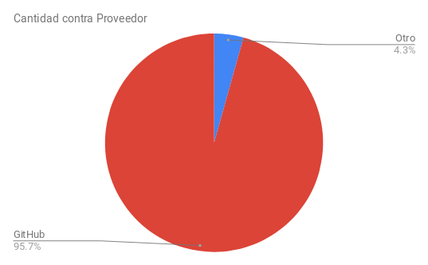
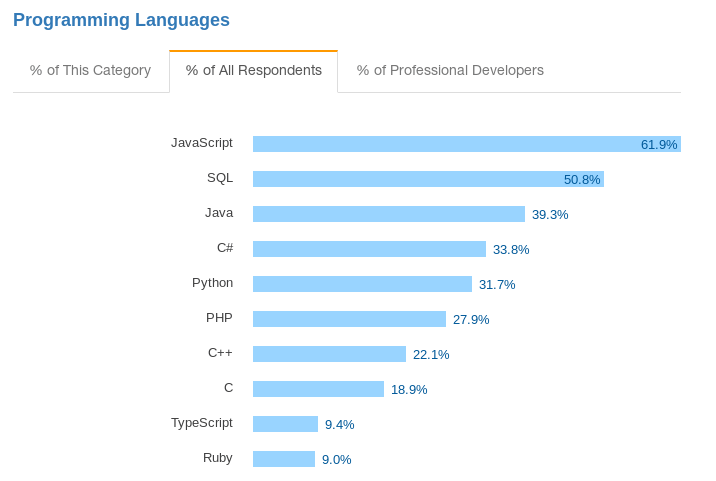
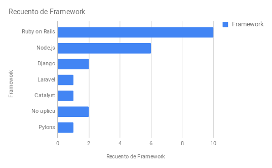
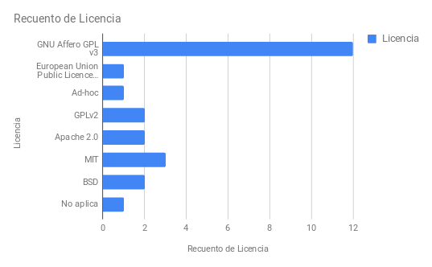
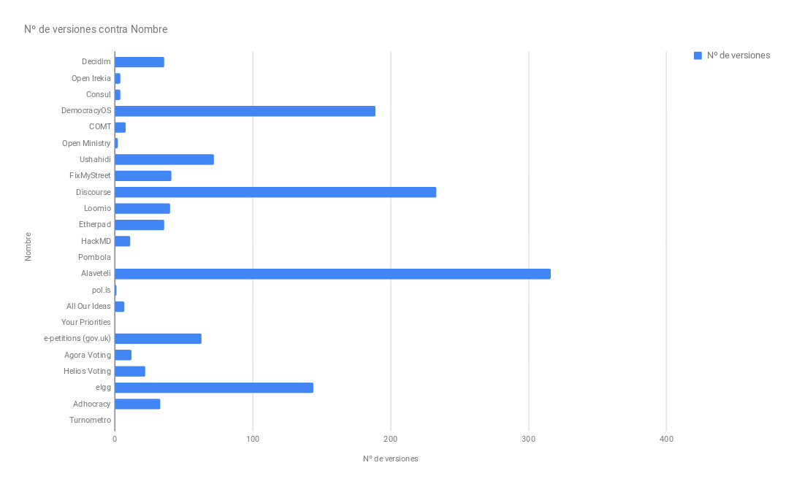

# Comparativa de metadatos

A continuación se incluyen distintos cuadros comparativos entre los metadatos de las aplicaciones analizadas. En cada cuadro  se incluye la siguiente información para cada aplicativo analizado:

* Cuadro 1: URL

* Cuadro 2: URL repositorio

* Cuadro 3: Resumen (en inglés)

* Cuadro 4: Resumen (en castellano) 

* Cuadro 5: Lenguaje y Framework

* Cuadro 6: Licencia

* Cuadro 7: Cantidad de versiones

* Cuadro 8: Cantidad de tablas en la base de datos (BBDD)

* Cuadro 9: Popularidad en GitHub

* Cuadro 10: Estado del mantenimiento 

## Cuadro 1: URL 

Para facilitar el estudio de los distintos aplicativos se agrega un cuadro resumen de las **direcciones URL de los **distintos **proyectos**** **estudiados en el marco de este informe. 

<table>
  <tr>
    <td>Código</td>
    <td>Nombre</td>
    <td>URL</td>
  </tr>
  <tr>
    <td>A.1</td>
    <td>Decidim</td>
    <td>https://decidim.org/</td>
  </tr>
  <tr>
    <td>A.2</td>
    <td>Open Irekia</td>
    <td>http://irekia.euskadi.eus/</td>
  </tr>
  <tr>
    <td>A.3</td>
    <td>Consul</td>
    <td>http://www.decide.es/</td>
  </tr>
  <tr>
    <td>B.1</td>
    <td>DemocracyOS</td>
    <td>http://democracyos.org/</td>
  </tr>
  <tr>
    <td>B.2</td>
    <td>COMT</td>
    <td>http://www.co-ment.com/</td>
  </tr>
  <tr>
    <td>B.3</td>
    <td>Open Ministry</td>
    <td>http://openministry.info/</td>
  </tr>
  <tr>
    <td>C.1</td>
    <td>Ushahidi</td>
    <td>https://www.ushahidi.com/</td>
  </tr>
  <tr>
    <td>C.2</td>
    <td>FixMyStreet</td>
    <td>https://www.fixmystreet.com/</td>
  </tr>
  <tr>
    <td>D.1</td>
    <td>Discourse</td>
    <td>https://www.discourse.org/</td>
  </tr>
  <tr>
    <td>D.2</td>
    <td>Loomio</td>
    <td>https://www.loomio.org/</td>
  </tr>
  <tr>
    <td>E.1</td>
    <td>Etherpad</td>
    <td>http://etherpad.org/</td>
  </tr>
  <tr>
    <td>E.2</td>
    <td>HackMD</td>
    <td>https://hackmd.io/</td>
  </tr>
  <tr>
    <td>F.1</td>
    <td>Pombola</td>
    <td>https://www.mysociety.org/democracy/pombola/</td>
  </tr>
  <tr>
    <td>F.2</td>
    <td>Alaveteli</td>
    <td>http://alaveteli.org/</td>
  </tr>
  <tr>
    <td>G.1</td>
    <td>pol.is</td>
    <td>https://pol.is</td>
  </tr>
  <tr>
    <td>G.2</td>
    <td>All Our Ideas</td>
    <td>http://www.allourideas.org</td>
  </tr>
  <tr>
    <td>H.1</td>
    <td>Your Priorities</td>
    <td>https://yrpri.org/</td>
  </tr>
  <tr>
    <td>H.2</td>
    <td>e-petitions (gov.uk)</td>
    <td>https://petition.parliament.uk/</td>
  </tr>
  <tr>
    <td>I.1</td>
    <td>Agora Voting</td>
    <td>http://agoravoting.org</td>
  </tr>
  <tr>
    <td>I.2</td>
    <td>Helios Voting</td>
    <td>https://heliosvoting.org/</td>
  </tr>
  <tr>
    <td>J.1</td>
    <td>elgg</td>
    <td>https://elgg.org/</td>
  </tr>
  <tr>
    <td>J.2</td>
    <td>Adhocracy</td>
    <td>https://adhocracy.de/</td>
  </tr>
  <tr>
    <td>K.1</td>
    <td>Turnometro</td>
    <td>http://turnometro.org/</td>
  </tr>
</table>

## Cuadro 2: URL repositorio

Para facilitar el estudio de los distintos aplicativos se agrega un cuadro resumen de las **direcciones URL de los **distintos **repositorios** de los proyectos estudiados en el marco de este informe. 

Es necesario hacer especial mención al uso de GitHub, ya que se trata  del proveedor de servicios de alojamiento de código escogido por la gran mayoría de los proyectos estudiados (un 95%), siendo Open Irekia el único proyecto que no se encuentra publicado en esta plataforma. 

<table>
  <tr>
    <td>Código</td>
    <td>Nombre</td>
    <td>URL repositorio</td>
  </tr>
  <tr>
    <td>A.1</td>
    <td>Decidim</td>
    <td>https://github.com/decidim/decidim</td>
  </tr>
  <tr>
    <td>A.2</td>
    <td>Open Irekia</td>
    <td>http://www.irekia.euskadi.eus/es/pages/10081-openirekia-publicacion-del-software-ogov-del-gobierno-vasco</td>
  </tr>
  <tr>
    <td>A.3</td>
    <td>Consul</td>
    <td>https://github.com/consul/consul/</td>
  </tr>
  <tr>
    <td>B.1</td>
    <td>DemocracyOS</td>
    <td>https://github.com/DemocracyOS/democracyos</td>
  </tr>
  <tr>
    <td>B.2</td>
    <td>COMT</td>
    <td>https://github.com/co-ment/comt</td>
  </tr>
  <tr>
    <td>B.3</td>
    <td>Open Ministry</td>
    <td>https://github.com/avoinministerio/avoinministerio</td>
  </tr>
  <tr>
    <td>C.1</td>
    <td>Ushahidi</td>
    <td>https://github.com/ushahidi/</td>
  </tr>
  <tr>
    <td>C.2</td>
    <td>FixMyStreet</td>
    <td>https://github.com/mysociety/fixmystreet</td>
  </tr>
  <tr>
    <td>D.1</td>
    <td>Discourse</td>
    <td>https://github.com/discourse/discourse</td>
  </tr>
  <tr>
    <td>D.2</td>
    <td>Loomio</td>
    <td>https://github.com/loomio/loomio</td>
  </tr>
  <tr>
    <td>E.1</td>
    <td>Etherpad</td>
    <td>https://github.com/ether/etherpad-lite</td>
  </tr>
  <tr>
    <td>E.2</td>
    <td>HackMD</td>
    <td>https://github.com/hackmdio/hackmd</td>
  </tr>
  <tr>
    <td>F.1</td>
    <td>Pombola</td>
    <td>https://github.com/mysociety/pombola</td>
  </tr>
  <tr>
    <td>F.2</td>
    <td>Alaveteli</td>
    <td>https://github.com/mysociety/alaveteli</td>
  </tr>
  <tr>
    <td>G.1</td>
    <td>pol.is</td>
    <td>https://github.com/pol-is</td>
  </tr>
  <tr>
    <td>G.2</td>
    <td>All Our Ideas</td>
    <td>https://github.com/allourideas/allourideas.org</td>
  </tr>
  <tr>
    <td>H.1</td>
    <td>Your Priorities</td>
    <td>https://github.com/rbjarnason/your-priorities-app/</td>
  </tr>
  <tr>
    <td>H.2</td>
    <td>e-petitions (gov.uk)</td>
    <td>https://github.com/alphagov/e-petitions</td>
  </tr>
  <tr>
    <td>I.1</td>
    <td>Agora Voting</td>
    <td>https://github.com/agoravoting</td>
  </tr>
  <tr>
    <td>I.2</td>
    <td>Helios Voting</td>
    <td>https://github.com/benadida/helios-server</td>
  </tr>
  <tr>
    <td>J.1</td>
    <td>elgg</td>
    <td>https://github.com/elgg/elgg</td>
  </tr>
  <tr>
    <td>J.2</td>
    <td>Adhocracy</td>
    <td>https://github.com/liqd/adhocracy</td>
  </tr>
  <tr>
    <td>K.1</td>
    <td>Turnometro</td>
    <td>https://github.com/elzr/Turnometro</td>
  </tr>
</table>

**Figura 1:** Porcentaje de uso de proveedores de alojamiento de código

## Cuadro 3: Descripción resumida  (en inglés)

Para facilitar el estudio de los distintos aplicativos se agrega un cuadro resumen de las **sinopsis** en inglés de los distintos proyectos estudiados en el marco de este informe. 

<table>
  <tr>
    <td>Código</td>
    <td>Nombre</td>
    <td>Descripción (Inglés)</td>
  </tr>
  <tr>
    <td>A.1</td>
    <td>Decidim</td>
    <td>The participatory democracy framework. A generator and multiple gems made with Ruby on Rails.</td>
  </tr>
  <tr>
    <td>A.2</td>
    <td>Open Irekia</td>
    <td>N/A</td>
  </tr>
  <tr>
    <td>A.3</td>
    <td>Consul</td>
    <td>Open Government and E-Participation Web Software</td>
  </tr>
  <tr>
    <td>B.1</td>
    <td>DemocracyOS</td>
    <td>An online space for deliberation and voting on political proposals. The software aims to stimulate better arguments and come to better rulings</td>
  </tr>
  <tr>
    <td>B.2</td>
    <td>COMT</td>
    <td>Text annotation and collaborative writing</td>
  </tr>
  <tr>
    <td>B.3</td>
    <td>Open Ministry</td>
    <td>Crowdsourcing legislation, deliberative and participatory democracy and citizens initiatives</td>
  </tr>
  <tr>
    <td>C.1</td>
    <td>Ushahidi</td>
    <td>Read the crowd. Don't just get the data. Get the whole story.</td>
  </tr>
  <tr>
    <td>C.2</td>
    <td>FixMyStreet</td>
    <td>Map-based reporting platform</td>
  </tr>
  <tr>
    <td>D.1</td>
    <td>Discourse</td>
    <td>A platform for community discussion. Free, open, simple.</td>
  </tr>
  <tr>
    <td>D.2</td>
    <td>Loomio</td>
    <td>An open-source web application that helps groups make better decisions together.</td>
  </tr>
  <tr>
    <td>E.1</td>
    <td>Etherpad</td>
    <td>Really real-time collaborative document editing</td>
  </tr>
  <tr>
    <td>E.2</td>
    <td>HackMD</td>
    <td>Best way to write and share your knowledge in markdown</td>
  </tr>
  <tr>
    <td>F.1</td>
    <td>Pombola</td>
    <td>Pombola is a parliamentary monitoring (PMO) platform; its biggest instances are Mzalendo.com and pa.org.za</td>
  </tr>
  <tr>
    <td>F.2</td>
    <td>Alaveteli</td>
    <td>Provide a Freedom of Information request system for your jurisdiction.</td>
  </tr>
  <tr>
    <td>G.1</td>
    <td>pol.is</td>
    <td>pol.is (pōlis) helps large organizations and communities understand themselves by visualizing what people think.</td>
  </tr>
  <tr>
    <td>G.2</td>
    <td>All Our Ideas</td>
    <td>Allows groups to collect and priorize information in an open, democratic, and efficient process.</td>
  </tr>
  <tr>
    <td>H.1</td>
    <td>Your Priorities</td>
    <td>Citizens participation application</td>
  </tr>
  <tr>
    <td>H.2</td>
    <td>e-petitions (gov.uk)</td>
    <td>This is the code base for the UK Government's e-petitions service (https://petition.parliament.uk)</td>
  </tr>
  <tr>
    <td>I.1</td>
    <td>Agora Voting</td>
    <td>Because every vote counts. Open source. Private vote. Auditable. Proven. Flexible.</td>
  </tr>
  <tr>
    <td>I.2</td>
    <td>Helios Voting</td>
    <td>Helios is an end-to-end verifiable voting system.</td>
  </tr>
  <tr>
    <td>J.1</td>
    <td>elgg</td>
    <td>Elgg is an open source rapid development framework for socially aware web applications.</td>
  </tr>
  <tr>
    <td>J.2</td>
    <td>Adhocracy</td>
    <td>A policy drafting and decision making software for distributed groups and open institutions.</td>
  </tr>
  <tr>
    <td>K.1</td>
    <td>Turnometro</td>
    <td>A web tool for more effective & inclusive assemblies.</td>
  </tr>
</table>

## Cuadro 4: Descripción resumida (en castellano)

Para facilitar el estudio de los distintos aplicativos se agrega un cuadro resumen de las **sinopsis** en castellano de los distintos proyectos estudiados en el marco de este informe. 

<table>
  <tr>
    <td>Código</td>
    <td>Nombre</td>
    <td>Descripción (Castellano)</td>
  </tr>
  <tr>
    <td>A.1</td>
    <td>Decidim</td>
    <td>El framework de la democracia participativa. Un generador y gemas múltiples hechas con Ruby on Rails.</td>
  </tr>
  <tr>
    <td>A.2</td>
    <td>Open Irekia</td>
    <td>Plataforma de la Dirección de Gobierno Abierto del Gobierno Vasco para fomentar la transparencia de las acciones del Gobierno Vasco y para promover la participación ciudadana activa en las decisiones del mismo</td>
  </tr>
  <tr>
    <td>A.3</td>
    <td>Consul</td>
    <td>Software web de Gobierno Abierto y E-Participación</td>
  </tr>
  <tr>
    <td>B.1</td>
    <td>DemocracyOS</td>
    <td>Un espacio en línea para deliberar y votar en propuestas politicas. El software tiene el fin de estimular mejores argumentos y llegar a mejores resoluciones.</td>
  </tr>
  <tr>
    <td>B.2</td>
    <td>COMT</td>
    <td>Anotación de textos y escritura colaborativa</td>
  </tr>
  <tr>
    <td>B.3</td>
    <td>Open Ministry</td>
    <td>Legislación con colaboración abierta distribuida, democracia participativa e iniciativas ciudadanas</td>
  </tr>
  <tr>
    <td>C.1</td>
    <td>Ushahidi</td>
    <td>Lea la multitud. No obtenga sólo los datos. Obtenga toda la historia.</td>
  </tr>
  <tr>
    <td>C.2</td>
    <td>FixMyStreet</td>
    <td>Plataforma de reporte basada en mapas</td>
  </tr>
  <tr>
    <td>D.1</td>
    <td>Discourse</td>
    <td>Una plataforma para el debate de la comunidad. Libre, abierta, simple.</td>
  </tr>
  <tr>
    <td>D.2</td>
    <td>Loomio</td>
    <td>Una aplicación web de código abierto que ayuda a los grupos a tomar mejores decisiones en grupo.</td>
  </tr>
  <tr>
    <td>E.1</td>
    <td>Etherpad</td>
    <td>Edición de documentos colaborativa realmente en tiempo real</td>
  </tr>
  <tr>
    <td>E.2</td>
    <td>HackMD</td>
    <td>La mejor forma para escribir y compartir tu conocimiento en markdown</td>
  </tr>
  <tr>
    <td>F.1</td>
    <td>Pombola</td>
    <td>Pombola es una plataforma de seguimiento parlamentario (PMO); sus mayores instancias son Mzalendo.com y pa.org.za</td>
  </tr>
  <tr>
    <td>F.2</td>
    <td>Alaveteli</td>
    <td>Proporciona un sistema de solicitud de libertad de información para su jurisdicción.</td>
  </tr>
  <tr>
    <td>G.1</td>
    <td>pol.is</td>
    <td>pol.is (pōlis) ayuda a grandes organizaciones y comunidades a entenderse a sí mismas visualizando lo que la gente piensa.</td>
  </tr>
  <tr>
    <td>G.2</td>
    <td>All Our Ideas</td>
    <td>Permite a grupos recoger y priorizar información en un proceso abierto, democrático y eficiente.</td>
  </tr>
  <tr>
    <td>H.1</td>
    <td>Your Priorities</td>
    <td>Aplicación para la participación ciudadana</td>
  </tr>
  <tr>
    <td>H.2</td>
    <td>e-petitions (gov.uk)</td>
    <td>Este es el código base para el servicio de peticiones electrónicas del Gobierno del Reino Unido (https://petition.parliament.uk)</td>
  </tr>
  <tr>
    <td>I.1</td>
    <td>Agora Voting</td>
    <td>Porque cada voto cuenta. Código abierto. Voto privado Auditable. Probado. Flexible.</td>
  </tr>
  <tr>
    <td>I.2</td>
    <td>Helios Voting</td>
    <td>Helios es un sistema de votación verificable de extremo a extremo.</td>
  </tr>
  <tr>
    <td>J.1</td>
    <td>elgg</td>
    <td>Elgg es un framework de desarrollo rápido de código abierto para aplicaciones web socialmente conscientes.</td>
  </tr>
  <tr>
    <td>J.2</td>
    <td>Adhocracy</td>
    <td>Una software para la elaboración de políticas y la toma de decisiones para grupos distribuidos e instituciones abiertas.</td>
  </tr>
  <tr>
    <td>K.1</td>
    <td>Turnometro</td>
    <td>Una herramienta web para asambleas más efectivas e inclusivas.</td>
  </tr>
</table>

## Cuadro 5: Lenguaje y Framework

Para facilitar el estudio de los distintos aplicativos se agrega un cuadro resumen del **lenguaje y framework **de programación y desarrollo de los distintos proyectos estudiados en el marco de este informe. 

<table>
  <tr>
    <td>Código</td>
    <td>Nombre</td>
    <td>Lenguaje</td>
    <td>Framework</td>
  </tr>
  <tr>
    <td>A.1</td>
    <td>Decidim</td>
    <td>Ruby</td>
    <td>Ruby on Rails</td>
  </tr>
  <tr>
    <td>A.2</td>
    <td>Open Irekia</td>
    <td>Ruby</td>
    <td>Ruby on Rails</td>
  </tr>
  <tr>
    <td>A.3</td>
    <td>Consul</td>
    <td>Ruby</td>
    <td>Ruby on Rails</td>
  </tr>
  <tr>
    <td>B.1</td>
    <td>DemocracyOS</td>
    <td>Javascript</td>
    <td>Node.js</td>
  </tr>
  <tr>
    <td>B.2</td>
    <td>COMT</td>
    <td>Python</td>
    <td>Django</td>
  </tr>
  <tr>
    <td>B.3</td>
    <td>Open Ministry</td>
    <td>Ruby</td>
    <td>Ruby on Rails</td>
  </tr>
  <tr>
    <td>C.1</td>
    <td>Ushahidi</td>
    <td>PHP</td>
    <td>Laravel</td>
  </tr>
  <tr>
    <td>C.2</td>
    <td>FixMyStreet</td>
    <td>Perl</td>
    <td>Catalyst</td>
  </tr>
  <tr>
    <td>D.1</td>
    <td>Discourse</td>
    <td>Ruby</td>
    <td>Ruby on Rails</td>
  </tr>
  <tr>
    <td>D.2</td>
    <td>Loomio</td>
    <td>Ruby</td>
    <td>Ruby on Rails</td>
  </tr>
  <tr>
    <td>E.1</td>
    <td>Etherpad</td>
    <td>Javascript</td>
    <td>Node.js</td>
  </tr>
  <tr>
    <td>E.2</td>
    <td>HackMD</td>
    <td>Javascript</td>
    <td>Node.js</td>
  </tr>
  <tr>
    <td>F.1</td>
    <td>Pombola</td>
    <td>Ruby</td>
    <td>Ruby on Rails</td>
  </tr>
  <tr>
    <td>F.2</td>
    <td>Alaveteli</td>
    <td>Ruby</td>
    <td>Ruby on Rails</td>
  </tr>
  <tr>
    <td>G.1</td>
    <td>pol.is</td>
    <td>Javascript</td>
    <td>Node.js</td>
  </tr>
  <tr>
    <td>G.2</td>
    <td>All Our Ideas</td>
    <td>Ruby</td>
    <td>Ruby on Rails</td>
  </tr>
  <tr>
    <td>H.1</td>
    <td>Your Priorities</td>
    <td>Javascript</td>
    <td>Node.js</td>
  </tr>
  <tr>
    <td>H.2</td>
    <td>e-petitions (gov.uk)</td>
    <td>Ruby</td>
    <td>Ruby on Rails</td>
  </tr>
  <tr>
    <td>I.1</td>
    <td>Agora Voting</td>
    <td>Javascript</td>
    <td>Node.js</td>
  </tr>
  <tr>
    <td>I.2</td>
    <td>Helios Voting</td>
    <td>Python</td>
    <td>Django</td>
  </tr>
  <tr>
    <td>J.1</td>
    <td>elgg</td>
    <td>PHP</td>
    <td>No aplica</td>
  </tr>
  <tr>
    <td>J.2</td>
    <td>Adhocracy</td>
    <td>Python</td>
    <td>Pylons</td>
  </tr>
  <tr>
    <td>K.1</td>
    <td>Turnometro</td>
    <td>Javascript</td>
    <td>No aplica</td>
  </tr>
</table>

Llama la atención que el lenguaje de programación y framework más popular para este tipo de aplicaciones sea Ruby ya que, según el sitio web para programadores StackOverflow[^1] que recoge los lenguajes de programación más populares, Ruby se encontraría en el décimo puesto:

[^1]: https://insights.stackoverflow.com/survey/2017#most-popular-technologies

**Figura 2:** Lenguajes de programación más populares en encuesta de StackOverflow

 

**Figura 3:** Lenguajes de los aplicativos estudiados en este informe

**Figura 4:** Frameworks de programación de los aplicativos estudiados en este informe

## Cuadro 6: Licencia

Para facilitar el estudio de los distintos aplicativos se agrega un cuadro resumen del tipo de **licencia** escogida para los distintos proyectos estudiados en el marco de este informe. 

<table>
  <tr>
    <td>Código</td>
    <td>Nombre</td>
    <td>Licencia</td>
  </tr>
  <tr>
    <td>A.1</td>
    <td>Decidim</td>
    <td>GNU Affero GPL v3</td>
  </tr>
  <tr>
    <td>A.2</td>
    <td>Open Irekia</td>
    <td>European Union Public Licence V . 1.1</td>
  </tr>
  <tr>
    <td>A.3</td>
    <td>Consul</td>
    <td>GNU Affero GPL v3</td>
  </tr>
  <tr>
    <td>B.1</td>
    <td>DemocracyOS</td>
    <td>GNU Affero GPL v3</td>
  </tr>
  <tr>
    <td>B.2</td>
    <td>COMT</td>
    <td>GNU Affero GPL v3</td>
  </tr>
  <tr>
    <td>B.3</td>
    <td>Open Ministry</td>
    <td>Ad-hoc</td>
  </tr>
  <tr>
    <td>C.1</td>
    <td>Ushahidi</td>
    <td>GNU Affero GPL v3</td>
  </tr>
  <tr>
    <td>C.2</td>
    <td>FixMyStreet</td>
    <td>GNU Affero GPL v3</td>
  </tr>
  <tr>
    <td>D.1</td>
    <td>Discourse</td>
    <td>GPLv2</td>
  </tr>
  <tr>
    <td>D.2</td>
    <td>Loomio</td>
    <td>GNU Affero GPL v3</td>
  </tr>
  <tr>
    <td>E.1</td>
    <td>Etherpad</td>
    <td>Apache 2.0</td>
  </tr>
  <tr>
    <td>E.2</td>
    <td>HackMD</td>
    <td>MIT</td>
  </tr>
  <tr>
    <td>F.1</td>
    <td>Pombola</td>
    <td>GNU Affero GPL v3</td>
  </tr>
  <tr>
    <td>F.2</td>
    <td>Alaveteli</td>
    <td>GNU Affero GPL v3</td>
  </tr>
  <tr>
    <td>G.1</td>
    <td>pol.is</td>
    <td>GNU Affero GPL v3</td>
  </tr>
  <tr>
    <td>G.2</td>
    <td>All Our Ideas</td>
    <td>BSD</td>
  </tr>
  <tr>
    <td>H.1</td>
    <td>Your Priorities</td>
    <td>BSD</td>
  </tr>
  <tr>
    <td>H.2</td>
    <td>e-petitions (gov.uk)</td>
    <td>MIT</td>
  </tr>
  <tr>
    <td>I.1</td>
    <td>Agora Voting</td>
    <td>GNU Affero GPL v3</td>
  </tr>
  <tr>
    <td>I.2</td>
    <td>Helios Voting</td>
    <td>Apache 2.0</td>
  </tr>
  <tr>
    <td>J.1</td>
    <td>elgg</td>
    <td>MIT / GPLv2</td>
  </tr>
  <tr>
    <td>J.2</td>
    <td>Adhocracy</td>
    <td>GNU Affero GPL v3</td>
  </tr>
  <tr>
    <td>K.1</td>
    <td>Turnometro</td>
    <td>No aplica</td>
  </tr>
</table>

Como puede apreciarse, la licencia más utilizada para los aplicativos estudiados es la GNU Affero GPL v3 (abreviada normalmente como AGPLv3):

**Figura 5:** Licencias de aplicaciones de este informe

<table>
  <tr>
    <td>Orden</td>
    <td>Licencia</td>
    <td>% de proyectos</td>
  </tr>
  <tr>
    <td>1</td>
    <td>AGPLv3</td>
    <td>50.00%</td>
  </tr>
  <tr>
    <td>2</td>
    <td>MIT</td>
    <td>12.50%</td>
  </tr>
  <tr>
    <td>3</td>
    <td>GPLv2</td>
    <td>8.33%</td>
  </tr>
  <tr>
    <td>4</td>
    <td>BSD</td>
    <td>8.33%</td>
  </tr>
  <tr>
    <td>5</td>
    <td>Apache</td>
    <td>8.33%</td>
  </tr>
  <tr>
    <td>6</td>
    <td>Ad-hoc</td>
    <td>4.16%</td>
  </tr>
  <tr>
    <td>7</td>
    <td>Unlicense</td>
    <td>4.16%</td>
  </tr>
  <tr>
    <td>8</td>
    <td>EUPL</td>
    <td>4.16%</td>
  </tr>
</table>

Si se compara con los tipos de licencia más populares en GitHub[^2] se ve que este tipo de licencia no cuenta con este grado de popularidad en el resto de proyectos libres o abiertos publicados en esta plataforma: 

[^2]: https://github.com/blog/1964-open-source-license-usage-on-github-com 

<table>
  <tr>
    <td>Orden</td>
    <td>Licencia</td>
    <td>% de proyectos</td>
  </tr>
  <tr>
    <td>1</td>
    <td>MIT</td>
    <td>44.69%</td>
  </tr>
  <tr>
    <td>2</td>
    <td>Other</td>
    <td>15.68%</td>
  </tr>
  <tr>
    <td>3</td>
    <td>GPLv2</td>
    <td>12.96%</td>
  </tr>
  <tr>
    <td>4</td>
    <td>Apache</td>
    <td>11.19%</td>
  </tr>
  <tr>
    <td>5</td>
    <td>GPLv3</td>
    <td>8.88%</td>
  </tr>
  <tr>
    <td>6</td>
    <td>BSD 3-clause</td>
    <td>4.53%</td>
  </tr>
  <tr>
    <td>7</td>
    <td>Unlicense</td>
    <td>1.87%</td>
  </tr>
  <tr>
    <td>8</td>
    <td>BSD 2-clause</td>
    <td>1.70%</td>
  </tr>
  <tr>
    <td>9</td>
    <td>LGPLv3</td>
    <td>1.30%</td>
  </tr>
  <tr>
    <td>10</td>
    <td>AGPLv3</td>
    <td>1.05%</td>
  </tr>
</table>

La licencia pública general de Affero (en inglés, Affero General Public License, Affero GPL o AGPL) es una licencia copyleft derivada de la Licencia Pública General de GNU diseñada específicamente para asegurar la cooperación con la comunidad en el caso de software que corra en servidores de red. La Affero GPL es íntegramente una GNU GPL con una cláusula nueva que añade la obligación de distribuir el software si éste se ejecuta para ofrecer servicios a través de una red de ordenadores.

La Free Software Foundation recomienda el uso de esta licencia "para cualquier software que usualmente corra sobre una red"[^3].

[^3]: The FSF recommends that people consider using the GNU AGPL for any software which will commonly be run over a network. [https://www.fsf.org/news/agplv3-pr](https://www.fsf.org/news/agplv3-pr)

La elección de este tipo de licencia AGPLv3 para este tipo de proyectos, en su mayoría relacionados con valores democráticos, obliga a las obras derivadas creadas a cumplir con este mismo tipo de licencia, en contraposición a otras licencias como la MIT, BSD o Apache en el que se podría cerrar el código de las aplicaciones derivadas, por lo que, al menos en principio, dicha licencia parece la más adecuada para una plataforma como Decidim.

## Cuadro 7: Cantidad de versiones

En la programación de software se suele indicar el número de versión con el fin de informar sobre su nivel de desarrollo. El hecho de disponer de pocas versiones de una aplicación o plataforma puede ser un indicador de que no cuentan con un flujo de publicación y distribución mantenido en el tiempo, o que el desarrollo se encuentra en un momento muy temprano. 

En el cuadro se han resaltado  los aplicativos que no cuenten con un mínimo de 10 versiones publicadas. ...

<table>
  <tr>
    <td>Código</td>
    <td>Nombre</td>
    <td>Nº de versiones</td>
  </tr>
  <tr>
    <td>A.1</td>
    <td>Decidim</td>
    <td>36</td>
  </tr>
  <tr>
    <td>A.2</td>
    <td>Open Irekia</td>
    <td>4</td>
  </tr>
  <tr>
    <td>A.3</td>
    <td>Consul</td>
    <td>4</td>
  </tr>
  <tr>
    <td>B.1</td>
    <td>DemocracyOS</td>
    <td>189</td>
  </tr>
  <tr>
    <td>B.2</td>
    <td>COMT</td>
    <td>8</td>
  </tr>
  <tr>
    <td>B.3</td>
    <td>Open Ministry</td>
    <td>2</td>
  </tr>
  <tr>
    <td>C.1</td>
    <td>Ushahidi</td>
    <td>72</td>
  </tr>
  <tr>
    <td>C.2</td>
    <td>FixMyStreet</td>
    <td>41</td>
  </tr>
  <tr>
    <td>D.1</td>
    <td>Discourse</td>
    <td>233</td>
  </tr>
  <tr>
    <td>D.2</td>
    <td>Loomio</td>
    <td>40</td>
  </tr>
  <tr>
    <td>E.1</td>
    <td>Etherpad</td>
    <td>36</td>
  </tr>
  <tr>
    <td>E.2</td>
    <td>HackMD</td>
    <td>11</td>
  </tr>
  <tr>
    <td>F.1</td>
    <td>Pombola</td>
    <td>0</td>
  </tr>
  <tr>
    <td>F.2</td>
    <td>Alaveteli</td>
    <td>316</td>
  </tr>
  <tr>
    <td>G.1</td>
    <td>pol.is</td>
    <td>1</td>
  </tr>
  <tr>
    <td>G.2</td>
    <td>All Our Ideas</td>
    <td>7</td>
  </tr>
  <tr>
    <td>H.1</td>
    <td>Your Priorities</td>
    <td>0</td>
  </tr>
  <tr>
    <td>H.2</td>
    <td>e-petitions (gov.uk)</td>
    <td>63</td>
  </tr>
  <tr>
    <td>I.1</td>
    <td>Agora Voting</td>
    <td>12</td>
  </tr>
  <tr>
    <td>I.2</td>
    <td>Helios Voting</td>
    <td>22</td>
  </tr>
  <tr>
    <td>J.1</td>
    <td>elgg</td>
    <td>144</td>
  </tr>
  <tr>
    <td>J.2</td>
    <td>Adhocracy</td>
    <td>33</td>
  </tr>
  <tr>
    <td>K.1</td>
    <td>Turnometro</td>
    <td>0</td>
  </tr>
</table>

# 

**Figura 6:** Cantidad de versiones de cada aplicativo estudiado en este informe

## Cuadro 8: Cantidad de tablas en la Base de Datos (BBDD)

La cantidad de tablas de la Base de Datos (BBDD) es un indicativo de qué tan compleja o monolítica puede ser una aplicación, y las dificultades que pueden encontrarse en su mantenimiento. 

Este indicador depende del tipo de aplicación de que se trate. Por ejemplo, en el caso de Turnometro, por la propia naturaleza de la aplicación, no cuenta con un esquema SQL desde donde se pueda analizar el número de tablas implicadas así como su complejidad.

Por otro lado, se han excluido de la comparativa aquellos aplicativos que no pudieron instalarse para su estudio en el marco de este informe. Dichos aplicativos excluidos son: pol.is, Your Priorities y Agora Voting. 

<table>
  <tr>
    <td>Código</td>
    <td>Nombre</td>
    <td>Nº de tablas en la BBDD</td>
  </tr>
  <tr>
    <td>A.1</td>
    <td>Decidim</td>
    <td>37</td>
  </tr>
  <tr>
    <td>A.2</td>
    <td>Open Irekia</td>
    <td>56</td>
  </tr>
  <tr>
    <td>A.3</td>
    <td>Consul</td>
    <td>85</td>
  </tr>
  <tr>
    <td>B.1</td>
    <td>DemocracyOS</td>
    <td>10</td>
  </tr>
  <tr>
    <td>B.2</td>
    <td>COMT</td>
    <td>26</td>
  </tr>
  <tr>
    <td>B.3</td>
    <td>Open Ministry</td>
    <td>30</td>
  </tr>
  <tr>
    <td>C.1</td>
    <td>Ushahidi</td>
    <td>49</td>
  </tr>
  <tr>
    <td>C.2</td>
    <td>FixMyStreet</td>
    <td>22</td>
  </tr>
  <tr>
    <td>D.1</td>
    <td>Discourse</td>
    <td>129</td>
  </tr>
  <tr>
    <td>D.2</td>
    <td>Loomio</td>
    <td>55</td>
  </tr>
  <tr>
    <td>E.1</td>
    <td>Etherpad</td>
    <td>1</td>
  </tr>
  <tr>
    <td>E.2</td>
    <td>HackMD</td>
    <td>8</td>
  </tr>
  <tr>
    <td>F.1</td>
    <td>Pombola</td>
    <td>107</td>
  </tr>
  <tr>
    <td>F.2</td>
    <td>Alaveteli</td>
    <td>35</td>
  </tr>
  <tr>
    <td>G.1</td>
    <td>pol.is</td>
    <td>No aplica</td>
  </tr>
  <tr>
    <td>G.2</td>
    <td>All Our Ideas</td>
    <td>33</td>
  </tr>
  <tr>
    <td>H.1</td>
    <td>Your Priorities</td>
    <td>No aplica</td>
  </tr>
  <tr>
    <td>H.2</td>
    <td>e-petitions (gov.uk)</td>
    <td>29</td>
  </tr>
  <tr>
    <td>I.1</td>
    <td>Agora Voting</td>
    <td>No aplica</td>
  </tr>
  <tr>
    <td>I.2</td>
    <td>Helios Voting</td>
    <td>20</td>
  </tr>
  <tr>
    <td>J.1</td>
    <td>elgg</td>
    <td>24</td>
  </tr>
  <tr>
    <td>J.2</td>
    <td>Adhocracy</td>
    <td>43</td>
  </tr>
  <tr>
    <td>K.1</td>
    <td>Turnometro</td>
    <td>0</td>
  </tr>
</table>

## Cuadro 9: Popularidad en GitHub

La plataforma para compartir código GitHub ofrece varios indicadores de popularidad. En el marco de este informe se han recogido la cantidad de contribuidores (programadores que hayan introducido por lo menos una línea de código o cambio en el proyecto) y el número de "stars" (cantidad de usuarios de GitHub que consideran interesante el proyecto o que quieran guardarlo como marcador para referencia futura). 

Se resaltan en rojo aquellos proyectos que tengan menos de 10 contribuidores o que cuenten con menos de 50 stars. 

...

<table>
  <tr>
    <td>Código</td>
    <td>Nombre</td>
    <td>Nº de contribuidores</td>
    <td>Nº de stars</td>
  </tr>
  <tr>
    <td>A.1</td>
    <td>Decidim</td>
    <td>19</td>
    <td>65</td>
  </tr>
  <tr>
    <td>A.2</td>
    <td>Open Irekia</td>
    <td>1</td>
    <td>1</td>
  </tr>
  <tr>
    <td>A.3</td>
    <td>Consul</td>
    <td>61</td>
    <td>480</td>
  </tr>
  <tr>
    <td>B.1</td>
    <td>DemocracyOS</td>
    <td>68</td>
    <td>1524</td>
  </tr>
  <tr>
    <td>B.2</td>
    <td>COMT</td>
    <td>5</td>
    <td>12</td>
  </tr>
  <tr>
    <td>B.3</td>
    <td>Open Ministry</td>
    <td>18</td>
    <td>98</td>
  </tr>
  <tr>
    <td>C.1</td>
    <td>Ushahidi</td>
    <td>26</td>
    <td>403</td>
  </tr>
  <tr>
    <td>C.2</td>
    <td>FixMyStreet</td>
    <td>34</td>
    <td>322</td>
  </tr>
  <tr>
    <td>D.1</td>
    <td>Discourse</td>
    <td>600</td>
    <td>22777</td>
  </tr>
  <tr>
    <td>D.2</td>
    <td>Loomio</td>
    <td>60</td>
    <td>1483</td>
  </tr>
  <tr>
    <td>E.1</td>
    <td>Etherpad</td>
    <td>177</td>
    <td>6495</td>
  </tr>
  <tr>
    <td>E.2</td>
    <td>HackMD</td>
    <td>54</td>
    <td>2814</td>
  </tr>
  <tr>
    <td>F.1</td>
    <td>Pombola</td>
    <td>27</td>
    <td>55</td>
  </tr>
  <tr>
    <td>F.2</td>
    <td>Alaveteli</td>
    <td>45</td>
    <td>213</td>
  </tr>
  <tr>
    <td>G.1</td>
    <td>pol.is</td>
    <td>18</td>
    <td>28</td>
  </tr>
  <tr>
    <td>G.2</td>
    <td>All Our Ideas</td>
    <td>11</td>
    <td>122</td>
  </tr>
  <tr>
    <td>H.1</td>
    <td>Your Priorities</td>
    <td>1</td>
    <td>19</td>
  </tr>
  <tr>
    <td>H.2</td>
    <td>e-petitions (gov.uk)</td>
    <td>29</td>
    <td>136</td>
  </tr>
  <tr>
    <td>I.1</td>
    <td>Agora Voting</td>
    <td>4</td>
    <td>12</td>
  </tr>
  <tr>
    <td>I.2</td>
    <td>Helios Voting</td>
    <td>13</td>
    <td>299</td>
  </tr>
  <tr>
    <td>J.1</td>
    <td>elgg</td>
    <td>75</td>
    <td>1064</td>
  </tr>
  <tr>
    <td>J.2</td>
    <td>Adhocracy</td>
    <td>29</td>
    <td>135</td>
  </tr>
  <tr>
    <td>K.1</td>
    <td>Turnometro</td>
    <td>1</td>
    <td>4</td>
  </tr>
</table>

## Cuadro 10: Estado del mantenimiento

Un aspecto fundamental en el desarrollo de software es el mantenimiento del mismo. Un aplicativo que no se actualice periódicamente tendrá fallos de seguridad, algo especialmente grave al tratarse de aplicaciones web. 

...

<table>
  <tr>
    <td>Código</td>
    <td>Nombre</td>
    <td>Mantenido</td>
  </tr>
  <tr>
    <td>A.1</td>
    <td>Decidim</td>
    <td>Sí</td>
  </tr>
  <tr>
    <td>A.2</td>
    <td>Open Irekia</td>
    <td>No</td>
  </tr>
  <tr>
    <td>A.3</td>
    <td>Consul</td>
    <td>Sí</td>
  </tr>
  <tr>
    <td>B.1</td>
    <td>DemocracyOS</td>
    <td>Sí</td>
  </tr>
  <tr>
    <td>B.2</td>
    <td>COMT</td>
    <td>No</td>
  </tr>
  <tr>
    <td>B.3</td>
    <td>Open Ministry</td>
    <td>No</td>
  </tr>
  <tr>
    <td>C.1</td>
    <td>Ushahidi</td>
    <td>Sí</td>
  </tr>
  <tr>
    <td>C.2</td>
    <td>FixMyStreet</td>
    <td>Sí</td>
  </tr>
  <tr>
    <td>D.1</td>
    <td>Discourse</td>
    <td>Sí</td>
  </tr>
  <tr>
    <td>D.2</td>
    <td>Loomio</td>
    <td>Sí</td>
  </tr>
  <tr>
    <td>E.1</td>
    <td>Etherpad</td>
    <td>Sí</td>
  </tr>
  <tr>
    <td>E.2</td>
    <td>HackMD</td>
    <td>Sí</td>
  </tr>
  <tr>
    <td>F.1</td>
    <td>Pombola</td>
    <td>Sí</td>
  </tr>
  <tr>
    <td>F.2</td>
    <td>Alaveteli</td>
    <td>Sí</td>
  </tr>
  <tr>
    <td>G.1</td>
    <td>pol.is</td>
    <td>Sí</td>
  </tr>
  <tr>
    <td>G.2</td>
    <td>All Our Ideas</td>
    <td>Sí</td>
  </tr>
  <tr>
    <td>H.1</td>
    <td>Your Priorities</td>
    <td>Sí</td>
  </tr>
  <tr>
    <td>H.2</td>
    <td>e-petitions (gov.uk)</td>
    <td>Sí</td>
  </tr>
  <tr>
    <td>I.1</td>
    <td>Agora Voting</td>
    <td>Sí</td>
  </tr>
  <tr>
    <td>I.2</td>
    <td>Helios Voting</td>
    <td>Sí</td>
  </tr>
  <tr>
    <td>J.1</td>
    <td>elgg</td>
    <td>Sí</td>
  </tr>
  <tr>
    <td>J.2</td>
    <td>Adhocracy</td>
    <td>No</td>
  </tr>
  <tr>
    <td>K.1</td>
    <td>Turnometro</td>
    <td>No</td>
  </tr>
</table>
