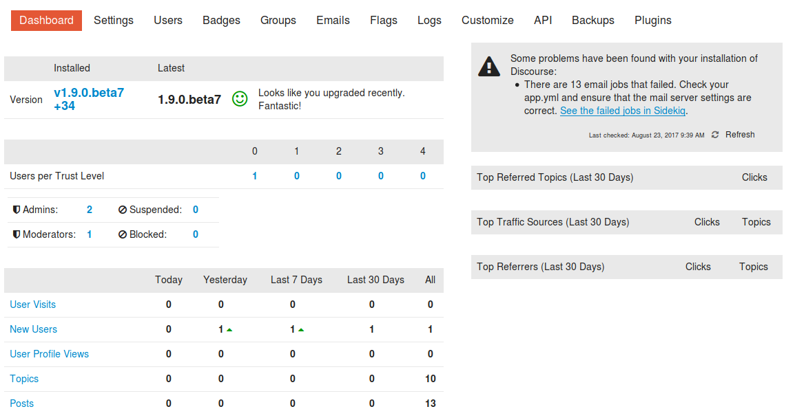
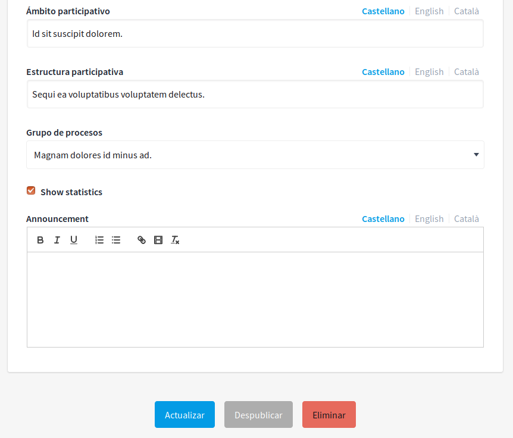
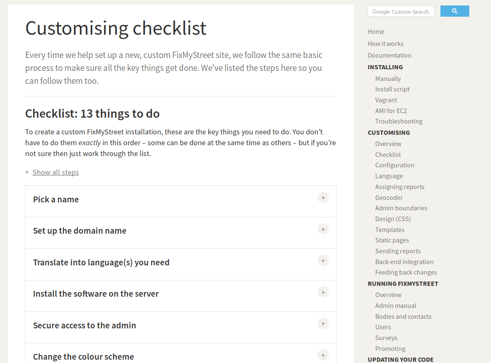

# Conclusiones

… 

# Recomendaciones

Para finalizar, se realizan una serie de recomendaciones y **propuestas de mejoras **para Decidim teniendo en cuenta los aspectos más innovadores de los aplicativos estudiados, así como carencias que puede tener el desarrollo ahora mismo, de cara a facilitar su reutilización por otras entidades. 

## 1. Emojis 

Son caracteres popularizados por los smartphones, que se encuentran disponibles en múltiples aplicaciones (Gmail, Facebook, Twitter, Whatsapp, Telegram, Google Hangouts) y que permiten comunicar expresiones faciales, objetos, lugares, etc. 

Son elementos que tienen cada vez más relevancia tanto a nivel técnico como cultural, siendo incluso un emoji () la palabra del Año 2015 según el diccionario Oxford  (NOTE:  http://blog.oxforddictionaries.com/2015/11/word-of-the-year-2015-emoji/ ). Así mismo cuentan con una clara tendencia ascendente según el servicio Google Trends que permite analizar términos de búsqueda en Google  (NOTE:  https://www.google.es/trends/explore#q=emoji&date=1%2F2011%2072m&cmpt=q&tz=Etc%2FGMT-2 ). 

**Figura 7:** Evolución del interés de Emojis en Google Trends

Entre las aplicaciones analizadas en este informe, Loomio ya cuenta con ellos y 

Your Priorities lo tiene en su plan de desarrollo. En el caso de Discourse incluso se pueden agregar Emojis personalizados. 

**Figura D.2.11 (Anexo D.2 Loomio): **Emojis en comentarios

## 2. Distintas fases para propuestas

Un problema que se ha detectado en la dinámica de propuestas es la falta de posibilidad de que los comentarios de otros usuarios puedan enriquecer las mismas si se cuenta con una única fase de creación y priorización. Este problema no se soluciona sólo permitiendo la edición de la misma por parte del creador original sino que hay que permitir que una misma propuesta pueda ir mejorando a través del tiempo en función de las aportaciones de otros usuarios expresadas a través de los comentarios u otros elementos.

En ese sentido se reconoce como un paso en la buena dirección el proceso llevado a cabo por Open Ministry, en el que una misma propuesta cuenta con varias fases en función del consenso logrado a través de la discusión, utilizando el feedback que reciben a través de sus comentarios para ir mejorando la Iniciativa o Propuesta de Ley en distintas fases: Se comienza siendo una Idea, luego se pasa a Borrador, según se redacta ya es una Propuesta y al aprobarse pasa a ser una Iniciativa.

## 3. Punto de recogida de apoyos 

Un problema común en estas aplicaciones es la desconexión entre las dinámicas de participación digital y presencial (online y offline). Aunque en el caso de Decidim se han realizado importantes avances en esta dirección a través del proceso del Plan Municipal mediante las Citas presenciales, estos avances no se han visto reflejados en la misma medida que resultan de la aplicación de otras tipologías de apoyo (Ayuntamiento, Ciudadanas, Organizaciones). 

Esta situación puede mejorarse a través de la inclusión de dinámicas presenciales de participación similares a las aplicadas en Open Ministry, donde se facilita la recogida de apoyos y comentarios a través de puntos de recogida presenciales.

Este procedimiento es similar al que se puede encontrar en la aplicación de Gobierno Abierto "Decide Madrid" del Ayuntamiento de Madrid  (NOTE:  https://decide.madrid.es/proposals_info):

**_¿Existen mecanismos presenciales para participar? ¿Se ha planteado llegar a los ciudadanos y ciudadanas con dificultades de acceso a Internet o en situación de exclusión?_**

*Todas las acciones relacionadas con el proceso de propuestas ciudadanas pueden realizarse presencialmente en cualquiera de las 26 Oficinas de Atención al Ciudadano repartidas por todos los distritos de Madrid. Además, el proceso de recogida de apoyos de una propuesta puede realizarse también a través de hojas de firmas, cuyo modelo puede ser descargado en este documento PDF * (NOTE:  https://decide.madrid.es/docs/formulario_propustas_ciudadanas.pdf )*. Adicionalmente se ha creado en el Área de Gobierno de Participación Ciudadana, Transparencia y Gobierno Abierto el Servicio de Inclusión, Neutralidad y Privacidad que pondrá en marcha una mesa de inclusión con personal del Ayuntamiento y asociaciones que trabajan con colectivos en situación de exclusión, para diseñar mecanismos especiales para que puedan participar dichos colectivos.*

Aparte de las Oficinas de Atención al Ciudadano ya existentes en Barcelona se debería estudiar su integración con los encuentros presenciales de participación ya existentes en la ciudad, como las Audiencias Públicas y Consells de Barris.

## 4. Rectificar el apoyo 

Loomio, Adhocracy y Your Priorities permiten cambiar el apoyo que se le ha dado a una propuesta, con el razonamiento de que en base a la discusión y deliberación de la misma se puede cambiar de opinión sobre el tema que se está debatiendo. 

## 5. Mejoras en la interfaz de argumentos a favor y en contra

En Your Priorities se ve claramente cuando un usuario aporta argumentos a favor y/o en contra en una propuesta ya que la interfaz facilita esta dinámica. Aunque en Decidim se cuenta con dicha posibilidad, ya que un mismo comentario puede marcarse como "A favor", “Neutral” o “En contra”, se debería estudiar un rediseño de la interfaz de presentación de estos comentarios en un próximo rediseño, donde a su vez se permita también responder dichos comentarios y continuar con la discusión.

**Figura H.1.8 (Anexo H.1 Your Priorities): **Página de idea

## 6. Mejoras en la interfaz de anotación de textos

Comparando la interfaz de anotación de textos entre lo que se tiene en Consul y en otras herramientas especializadas en eso se puede ver bastante diferencia en la usabilidad y visualización de las mismas. 

## 7. Permitir agregar noticias a una propuesta

Uno de los puntos fuertes para el proceso de deliberación puede ser permitir agregar noticias asociadas a una propuesta. Se puede ver aplicado en Your Priorities, donde cuentan con una pestaña diferenciada que también sirve para votar a favor o en contra y hacer comentarios sobre la misma. 

**Figura H.1.11 (Anexo H.1 Your Priorities): **Página de noticias en ideas

## 8. Permitir agregar documentos, imágenes y URLs a una propuesta

Una funcionalidad útil todavía no desarrollada es la posibilidad de agregar tanto imágenes como documentos de forma adjunta a una propuesta o a un comentario. Se puede ver un ejemplo de esta funcionalidad en el uso de adjuntos de Loomio. 

## 9. Mejora contenidos iniciales post-instalación 

En muchas de las aplicaciones estudiadas se facilita la creación de contenidos iniciales de cara a poder comprender mejor la aplicación y los tipos de contenidos soportados. En el caso de algunas, como Decidim y Consul, estos contenidos iniciales (también llamados seeds o semillas en el caso del framework Ruby on Rails), se tratan de contenidos generados automáticamente por una librería basada en "Lorem ipsum", textos sin sentido que sirven para poder visualizar el diseño final a falta de los contenidos reales. 

Por otra parte, en el caso de Discourse, esos contenidos iniciales son la propia explicación de la herramienta: cómo personalizarla inicialmente, preguntas frecuentes, textos de bienvenida a ciertas categorías, etc. Esto facilita la entrada de los usuarios iniciales (administradores) a la herramienta, ya que no deben buscar en la documentación de la herramienta sino que directamente se encuentran en la misma. 

**Figura D.1.7 (Anexo D.1 Discourse):** Página principal con sesión de administrador iniciada

## 10. Panel de control de administrador

Al acceder a Decidim como usuario administrador el panel de control no contiene ningún tipo de información de actividad de la plataforma: 

**Figura A.1.30 (Anexo A.1 Decidim):** Administrador - Panel de control 

De cara a facilitar la revisión y moderación de contenidos nuevos así como de información general de la plataforma se recomienda tener una serie de metadatos similares a los disponibles en Discourse: 

**Figura D.1.23 (Anexo D.1 Discourse):** Administrador: Panel de control

## 11. Ayudas contextuales en Administrador

De cara a comprender mejor cada opción del administrador, en Decidim se echa en falta la explicación de cada configuración disponible en dicho panel. 

Un buen ejemplo de cómo pueden explicarse esos valores es el utilizado para Discourse: 

**Figura D.1.24 (Anexo D.1 Discourse):** Administrador: Configuraciones

## 12. Responder por correo electrónico 

De cara a mejorar la participación de los usuarios en la plataforma (user engagement) se recomienda desarrollar una funcionalidad que permita a los usuarios seguir participando en un hilo desde el propio correo electrónico, como lo realizan Discourse y Loomio. 

## 13. Granularidad de permisos 

De cara a facilitar la adaptación por parte de otras entidades, con otro tipo de necesidades, se echa en falta un sistema de permisos por acciones, en el que se pueda configurar qué es lo que pueda realizar cada rol de usuario. Un buen ejemplo de esta interfaz es la de Open Irekia, donde se presenta una matriz de estos permisos que son, además, personalizables. 

**Figura A.2.17 (Anexo A.2 Open Irekia): **Permisos de usuarios

**Figura A.2.18 (Anexo A.2 Open Irekia): **Modificación de permisos de usuarios

## 14. Traducciones faltantes 

Durante el análisis de Decidim se han encontrado una serie de campos en inglés sin traducción a las otras lenguas soportadas oficialmente (Catalán y Castellano). Esto genera problemas de usabilidad por parte de los administradores, ya que muchos pueden no saber inglés. Como ejemplo de estos fallos se encuentran los campos "Show statistics" y “Announcement”. 

**Figura A.1.34:** Administrador - Proceso Participativo - Información III

## 15. Documentación funcional de puesta en producción

Un aspecto a destacar de la mayoría de las aplicaciones hechas por mySociety (FixMyStreet (NOTE:  http://fixmystreet.org/customising/checklist/ ), Alaveteli (NOTE:  http://alaveteli.org/docs/getting_started/) y Pombola) es el uso de documentación tanto técnica como funcional. Por ejemplo entre las instrucciones que dan de personalización ofrecen una lista de tareas a comprobar, cómo por ejemplo formar el grupo impulsor, escoger el nombre de la plataforma, su dominio, traducir al idioma, instalar la aplicación, adaptar la imagen, etc. 

###  

**Figura F.2.36 **** (Anexo F.2 Aleveteli)****:** Documentación: como personalizar la instalación 

## 16. Permitir agregar documentos, imágenes y URLs a una propuesta

En los último años las aplicaciones analizadas han implementado la posibilidad de agregar enlaces de forma enriquecida, mostrando un título, una descripción y una imagen (thumbnail) de esta URL a través del estándar Open Graph  (NOTE:  http://ogp.me/) o similar, con el objetivo de mostrar los metadatos de la página a la que se hace referencia de forma enriquecida. 

## XX 17. Mejorar la granularidad en la configuración de los permisos.

## XX 18. Mejoras en sistema de newsletter.

**Figura D.1.43 (Anexo D.1 Discourse):** Formulario de publicación de entradas II
