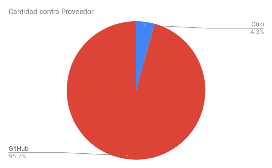
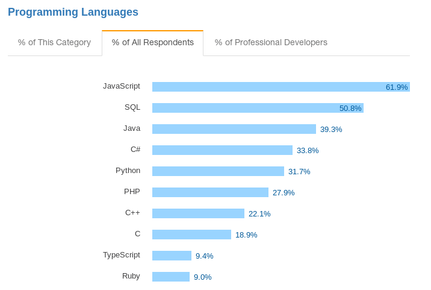
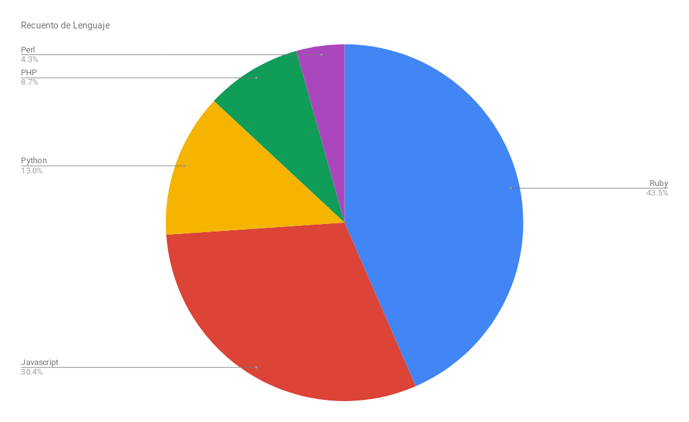
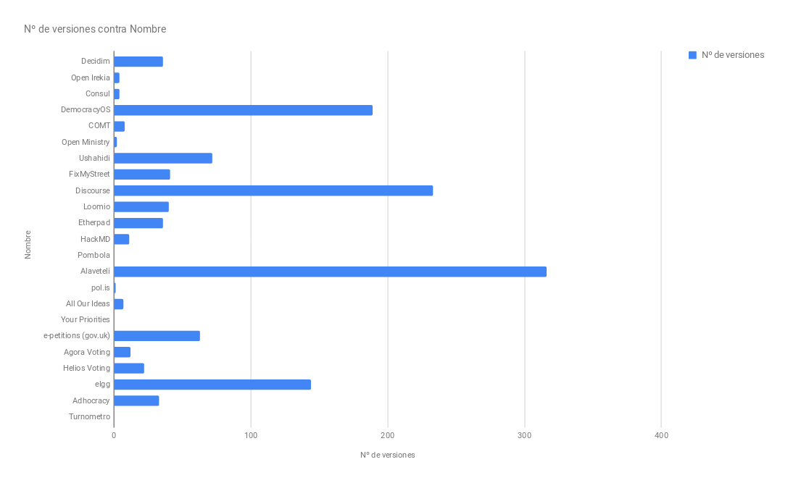
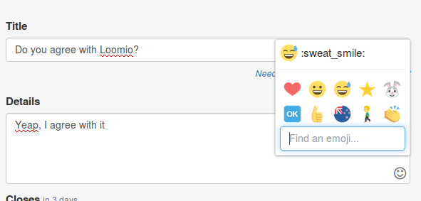
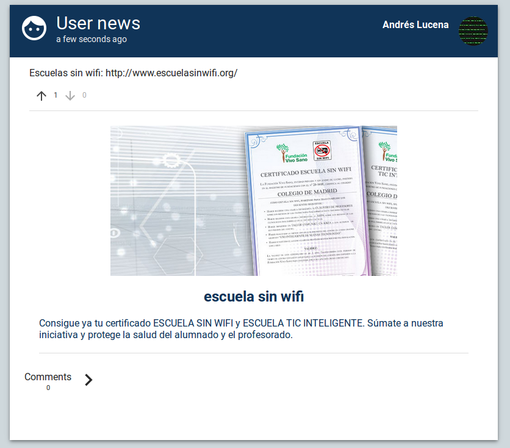
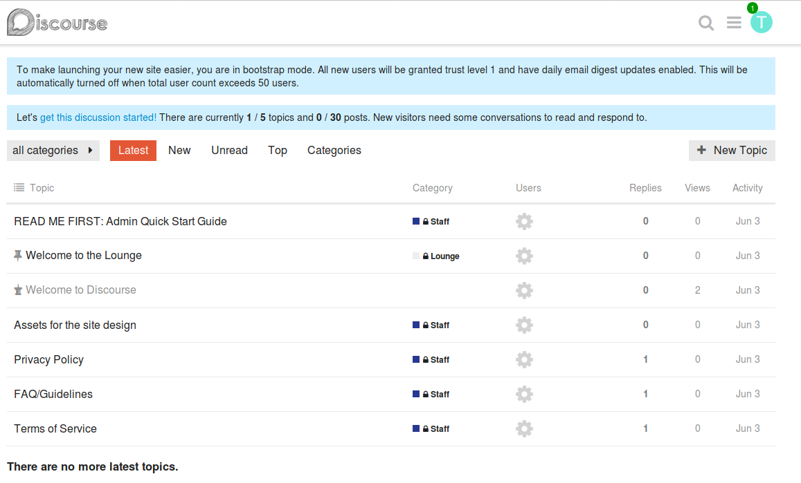
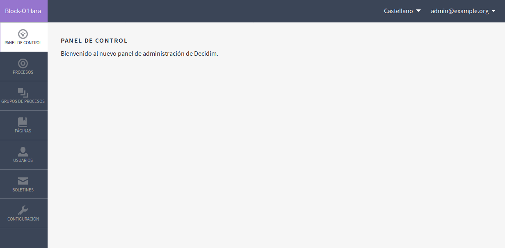
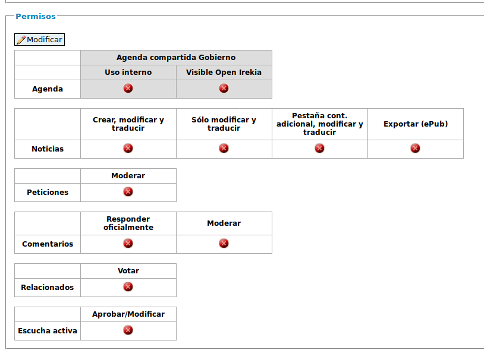
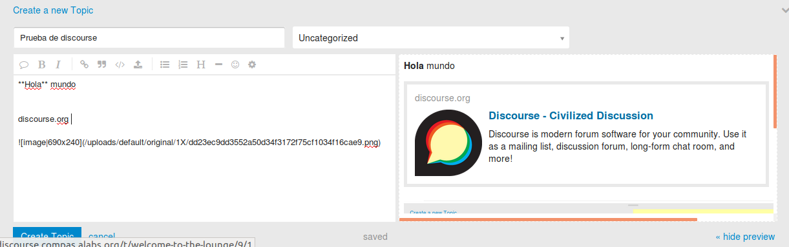

# Introducción

En su primer año de desarrollo con una nueva versión modular, la plataforma Decidim ya se ha extendido en múltiples municipios desde su impulso y adopción inicial por parte del Ayuntamiento de Barcelona. Entre otros, Hospitalet de Llobregat, Terrassa, Sabadell, Gavà, Sant Cugat, Vilanova i la Geltrú, Pamplona y Mataró. 

La plataforma se encuentra en pleno desarrollo y se están estudiando distintas dinámicas y metodologías para mejorarla, en base a las funcionalidades actuales del configurador de Procesos Participativos y otras dinámicas planteadas en su Plan de Desarrollo. 

El objetivo de este estudio  es el de investigar, informar y proponer distintas funcionalidades y mejoras en sus componentes, así como hacer recomendaciones de mejoras en distintos ámbitos de usabilidad y documentación entre otros. 

# XX Glosario (NOTE:  Las fuenes utilizadas para las definiciones contenidas en el glosario provienen fundamentalmente de Wikipedia (https://es.wikipedia.org). En caso contrario se referencia la fuente o fuentes utilizadas en notas al pié de página para cada palabra/concepto.)

**iframe**

iframe, por inline frame o marco incorporado en inglés, es un elemento HTML que permite insertar o incrustar un documento HTML dentro de un documento HTML principal. Actualmente es ya aceptada por la W3 como un elemento estándar y es ampliamente soportado por gran variedad de navegadores.

**Ruby on Rails**

Ruby on Rails o Rails, es un framework de aplicaciones web de código abierto escrito en el lenguaje de programación Ruby, siguiendo el paradigma del patrón Modelo Vista Controlador (MVC). El lenguaje de programación Ruby permite la metaprogramación, de la cual Rails hace uso, lo que resulta en una sintaxis que muchos de sus usuarios encuentran muy legible. Rails se distribuye a través de RubyGems, que es el formato oficial de paquete y canal de distribución de bibliotecas y aplicaciones Ruby.

**HTML**

HTML, sigla en inglés de HyperText Markup Language (lenguaje de marcas de hipertexto), hace referencia al lenguaje para la elaboración de páginas web. Es un estándar a cargo del World Wide Web Consortium (W3C) o Consorcio WWW, organización dedicada a la estandarización de las tecnologías ligadas a la web.

**CSS**

Hojas de estilo en cascada (o CSS, siglas en inglés de Cascading Stylesheets) es un lenguaje de diseño gráfico para definir y crear la presentación de un documento estructurado escrito en un lenguaje de marcado como HTML.

**Lenguaje de marcado**

Un lenguaje de marcado es una forma de codificar un documento que, junto con el texto, incorpora etiquetas o marcas que contienen información adicional acerca de la estructura del texto o su presentación. El lenguaje de marcas más extendido es el HTML.

**JavaScript**

JavaScript es un lenguaje de programación orientado a objetos basado en prototipos, imperativo, débilmente tipado y dinámico. Se utiliza principalmente en su forma del lado del cliente, implementado como parte de un navegador web permitiendo mejoras en la interfaz de usuario y páginas web dinámicas​ aunque existe una forma de JavaScript del lado del servidor(Server-side JavaScript o SSJS). 

**API **

Interfaz de programación de aplicaciones, abreviada como API (del inglés: Application Programming Interface),​ es un conjunto de subrutinas, funciones y procedimientos (o métodos, en la programación orientada a objetos) que ofrece cierta biblioteca para ser utilizado por otro software como una capa de abstracción.

**REST**

Describe cualquier interfaz entre sistemas que utilice directamente HTTP para obtener datos o indicar la ejecución de operaciones sobre los datos, en cualquier formato.

**HTTP**

Protocolo de comunicación que permite las transferencias de información en la World Wide Web

**Protocolo de comunicación**

En informática y telecomunicaciones un protocolo de comunicaciones es un sistema de reglas que permiten que dos o más entidades de un sistema de comunicación se comuniquen entre ellas para transmitir información.

**SMTP**

El simple Mail Transfer Protocol (SMTP) o "protocolo para transferencia simple de correo", es un protocolo de red utilizado para el intercambio de mensajes de correo electrónico entre computadoras u otros dispositivos.

**PLUGIN**

Aplicación que se relaciona con otra para agregarle una función nueva y generalmente muy específica.

**GIT**

Software de control de versiones diseñado por Linus Torvalds, pensando en la eficiencia y la confiabilidad del mantenimiento de versiones de aplicaciones cuando éstas tienen un gran número de archivos de código fuente.

**GITHUB / GITLAB**

Plataformas de desarrollo colaborativo para alojar proyectos utilizando el sistema de control de versiones Git. 

**Framework**

Entorno de trabajo compuesto por un conjunto estandarizado de conceptos, prácticas y criterios para enfocar un tipo de problemática particular que sirve como referencia, para enfrentar y resolver nuevos problemas de índole similar.

En el desarrollo de software, un entorno de trabajo es una estructura conceptual y tecnológica de asistencia definida, normalmente, con artefactos o módulos concretos de software, que puede servir de base para la organización y desarrollo de software. Típicamente, puede incluir soporte de programas, bibliotecas, y un lenguaje interpretado, entre otras herramientas, para así ayudar a desarrollar y unir los diferentes componentes de un proyecto.

**Democracia participativa**

Hace referencia a la forma de democracia en la que la ciudadanía tienen una mayor participación en la toma de las decisiones políticas de las que les otorga tradicionalmente la democracia representativa. La democracia participativa permite una participación ciudadana mayor que en democracia representativa pero menor que en la llamada democracia directa.

Puede definirse como un modelo político que facilita a la ciudadanía su capacidad de asociarse y organizarse de tal modo que puedan ejercer una influencia directa en las decisiones públicas. En la actualidad se manifiesta usualmente por medio de una diversidad de mecanismos, como presupuestos participativos, consejos vecinales o comunales o consultas populares. En una etapa más avanzada, el proyecto fundamental de la democracia participativa es la creación de un mecanismo de deliberaciones mediante el cual  la ciudadanía, con su propia participación, esté habilitada para manifestarse por igual con puntos de vista tanto mayoritarios como minoritarios. Los mecanismos o instituciones de participación tienen el propósito de hacer hincapié en el pleno respeto a las minorías, sus opiniones y su amplia manifestación a través de un mecanismo participativo e institucionalizado.

**Participación ciudadana**

Hacer referencia al conjunto de mecanismos para que la ciudadanía acceda a las decisiones de gobierno de manera independiente y sin necesidad de formar parte de la administración pública o de un partido político.

La participación ciudadana es considerada hoy en día como una pieza fundamental de los sistemas democráticos avanzados.

**Democracia digital o electrónica (e-democracy)**

La llamada democracia electrónica o democracia digital, conocida en inglés como e-democracy, implica el uso de las TIC (informática, Internet, computación móvil y telecomunicaciones) para crear espacios de diálogo y reflexión social, acceso a información de sujetos políticos, ejercicio de los derechos de participación política, y en la mejora de la relación entre ciudadanía, sujetos políticos e instituciones públicas con responsabilidades de gobierno.

**Democracia líquida (Liquid democracy)**

La democracia líquida o democracia delegativa revocable es una forma de democracia directa que incluye la posibilidad de delegación de voto revocable de forma instantánea.

**Voto electrónico**

El voto electrónico se refiere a la emisión del voto utilizando medios electrónicos diferentes de los tradicionales, como el voto presencial en papel y el voto por correo.

**Groupware**

Software colaborativo o groupware se refiere al conjunto de programas informáticos que integran el trabajo en un sólo proyecto, con muchos usuarios concurrentes, que se encuentran en diversas estaciones de trabajo, conectadas a través de una red (internet o intranet).

**Vagrant **

Herramienta para crear y configurar máquinas virtuales portables y reproducibles, de manera automática.

**Docker **

Docker es un proyecto de código abierto que automatiza el despliegue de aplicaciones dentro de contenedores de software, proporcionando una capa adicional de abstracción y automatización de Virtualización a nivel de sistema operativo en GNU Linux.

**Contenedores de software**

Los contenedores de software son un conjunto de elementos que permiten ejecutar una aplicación determinada en cualquier sistema operativo. Se utilizan para garantizar que una determinada aplicación se ejecute correctamente cuando cambie su entorno, sin dar fallos de ningún tipo. 

**Tecnopolítica**

Hace referencia al uso táctico y estratégico de las herramientas digitales para la organización, comunicación y acción colectiva. La capacidad de la multitudes conectadas, de los cerebros y cuerpos en red para crear y automodular la acción colectiva. (NOTE:  https://tecnopoliticay15m.wordpress.com/2012/08/01/concepto-tecnopolitica/)

Antoni Gutiérrez-Rubí, asesor de comunicación y consultor político,  define la tecnopolítica como "*acción política, comunicación política y, parcialmente, gestión política a través de la tecnología.*" Según este autor, la tecnopolítica es también un conjunto de prácticas asociadas a una forma de entender la comunicación política, las prácticas políticas. La tecnopolítica supone poner en el centro de la acción política al individuo y sus comunidades.

**Modelo de datos**

Un modelo de datos permite describir los elementos de la realidad que intervienen en un problema dado y la forma en que se relacionan esos elementos entre sí.

Aplicado a las Bases de Datos, un modelo de datos permite describir:

* Las estructuras de datos de la base: El tipo de los datos que hay en la base y la forma en que se relacionan.

* Las restricciones de integridad: Un conjunto de condiciones que deben cumplir los datos para reflejar la realidad deseada.

* Operaciones de manipulación de los datos: típicamente, operaciones de agregado, borrado, modificación y recuperación de los datos de la base.

**UML**

UML es un "lenguaje de modelado" o conjunto estandarizado de símbolos y de modos de disponerlos que facilita el diseño de software permitiendo especificar y  describir métodos o procesos. Se utiliza para visualizar, especificar, construir y documentar un sistema.

**Arquitectura software**

Hace referencia a la estructura, funcionamiento e interacción entre las partes del software. La Arquitectura del Software es el diseño de más alto nivel de la estructura de un sistema.

**Software modular - Programación modular**

Software modular hace referencia a aquel software desarrollado bajo los principios de la programación modular.

La programación modular es un paradigma de programación que consiste en dividir un programa en módulos o subprogramas con el fin de hacerlo más legible y manejable. Se presenta históricamente como una evolución de la programación estructurada para solucionar problemas de programación más grandes y complejos de lo que esta puede resolver.

Al aplicar la programación modular, un problema complejo debe ser dividido en varios subproblemas más simples, y estos a su vez en otros subproblemas más simples áun hasta obtener subproblemas lo suficientemente simples como para poder ser resueltos fácilmente con algún lenguaje de programación. Esta técnica se llama refinamiento sucesivo, divide y vencerás ó análisis descendente (Top-Down).

**Metadatos**

Datos que describen otros datos.

**Newsletter**

Boletín informativo que se elabora y distribuye de forma regular entre los usuarios de un sistema con el fin de mantenerlos informados sobre las novedades del mismo.

**MultiTenant**

Arquitectura de software en la cual una sola instancia de la aplicación se ejecuta en el servidor, pero sirviendo a múltiples clientes u organizaciones (tenedor o instancia). Este modelo se diferencia de las arquitecturas con múltiples instancias donde cada organización o cliente tiene su propia instancia instalada de la aplicación. La arquitectura MultiTenant permite que cada cliente tenga una instancia virtual adaptada a sus requerimientos. 

# Alcance y Metodología

El estudio se ha centrado exclusivamente en aplicativos web libres, es decir, aquellos que están protegidos por una licencia avalada por la Open Source Initiative (NOTE:  https://opensource.org/licenses/alphabetical ), licencias que permiten tanto su estudio como su modificación y/o adaptación y distribución, así como su instalación y análisis desde la perspectiva del usuario en sus distintos perfiles: usuario final, administrador, moderador, etc.

Así mismo, los aplicativos seleccionados para el estudio han sido o están siendo utilizados en la práctica por experiencias concretas de gobierno en distintas escalas (ciudad, provincia, estado, etc), así como por organizaciones sociales, cívicas y políticas, no obstante lo cual se han incluido también "pruebas de concepto" que se consideran especialmente relevantes para los fines del presente documento. 

La información recogida (recopilada) para cada uno de las aplicativos se presenta con la siguiente estructura: 

1. Metadatos

2. Funcionalidades 

3. Capturas de pantallas

4. Análisis

5. Arquitectura

6. Modelos de datos

Los **metadatos** recopilados son:

* Nombre: nombre completo del aplicativo

* URL: dirección web donde puede encontrarse el software funcionando o la explicación del proyecto en el caso en que lo tenga. 

* URL repositorio: dirección web donde puede encontrarse el código del aplicativo.

* Resumen (Inglés): una sinopsis de para qué sirve el software. 

* Resumen (Castellano): idem anterior, traducido al castellano. 

* Lenguaje: en que lenguaje de programación se ha realizado. 

* Framework: que conjunto de librerías se ha utilizado para su desarrollo. 

* Fecha primer commit: mes y año en que ha comenzado ha desarrollarse.

* Versión analizada: versión analizada en el marco de este informe. 

* Nº de releases: cantidad de versiones publicadas del aplicativo. 

* Nº de tablas en la BBDD: cantidad de tablas en la Base de Datos (BBDD), sirve como indicador de la complejidad del aplicativo (a mayor número de tablas más complejo). 

* Nº de contribuidores: cantidad de programadores que han contribuido código al aplicativo. 

* Nº de stars: indicador de popularidad en GitHub

* Licencia: que tipo de licencia es la que tiene el proyecto.

* Mantenido: si cuenta con un desarrollo activo (algún commit en los últimos 6 meses). 

* Diseño responsivo: si su diseño es adaptable a dispositivos con distintas anchuras (móviles, tablets, equipos de escritorio).

A continuación se hace un análisis de las distintas **funcionalidades** que ofrece el aplicativo, así como una serie de **capturas de pantallas** con una explicación simple de las mismas. 

Con respecto al **análisis**, se detalla en qué casos se ha usado y qué funcionalidades son especialmente reseñables de cara a Decidim. 

Posteriormente se documentan a nivel de **arquitectura** los grados de personalización, el soporte de temas de diseño, de modularización y extensión a través de plugins, addons o complementos y los distintos servicios que deben configurarse para el correcto funcionamiento de la herramienta, entre ellos pueden encontrarse servicios del tipo:

1. Servidor web

2. Servidor de aplicación

3. Servidor de base de datos

4. Servidor de caché

5. Servidor de envío de correo SMTP

6. Binarios necesarios

7. Servicios externos o APIs a los que se requiera para acceder (por ejemplo Google Maps o Bing Maps)

Por último se agrega información relativa al **modelo de datos**, con un esquema de la base de datos así como un listado de las tablas utilizadas por la aplicación. 

# Aplicativos estudiados

Se ha realizado una selección de distintos aplicativos con dinámicas participativas diferentes. Para realizar esta selección se han estudiado distintos recursos disponibles en la web, principalmente: 

* Civic Stack ([http://www.civicstack.org/](http://www.civicstack.org/)); Herramientas de código abierto para acciones políticas y sociales. Creado por Democracia en Red y Asuntos del Sur. 

* OGP Toolbox ([https://ogptoolbox.org/](https://ogptoolbox.org/)): Digital solutions to improve democracy. Creado por Open Government Partnership y Etalab. 

Con el fin de facilitar la navegación por las distintas aplicaciones y su comparativa, se han categorizado según sus funcionalidades principales y dinámicas participativas más relevantes.

<table>
  <tr>
    <td>Categoría</td>
    <td>Características</td>
    <td>Ejemplos</td>
  </tr>
  <tr>
    <td>A. Integral</td>
    <td>Permiten distintos tipos de dinámicas participativas integradas que posibilitan llevar a cabo distintos modelos de procesos participativos. Para ello cuentan con mecanismos integrados de "Comentario de texto", “Mapeo colaborativo” y “Debate”.</td>
    <td>A.1. Decidim
A.2. Open Irekia
A.3. Consul</td>
  </tr>
  <tr>
    <td>B. Comentario de texto</td>
    <td>Permiten añadir notas sobre una sección de un texto.</td>
    <td>B.1. DemocracyOS
B.2. COMT
B.3. Open Ministry</td>
  </tr>
  <tr>
    <td>C. Mapeo colaborativo</td>
    <td>Permiten realizar reportes o eventos geolocalizados sobre un mapa. </td>
    <td>C.1. Ushahidi
C.2. FixMyStreet</td>
  </tr>
  <tr>
    <td>D. Debate</td>
    <td>Permitena una comunidad digital tener un foro de discusión. </td>
    <td>D.1. Discourse
D.2. Loomio</td>
  </tr>
  <tr>
    <td>E. Escritura colaborativa en tiempo real </td>
    <td>Permiten escribir un texto entre varias personas simultáneamente (en tiempo real). </td>
    <td>E.1. Etherpad
E.2. HackMD</td>
  </tr>
  <tr>
    <td>F. Transparencia</td>
    <td>Permiten tener mecanismos de control por rendición de cuentas de los cargos públicos y hacer seguimiento de su actividad política y/o gestora. </td>
    <td>F.1. Pombola
F.2. Alaveteli</td>
  </tr>
  <tr>
    <td>G. Propuestas (votación a pares)</td>
    <td>Dadas dos propuestas o respuestas a una pregunta permite escoger la preferida por el usuario, así como realizar una alternativa. </td>
    <td>G.1. pol.is
G.2. All Our Ideas</td>
  </tr>
  <tr>
    <td>H. Propuestas (priorización)</td>
    <td>Permiten priorizar o votar distintas propuestas, peticiones o prioridades. </td>
    <td>H.1. Your Priorities
H.2. e-petitions (gov.uk)</td>
  </tr>
  <tr>
    <td>I. Voto electrónico</td>
    <td>Permiten crear y gestionar votaciones con ciertas garantías de confidencialidad y verificabilidad. </td>
    <td>I.1. nVotes
I.2. Helios Voting</td>
  </tr>
  <tr>
    <td>J. eGroupware</td>
    <td>Permiten a grupos trabajar y organizarse a través de una plataforma web, con distintas funcionalidades (foros de debate, calendarios compartidos, etc). </td>
    <td>J.1. Adhocracy
J.2. Elgg</td>
  </tr>
  <tr>
    <td>K. Dinamización de asambleas</td>
    <td>Permiten dinamizar una asamblea, llevando turnos de palabra y limitando la duración de cada turno. </td>
    <td>K.1. Turnometro
</td>
  </tr>
</table>

# Comparativa de metadatos

A continuación se incluyen distintos cuadros comparativos entre los metadatos de las aplicaciones analizadas. En cada cuadro  se incluye la siguiente información para cada aplicativo analizado:

* Cuadro 1: URL

* Cuadro 2: URL repositorio

* Cuadro 3: Resumen (en inglés)

* Cuadro 4: Resumen (en castellano) 

* Cuadro 5: Lenguaje y Framework

* Cuadro 6: Licencia

* Cuadro 7: Cantidad de versiones

* Cuadro 8: Cantidad de tablas en la base de datos (BBDD)

* Cuadro 9: Popularidad en GitHub

* Cuadro 10: Estado del mantenimiento 

## Cuadro 1: URL 

Para facilitar el estudio de los distintos aplicativos se agrega un cuadro resumen de las **direcciones URL de los **distintos **proyectos**** **estudiados en el marco de este informe. 

<table>
  <tr>
    <td>Código</td>
    <td>Nombre</td>
    <td>URL</td>
  </tr>
  <tr>
    <td>A.1</td>
    <td>Decidim</td>
    <td>https://decidim.org/</td>
  </tr>
  <tr>
    <td>A.2</td>
    <td>Open Irekia</td>
    <td>http://irekia.euskadi.eus/</td>
  </tr>
  <tr>
    <td>A.3</td>
    <td>Consul</td>
    <td>http://www.decide.es/</td>
  </tr>
  <tr>
    <td>B.1</td>
    <td>DemocracyOS</td>
    <td>http://democracyos.org/</td>
  </tr>
  <tr>
    <td>B.2</td>
    <td>COMT</td>
    <td>http://www.co-ment.com/</td>
  </tr>
  <tr>
    <td>B.3</td>
    <td>Open Ministry</td>
    <td>http://openministry.info/</td>
  </tr>
  <tr>
    <td>C.1</td>
    <td>Ushahidi</td>
    <td>https://www.ushahidi.com/</td>
  </tr>
  <tr>
    <td>C.2</td>
    <td>FixMyStreet</td>
    <td>https://www.fixmystreet.com/</td>
  </tr>
  <tr>
    <td>D.1</td>
    <td>Discourse</td>
    <td>https://www.discourse.org/</td>
  </tr>
  <tr>
    <td>D.2</td>
    <td>Loomio</td>
    <td>https://www.loomio.org/</td>
  </tr>
  <tr>
    <td>E.1</td>
    <td>Etherpad</td>
    <td>http://etherpad.org/</td>
  </tr>
  <tr>
    <td>E.2</td>
    <td>HackMD</td>
    <td>https://hackmd.io/</td>
  </tr>
  <tr>
    <td>F.1</td>
    <td>Pombola</td>
    <td>https://www.mysociety.org/democracy/pombola/</td>
  </tr>
  <tr>
    <td>F.2</td>
    <td>Alaveteli</td>
    <td>http://alaveteli.org/</td>
  </tr>
  <tr>
    <td>G.1</td>
    <td>pol.is</td>
    <td>https://pol.is</td>
  </tr>
  <tr>
    <td>G.2</td>
    <td>All Our Ideas</td>
    <td>http://www.allourideas.org</td>
  </tr>
  <tr>
    <td>H.1</td>
    <td>Your Priorities</td>
    <td>https://yrpri.org/</td>
  </tr>
  <tr>
    <td>H.2</td>
    <td>e-petitions (gov.uk)</td>
    <td>https://petition.parliament.uk/</td>
  </tr>
  <tr>
    <td>I.1</td>
    <td>Agora Voting</td>
    <td>http://agoravoting.org</td>
  </tr>
  <tr>
    <td>I.2</td>
    <td>Helios Voting</td>
    <td>https://heliosvoting.org/</td>
  </tr>
  <tr>
    <td>J.1</td>
    <td>elgg</td>
    <td>https://elgg.org/</td>
  </tr>
  <tr>
    <td>J.2</td>
    <td>Adhocracy</td>
    <td>https://adhocracy.de/</td>
  </tr>
  <tr>
    <td>K.1</td>
    <td>Turnometro</td>
    <td>http://turnometro.org/</td>
  </tr>
</table>

## Cuadro 2: URL repositorio

Para facilitar el estudio de los distintos aplicativos se agrega un cuadro resumen de las **direcciones URL de los **distintos **repositorios** de los proyectos estudiados en el marco de este informe. 

Es necesario hacer especial mención al uso de GitHub, ya que se trata  del proveedor de servicios de alojamiento de código escogido por la gran mayoría de los proyectos estudiados (un 95%), siendo Open Irekia el único proyecto que no se encuentra publicado en esta plataforma. 

<table>
  <tr>
    <td>Código</td>
    <td>Nombre</td>
    <td>URL repositorio</td>
  </tr>
  <tr>
    <td>A.1</td>
    <td>Decidim</td>
    <td>https://github.com/decidim/decidim</td>
  </tr>
  <tr>
    <td>A.2</td>
    <td>Open Irekia</td>
    <td>http://www.irekia.euskadi.eus/es/pages/10081-openirekia-publicacion-del-software-ogov-del-gobierno-vasco</td>
  </tr>
  <tr>
    <td>A.3</td>
    <td>Consul</td>
    <td>https://github.com/consul/consul/</td>
  </tr>
  <tr>
    <td>B.1</td>
    <td>DemocracyOS</td>
    <td>https://github.com/DemocracyOS/democracyos</td>
  </tr>
  <tr>
    <td>B.2</td>
    <td>COMT</td>
    <td>https://github.com/co-ment/comt</td>
  </tr>
  <tr>
    <td>B.3</td>
    <td>Open Ministry</td>
    <td>https://github.com/avoinministerio/avoinministerio</td>
  </tr>
  <tr>
    <td>C.1</td>
    <td>Ushahidi</td>
    <td>https://github.com/ushahidi/</td>
  </tr>
  <tr>
    <td>C.2</td>
    <td>FixMyStreet</td>
    <td>https://github.com/mysociety/fixmystreet</td>
  </tr>
  <tr>
    <td>D.1</td>
    <td>Discourse</td>
    <td>https://github.com/discourse/discourse</td>
  </tr>
  <tr>
    <td>D.2</td>
    <td>Loomio</td>
    <td>https://github.com/loomio/loomio</td>
  </tr>
  <tr>
    <td>E.1</td>
    <td>Etherpad</td>
    <td>https://github.com/ether/etherpad-lite</td>
  </tr>
  <tr>
    <td>E.2</td>
    <td>HackMD</td>
    <td>https://github.com/hackmdio/hackmd</td>
  </tr>
  <tr>
    <td>F.1</td>
    <td>Pombola</td>
    <td>https://github.com/mysociety/pombola</td>
  </tr>
  <tr>
    <td>F.2</td>
    <td>Alaveteli</td>
    <td>https://github.com/mysociety/alaveteli</td>
  </tr>
  <tr>
    <td>G.1</td>
    <td>pol.is</td>
    <td>https://github.com/pol-is</td>
  </tr>
  <tr>
    <td>G.2</td>
    <td>All Our Ideas</td>
    <td>https://github.com/allourideas/allourideas.org</td>
  </tr>
  <tr>
    <td>H.1</td>
    <td>Your Priorities</td>
    <td>https://github.com/rbjarnason/your-priorities-app/</td>
  </tr>
  <tr>
    <td>H.2</td>
    <td>e-petitions (gov.uk)</td>
    <td>https://github.com/alphagov/e-petitions</td>
  </tr>
  <tr>
    <td>I.1</td>
    <td>Agora Voting</td>
    <td>https://github.com/agoravoting</td>
  </tr>
  <tr>
    <td>I.2</td>
    <td>Helios Voting</td>
    <td>https://github.com/benadida/helios-server</td>
  </tr>
  <tr>
    <td>J.1</td>
    <td>elgg</td>
    <td>https://github.com/elgg/elgg</td>
  </tr>
  <tr>
    <td>J.2</td>
    <td>Adhocracy</td>
    <td>https://github.com/liqd/adhocracy</td>
  </tr>
  <tr>
    <td>K.1</td>
    <td>Turnometro</td>
    <td>https://github.com/elzr/Turnometro</td>
  </tr>
</table>

**Figura 1:** Porcentaje de uso de proveedores de alojamiento de código

## Cuadro 3: Descripción resumida  (en inglés)

Para facilitar el estudio de los distintos aplicativos se agrega un cuadro resumen de las **sinopsis** en inglés de los distintos proyectos estudiados en el marco de este informe. 

<table>
  <tr>
    <td>Código</td>
    <td>Nombre</td>
    <td>Descripción (Inglés)</td>
  </tr>
  <tr>
    <td>A.1</td>
    <td>Decidim</td>
    <td>The participatory democracy framework. A generator and multiple gems made with Ruby on Rails.</td>
  </tr>
  <tr>
    <td>A.2</td>
    <td>Open Irekia</td>
    <td>N/A</td>
  </tr>
  <tr>
    <td>A.3</td>
    <td>Consul</td>
    <td>Open Government and E-Participation Web Software</td>
  </tr>
  <tr>
    <td>B.1</td>
    <td>DemocracyOS</td>
    <td>An online space for deliberation and voting on political proposals. The software aims to stimulate better arguments and come to better rulings</td>
  </tr>
  <tr>
    <td>B.2</td>
    <td>COMT</td>
    <td>Text annotation and collaborative writing</td>
  </tr>
  <tr>
    <td>B.3</td>
    <td>Open Ministry</td>
    <td>Crowdsourcing legislation, deliberative and participatory democracy and citizens initiatives</td>
  </tr>
  <tr>
    <td>C.1</td>
    <td>Ushahidi</td>
    <td>Read the crowd. Don't just get the data. Get the whole story.</td>
  </tr>
  <tr>
    <td>C.2</td>
    <td>FixMyStreet</td>
    <td>Map-based reporting platform</td>
  </tr>
  <tr>
    <td>D.1</td>
    <td>Discourse</td>
    <td>A platform for community discussion. Free, open, simple.</td>
  </tr>
  <tr>
    <td>D.2</td>
    <td>Loomio</td>
    <td>An open-source web application that helps groups make better decisions together.</td>
  </tr>
  <tr>
    <td>E.1</td>
    <td>Etherpad</td>
    <td>Really real-time collaborative document editing</td>
  </tr>
  <tr>
    <td>E.2</td>
    <td>HackMD</td>
    <td>Best way to write and share your knowledge in markdown</td>
  </tr>
  <tr>
    <td>F.1</td>
    <td>Pombola</td>
    <td>Pombola is a parliamentary monitoring (PMO) platform; its biggest instances are Mzalendo.com and pa.org.za</td>
  </tr>
  <tr>
    <td>F.2</td>
    <td>Alaveteli</td>
    <td>Provide a Freedom of Information request system for your jurisdiction.</td>
  </tr>
  <tr>
    <td>G.1</td>
    <td>pol.is</td>
    <td>pol.is (pōlis) helps large organizations and communities understand themselves by visualizing what people think.</td>
  </tr>
  <tr>
    <td>G.2</td>
    <td>All Our Ideas</td>
    <td>Allows groups to collect and priorize information in an open, democratic, and efficient process.</td>
  </tr>
  <tr>
    <td>H.1</td>
    <td>Your Priorities</td>
    <td>Citizens participation application</td>
  </tr>
  <tr>
    <td>H.2</td>
    <td>e-petitions (gov.uk)</td>
    <td>This is the code base for the UK Government's e-petitions service (https://petition.parliament.uk)</td>
  </tr>
  <tr>
    <td>I.1</td>
    <td>Agora Voting</td>
    <td>Because every vote counts. Open source. Private vote. Auditable. Proven. Flexible.</td>
  </tr>
  <tr>
    <td>I.2</td>
    <td>Helios Voting</td>
    <td>Helios is an end-to-end verifiable voting system.</td>
  </tr>
  <tr>
    <td>J.1</td>
    <td>elgg</td>
    <td>Elgg is an open source rapid development framework for socially aware web applications.</td>
  </tr>
  <tr>
    <td>J.2</td>
    <td>Adhocracy</td>
    <td>A policy drafting and decision making software for distributed groups and open institutions.</td>
  </tr>
  <tr>
    <td>K.1</td>
    <td>Turnometro</td>
    <td>A web tool for more effective & inclusive assemblies.</td>
  </tr>
</table>

## Cuadro 4: Descripción resumida (en castellano)

Para facilitar el estudio de los distintos aplicativos se agrega un cuadro resumen de las **sinopsis** en castellano de los distintos proyectos estudiados en el marco de este informe. 

<table>
  <tr>
    <td>Código</td>
    <td>Nombre</td>
    <td>Descripción (Castellano)</td>
  </tr>
  <tr>
    <td>A.1</td>
    <td>Decidim</td>
    <td>El framework de la democracia participativa. Un generador y gemas múltiples hechas con Ruby on Rails.</td>
  </tr>
  <tr>
    <td>A.2</td>
    <td>Open Irekia</td>
    <td>Plataforma de la Dirección de Gobierno Abierto del Gobierno Vasco para fomentar la transparencia de las acciones del Gobierno Vasco y para promover la participación ciudadana activa en las decisiones del mismo</td>
  </tr>
  <tr>
    <td>A.3</td>
    <td>Consul</td>
    <td>Software web de Gobierno Abierto y E-Participación</td>
  </tr>
  <tr>
    <td>B.1</td>
    <td>DemocracyOS</td>
    <td>Un espacio en línea para deliberar y votar en propuestas politicas. El software tiene el fin de estimular mejores argumentos y llegar a mejores resoluciones.</td>
  </tr>
  <tr>
    <td>B.2</td>
    <td>COMT</td>
    <td>Anotación de textos y escritura colaborativa</td>
  </tr>
  <tr>
    <td>B.3</td>
    <td>Open Ministry</td>
    <td>Legislación con colaboración abierta distribuida, democracia participativa e iniciativas ciudadanas</td>
  </tr>
  <tr>
    <td>C.1</td>
    <td>Ushahidi</td>
    <td>Lea la multitud. No obtenga sólo los datos. Obtenga toda la historia.</td>
  </tr>
  <tr>
    <td>C.2</td>
    <td>FixMyStreet</td>
    <td>Plataforma de reporte basada en mapas</td>
  </tr>
  <tr>
    <td>D.1</td>
    <td>Discourse</td>
    <td>Una plataforma para el debate de la comunidad. Libre, abierta, simple.</td>
  </tr>
  <tr>
    <td>D.2</td>
    <td>Loomio</td>
    <td>Una aplicación web de código abierto que ayuda a los grupos a tomar mejores decisiones en grupo.</td>
  </tr>
  <tr>
    <td>E.1</td>
    <td>Etherpad</td>
    <td>Edición de documentos colaborativa realmente en tiempo real</td>
  </tr>
  <tr>
    <td>E.2</td>
    <td>HackMD</td>
    <td>La mejor forma para escribir y compartir tu conocimiento en markdown</td>
  </tr>
  <tr>
    <td>F.1</td>
    <td>Pombola</td>
    <td>Pombola es una plataforma de seguimiento parlamentario (PMO); sus mayores instancias son Mzalendo.com y pa.org.za</td>
  </tr>
  <tr>
    <td>F.2</td>
    <td>Alaveteli</td>
    <td>Proporciona un sistema de solicitud de libertad de información para su jurisdicción.</td>
  </tr>
  <tr>
    <td>G.1</td>
    <td>pol.is</td>
    <td>pol.is (pōlis) ayuda a grandes organizaciones y comunidades a entenderse a sí mismas visualizando lo que la gente piensa.</td>
  </tr>
  <tr>
    <td>G.2</td>
    <td>All Our Ideas</td>
    <td>Permite a grupos recoger y priorizar información en un proceso abierto, democrático y eficiente.</td>
  </tr>
  <tr>
    <td>H.1</td>
    <td>Your Priorities</td>
    <td>Aplicación para la participación ciudadana</td>
  </tr>
  <tr>
    <td>H.2</td>
    <td>e-petitions (gov.uk)</td>
    <td>Este es el código base para el servicio de peticiones electrónicas del Gobierno del Reino Unido (https://petition.parliament.uk)</td>
  </tr>
  <tr>
    <td>I.1</td>
    <td>Agora Voting</td>
    <td>Porque cada voto cuenta. Código abierto. Voto privado Auditable. Probado. Flexible.</td>
  </tr>
  <tr>
    <td>I.2</td>
    <td>Helios Voting</td>
    <td>Helios es un sistema de votación verificable de extremo a extremo.</td>
  </tr>
  <tr>
    <td>J.1</td>
    <td>elgg</td>
    <td>Elgg es un framework de desarrollo rápido de código abierto para aplicaciones web socialmente conscientes.</td>
  </tr>
  <tr>
    <td>J.2</td>
    <td>Adhocracy</td>
    <td>Una software para la elaboración de políticas y la toma de decisiones para grupos distribuidos e instituciones abiertas.</td>
  </tr>
  <tr>
    <td>K.1</td>
    <td>Turnometro</td>
    <td>Una herramienta web para asambleas más efectivas e inclusivas.</td>
  </tr>
</table>

## Cuadro 5: Lenguaje y Framework

Para facilitar el estudio de los distintos aplicativos se agrega un cuadro resumen del **lenguaje y framework **de programación y desarrollo de los distintos proyectos estudiados en el marco de este informe. 

<table>
  <tr>
    <td>Código</td>
    <td>Nombre</td>
    <td>Lenguaje</td>
    <td>Framework</td>
  </tr>
  <tr>
    <td>A.1</td>
    <td>Decidim</td>
    <td>Ruby</td>
    <td>Ruby on Rails</td>
  </tr>
  <tr>
    <td>A.2</td>
    <td>Open Irekia</td>
    <td>Ruby</td>
    <td>Ruby on Rails</td>
  </tr>
  <tr>
    <td>A.3</td>
    <td>Consul</td>
    <td>Ruby</td>
    <td>Ruby on Rails</td>
  </tr>
  <tr>
    <td>B.1</td>
    <td>DemocracyOS</td>
    <td>Javascript</td>
    <td>Node.js</td>
  </tr>
  <tr>
    <td>B.2</td>
    <td>COMT</td>
    <td>Python</td>
    <td>Django</td>
  </tr>
  <tr>
    <td>B.3</td>
    <td>Open Ministry</td>
    <td>Ruby</td>
    <td>Ruby on Rails</td>
  </tr>
  <tr>
    <td>C.1</td>
    <td>Ushahidi</td>
    <td>PHP</td>
    <td>Laravel</td>
  </tr>
  <tr>
    <td>C.2</td>
    <td>FixMyStreet</td>
    <td>Perl</td>
    <td>Catalyst</td>
  </tr>
  <tr>
    <td>D.1</td>
    <td>Discourse</td>
    <td>Ruby</td>
    <td>Ruby on Rails</td>
  </tr>
  <tr>
    <td>D.2</td>
    <td>Loomio</td>
    <td>Ruby</td>
    <td>Ruby on Rails</td>
  </tr>
  <tr>
    <td>E.1</td>
    <td>Etherpad</td>
    <td>Javascript</td>
    <td>Node.js</td>
  </tr>
  <tr>
    <td>E.2</td>
    <td>HackMD</td>
    <td>Javascript</td>
    <td>Node.js</td>
  </tr>
  <tr>
    <td>F.1</td>
    <td>Pombola</td>
    <td>Ruby</td>
    <td>Ruby on Rails</td>
  </tr>
  <tr>
    <td>F.2</td>
    <td>Alaveteli</td>
    <td>Ruby</td>
    <td>Ruby on Rails</td>
  </tr>
  <tr>
    <td>G.1</td>
    <td>pol.is</td>
    <td>Javascript</td>
    <td>Node.js</td>
  </tr>
  <tr>
    <td>G.2</td>
    <td>All Our Ideas</td>
    <td>Ruby</td>
    <td>Ruby on Rails</td>
  </tr>
  <tr>
    <td>H.1</td>
    <td>Your Priorities</td>
    <td>Javascript</td>
    <td>Node.js</td>
  </tr>
  <tr>
    <td>H.2</td>
    <td>e-petitions (gov.uk)</td>
    <td>Ruby</td>
    <td>Ruby on Rails</td>
  </tr>
  <tr>
    <td>I.1</td>
    <td>Agora Voting</td>
    <td>Javascript</td>
    <td>Node.js</td>
  </tr>
  <tr>
    <td>I.2</td>
    <td>Helios Voting</td>
    <td>Python</td>
    <td>Django</td>
  </tr>
  <tr>
    <td>J.1</td>
    <td>elgg</td>
    <td>PHP</td>
    <td>No aplica</td>
  </tr>
  <tr>
    <td>J.2</td>
    <td>Adhocracy</td>
    <td>Python</td>
    <td>Pylons</td>
  </tr>
  <tr>
    <td>K.1</td>
    <td>Turnometro</td>
    <td>Javascript</td>
    <td>No aplica</td>
  </tr>
</table>

Llama la atención que el lenguaje de programación y framework más popular para este tipo de aplicaciones sea Ruby ya que, según el sitio web para programadores StackOverflow (NOTE:  https://insights.stackoverflow.com/survey/2017#most-popular-technologies ) que recoge los lenguajes de programación más populares, Ruby se encontraría en el décimo puesto:

**Figura 2:** Lenguajes de programación más populares en encuesta de StackOverflow

 

**Figura 3:** Lenguajes de los aplicativos estudiados en este informe

**Figura 4:** Frameworks de programación de los aplicativos estudiados en este informe

## Cuadro 6: Licencia

Para facilitar el estudio de los distintos aplicativos se agrega un cuadro resumen del tipo de **licencia** escogida para los distintos proyectos estudiados en el marco de este informe. 

<table>
  <tr>
    <td>Código</td>
    <td>Nombre</td>
    <td>Licencia</td>
  </tr>
  <tr>
    <td>A.1</td>
    <td>Decidim</td>
    <td>GNU Affero GPL v3</td>
  </tr>
  <tr>
    <td>A.2</td>
    <td>Open Irekia</td>
    <td>European Union Public Licence V . 1.1</td>
  </tr>
  <tr>
    <td>A.3</td>
    <td>Consul</td>
    <td>GNU Affero GPL v3</td>
  </tr>
  <tr>
    <td>B.1</td>
    <td>DemocracyOS</td>
    <td>GNU Affero GPL v3</td>
  </tr>
  <tr>
    <td>B.2</td>
    <td>COMT</td>
    <td>GNU Affero GPL v3</td>
  </tr>
  <tr>
    <td>B.3</td>
    <td>Open Ministry</td>
    <td>Ad-hoc</td>
  </tr>
  <tr>
    <td>C.1</td>
    <td>Ushahidi</td>
    <td>GNU Affero GPL v3</td>
  </tr>
  <tr>
    <td>C.2</td>
    <td>FixMyStreet</td>
    <td>GNU Affero GPL v3</td>
  </tr>
  <tr>
    <td>D.1</td>
    <td>Discourse</td>
    <td>GPLv2</td>
  </tr>
  <tr>
    <td>D.2</td>
    <td>Loomio</td>
    <td>GNU Affero GPL v3</td>
  </tr>
  <tr>
    <td>E.1</td>
    <td>Etherpad</td>
    <td>Apache 2.0</td>
  </tr>
  <tr>
    <td>E.2</td>
    <td>HackMD</td>
    <td>MIT</td>
  </tr>
  <tr>
    <td>F.1</td>
    <td>Pombola</td>
    <td>GNU Affero GPL v3</td>
  </tr>
  <tr>
    <td>F.2</td>
    <td>Alaveteli</td>
    <td>GNU Affero GPL v3</td>
  </tr>
  <tr>
    <td>G.1</td>
    <td>pol.is</td>
    <td>GNU Affero GPL v3</td>
  </tr>
  <tr>
    <td>G.2</td>
    <td>All Our Ideas</td>
    <td>BSD</td>
  </tr>
  <tr>
    <td>H.1</td>
    <td>Your Priorities</td>
    <td>BSD</td>
  </tr>
  <tr>
    <td>H.2</td>
    <td>e-petitions (gov.uk)</td>
    <td>MIT</td>
  </tr>
  <tr>
    <td>I.1</td>
    <td>Agora Voting</td>
    <td>GNU Affero GPL v3</td>
  </tr>
  <tr>
    <td>I.2</td>
    <td>Helios Voting</td>
    <td>Apache 2.0</td>
  </tr>
  <tr>
    <td>J.1</td>
    <td>elgg</td>
    <td>MIT / GPLv2</td>
  </tr>
  <tr>
    <td>J.2</td>
    <td>Adhocracy</td>
    <td>GNU Affero GPL v3</td>
  </tr>
  <tr>
    <td>K.1</td>
    <td>Turnometro</td>
    <td>No aplica</td>
  </tr>
</table>

Como puede apreciarse, la licencia más utilizada para los aplicativos estudiados es la GNU Affero GPL v3 (abreviada normalmente como AGPLv3):

**Figura 5:** Licencias de aplicaciones de este informe

<table>
  <tr>
    <td>Orden</td>
    <td>Licencia</td>
    <td>% de proyectos</td>
  </tr>
  <tr>
    <td>1</td>
    <td>AGPLv3</td>
    <td>50.00%</td>
  </tr>
  <tr>
    <td>2</td>
    <td>MIT</td>
    <td>12.50%</td>
  </tr>
  <tr>
    <td>3</td>
    <td>GPLv2</td>
    <td>8.33%</td>
  </tr>
  <tr>
    <td>4</td>
    <td>BSD</td>
    <td>8.33%</td>
  </tr>
  <tr>
    <td>5</td>
    <td>Apache</td>
    <td>8.33%</td>
  </tr>
  <tr>
    <td>6</td>
    <td>Ad-hoc</td>
    <td>4.16%</td>
  </tr>
  <tr>
    <td>7</td>
    <td>Unlicense</td>
    <td>4.16%</td>
  </tr>
  <tr>
    <td>8</td>
    <td>EUPL</td>
    <td>4.16%</td>
  </tr>
</table>

Si se compara con los tipos de licencia más populares en GitHub (NOTE:  https://github.com/blog/1964-open-source-license-usage-on-github-com ) se ve que este tipo de licencia no cuenta con este grado de popularidad en el resto de proyectos libres o abiertos publicados en esta plataforma: 

<table>
  <tr>
    <td>Orden</td>
    <td>Licencia</td>
    <td>% de proyectos</td>
  </tr>
  <tr>
    <td>1</td>
    <td>MIT</td>
    <td>44.69%</td>
  </tr>
  <tr>
    <td>2</td>
    <td>Other</td>
    <td>15.68%</td>
  </tr>
  <tr>
    <td>3</td>
    <td>GPLv2</td>
    <td>12.96%</td>
  </tr>
  <tr>
    <td>4</td>
    <td>Apache</td>
    <td>11.19%</td>
  </tr>
  <tr>
    <td>5</td>
    <td>GPLv3</td>
    <td>8.88%</td>
  </tr>
  <tr>
    <td>6</td>
    <td>BSD 3-clause</td>
    <td>4.53%</td>
  </tr>
  <tr>
    <td>7</td>
    <td>Unlicense</td>
    <td>1.87%</td>
  </tr>
  <tr>
    <td>8</td>
    <td>BSD 2-clause</td>
    <td>1.70%</td>
  </tr>
  <tr>
    <td>9</td>
    <td>LGPLv3</td>
    <td>1.30%</td>
  </tr>
  <tr>
    <td>10</td>
    <td>AGPLv3</td>
    <td>1.05%</td>
  </tr>
</table>

La licencia pública general de Affero (en inglés, Affero General Public License, Affero GPL o AGPL) es una licencia copyleft derivada de la Licencia Pública General de GNU diseñada específicamente para asegurar la cooperación con la comunidad en el caso de software que corra en servidores de red. La Affero GPL es íntegramente una GNU GPL con una cláusula nueva que añade la obligación de distribuir el software si éste se ejecuta para ofrecer servicios a través de una red de ordenadores.

La Free Software Foundation recomienda el uso de esta licencia "para cualquier software que usualmente corra sobre una red" (NOTE:  The FSF recommends that people consider using the GNU AGPL for any software which will commonly be run over a network. (https://www.fsf.org/news/agplv3-pr)).

La elección de este tipo de licencia AGPLv3 para este tipo de proyectos, en su mayoría relacionados con valores democráticos, obliga a las obras derivadas creadas a cumplir con este mismo tipo de licencia, en contraposición a otras licencias como la MIT, BSD o Apache en el que se podría cerrar el código de las aplicaciones derivadas, por lo que, al menos en principio, dicha licencia parece la más adecuada para una plataforma como Decidim.

## Cuadro 7: Cantidad de versiones

En la programación de software se suele indicar el número de versión con el fin de informar sobre su nivel de desarrollo. El hecho de disponer de pocas versiones de una aplicación o plataforma puede ser un indicador de que no cuentan con un flujo de publicación y distribución mantenido en el tiempo, o que el desarrollo se encuentra en un momento muy temprano. 

En el cuadro se han resaltado  los aplicativos que no cuenten con un mínimo de 10 versiones publicadas. ...

<table>
  <tr>
    <td>Código</td>
    <td>Nombre</td>
    <td>Nº de versiones</td>
  </tr>
  <tr>
    <td>A.1</td>
    <td>Decidim</td>
    <td>36</td>
  </tr>
  <tr>
    <td>A.2</td>
    <td>Open Irekia</td>
    <td>4</td>
  </tr>
  <tr>
    <td>A.3</td>
    <td>Consul</td>
    <td>4</td>
  </tr>
  <tr>
    <td>B.1</td>
    <td>DemocracyOS</td>
    <td>189</td>
  </tr>
  <tr>
    <td>B.2</td>
    <td>COMT</td>
    <td>8</td>
  </tr>
  <tr>
    <td>B.3</td>
    <td>Open Ministry</td>
    <td>2</td>
  </tr>
  <tr>
    <td>C.1</td>
    <td>Ushahidi</td>
    <td>72</td>
  </tr>
  <tr>
    <td>C.2</td>
    <td>FixMyStreet</td>
    <td>41</td>
  </tr>
  <tr>
    <td>D.1</td>
    <td>Discourse</td>
    <td>233</td>
  </tr>
  <tr>
    <td>D.2</td>
    <td>Loomio</td>
    <td>40</td>
  </tr>
  <tr>
    <td>E.1</td>
    <td>Etherpad</td>
    <td>36</td>
  </tr>
  <tr>
    <td>E.2</td>
    <td>HackMD</td>
    <td>11</td>
  </tr>
  <tr>
    <td>F.1</td>
    <td>Pombola</td>
    <td>0</td>
  </tr>
  <tr>
    <td>F.2</td>
    <td>Alaveteli</td>
    <td>316</td>
  </tr>
  <tr>
    <td>G.1</td>
    <td>pol.is</td>
    <td>1</td>
  </tr>
  <tr>
    <td>G.2</td>
    <td>All Our Ideas</td>
    <td>7</td>
  </tr>
  <tr>
    <td>H.1</td>
    <td>Your Priorities</td>
    <td>0</td>
  </tr>
  <tr>
    <td>H.2</td>
    <td>e-petitions (gov.uk)</td>
    <td>63</td>
  </tr>
  <tr>
    <td>I.1</td>
    <td>Agora Voting</td>
    <td>12</td>
  </tr>
  <tr>
    <td>I.2</td>
    <td>Helios Voting</td>
    <td>22</td>
  </tr>
  <tr>
    <td>J.1</td>
    <td>elgg</td>
    <td>144</td>
  </tr>
  <tr>
    <td>J.2</td>
    <td>Adhocracy</td>
    <td>33</td>
  </tr>
  <tr>
    <td>K.1</td>
    <td>Turnometro</td>
    <td>0</td>
  </tr>
</table>

# 

**Figura 6:** Cantidad de versiones de cada aplicativo estudiado en este informe

## Cuadro 8: Cantidad de tablas en la Base de Datos (BBDD)

La cantidad de tablas de la Base de Datos (BBDD) es un indicativo de qué tan compleja o monolítica puede ser una aplicación, y las dificultades que pueden encontrarse en su mantenimiento. 

Este indicador depende del tipo de aplicación de que se trate. Por ejemplo, en el caso de Turnometro, por la propia naturaleza de la aplicación, no cuenta con un esquema SQL desde donde se pueda analizar el número de tablas implicadas así como su complejidad.

Por otro lado, se han excluido de la comparativa aquellos aplicativos que no pudieron instalarse para su estudio en el marco de este informe. Dichos aplicativos excluidos son: pol.is, Your Priorities y Agora Voting. 

<table>
  <tr>
    <td>Código</td>
    <td>Nombre</td>
    <td>Nº de tablas en la BBDD</td>
  </tr>
  <tr>
    <td>A.1</td>
    <td>Decidim</td>
    <td>37</td>
  </tr>
  <tr>
    <td>A.2</td>
    <td>Open Irekia</td>
    <td>56</td>
  </tr>
  <tr>
    <td>A.3</td>
    <td>Consul</td>
    <td>85</td>
  </tr>
  <tr>
    <td>B.1</td>
    <td>DemocracyOS</td>
    <td>10</td>
  </tr>
  <tr>
    <td>B.2</td>
    <td>COMT</td>
    <td>26</td>
  </tr>
  <tr>
    <td>B.3</td>
    <td>Open Ministry</td>
    <td>30</td>
  </tr>
  <tr>
    <td>C.1</td>
    <td>Ushahidi</td>
    <td>49</td>
  </tr>
  <tr>
    <td>C.2</td>
    <td>FixMyStreet</td>
    <td>22</td>
  </tr>
  <tr>
    <td>D.1</td>
    <td>Discourse</td>
    <td>129</td>
  </tr>
  <tr>
    <td>D.2</td>
    <td>Loomio</td>
    <td>55</td>
  </tr>
  <tr>
    <td>E.1</td>
    <td>Etherpad</td>
    <td>1</td>
  </tr>
  <tr>
    <td>E.2</td>
    <td>HackMD</td>
    <td>8</td>
  </tr>
  <tr>
    <td>F.1</td>
    <td>Pombola</td>
    <td>107</td>
  </tr>
  <tr>
    <td>F.2</td>
    <td>Alaveteli</td>
    <td>35</td>
  </tr>
  <tr>
    <td>G.1</td>
    <td>pol.is</td>
    <td>No aplica</td>
  </tr>
  <tr>
    <td>G.2</td>
    <td>All Our Ideas</td>
    <td>33</td>
  </tr>
  <tr>
    <td>H.1</td>
    <td>Your Priorities</td>
    <td>No aplica</td>
  </tr>
  <tr>
    <td>H.2</td>
    <td>e-petitions (gov.uk)</td>
    <td>29</td>
  </tr>
  <tr>
    <td>I.1</td>
    <td>Agora Voting</td>
    <td>No aplica</td>
  </tr>
  <tr>
    <td>I.2</td>
    <td>Helios Voting</td>
    <td>20</td>
  </tr>
  <tr>
    <td>J.1</td>
    <td>elgg</td>
    <td>24</td>
  </tr>
  <tr>
    <td>J.2</td>
    <td>Adhocracy</td>
    <td>43</td>
  </tr>
  <tr>
    <td>K.1</td>
    <td>Turnometro</td>
    <td>0</td>
  </tr>
</table>

## Cuadro 9: Popularidad en GitHub

La plataforma para compartir código GitHub ofrece varios indicadores de popularidad. En el marco de este informe se han recogido la cantidad de contribuidores (programadores que hayan introducido por lo menos una línea de código o cambio en el proyecto) y el número de "stars" (cantidad de usuarios de GitHub que consideran interesante el proyecto o que quieran guardarlo como marcador para referencia futura). 

Se resaltan en rojo aquellos proyectos que tengan menos de 10 contribuidores o que cuenten con menos de 50 stars. 

...

<table>
  <tr>
    <td>Código</td>
    <td>Nombre</td>
    <td>Nº de contribuidores</td>
    <td>Nº de stars</td>
  </tr>
  <tr>
    <td>A.1</td>
    <td>Decidim</td>
    <td>19</td>
    <td>65</td>
  </tr>
  <tr>
    <td>A.2</td>
    <td>Open Irekia</td>
    <td>1</td>
    <td>1</td>
  </tr>
  <tr>
    <td>A.3</td>
    <td>Consul</td>
    <td>61</td>
    <td>480</td>
  </tr>
  <tr>
    <td>B.1</td>
    <td>DemocracyOS</td>
    <td>68</td>
    <td>1524</td>
  </tr>
  <tr>
    <td>B.2</td>
    <td>COMT</td>
    <td>5</td>
    <td>12</td>
  </tr>
  <tr>
    <td>B.3</td>
    <td>Open Ministry</td>
    <td>18</td>
    <td>98</td>
  </tr>
  <tr>
    <td>C.1</td>
    <td>Ushahidi</td>
    <td>26</td>
    <td>403</td>
  </tr>
  <tr>
    <td>C.2</td>
    <td>FixMyStreet</td>
    <td>34</td>
    <td>322</td>
  </tr>
  <tr>
    <td>D.1</td>
    <td>Discourse</td>
    <td>600</td>
    <td>22777</td>
  </tr>
  <tr>
    <td>D.2</td>
    <td>Loomio</td>
    <td>60</td>
    <td>1483</td>
  </tr>
  <tr>
    <td>E.1</td>
    <td>Etherpad</td>
    <td>177</td>
    <td>6495</td>
  </tr>
  <tr>
    <td>E.2</td>
    <td>HackMD</td>
    <td>54</td>
    <td>2814</td>
  </tr>
  <tr>
    <td>F.1</td>
    <td>Pombola</td>
    <td>27</td>
    <td>55</td>
  </tr>
  <tr>
    <td>F.2</td>
    <td>Alaveteli</td>
    <td>45</td>
    <td>213</td>
  </tr>
  <tr>
    <td>G.1</td>
    <td>pol.is</td>
    <td>18</td>
    <td>28</td>
  </tr>
  <tr>
    <td>G.2</td>
    <td>All Our Ideas</td>
    <td>11</td>
    <td>122</td>
  </tr>
  <tr>
    <td>H.1</td>
    <td>Your Priorities</td>
    <td>1</td>
    <td>19</td>
  </tr>
  <tr>
    <td>H.2</td>
    <td>e-petitions (gov.uk)</td>
    <td>29</td>
    <td>136</td>
  </tr>
  <tr>
    <td>I.1</td>
    <td>Agora Voting</td>
    <td>4</td>
    <td>12</td>
  </tr>
  <tr>
    <td>I.2</td>
    <td>Helios Voting</td>
    <td>13</td>
    <td>299</td>
  </tr>
  <tr>
    <td>J.1</td>
    <td>elgg</td>
    <td>75</td>
    <td>1064</td>
  </tr>
  <tr>
    <td>J.2</td>
    <td>Adhocracy</td>
    <td>29</td>
    <td>135</td>
  </tr>
  <tr>
    <td>K.1</td>
    <td>Turnometro</td>
    <td>1</td>
    <td>4</td>
  </tr>
</table>

## Cuadro 10: Estado del mantenimiento

Un aspecto fundamental en el desarrollo de software es el mantenimiento del mismo. Un aplicativo que no se actualice periódicamente tendrá fallos de seguridad, algo especialmente grave al tratarse de aplicaciones web. 

...

<table>
  <tr>
    <td>Código</td>
    <td>Nombre</td>
    <td>Mantenido</td>
  </tr>
  <tr>
    <td>A.1</td>
    <td>Decidim</td>
    <td>Sí</td>
  </tr>
  <tr>
    <td>A.2</td>
    <td>Open Irekia</td>
    <td>No</td>
  </tr>
  <tr>
    <td>A.3</td>
    <td>Consul</td>
    <td>Sí</td>
  </tr>
  <tr>
    <td>B.1</td>
    <td>DemocracyOS</td>
    <td>Sí</td>
  </tr>
  <tr>
    <td>B.2</td>
    <td>COMT</td>
    <td>No</td>
  </tr>
  <tr>
    <td>B.3</td>
    <td>Open Ministry</td>
    <td>No</td>
  </tr>
  <tr>
    <td>C.1</td>
    <td>Ushahidi</td>
    <td>Sí</td>
  </tr>
  <tr>
    <td>C.2</td>
    <td>FixMyStreet</td>
    <td>Sí</td>
  </tr>
  <tr>
    <td>D.1</td>
    <td>Discourse</td>
    <td>Sí</td>
  </tr>
  <tr>
    <td>D.2</td>
    <td>Loomio</td>
    <td>Sí</td>
  </tr>
  <tr>
    <td>E.1</td>
    <td>Etherpad</td>
    <td>Sí</td>
  </tr>
  <tr>
    <td>E.2</td>
    <td>HackMD</td>
    <td>Sí</td>
  </tr>
  <tr>
    <td>F.1</td>
    <td>Pombola</td>
    <td>Sí</td>
  </tr>
  <tr>
    <td>F.2</td>
    <td>Alaveteli</td>
    <td>Sí</td>
  </tr>
  <tr>
    <td>G.1</td>
    <td>pol.is</td>
    <td>Sí</td>
  </tr>
  <tr>
    <td>G.2</td>
    <td>All Our Ideas</td>
    <td>Sí</td>
  </tr>
  <tr>
    <td>H.1</td>
    <td>Your Priorities</td>
    <td>Sí</td>
  </tr>
  <tr>
    <td>H.2</td>
    <td>e-petitions (gov.uk)</td>
    <td>Sí</td>
  </tr>
  <tr>
    <td>I.1</td>
    <td>Agora Voting</td>
    <td>Sí</td>
  </tr>
  <tr>
    <td>I.2</td>
    <td>Helios Voting</td>
    <td>Sí</td>
  </tr>
  <tr>
    <td>J.1</td>
    <td>elgg</td>
    <td>Sí</td>
  </tr>
  <tr>
    <td>J.2</td>
    <td>Adhocracy</td>
    <td>No</td>
  </tr>
  <tr>
    <td>K.1</td>
    <td>Turnometro</td>
    <td>No</td>
  </tr>
</table>

# Conclusiones

… 

# Recomendaciones

Para finalizar, se realizan una serie de recomendaciones y **propuestas de mejoras **para Decidim teniendo en cuenta los aspectos más innovadores de los aplicativos estudiados, así como carencias que puede tener el desarrollo ahora mismo, de cara a facilitar su reutilización por otras entidades. 

## 1. Emojis 

Son caracteres popularizados por los smartphones, que se encuentran disponibles en múltiples aplicaciones (Gmail, Facebook, Twitter, Whatsapp, Telegram, Google Hangouts) y que permiten comunicar expresiones faciales, objetos, lugares, etc. 

Son elementos que tienen cada vez más relevancia tanto a nivel técnico como cultural, siendo incluso un emoji () la palabra del Año 2015 según el diccionario Oxford  (NOTE:  http://blog.oxforddictionaries.com/2015/11/word-of-the-year-2015-emoji/ ). Así mismo cuentan con una clara tendencia ascendente según el servicio Google Trends que permite analizar términos de búsqueda en Google  (NOTE:  https://www.google.es/trends/explore#q=emoji&date=1%2F2011%2072m&cmpt=q&tz=Etc%2FGMT-2 ). 

**Figura 7:** Evolución del interés de Emojis en Google Trends

Entre las aplicaciones analizadas en este informe, Loomio ya cuenta con ellos y 

Your Priorities lo tiene en su plan de desarrollo. En el caso de Discourse incluso se pueden agregar Emojis personalizados. 

**Figura D.2.11 (Anexo D.2 Loomio): **Emojis en comentarios

## 2. Distintas fases para propuestas

Un problema que se ha detectado en la dinámica de propuestas es la falta de posibilidad de que los comentarios de otros usuarios puedan enriquecer las mismas si se cuenta con una única fase de creación y priorización. Este problema no se soluciona sólo permitiendo la edición de la misma por parte del creador original sino que hay que permitir que una misma propuesta pueda ir mejorando a través del tiempo en función de las aportaciones de otros usuarios expresadas a través de los comentarios u otros elementos.

En ese sentido se reconoce como un paso en la buena dirección el proceso llevado a cabo por Open Ministry, en el que una misma propuesta cuenta con varias fases en función del consenso logrado a través de la discusión, utilizando el feedback que reciben a través de sus comentarios para ir mejorando la Iniciativa o Propuesta de Ley en distintas fases: Se comienza siendo una Idea, luego se pasa a Borrador, según se redacta ya es una Propuesta y al aprobarse pasa a ser una Iniciativa.

## 3. Punto de recogida de apoyos 

Un problema común en estas aplicaciones es la desconexión entre las dinámicas de participación digital y presencial (online y offline). Aunque en el caso de Decidim se han realizado importantes avances en esta dirección a través del proceso del Plan Municipal mediante las Citas presenciales, estos avances no se han visto reflejados en la misma medida que resultan de la aplicación de otras tipologías de apoyo (Ayuntamiento, Ciudadanas, Organizaciones). 

Esta situación puede mejorarse a través de la inclusión de dinámicas presenciales de participación similares a las aplicadas en Open Ministry, donde se facilita la recogida de apoyos y comentarios a través de puntos de recogida presenciales.

Este procedimiento es similar al que se puede encontrar en la aplicación de Gobierno Abierto "Decide Madrid" del Ayuntamiento de Madrid  (NOTE:  https://decide.madrid.es/proposals_info):

**_¿Existen mecanismos presenciales para participar? ¿Se ha planteado llegar a los ciudadanos y ciudadanas con dificultades de acceso a Internet o en situación de exclusión?_**

*Todas las acciones relacionadas con el proceso de propuestas ciudadanas pueden realizarse presencialmente en cualquiera de las 26 Oficinas de Atención al Ciudadano repartidas por todos los distritos de Madrid. Además, el proceso de recogida de apoyos de una propuesta puede realizarse también a través de hojas de firmas, cuyo modelo puede ser descargado en este documento PDF * (NOTE:  https://decide.madrid.es/docs/formulario_propustas_ciudadanas.pdf )*. Adicionalmente se ha creado en el Área de Gobierno de Participación Ciudadana, Transparencia y Gobierno Abierto el Servicio de Inclusión, Neutralidad y Privacidad que pondrá en marcha una mesa de inclusión con personal del Ayuntamiento y asociaciones que trabajan con colectivos en situación de exclusión, para diseñar mecanismos especiales para que puedan participar dichos colectivos.*

Aparte de las Oficinas de Atención al Ciudadano ya existentes en Barcelona se debería estudiar su integración con los encuentros presenciales de participación ya existentes en la ciudad, como las Audiencias Públicas y Consells de Barris.

## 4. Rectificar el apoyo 

Loomio, Adhocracy y Your Priorities permiten cambiar el apoyo que se le ha dado a una propuesta, con el razonamiento de que en base a la discusión y deliberación de la misma se puede cambiar de opinión sobre el tema que se está debatiendo. 

## 5. Mejoras en la interfaz de argumentos a favor y en contra

En Your Priorities se ve claramente cuando un usuario aporta argumentos a favor y/o en contra en una propuesta ya que la interfaz facilita esta dinámica. Aunque en Decidim se cuenta con dicha posibilidad, ya que un mismo comentario puede marcarse como "A favor", “Neutral” o “En contra”, se debería estudiar un rediseño de la interfaz de presentación de estos comentarios en un próximo rediseño, donde a su vez se permita también responder dichos comentarios y continuar con la discusión.

**Figura H.1.8 (Anexo H.1 Your Priorities): **Página de idea

## 6. Mejoras en la interfaz de anotación de textos

Comparando la interfaz de anotación de textos entre lo que se tiene en Consul y en otras herramientas especializadas en eso se puede ver bastante diferencia en la usabilidad y visualización de las mismas. 

## 7. Permitir agregar noticias a una propuesta

Uno de los puntos fuertes para el proceso de deliberación puede ser permitir agregar noticias asociadas a una propuesta. Se puede ver aplicado en Your Priorities, donde cuentan con una pestaña diferenciada que también sirve para votar a favor o en contra y hacer comentarios sobre la misma. 

**Figura H.1.11 (Anexo H.1 Your Priorities): **Página de noticias en ideas

## 8. Permitir agregar documentos, imágenes y URLs a una propuesta

Una funcionalidad útil todavía no desarrollada es la posibilidad de agregar tanto imágenes como documentos de forma adjunta a una propuesta o a un comentario. Se puede ver un ejemplo de esta funcionalidad en el uso de adjuntos de Loomio. 

## 9. Mejora contenidos iniciales post-instalación 

En muchas de las aplicaciones estudiadas se facilita la creación de contenidos iniciales de cara a poder comprender mejor la aplicación y los tipos de contenidos soportados. En el caso de algunas, como Decidim y Consul, estos contenidos iniciales (también llamados seeds o semillas en el caso del framework Ruby on Rails), se tratan de contenidos generados automáticamente por una librería basada en "Lorem ipsum", textos sin sentido que sirven para poder visualizar el diseño final a falta de los contenidos reales. 

Por otra parte, en el caso de Discourse, esos contenidos iniciales son la propia explicación de la herramienta: cómo personalizarla inicialmente, preguntas frecuentes, textos de bienvenida a ciertas categorías, etc. Esto facilita la entrada de los usuarios iniciales (administradores) a la herramienta, ya que no deben buscar en la documentación de la herramienta sino que directamente se encuentran en la misma. 

**Figura D.1.7 (Anexo D.1 Discourse):** Página principal con sesión de administrador iniciada

## 10. Panel de control de administrador

Al acceder a Decidim como usuario administrador el panel de control no contiene ningún tipo de información de actividad de la plataforma: 

**Figura A.1.30 (Anexo A.1 Decidim):** Administrador - Panel de control 

De cara a facilitar la revisión y moderación de contenidos nuevos así como de información general de la plataforma se recomienda tener una serie de metadatos similares a los disponibles en Discourse: 

**Figura D.1.23 (Anexo D.1 Discourse):** Administrador: Panel de control

## 11. Ayudas contextuales en Administrador

De cara a comprender mejor cada opción del administrador, en Decidim se echa en falta la explicación de cada configuración disponible en dicho panel. 

Un buen ejemplo de cómo pueden explicarse esos valores es el utilizado para Discourse: 

**Figura D.1.24 (Anexo D.1 Discourse):** Administrador: Configuraciones

## 12. Responder por correo electrónico 

De cara a mejorar la participación de los usuarios en la plataforma (user engagement) se recomienda desarrollar una funcionalidad que permita a los usuarios seguir participando en un hilo desde el propio correo electrónico, como lo realizan Discourse y Loomio. 

## 13. Granularidad de permisos 

De cara a facilitar la adaptación por parte de otras entidades, con otro tipo de necesidades, se echa en falta un sistema de permisos por acciones, en el que se pueda configurar qué es lo que pueda realizar cada rol de usuario. Un buen ejemplo de esta interfaz es la de Open Irekia, donde se presenta una matriz de estos permisos que son, además, personalizables. 

**Figura A.2.17 (Anexo A.2 Open Irekia): **Permisos de usuarios

**Figura A.2.18 (Anexo A.2 Open Irekia): **Modificación de permisos de usuarios

## 14. Traducciones faltantes 

Durante el análisis de Decidim se han encontrado una serie de campos en inglés sin traducción a las otras lenguas soportadas oficialmente (Catalán y Castellano). Esto genera problemas de usabilidad por parte de los administradores, ya que muchos pueden no saber inglés. Como ejemplo de estos fallos se encuentran los campos "Show statistics" y “Announcement”. 

**Figura A.1.34:** Administrador - Proceso Participativo - Información III

## 15. Documentación funcional de puesta en producción

Un aspecto a destacar de la mayoría de las aplicaciones hechas por mySociety (FixMyStreet (NOTE:  http://fixmystreet.org/customising/checklist/ ), Alaveteli (NOTE:  http://alaveteli.org/docs/getting_started/) y Pombola) es el uso de documentación tanto técnica como funcional. Por ejemplo entre las instrucciones que dan de personalización ofrecen una lista de tareas a comprobar, cómo por ejemplo formar el grupo impulsor, escoger el nombre de la plataforma, su dominio, traducir al idioma, instalar la aplicación, adaptar la imagen, etc. 

###  

**Figura F.2.36 **** (Anexo F.2 Aleveteli)****:** Documentación: como personalizar la instalación 

## 16. Permitir agregar documentos, imágenes y URLs a una propuesta

En los último años las aplicaciones analizadas han implementado la posibilidad de agregar enlaces de forma enriquecida, mostrando un título, una descripción y una imagen (thumbnail) de esta URL a través del estándar Open Graph  (NOTE:  http://ogp.me/) o similar, con el objetivo de mostrar los metadatos de la página a la que se hace referencia de forma enriquecida. 

## XX 17. Mejorar la granularidad en la configuración de los permisos.

## XX 18. Mejoras en sistema de newsletter.

**Figura D.1.43 (Anexo D.1 Discourse):** Formulario de publicación de entradas II
