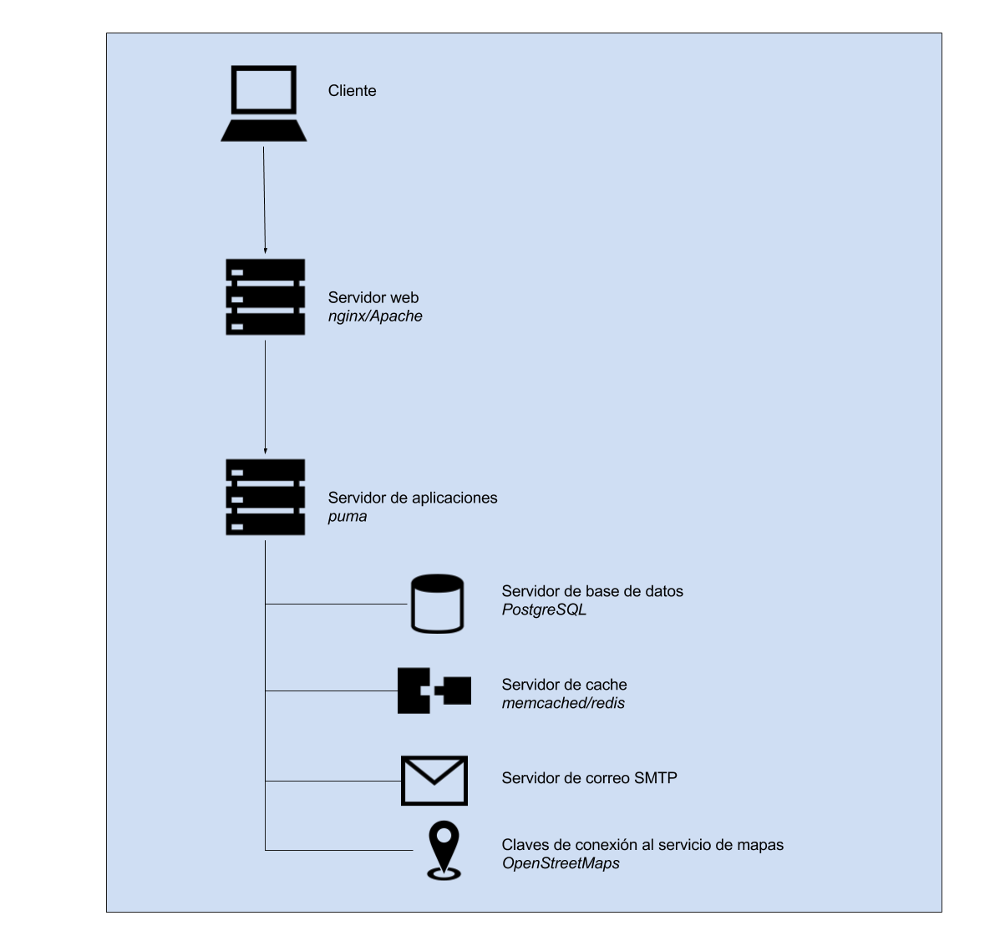

### A.1.4 Arquitectura

Consta de librerías y generadores de código hecho en el lenguaje Ruby con el framework Ruby on Rails. 

Cuenta con soporte de internacionalización y adaptación de imagen gráfica. 

Cuenta con distintos componentes para facilitar la modularización y colaboración de otras entidades. Se extrae y traduce de su documentación[^1]: 

<table>
  <tr>
    <td>Libreria</td>
    <td>Descripción (Inglés)</td>
    <td>Descripción (Castellano)</td>
  </tr>
  <tr>
    <td>Administración</td>
    <td>This library adds an administration dashboard so users can manage their organization and all other entities.</td>
    <td>Esta biblioteca añade un panel de administración para que los usuarios puedan administrar su organización y todas las demás entidades.</td>
  </tr>
  <tr>
    <td>API</td>
    <td>This library exposes a GraphQL API to programatically interact with the Decidim platform via HTTP</td>
    <td>Esta biblioteca expone una API de GraphQL para interaccionar programáticamente con la plataforma Decidim a través de HTTP</td>
  </tr>
  <tr>
    <td>Presupuestos</td>
    <td>Adds a participatory budgets system to any participatory space.</td>
    <td>Agrega un sistema de presupuestos participativos a cualquier espacio participativo.</td>
  </tr>
  <tr>
    <td>Comentarios</td>
    <td>The Comments module adds the ability to include comments to any resource which can be commentable by users.</td>
    <td>El módulo de comentarios agrega la capacidad de incluir comentarios en cualquier recurso que pueda ser comentado por los usuarios.</td>
  </tr>
  <tr>
    <td>Core</td>
    <td>The basics of Decidim: users, organizations, etc. This is the only required engine to run Decidim, all the others are optional.</td>
    <td>Los fundamentos de Decidim: usuarios, organizaciones, etc. Este es el único motor requerido para ejecutar Decidim, todos los demás son opcionales.</td>
  </tr>
  <tr>
    <td>Dev</td>
    <td>This gem aids the local development of Decidim's features.</td>
    <td>Esta joya ayuda al desarrollo local de las características de Decidim.</td>
  </tr>
  <tr>
    <td>Encuentros</td>
    <td>The Meeting module adds meeting to any participatory space. It adds a CRUD engine to the admin and public view scoped inside the participatory space.</td>
    <td>El módulo de la reunión agrega la reunión a cualquier espacio participativo. Añade un motor CRUD al ámbito público y de administración dentro del espacio participativo.</td>
  </tr>
  <tr>
    <td>Páginas</td>
    <td>The Pages module adds static page capabilities to any participatory space. It basically provides an interface to include arbitrary HTML content to any step.</td>
    <td>El módulo Páginas agrega capacidades de página estática a cualquier espacio participativo. Básicamente, proporciona una interfaz para incluir contenido HTML arbitrario en cualquier paso.</td>
  </tr>
  <tr>
    <td>Propuestas</td>
    <td>The Proposals module adds one of the main features of Decidim: allows users to contribute to a participatory space by creating proposals.</td>
    <td>El módulo Propuestas agrega una de las principales características de Decidim: permite a los usuarios contribuir a un espacio participativo mediante la creación de propuestas.</td>
  </tr>
  <tr>
    <td>Resultados</td>
    <td>Adds a results section to any participatory space so users can follow along the state of the accepted proposals.</td>
    <td>Añade una sección de resultados a cualquier espacio participativo para que los usuarios puedan seguir el estado de las propuestas aceptadas.</td>
  </tr>
  <tr>
    <td>Encuestas</td>
    <td>Adds the ability for admins to create arbitrary surveys.</td>
    <td>Añade la capacidad de los administradores de crear encuestas arbitrarias.</td>
  </tr>
  <tr>
    <td>Sistema</td>
    <td>Multitenant Admin to manage multiple organizations in a single installation</td>
    <td>Multitenant Admin para administrar múltiples organizaciones en una sola instalación</td>
  </tr>
</table>

**Figura A.1.4.1:** Arquitectura de servidores de Decidim

[^1]: https://github.com/decidim/decidim
