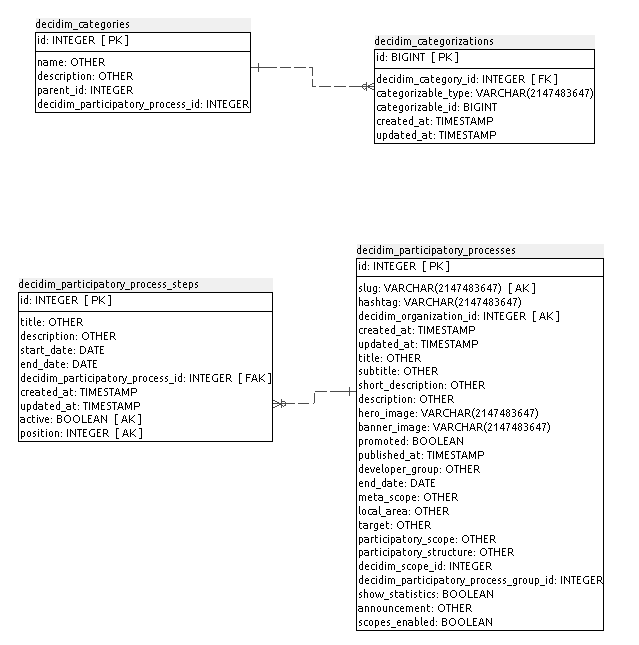
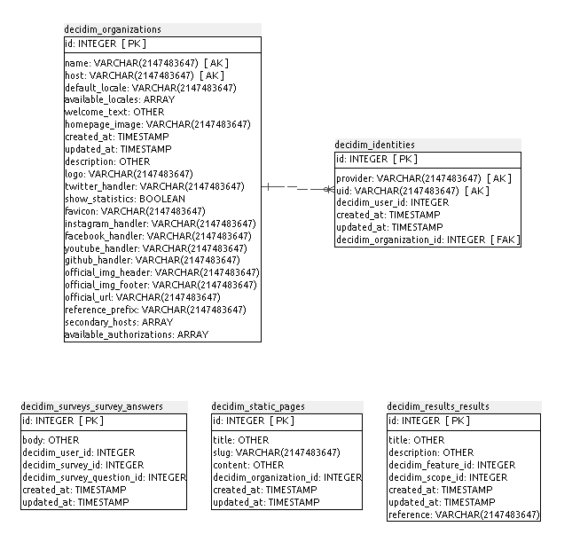
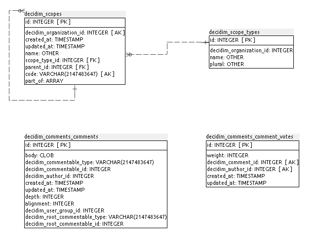
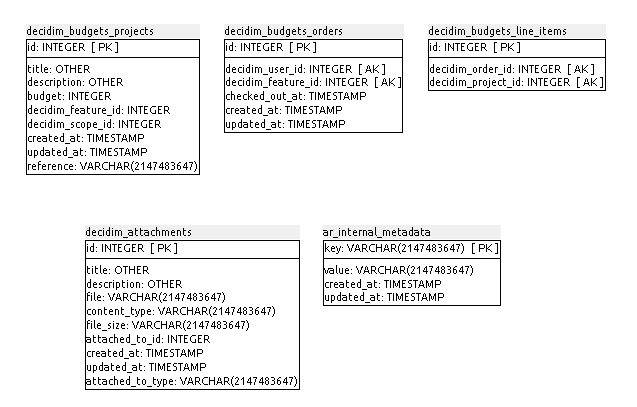
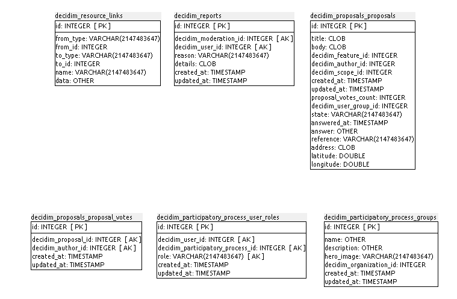
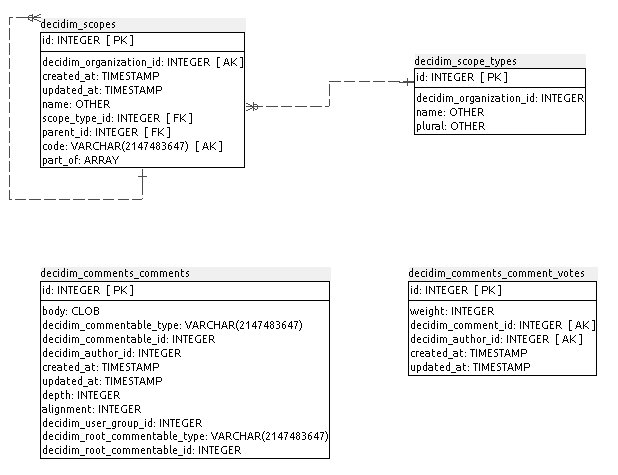
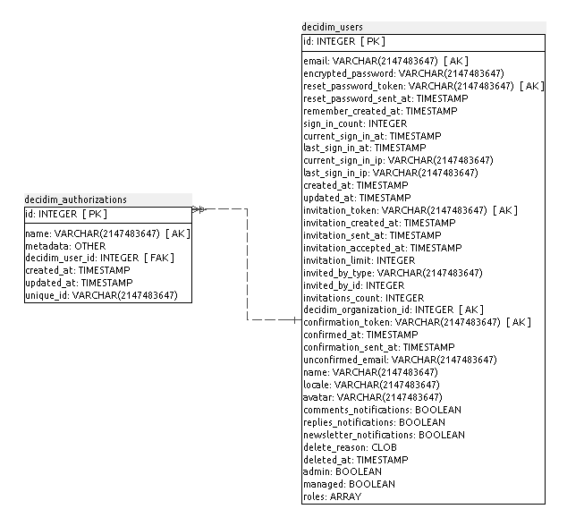

### A.1.5 Modelo de datos

#### A.1.5.1 Modelos relevantes

Los modelos relevantes son Organizations, Participatory Processes, Users y Features.

#### A.1.5.2 Tablas

Cuenta con 37 tablas:

* decidim_attachments

* decidim_authorizations 

* decidim_budgets_line_items 

* decidim_budgets_orders

* decidim_budgets_projects

* decidim_categories

* decidim_categorizations

* decidim_comments_comment_votes

* decidim_comments_comments

* decidim_features                   	 

* decidim_identities                 	 

* decidim_impersonation_logs

* decidim_meetings_meetings

* decidim_moderations

* decidim_newsletters

* decidim_organizations

* decidim_pages_pages

* decidim_participatory_process_groups    

* decidim_participatory_process_steps	 

* decidim_participatory_process_user_roles

* decidim_participatory_processes 

* decidim_proposals_proposal_votes   	 

* decidim_proposals_proposals

* decidim_reports                    	 

* decidim_resource_links

* decidim_results_results

* decidim_scope_types

* decidim_scopes                     	 

* decidim_static_pages

* decidim_surveys_survey_answers     

* decidim_surveys_survey_questions   	 

* decidim_surveys_surveys

* decidim_system_admins

* decidim_user_group_memberships

* decidim_user_groups

* decidim_users                      	 

* schema_migrations

#### A.1.5.3 Gráficos UML

**Figura A.1.5.1:** Tablas de la base de datos de Decidim

**Figura A.1.5.2:** Tablas de la base de datos de Decidim

**Figura A.1.5.3:** Tablas de la base de datos de Decidim

**Figura A.1.5.4:** Tablas de la base de datos de Decidim

**Figura A.1.5.5:** Tablas de la base de datos de Decidim

**Figura A.1.5.6:** Tablas de la base de datos de Decidim

**Figura A.1.5.7:** Tablas de la base de datos de Decidim

**Figura A.1.5.8:** Tablas de la base de datos de Decidim

