## Anexo A.1 Decidim

**Figura A.1.0:** Portada de [http://decidim.org](http://decidim.org) 

*Decidim es más que una plataforma digital: es un proyecto y una infraestructura abierta que incluye código, documentación, diseño, formación, un marco legal, interfaces colaborativas, una comunidad de usuarios y facilitadores y una visión global.* (NOTE:  https://decidim.org/es/ )

### A.1.1 Metadatos

<table>
  <tr>
    <td>Nombre</td>
    <td>Decidim</td>
  </tr>
  <tr>
    <td>URL</td>
    <td>https://decidim.org/ </td>
  </tr>
  <tr>
    <td>URL repositorio</td>
    <td>https://github.com/decidim/decidim </td>
  </tr>
  <tr>
    <td>Resumen (Inglés)</td>
    <td>The participatory democracy framework. A generator and multiple gems made with Ruby on Rails.</td>
  </tr>
  <tr>
    <td>Resumen (Castellano)</td>
    <td>El framework de la democracia participativa. Un generador y gemas múltiples hechas con Ruby on Rails.</td>
  </tr>
  <tr>
    <td>Lenguaje</td>
    <td>Ruby</td>
  </tr>
  <tr>
    <td>Framework</td>
    <td>Ruby on Rails</td>
  </tr>
  <tr>
    <td>Fecha primer commit</td>
    <td>Agosto de 2016</td>
  </tr>
  <tr>
    <td>Versión analizada</td>
    <td>0.5.1</td>
  </tr>
  <tr>
    <td>Nº de versiones</td>
    <td>36</td>
  </tr>
  <tr>
    <td>Nº de tablas de la BBDD</td>
    <td>37</td>
  </tr>
  <tr>
    <td>Nº de contribuidores</td>
    <td>19</td>
  </tr>
  <tr>
    <td>Nº de stars</td>
    <td>65</td>
  </tr>
  <tr>
    <td>Licencia</td>
    <td> GNU Affero GPL v3</td>
  </tr>
  <tr>
    <td>Mantenido</td>
    <td>Sí</td>
  </tr>
  <tr>
    <td>Diseño responsivo</td>
    <td>Sí</td>
  </tr>
</table>

 

### A.1.2 Funcionalidades 

* Permite realizar procesos participativos con distintas funcionalidades como propuestas, debates, citas presenciales a través de un panel de administración. 

* Permite enviar boletines de noticias a los usuarios registrados en la plataforma. 

* Permite modificar las páginas estáticas a través de un sistema de gestión de contenidos (CMS).

* Permite integrar (embeber) a través de iframes los contenidos en webs externas.

* Permite al usuario crear una Propuesta, apoyarla, comentar, etc.

* Permite a los administradores dar respuesta a las Propuestas (si está en estudio, ha sido aceptada o rechazada).

* Permite enlazar las Propuestas y Encuentros en Resultados, donde se puede hacer seguimiento de la ejecución.

* Permite a los administradores crear Encuestas con distintos tipos de preguntas. 

* Permite hacer votaciones de Presupuestos Participativos donde los Proyectos tengan asignados un importe y los usuarios pueden seleccionar hasta cierto importe total.

* Permite adjuntar imágenes y documentos a distintos tipos de contenidos (Procesos Participativos, Proyectos, Encuentros)

* Permite tener Organizaciones asociadas a un Usuario y actual como tal en ciertas acciones (por ejemplo al crear o comentar una propuesta).

* Permite tener ámbitos geográficos organizados por jerarquía (por ejemplo Municipios, Comarcas, Provincias, etc.).

* Permite reportar un contenido inapropiado, dando el motivo del reporte, para que un moderador o administrador revise estos reportes y los acepte o rechace.

* Permite tener administradores generales (de toda la plataforma) o específicos para un Proceso Participativo concreto.

* Permite tener Grupos de Procesos Participativos.

* Cuenta con un sistema MultiTenant, donde desde una misma instalación se pueden servir distintos sitios web con direcciones URL separadas.

### A.1.3 ImplantaciónAnálisis

Decidim esHa sido utilizado por numerosos municipios, en su mayoría de Cataluña: 

<table>
  <tr>
    <td>Nombre</td>
    <td>Región</td>
    <td>URL</td>
  </tr>
  <tr>
    <td>Decidim Barcelona</td>
    <td>Barcelona</td>
    <td>https://www.decidim.barcelona/</td>
  </tr>
  <tr>
    <td>L'H ON Participa</td>
    <td>Hospitalet de Llobregat</td>
    <td>https://www.lhon-participa.cat/</td>
  </tr>
  <tr>
    <td>Participa a Terrassa</td>
    <td>Terrassa</td>
    <td>https://participa.terrassa.cat/</td>
  </tr>
  <tr>
    <td>Decidim Sabadell</td>
    <td>Sabadell</td>
    <td>https://decidim.sabadell.cat/</td>
  </tr>
  <tr>
    <td>Gavà participa, Gavà decideix</td>
    <td>Gavà</td>
    <td>https://participa.gavaciutat.cat/</td>
  </tr>
  <tr>
    <td>Decidim Sant Cugat</td>
    <td>Sant Cugat</td>
    <td>https://decidim.santcugat.cat/</td>
  </tr>
  <tr>
    <td>Vilanova Participa</td>
    <td>Vilanova i la Geltrú</td>
    <td>http://participa.vilanova.cat/</td>
  </tr>
  <tr>
    <td>Erabaki Pamplona</td>
    <td>Pamplona</td>
    <td>https://erabaki.pamplona.es/</td>
  </tr>
  <tr>
    <td>Decidim Mataró</td>
    <td>Mataró</td>
    <td>https://www.decidimmataro.cat/</td>
  </tr>
</table>

### A.1.4 Arquitectura

Consta de librerías y generadores de código hecho en el lenguaje Ruby con el framework Ruby on Rails. 

Cuenta con soporte de internacionalización y adaptación de imagen gráfica. 

Cuenta con distintos componentes para facilitar la modularización y colaboración de otras entidades. Se extrae y traduce de su documentación (NOTE:  https://github.com/decidim/decidim ): 

<table>
  <tr>
    <td>Libreria</td>
    <td>Descripción (Inglés)</td>
    <td>Descripción (Castellano)</td>
  </tr>
  <tr>
    <td>Administración</td>
    <td>This library adds an administration dashboard so users can manage their organization and all other entities.</td>
    <td>Esta biblioteca añade un panel de administración para que los usuarios puedan administrar su organización y todas las demás entidades.</td>
  </tr>
  <tr>
    <td>API</td>
    <td>This library exposes a GraphQL API to programatically interact with the Decidim platform via HTTP</td>
    <td>Esta biblioteca expone una API de GraphQL para interaccionar programáticamente con la plataforma Decidim a través de HTTP</td>
  </tr>
  <tr>
    <td>Presupuestos</td>
    <td>Adds a participatory budgets system to any participatory space.</td>
    <td>Agrega un sistema de presupuestos participativos a cualquier espacio participativo.</td>
  </tr>
  <tr>
    <td>Comentarios</td>
    <td>The Comments module adds the ability to include comments to any resource which can be commentable by users.</td>
    <td>El módulo de comentarios agrega la capacidad de incluir comentarios en cualquier recurso que pueda ser comentado por los usuarios.</td>
  </tr>
  <tr>
    <td>Core</td>
    <td>The basics of Decidim: users, organizations, etc. This is the only required engine to run Decidim, all the others are optional.</td>
    <td>Los fundamentos de Decidim: usuarios, organizaciones, etc. Este es el único motor requerido para ejecutar Decidim, todos los demás son opcionales.</td>
  </tr>
  <tr>
    <td>Dev</td>
    <td>This gem aids the local development of Decidim's features.</td>
    <td>Esta joya ayuda al desarrollo local de las características de Decidim.</td>
  </tr>
  <tr>
    <td>Encuentros</td>
    <td>The Meeting module adds meeting to any participatory space. It adds a CRUD engine to the admin and public view scoped inside the participatory space.</td>
    <td>El módulo de la reunión agrega la reunión a cualquier espacio participativo. Añade un motor CRUD al ámbito público y de administración dentro del espacio participativo.</td>
  </tr>
  <tr>
    <td>Páginas</td>
    <td>The Pages module adds static page capabilities to any participatory space. It basically provides an interface to include arbitrary HTML content to any step.</td>
    <td>El módulo Páginas agrega capacidades de página estática a cualquier espacio participativo. Básicamente, proporciona una interfaz para incluir contenido HTML arbitrario en cualquier paso.</td>
  </tr>
  <tr>
    <td>Propuestas</td>
    <td>The Proposals module adds one of the main features of Decidim: allows users to contribute to a participatory space by creating proposals.</td>
    <td>El módulo Propuestas agrega una de las principales características de Decidim: permite a los usuarios contribuir a un espacio participativo mediante la creación de propuestas.</td>
  </tr>
  <tr>
    <td>Resultados</td>
    <td>Adds a results section to any participatory space so users can follow along the state of the accepted proposals.</td>
    <td>Añade una sección de resultados a cualquier espacio participativo para que los usuarios puedan seguir el estado de las propuestas aceptadas.</td>
  </tr>
  <tr>
    <td>Encuestas</td>
    <td>Adds the ability for admins to create arbitrary surveys.</td>
    <td>Añade la capacidad de los administradores de crear encuestas arbitrarias.</td>
  </tr>
  <tr>
    <td>Sistema</td>
    <td>Multitenant Admin to manage multiple organizations in a single installation</td>
    <td>Multitenant Admin para administrar múltiples organizaciones en una sola instalación</td>
  </tr>
</table>

**Figura A.1.4.1:** Arquitectura de servidores de Decidim

### A.1.5 Modelo de datos

#### A.1.5.1 Modelos relevantes

Los modelos relevantes son Organizations, Participatory Processes, Users y Features.

#### A.1.5.2 Tablas

Cuenta con 37 tablas:

* decidim_attachments

* decidim_authorizations 

* decidim_budgets_line_items 

* decidim_budgets_orders

* decidim_budgets_projects

* decidim_categories

* decidim_categorizations

* decidim_comments_comment_votes

* decidim_comments_comments

* decidim_features                   	 

* decidim_identities                 	 

* decidim_impersonation_logs

* decidim_meetings_meetings

* decidim_moderations

* decidim_newsletters

* decidim_organizations

* decidim_pages_pages

* decidim_participatory_process_groups    

* decidim_participatory_process_steps	 

* decidim_participatory_process_user_roles

* decidim_participatory_processes 

* decidim_proposals_proposal_votes   	 

* decidim_proposals_proposals

* decidim_reports                    	 

* decidim_resource_links

* decidim_results_results

* decidim_scope_types

* decidim_scopes                     	 

* decidim_static_pages

* decidim_surveys_survey_answers     

* decidim_surveys_survey_questions   	 

* decidim_surveys_surveys

* decidim_system_admins

* decidim_user_group_memberships

* decidim_user_groups

* decidim_users                      	 

* schema_migrations

#### A.1.5.3 Gráficos UML

**Figura A.1.5.1:** Tablas de la base de datos de Decidim

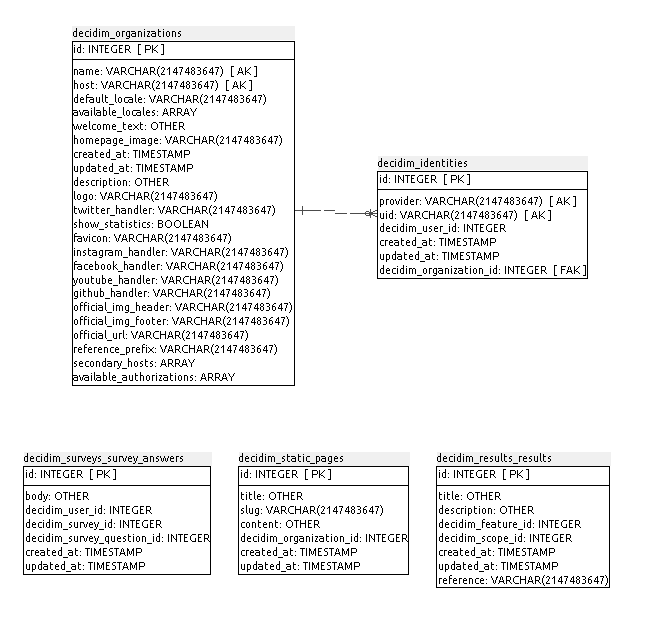

**Figura A.1.5.2:** Tablas de la base de datos de Decidim

**Figura A.1.5.3:** Tablas de la base de datos de Decidim

**Figura A.1.5.4:** Tablas de la base de datos de Decidim

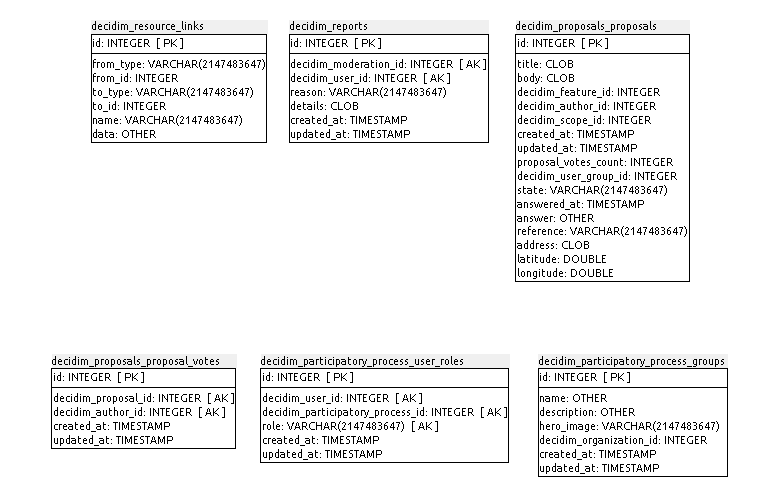

**Figura A.1.5.5:** Tablas de la base de datos de Decidim

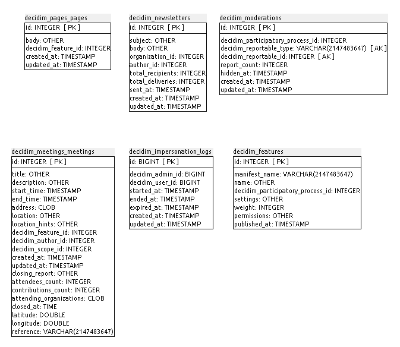

**Figura A.1.5.6:** Tablas de la base de datos de Decidim

**Figura A.1.5.7:** Tablas de la base de datos de Decidim

**Figura A.1.5.8:** Tablas de la base de datos de Decidim

### A.1.6 Conclusiones

Decidim destaca fundamentalmente por incorporar dos aspectos claramente diferenciales respecto al resto de aplicativos analizados:

**MetaDecidim** (NOTE:   https://www.decidim.barcelona/processes/12):

MetaDecidim es un proceso participativo sobre el propio Decidim en el que se integra a la ciudadanía o comunidad de usuarios para contribuir al desarrollo de la plataforma pensando y rediseñando colectivamente sus funcionalidades, haciendo propuestas de mejora, deliberando sobre sus posibles usos futuros.

A través del proceso MetaDecidim se ha puesto en marcha un colaboración transversal que implica y relaciona a la ciudadanía con la comunidad de desarrolladores facilitando así la ‘apropiación’ de la plataforma por esa ciudadanía. 

El proceso incluye distintos ejes de trabajo/participación, que mantienen reuniones periódicas y canales de comunicación permanentes, en los que se abordan participativamente los siguientes aspectos: Investigación, Modelo de Gobernanza, Tecnología, Relato y Experiencia de Participante (UX)

**Contrato Social** (NOTE:  https://decidim.org/es/contract/):

El Contrato Social de Decidim, en tanto que acuerdo libremente adoptado por todas las participantes en el proyecto Decidim, supone una garantía básica de los compromisos de la comunidad de Decidim para con sus participantes y usuarios y recoge los principios sobre los que se asiente el desarrollo del proyecto.

En el caso de Decidim, esos principios se resumen en compromisos con:

* El Software Libre y los Contenidos Abiertos. 

* La transparencia, trazabilidad e integridad de la plataforma y sus usos.

* Igualdad de oportunidades e indicadores de calidad.

* Confidencialidad de los datos.

* Compromiso y responsabilidad.

* Mejora continua y colaboración interinstitucional.

### A.1.7 Capturas de pantallas 

**Figura A.1.7.1:** Portada I

**Figura A.1.7.2:** Portada II

**Figura A.1.7.3:** Portada III

**Figura A.1.7.4:** Portada IV

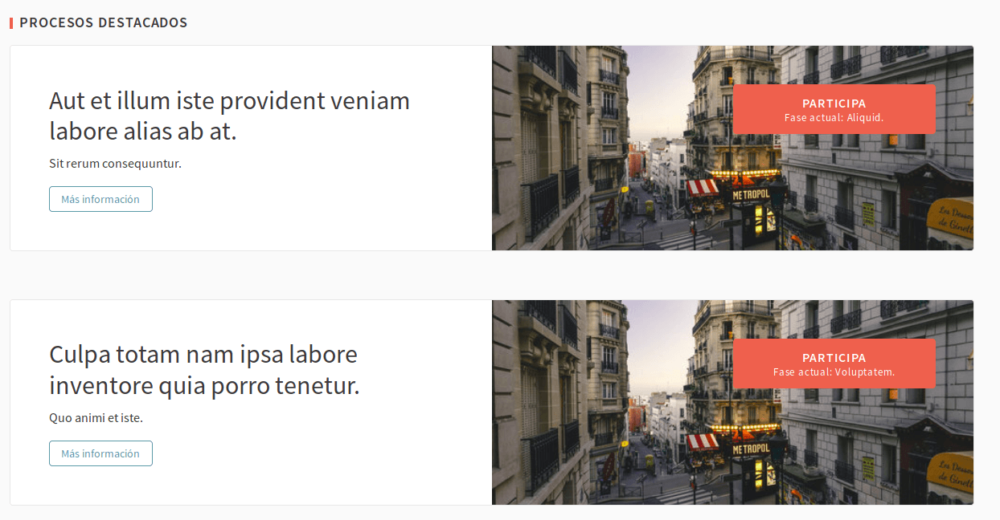

**Figura A.1.7.5:** Listado de Procesos Participativos I

**Figura A.1.7.6:**  Listado de Procesos Participativos II

**Figura A.1.7.7:** Página de Proceso Participativo I

**Figura A.1.7.8:** Página de Proceso Participativo II

**Figura A.1.7.9:** Proceso Participativo - Página 

**Figura A.1.7.10:** Proceso Participativo - Listado de Encuentros 

**Figura A.1.7.11:**  Proceso Participativo - Encuentro

**Figura A.1.7.12:** Compartir un elemento

**Figura A.1.7.13:** Integrar (embeber) un elemento

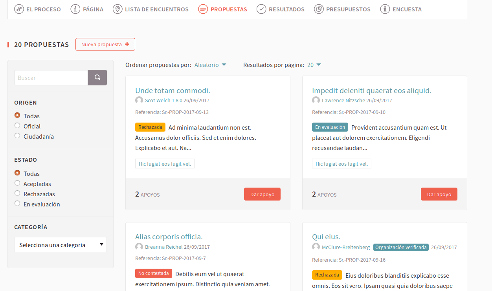

**Figura A.1.7.14:**  Proceso Participativo - Propuestas

**Figura A.1.7.15:**  Proceso Participativo - Propuesta

**Figura A.1.7.16:**  Proceso Participativo - Resultado

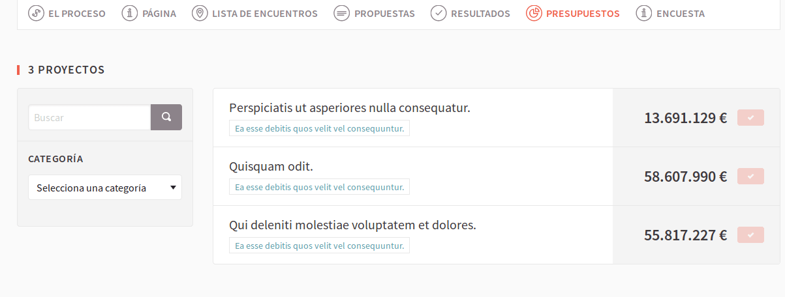

**Figura A.1.7.17:**  Proceso Participativo - Presupuestos

**Figura A.1.7.18:**  Proceso Participativo - Proyecto de Presupuesto

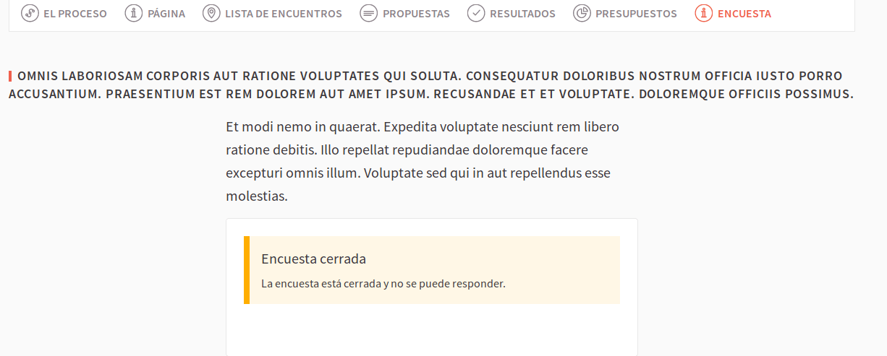

**Figura A.1.7.19:**  Proceso Participativo - Encuesta cerrada

**Figura A.1.7.20:**  Proceso Participativo - Encuesta

**Figura A.1.7.20:**  Proceso Participativo - Encuesta respondida

**Figura A.1.7.21:** Proceso Participativo - Fases

**Figura A.1.7.22:** Listado de páginas estáticas

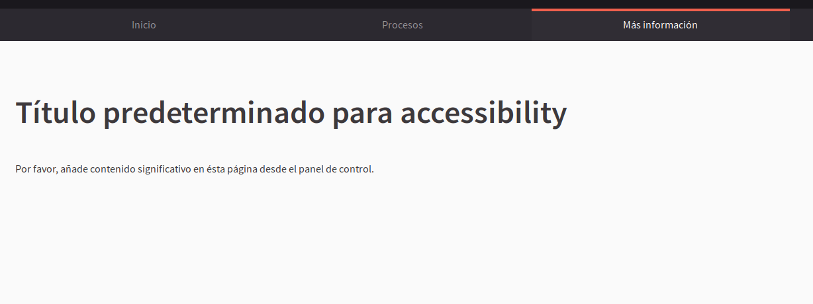

**Figura A.1.7.23:** Página estática

**Figura A.1.7.24:** Formulario de registro de usuarios

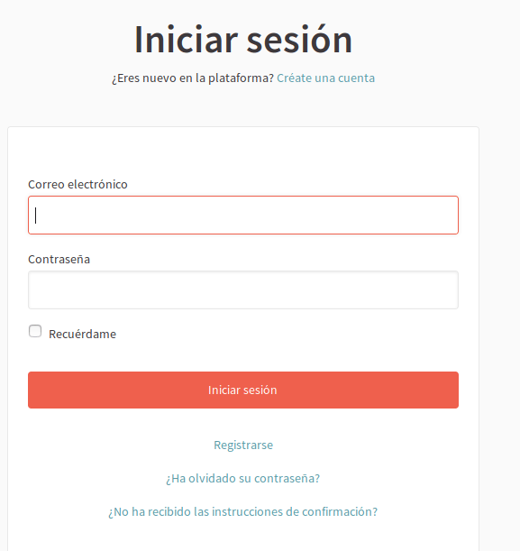

**Figura A.1.7.25:** Formulario de inicio de sesión

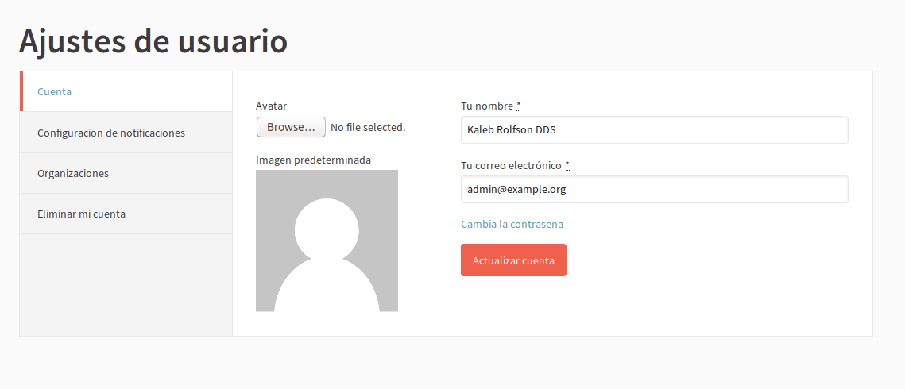

**Figura A.1.7.26:** Usuario - Edición de cuenta de usuario

**Figura A.1.7.27:** Usuario - Gestión de notificaciones

**Figura A.1.7.28:** Usuario - Gestión de organizaciones de un usuario

**Figura A.1.7.29:** Usuario - Darse de baja de la plataforma 

**Figura A.1.7.30:** Administrador - Panel de control 

**Figura A.1.7.31:** Administrador - Listado de Procesos Participativos

**Figura A.1.7.32:** Administrador - Proceso Participativo - Información I

**Figura A.1.7.33:** Administrador - Proceso Participativo - Información II

**Figura A.1.7.34:** Administrador - Proceso Participativo - Información III

**Figura A.1.7.35:** Administrador - Proceso Participativo - Fases - Gestión

**Figura A.1.7.36:** **:** Administrador - Proceso Participativo - Fases - Edición

**Figura A.1.7.37:** **:** Administrador - Proceso Participativo - Funcionalidades - Gestión

**Figura A.1.7.38:** Administrador - Proceso Participativo - Funcionalidades - Páginas

**Figura A.1.7.39:** Administrador - Proceso Participativo - Funcionalidades - Páginas

**Figura A.1.7.40:** Administrador - Proceso Participativo - Funcionalidades - Configuración de Páginas

**Figura A.1.7.41:** Administrador - Proceso Participativo - Funcionalidades - Encuentros

**Figura A.1.7.42:** Administrador - Proceso Participativo - Funcionalidades - Formulario de Encuentros

**Figura A.1.7.43: **Administrador - Proceso Participativo - Funcionalidades - Archivos adjuntos

**Figura A.1.7.44:** Administrador - Proceso Participativo - Funcionalidades - Listado de Propuestas

**Figura A.1.7.45: **Administrador - Proceso Participativo - Funcionalidades - Respuesta a Propuesta

**Figura A.1.7.46: **Administrador - Proceso Participativo - Funcionalidades - Formulario de Resultado

**Figura A.1.7.47:** Administrador - Proceso Participativo - Funcionalidades - Proyectos (Presupuestos Participativos)

**Figura A.1.7.48:** Administrador - Proceso Participativo - Funcionalidades - Formulario de Proyecto (Presupuestos Participativos)

**Figura A.1.7.49:** Administrador - Proceso Participativo - Funcionalidades - Formulario de Encuesta I

**Figura A.1.7.50: **Administrador - Proceso Participativo - Funcionalidades - Formulario de Encuesta II

**Figura A.1.7.51:** Administrador - Proceso Participativo - Funcionalidades -

**Figura A.1.7.52:** Administrador - Proceso Participativo - Funcionalidades -

**Figura A.1.7.53:** Administrador - Proceso Participativo - Gestión de usuarios

**Figura A.1.7.54:** Formulario de denunciar un problema

**Figura A.1.7.55:** Administrador - Proceso Participativo - Gestión de moderaciones

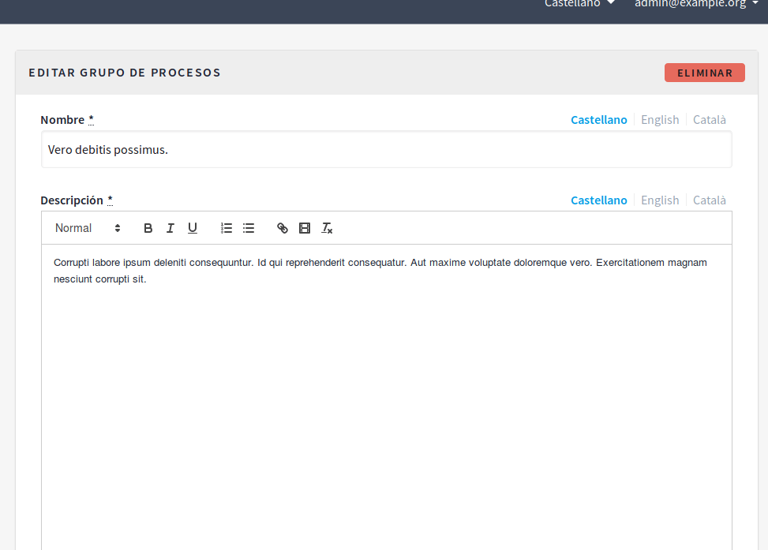

**Figura A.1.7.56:** Administrador - Proceso Participativo - Formulario de grupos I

**Figura A.1.7.57:** Administrador - Proceso Participativo - Formulario de grupos II

**Figura A.1.7.58:** Administrador - Páginas - Formulario

**Figura A.1.7.59: **Administrador - Gestión de usuarios

**Figura A.1.7.60: **Administrador - Gestión de boletines de noticias (newsletters)

**Figura A.1.7.61: **Administrador - Configuración general I

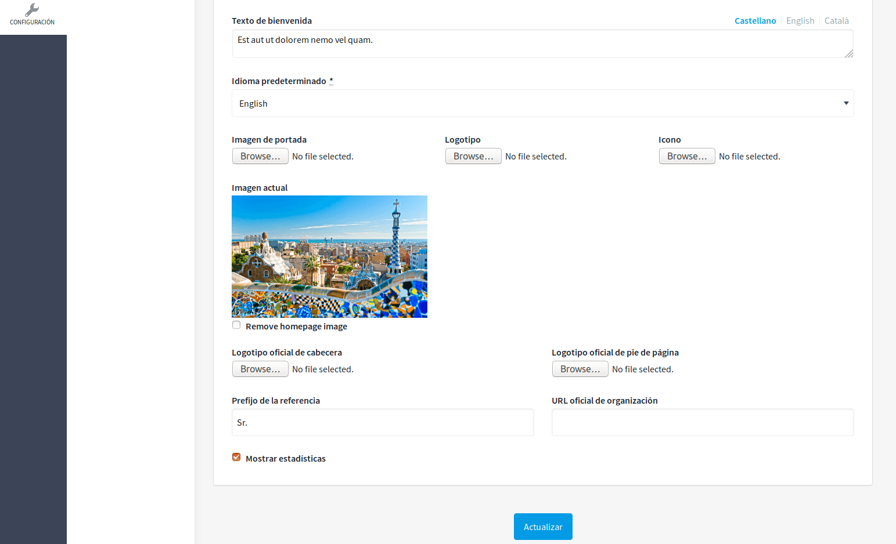

**Figura A.1.7.62: **Administrador - Configuración general II

**Figura A.1.7.63:** Administrador - Gestión de ámbitos

**Figura A.1.7.64:** Administrador - Gestión de tipos de ámbitos 

**Figura A.1.7.65: **Sistema - Inicio de sesión

**Figura A.1.7.66: **Sistema - Panel de control 

**Figura A.1.7.67:** Sistema - Organizaciones (Tenants) - Gestión

**Figura A.1.7.68: **Sistema - Organizaciones (Tenants) - Formulario

**Figura A.1.7.69: **Sistema - Administradores

###  

