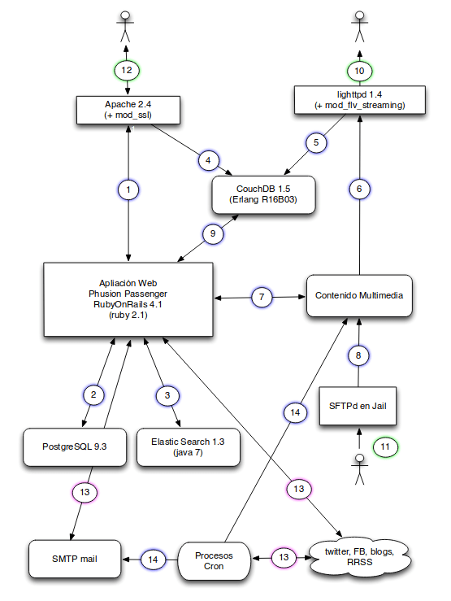
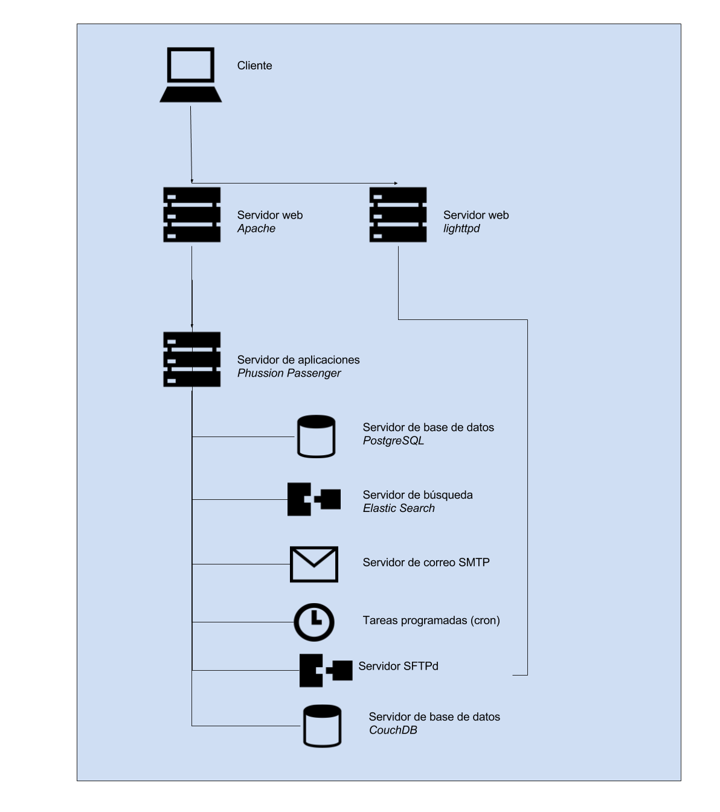

### A.2.4 Arquitectura

Cuenta con documentación con explicación de cada uno de los servicios y su configuración recomendada es la siguiente:  (NOTE:  http://bideoak2.euskadi.net/openirekia/ogov/v5/OpenIrekia-5.0-install.pdf )

*1. El servidor Apache con VirtualHost y configuración SSL, proxy hasta Passenger.*

*2. La aplicación usa conexión vía socket local hasta la base de datos postgres*

*Protocolo de conexión: socket puerto 5432*

*3. Los contenidos se indexan en servidor ElasticSearch.*

*Protocolo de conexión: REST vía HTTP a puerto 9200*

*4. Los logs de acceso por HTTP y HTTPS al Apache se registran en la base de datos CouchDB*

*Protocolo de conexión: REST vía HTTP a puerto 8984*

*5. Los logs de acceso por HTTP para el contenido multimedia (incluido el streaming vía mod_flv_streaming) se registran en la base de datos CouchDB.*

*Protocolo de conexión: REST vía HTTP a puerto 8984*

*6. Los contenidos multimedia para pseudostreaming se publican por http desde lighttpd*

*7. Las aplicaciones crean y trasladan los directorios necesarios y preparan los vídeos en .flv para streaming*

*8. El servidor de SFTP permite depositar contenidos multimedia con permisos limitados*

*A.2. El módulo de estadística en tiempo real accede a las bases de datos en CouchDB*

*Protocolo de conexión: REST vía HTTP a puerto 8984*

*10. Los usuarios finales acceden a los contenidos multimedia vía navegador web o reproductor flash o usando html5 en dispositivos móviles.*

*Protocolo de conexión: HTTP*

*11. Los colaboradores suben contenido pesado (video y fotos) vía SFTP*

*12. Los usuarios finales y los internos usuarios autorizados acceden a los servicios web*

*Protocolos de conexión: HTTP y HTTPS*

*13. Las aplicaciones usan servicios externos*

*Protocolos de conexión: HTTP y HTTPS*

*14. Las aplicaciones envían mensajes de email por smtp*

*Protocolo de conexión: SMTP al puerto 25*

*Nota: OpenIrekia gestiona los procesos de streaming en directo pero no incluye servidor de streaming. Actualmente se usa un servicio por parte de los servicios informáticos del gobierno basado en Wowza Media Server y protocolo RTMP para clientes de escritorio y HTTP para clientes móviles*

**Figura A.2.4.1: **Esquema de arquitectura de Open Irekia (documentación oficial)

**Figura A.2.4.2: **Esquema de arquitectura de Open Irekia
