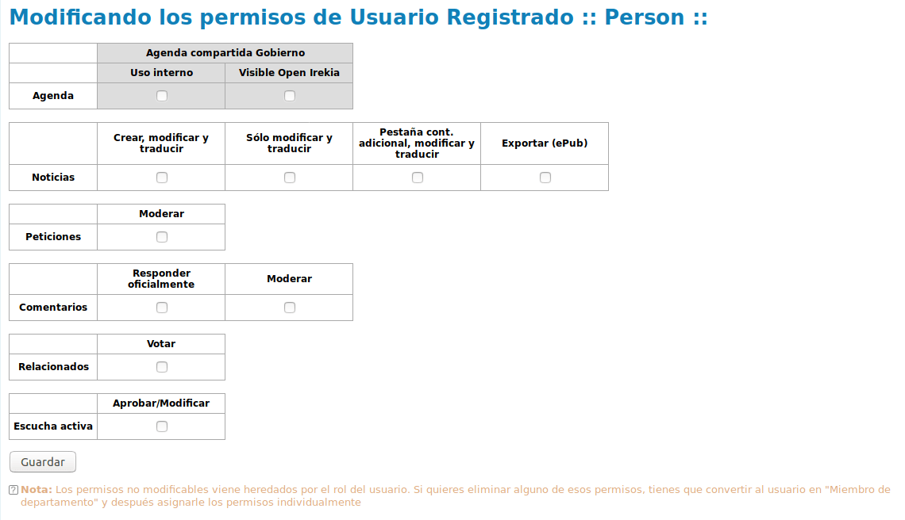
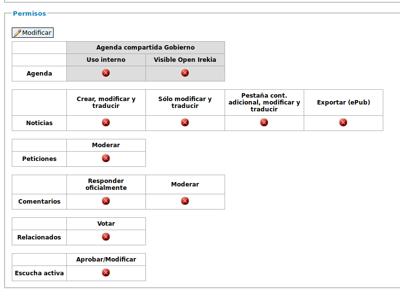

### A.2.6 Conclusiones

No está pensada para ser reutilizada, por lo que no tiene la posibilidad de adaptar la imagen y contenidos y a su vez mantener las actualizaciones futuras al sistema.

Entre sus puntos fuertes se encuentra la gestión granular de permisos de usuarios[^1] : 

> En la aplicación dispones de los siguientes perfiles de usuarios (con los usuarios de pruebas ya disponibles en esta instalación indicados entre paréntesis):
> 
>  * Externos:
> 
>    * _Registrados _(usuario@example.com; contraseña: openirekia): son los ciudadanos que desean participar de alguna de las formas previstas. El interesado puede darse de alta por tres vías desde la opción "login": sus cuentas de Twitter o Facebook (mediante oAuth),  o con el formulario; en este caso, puede colocarse un avatar y se valida a sí mismo el alta al confirmar el email remitido. Desde su página de perfil, podrá seleccionar a quién seguir, ver sus actvidades, así como acceder a notificaciones automáticas de interacciones desde la plataforma. 
> 
>    * _Periodista_: personal de medios de comunicación a los que se les invita mediante un sistema de notificaciones vía email a los eventos públicos de la Agenda con una antelación de tres días. El alta es sólo mediante formulario (accesible desde enlace en la Agenda y/o en el pie de página), donde puede elegir sus áreas de interés; las peticiones son aprobadas a posteriori tras su aceptacion por el administrador.
> 
> * Internos:
> 
>    *  _Administradores_ (admin@example.com; contraseña: openirekia)
> 
>    *  _Jefes de Prensa _(jefe_dept@example.com; contraseña: openirekia): responsables de comunicación de la Administración, a los que se les mantiene informados mediante el sistema de notificaciones vía email de la actividad en el portal. Como segundo perfil disponible, pero sin el sistema de notificación está el el _Jefe de Gabinete_.
> 
>    *  _Miembros de departamento _: corresponde al equipo de editores departamentales con diferentes atribuciones seleccionables de permisos. 
> 
>    *  _Colaboradores_: similar al anterior, pero con permisos acotados. En el caso de los _Colaboradores externos_, con permisos más limitados.
> 
>    *  _Políticos _(politician@example.com; contraseña: openirekia): identifica a los altos cargos que componen la estructura del Gobierno. Disponene de una ficha pública donde queda recogida toda su actividad en el portal (ver más adelante el apartado "Cargos Gobierno y otros asistentes") Una vez creada su ficha, es necesario adscribirle a un Área concreta (desde la página de administraci´n de áreas > equipo)
> 
>      Para lo referido a la operatoria de los streamings on-line, se disponen de los siguientes perfiles:
> 
>    *      _Operadores de streaming _(operador@example.com; contraseña: openirekia): corresponde al operador de guardia que activa remotamente las cámaras y encoders de las salas registradas en el portal como habilitadas para la retransmisión en directo, dando comienzo y fin a las emisiones programadas.
> 
>    *      _Responsables de sala_: responsable de la sala encargado de su apertura, encendido, pruebas, etc.
> 
> La mayoría de estos perfiles reciben notificaciones vía email en función de las funciones asociadas y momentos diferenciados (ver más[ información y textos en el PDF](https://openirekia.compas.alabs.org/uploads/attachments/2/Open_Irekia_-_textos_emails_notificaciones_en_v5.pdf?1410504121) adjunto en el área de descargas de esta página). 
> 
> De cara a experimentar con la funcionalidad de cada tipo de usuario, se recomienda utilizar diferentes navegadores y autenticarse con un usuario diferente en cada uno de ellos (p.ej.: en Mozilla, login de "administrador"; en "Safari", login de "usuario registrado"; en Ópera, login de "político".., etc. Nota: la palabra de paso para todos los tipos de usuarios previamente indicados es: openirekia). 
> 
> Complementariamente a estos usuarios, el portal utiliza también otro concepto diferenciado de  intervinientes: con los "_Cargos del Gobierno_" y los "_Otros asistentes_" contemplados en la administración de los eventos de la Agenda y en las Noticias. Se trata de un campo más de información que se introduce en los citados contenidos. El primero está restringido a las personas que previamente hayan sido dadas de alta en el perfil "_Políticos_" antes citado, y se rellena mediante una función autocomplete. Esta vinculación es la que permite mantener actualizadas sus correspondientes fichas. 

> En cuanto a los segundos ("Otros asistentes"), se trata de un campo de texto libre que luego se visualiza en el contenido publicado, pero sobre la que la aplicación no contempla ningún control.

Además de permisos por grupos también se pueden configurar de forma específica para cada usuario de manera diferenciada:

**Figura A.2.3.1:** Permisos de usuarios

**Figura A.2.3.2:** Modificación de permisos de usuarios

Otro punto fuerte con los que cuenta es su sistema de newsletters, permitiendo llevar el control de qué contenidos se han enviado a cada newsletter, así como pudiendo seleccionar los contenidos nuevos que se quieran comunicar en el próximo envío. 

[^1]: Extraído de los contenidos por defecto de la herramienta. No se puede enlazar al no encontrarse en un repositorio de control de versiones (por ejemplo git) sino que la liberación se realiza a través de un fichero .zip como se ha comentado anteriormente
