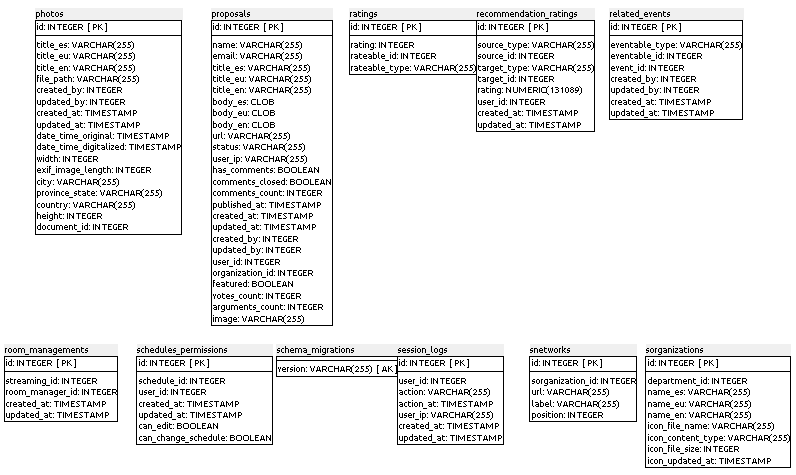
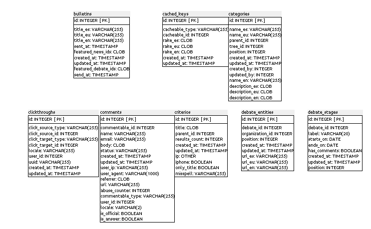
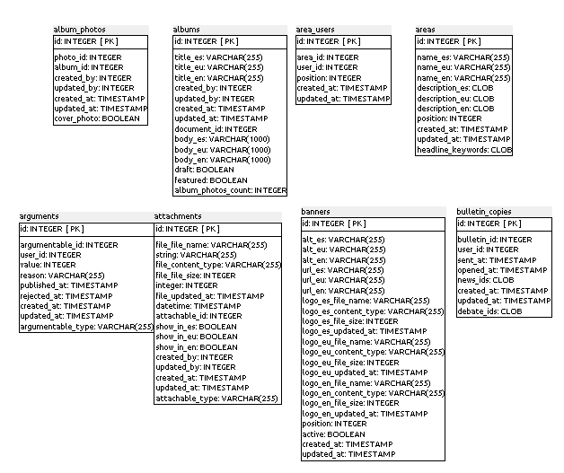

### A.2.5 Modelo de datos

#### A.2.5.1 Modelos relevantes

Los modelos más importantes son Users, Videos, Documents, Proposals, Orders y Debates. 

#### A.2.5.2 Tablas

Cuenta con 56 tablas:

* album_photos         	 

* albums 

* area_users 

* areas 

* arguments 

* attachments 

* banners 

* bulletin_copies

* bulletins            	 

* cached_keys          	 

* categories           	 

* clickthroughs        	 

* comments             	 

* criterios            	 

* debate_entities      	 

* debate_stages        	 

* debates              	 

* document_tweets      	 

* documents            	 

* event_alerts         	 

* event_locations      	 

* external_comments_clients

* external_comments_items  

* followings          	 

* headlines           	 

* notifications       	 

* old_clickthroughs   	 

* orders              	 

* organizations       	 

* outside_organizations    

* permissions         	 

* photos              	 

* proposals           	 

* ratings             	 

* recommendation_ratings   

* related_events      	 

* room_managements    	 

* schedules_permissions    

* schema_migrations   	 

* session_logs        	 

* snetworks           	 

* sorganizations      	 

* stats_counters      	 

* stats_fs            	 

* stream_flows        	 

* subscriptions       	 

* survey_responses    	 

* surveys             	 

* tag_ejes            	 

* taggings            	 

* tags                	 

* trees               	 

* twitter_mentions    	 

* users               	 

* videos              	 

* votes

### A.2.5.3 Gráficos UML

**Figura A.2.5.1**: Esquema de la base de datos de Open Irekia

## 

**Figura A.2.5.2**: Esquema de la base de datos de Open Irekia

**Figura A.2.5.3**: Esquema de la base de datos de Open Irekia

**Figura A.2.5.4**: Esquema de la base de datos de Open Irekia

**Figura A.2.5.5**: Esquema de la base de datos de Open Irekia

**Figura A.2.5.6**: Esquema de la base de datos de Open Irekia

**Figura A.2.5.8**: Esquema de la base de datos de Open Irekia

**Figura A.2.5.9**: Esquema de la base de datos de Open Irekia

