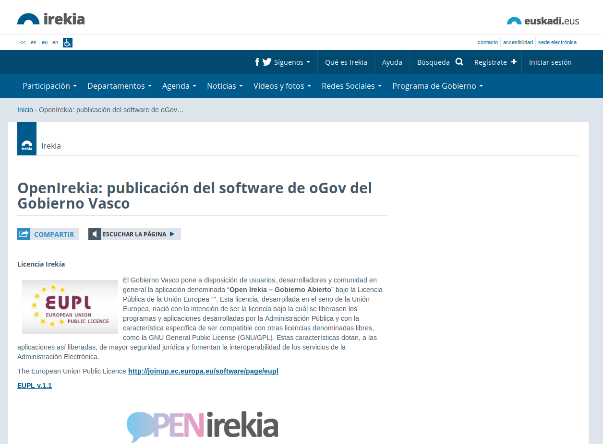

## A.2 Open Irekia 

**Figura A.2.0: **Entrada de publicación del software en [http://irekia.euskadi.eus](http://irekia.euskadi.eus) 

*Sus principales **características** son la comunicación directa e inmediata entre Gobierno y ciudadanía a través de:*

* *la publicación de noticias y eventos relacionados con las decisiones adoptadas o por adoptar,*

* *la consulta de las opiniones de los ciudadanos al respecto a través de peticiones ciudadanas, propuestas de Gobierno y comentarios en todos los contenidos.*

