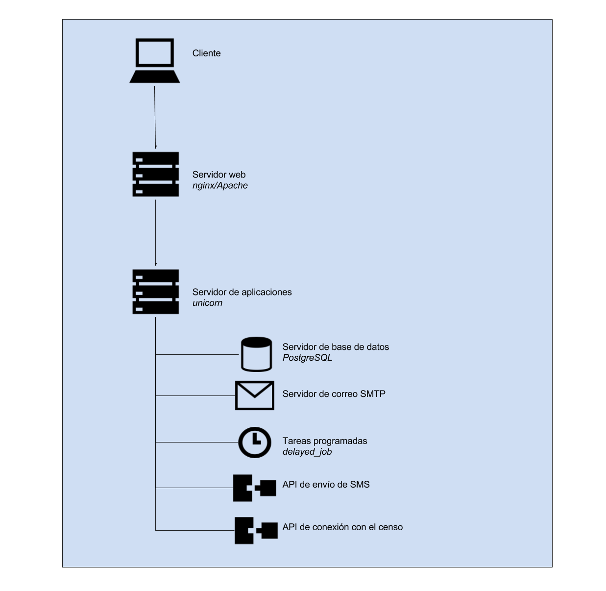

### A.3.4 Arquitectura

Aunque se trata de una aplicación monolítica sin soporte para adaptaciones gráficas (CSS, HTML, Imagenes), si que permite la sobreescritura de ciertos ficheros para facilitar su actualización[^1]:

*Puedes modificar consul y ponerle tu propia imagen, para esto debes primero hacer un fork de [https://github.com/consul/consul](https://github.com/consul/consul) creando un repositorio nuevo en Github. Puedes usar otro servicio como Gitlab, pero no te olvides de poner el enlace en el footer a tu repositorio en cumplimiento con la licencia de este proyecto (GPL Affero 3).*

*Hemos creado una estructura específica donde puedes sobreescribir y personalizar la aplicación para que puedas actualizar sin que tengas problemas al hacer merge y se sobreescriban por error tus cambios. Intentamos que Consul sea una aplicación Ruby on Rails lo más plain vanilla posible para facilitar el acceso de nuevas desarrolladoras.*

Este sistema cuenta con unos inconvenientes relativos a mejorar el sistema de gobernanza de la comunidad, introduciendo cuellos de botella en la aceptación de cambios que se quieran proponer para Consul[^2].

**Figura A.3.4.1:** Esquema de arquitectura de Consul

[^1]: https://github.com/consul/consul/blob/master/CUSTOMIZE_ES.md
[^2]: Pereira de Lucena, A. y Blanco-Gracia, A. (2016) Propuesta de cambios en la Arquitectura de Consul. https://www.gitbook.com/book/alabs/propuesta-de-cambios-en-la-arquitectura-de-consul/details 
