### A.3.7 Capturas de pantallas 

**Figura A.3.7.1:** Portada

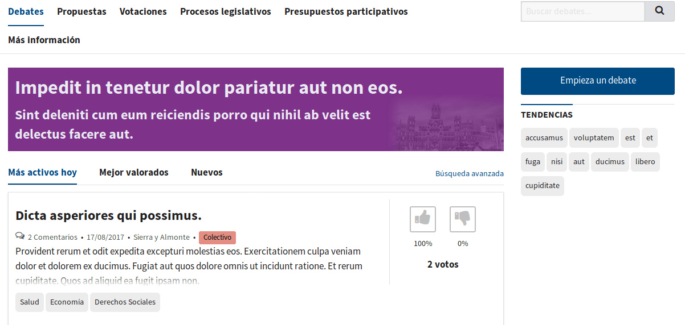

**Figura A.3.7.2:** Listado de debates

**Figura A.3.7.3:** Formulario de creación de debate

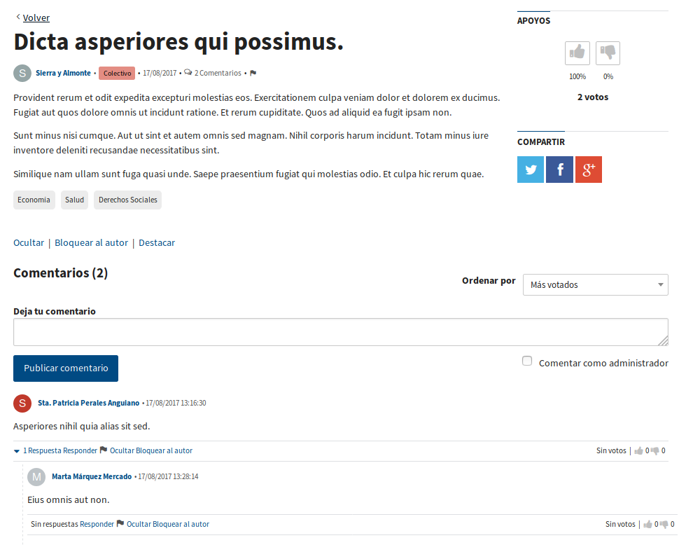

**Figura A.3.7.4:** Ficha de debate (con comentarios)

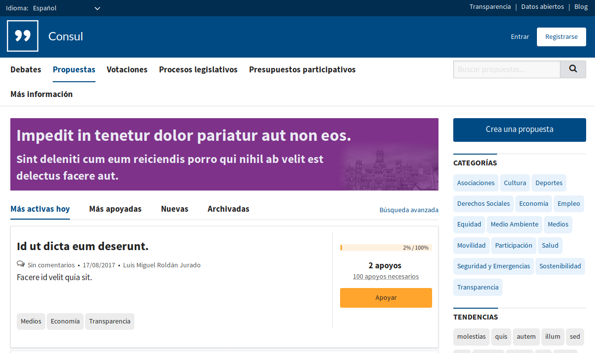

**Figura A.3.7.5:** Listado de propuestas

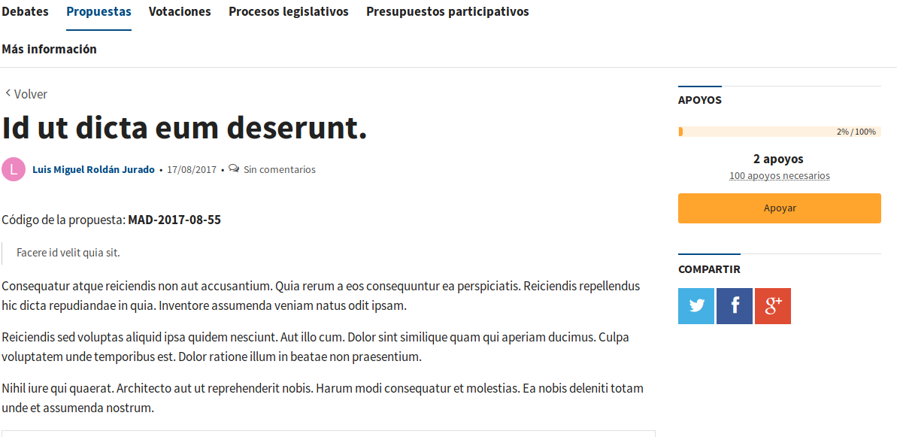

**Figura A.3.7.6:** Ficha de propuesta

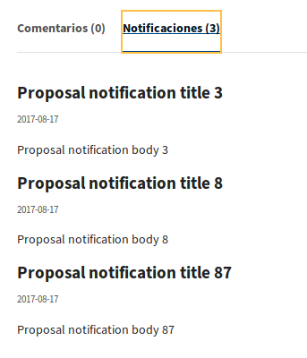

**Figura A.3.7.7:** Ficha de propuesta: detalle de notificaciones

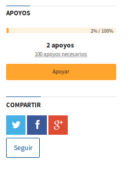

**Figura A.3.7.8:** Ficha de propuesta: detalle de barra lateral

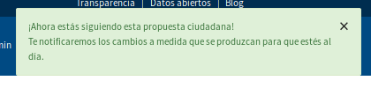

**Figura A.3.7.9:** Notificación de seguimiento de propuestas

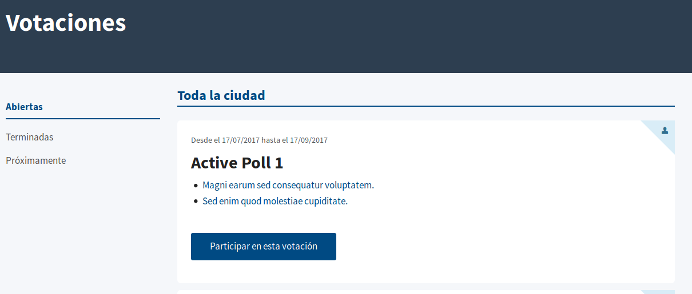

**Figura A.3.7.10:** Listado de votaciones

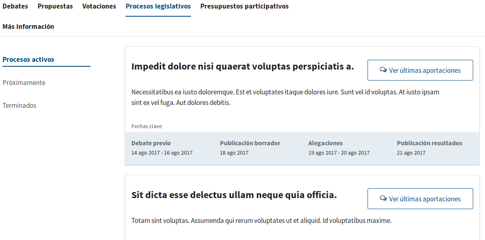

**Figura A.3.7.11:** Listado de procesos legislativos

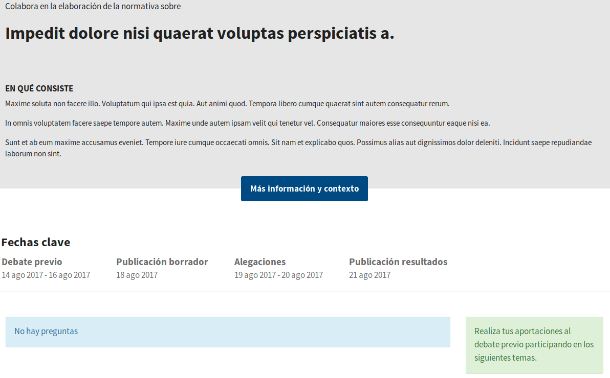

**Figura A.3.7.12:** Ficha de proceso legislativo

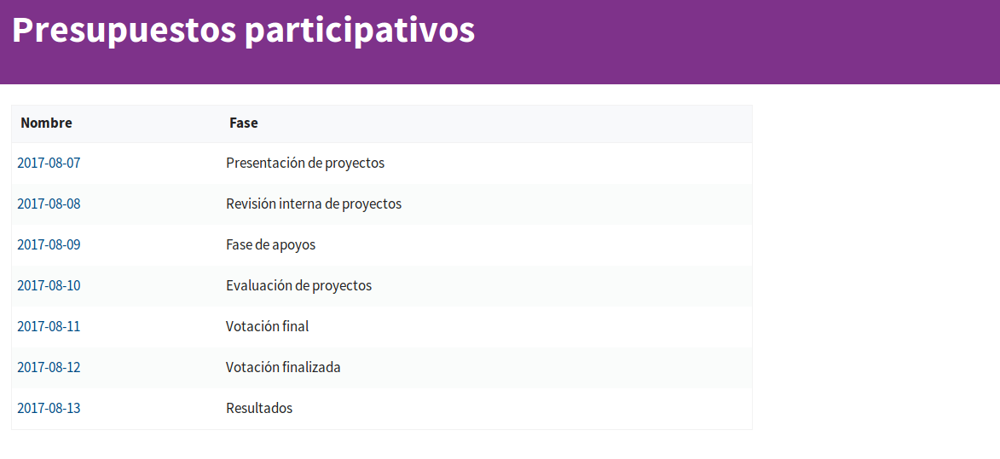

**Figura A.3.7.13:** Página de presupuestos participativos

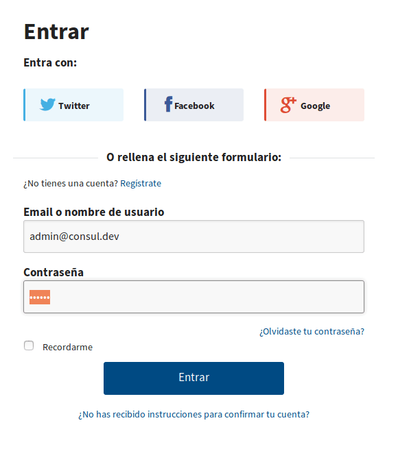

**Figura A.3.7.14:** Inicio de sesión

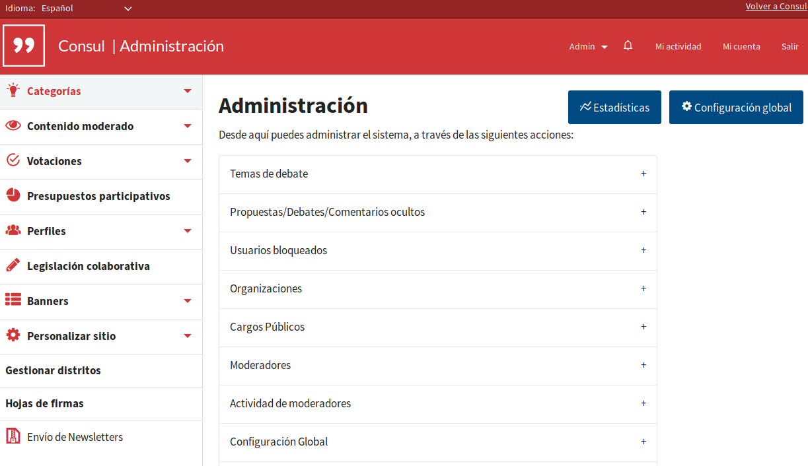

**Figura A.3.7.15:** Panel de administración

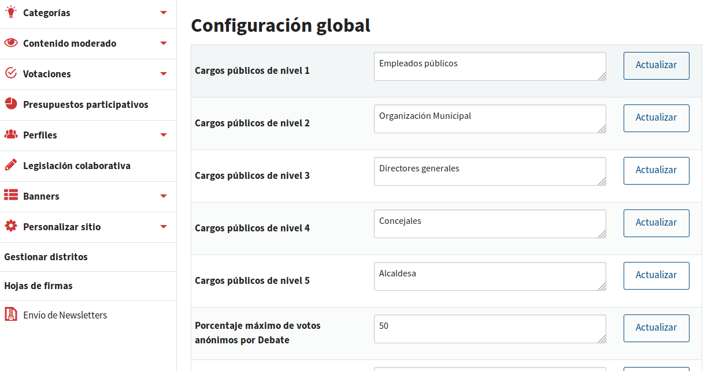

**Figura A.3.7.16:** Configuración global

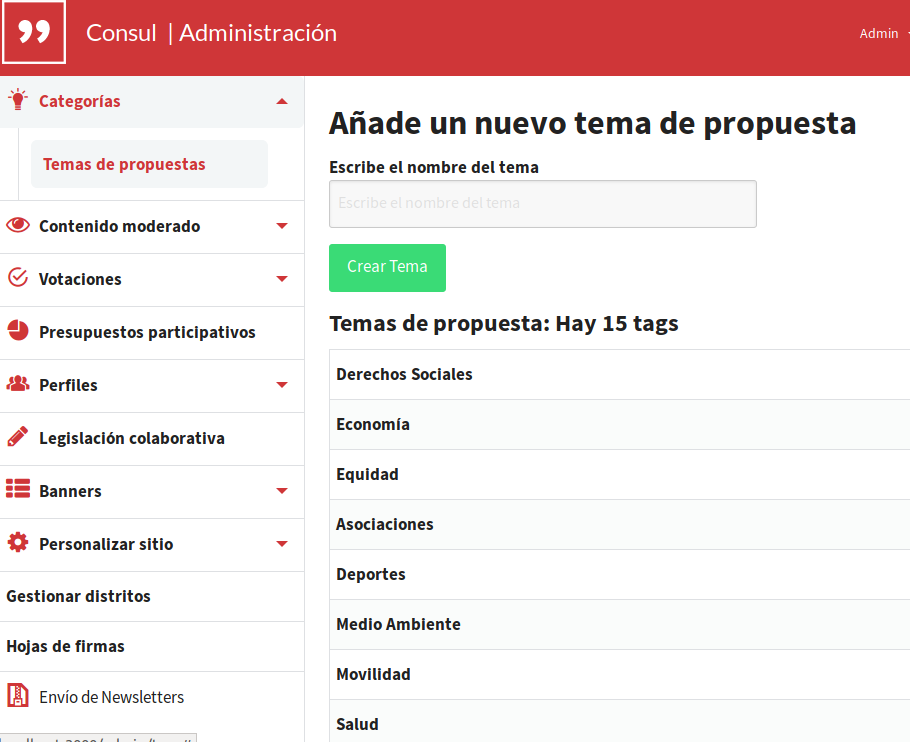

**Figura A.3.7.17:** Categoróas: temas de propuestas

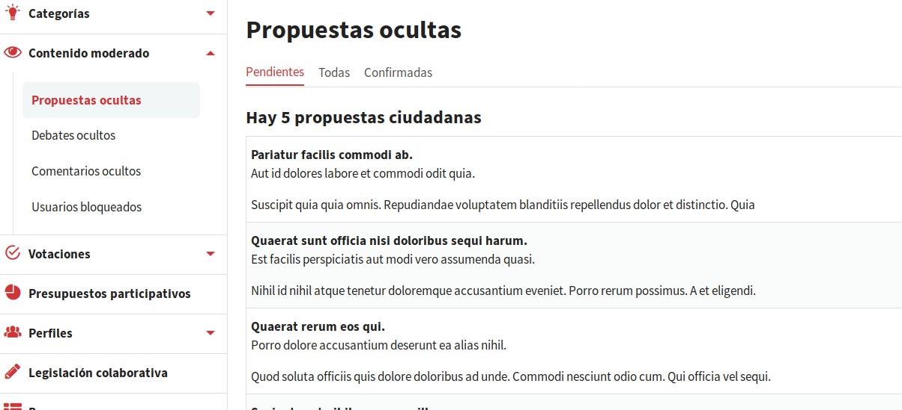

**Figura A.3.7.18:** Revisión de moderación de contenitos (administración)

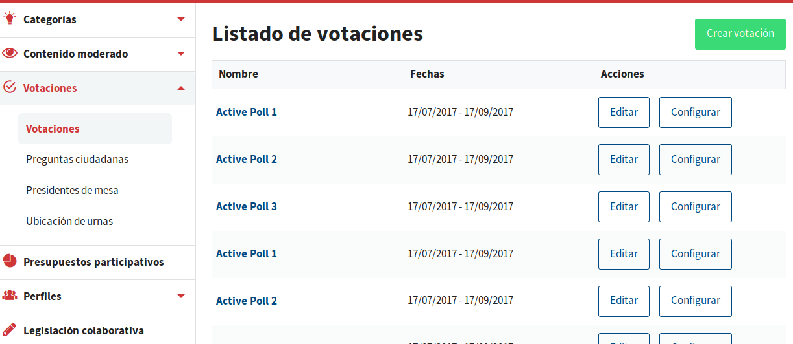

**Figura A.3.7.19:** Administrador: configurador de votaciones

**Figura A.3.7.20:** Portada

###  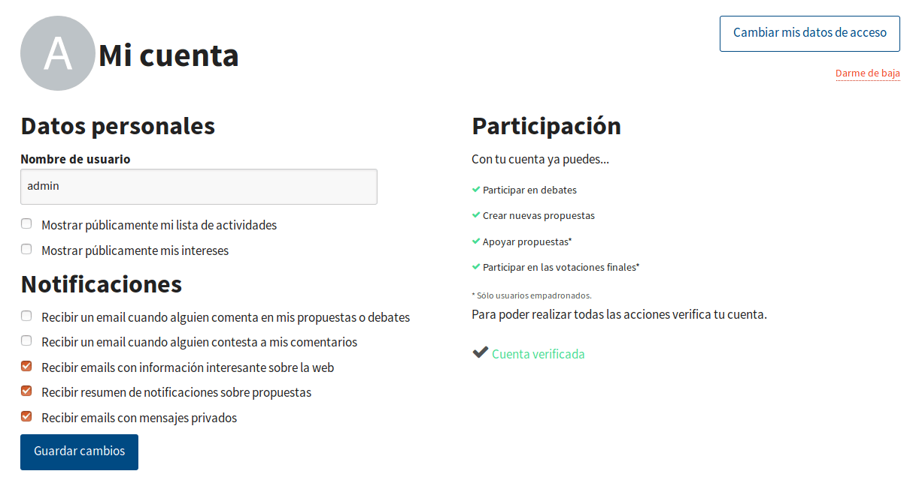

**Figura A.3.7.21:** Perfil de usuario

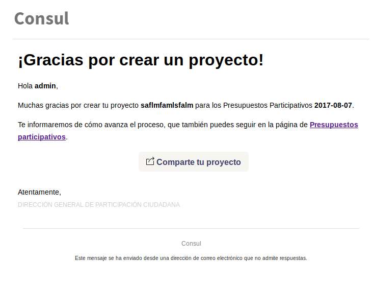

**Figura A.3.7.22:** Correo enviado al publicar un proyecto 

