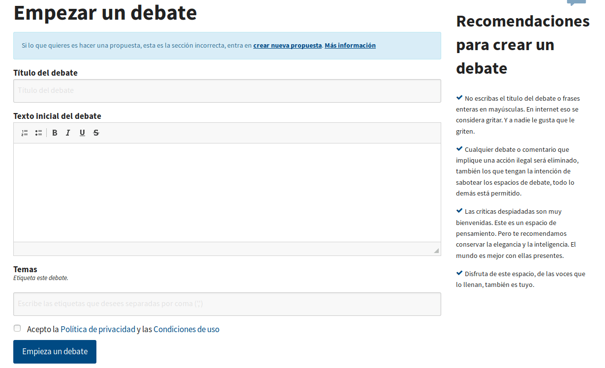
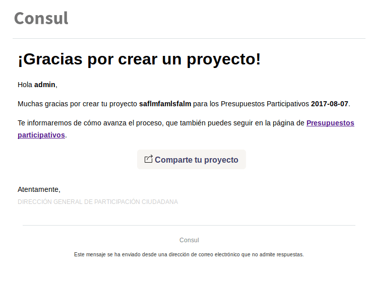

### A.3.7 Capturas de pantallas 

**Figura A.3.7.1:** Portada

**Figura A.3.7.2:** Listado de debates

**Figura A.3.7.3:** Formulario de creación de debate

**Figura A.3.7.4:** Ficha de debate (con comentarios)

**Figura A.3.7.5:** Listado de propuestas

**Figura A.3.7.6:** Ficha de propuesta

**Figura A.3.7.7:** Ficha de propuesta: detalle de notificaciones

**Figura A.3.7.8:** Ficha de propuesta: detalle de barra lateral

**Figura A.3.7.9:** Notificación de seguimiento de propuestas

**Figura A.3.7.10:** Listado de votaciones

**Figura A.3.7.11:** Listado de procesos legislativos

**Figura A.3.7.12:** Ficha de proceso legislativo

**Figura A.3.7.13:** Página de presupuestos participativos

**Figura A.3.7.14:** Inicio de sesión

**Figura A.3.7.15:** Panel de administración

**Figura A.3.7.16:** Configuración global

**Figura A.3.7.17:** Categoróas: temas de propuestas

**Figura A.3.7.18:** Revisión de moderación de contenitos (administración)

**Figura A.3.7.19:** Administrador: configurador de votaciones

**Figura A.3.7.20:** Portada

###  

**Figura A.3.7.21:** Perfil de usuario

**Figura A.3.7.22:** Correo enviado al publicar un proyecto 

