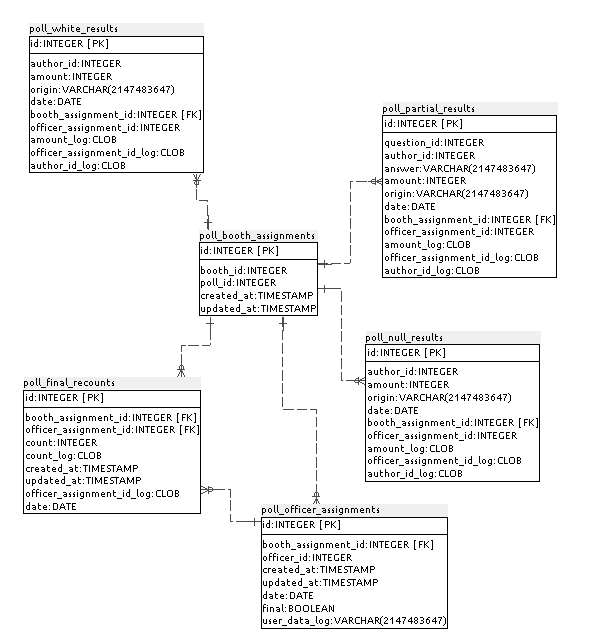
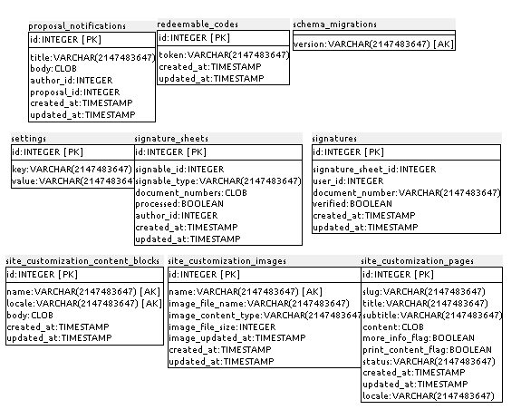

### A.3.5 Modelo de datos

#### A.3.5.1 Modelos relevantes

Los principales Modelos son Users, BudgetInvestments, SpendingInvestments, Comments, Debates, LegislationProcesses, PollQuestions, Proposals y Annotations. 

#### A.3.5.2 Tablas

Cuenta con 85 tablas:

* activities

* administrators

* ahoy_events

* annotations

* answers

* ballot_lines

* ballots

* banners

* budget_ballot_lines

* budget_ballots

* budget_groups

* budget_headings

* budget_investment_milestones

* budget_investments

* budget_reclassified_votes

* budget_recommendations

* budget_valuator_assignments

* budgets

* campaigns

* comments

* debates

* delayed_jobs

* direct_messages

* failed_census_calls

* flags

* follows

* forums

* geozones

* geozones_polls

* identities

* legacy_legislations

* legislation_annotations

* legislation_answers

* legislation_draft_versions

* legislation_processes

* legislation_question_options

* legislation_questions

* local_census_records

* locks

* managers

* moderators

* notifications

* organizations

* poll_answers

* poll_booth_assignments

* poll_booths

* poll_final_recounts

* poll_letter_officer_logs

* poll_null_results

* poll_nvotes

* poll_officer_assignments

* poll_officers

* poll_partial_results

* poll_questions

* poll_recounts

* poll_voters

* poll_white_results

* polls

* probe_options

* probe_selections

* probes

* proposal_notifications

* proposals

* redeemable_codes

* schema_migrations

* settings

* signature_sheets

* signatures

* site_customization_content_blocks

* site_customization_images

* site_customization_pages

* spending_proposals

* stats

* taggings

* tags

* tolk_locales

* tolk_phrases

* tolk_translations

* users

* valuation_assignments

* valuators

* verified_users

* visits

* volunteer_polls

* votes

#### A.3.5.3 Gráficos UML

**Figura A.3.5.1: **Tablas de la base de datos

**Figura A.3.5.2: **Tablas de la base de datos

**Figura A.3.5.3: **Tablas de la base de datos

**Figura A.3.5.4: **Tablas de la base de datos

**Figura A.3.5.5: **Tablas de la base de datos

**Figura A.3.5.6: **Tablas de la base de datos

**Figura A.3.5.7: **Tablas de la base de datos

**Figura A.3.5.8: **Tablas de la base de datos

**Figura A.3.5.9: **Tablas de la base de datos

**Figura A.3.5.10: **Tablas de la base de datos

**Figura A.3.5.11: **Tablas de la base de datos

**Figura A.3.5.12: **Tablas de la base de datos

**Figura A.3.5.13: **Tablas de la base de datos

**Figura A.3.5.14: **Tablas de la base de datos

