## A.3 Consul

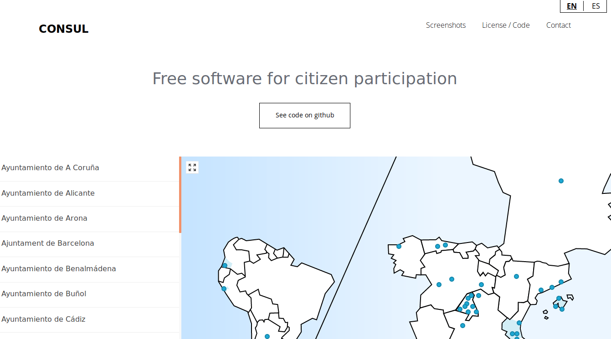

**Figura A.3.0:** Portada de [http://decide.es](http://decide.es) 

Es la aplicación web creada para el portal de Participación Ciudadana del Ayuntamiento de Madrid (NOTE:  https://decide.madrid.es ). Cuenta con funcionalidades de Debates, Propuestas, Presupuestos participativos, Votaciones y Legislación colaborativa. 

### A.3.1 Metadatos

<table>
  <tr>
    <td>Nombre</td>
    <td>Consul</td>
  </tr>
  <tr>
    <td>URL</td>
    <td>http://www.decide.es/ </td>
  </tr>
  <tr>
    <td>URL repositorio</td>
    <td>https://github.com/consul/consul/ </td>
  </tr>
  <tr>
    <td>Resumen (Inglés)</td>
    <td>Open Government and E-Participation Web Software </td>
  </tr>
  <tr>
    <td>Resumen (Castellano)</td>
    <td>Software web de Gobierno Abierto y E-Participación</td>
  </tr>
  <tr>
    <td>Lenguaje</td>
    <td>Ruby</td>
  </tr>
  <tr>
    <td>Framework</td>
    <td>Ruby on Rails</td>
  </tr>
  <tr>
    <td>Fecha primer commit</td>
    <td>Julio de 2015</td>
  </tr>
  <tr>
    <td>Versión analizada</td>
    <td>No aplica</td>
  </tr>
  <tr>
    <td>Nº de versiones</td>
    <td>4</td>
  </tr>
  <tr>
    <td>Nº de tablas de la BBDD</td>
    <td>85</td>
  </tr>
  <tr>
    <td>Nº de contribuidores</td>
    <td>67</td>
  </tr>
  <tr>
    <td>Nº de stars</td>
    <td>480</td>
  </tr>
  <tr>
    <td>Licencia</td>
    <td>GNU Affero GPL v3</td>
  </tr>
  <tr>
    <td>Mantenido</td>
    <td>Sí</td>
  </tr>
  <tr>
    <td>Diseño responsivo</td>
    <td>Sí</td>
  </tr>
</table>

 

### A.3.2 Funcionalidades 

Cuenta con las siguientes funcionalidades a alto nivel (NOTE:  http://www.decide.es/es/index.html ): 

* **_Debates_***: Cualquier persona puede abrir hilos de discusión sobre cualquier tema, creando espacios independientes donde la gente puede debatir sobre el tema propuesto. Los debates son valorados por todos, para destacar los temas más importantes.*

* **_Propuestas_***: Un espacio para que cualquiera pueda crear una propuesta ciudadana y recabar apoyos. Las propuestas que alcanzan los suficientes apoyos pasan a votación, para que entre **todas las participantes **decidamos si se deben llevar a cabo o no los temas que nos importan.*

* **_Presupuestos participativos_***: Los presupuestos participativos permiten que los ciudadanos propongan y decidan de manera directa cómo gastar parte del presupuesto, con un seguimiento y evaluación riguroso de las propuestas por parte de la institución. Máxima efectividad y control de los recursos con la mayor satisfacción para todos.*

* **_Votaciones_***: Sistema seguro de votación, tanto de propuestas ciudadanas, como de cuestiones propuestas desde la institución. Permite decidir sobre los temas más importantes fácilmente desde el móvil.*

* **_Legislación colaborativa_***: Cualquier texto legislativo puede ser compartido con la ciudadanía para recibir comentarios sobre cualquier parte concreta del mismo. Los comentarios se asocian a las partes comentadas utilizando adicionalmente un código de colores, que permite visualizar de manera sencilla las partes mejorables. También permite crear espacios de debate previo asociados al texto, para un mejor desarrollo posterior del mismo.*

* **_Procesos sectoriales_***: Sección avanzada para desarrollar procesos complejos de participación como desarrollos urbanísticos, normativa compleja o procesos que necesitan una serie de fases de participación específica.*

* **_Panel de Administración: _***Administración interna avanzada para un seguimiento fácil de todos los procesos.*

* **_Internacionalización: _***Plataforma multilingüe. Posibilidad de incluir nuevos lenguajes de manera sencilla.*

* **_Páginas de información: _***Estadísticas avanzadas, tanto públicas como internas de los procesos. Páginas de información para todos los procesos.*

* **_Sistema avanzado de roles_***: Posibilidad de definir múltiples tipos de usuarios con accesos diferentes a la herramienta (ej: administradores, moderadores, evaluadores, cargos, etc.) *

### A.3.3 Análisis

Es utilizada por distintos ayuntamientos españoles, como el de Oviedo, A Coruña, València, Calvià, Getafe, Castelló e incluso de ciudades de fuera de España como Buenos Aires y Mendoza (Argentina).  

<table>
  <tr>
    <td>Nombre</td>
    <td>Región</td>
    <td>URL</td>
  </tr>
  <tr>
    <td>Decide Madrid</td>
    <td>Madrid, España</td>
    <td>https://decide.madrid.es/</td>
  </tr>
  <tr>
    <td>Decide Oviedo</td>
    <td>Oviedo, España</td>
    <td>http://www.consultaoviedo.es/</td>
  </tr>
  <tr>
    <td>A Porta Aberta</td>
    <td>A Coruña, España</td>
    <td>https://aportaaberta.coruna.es/?locale=es</td>
  </tr>
  <tr>
    <td>decidimVLC</td>
    <td>Valencia, España</td>
    <td>https://decidimvlc.valencia.es/</td>
  </tr>
  <tr>
    <td>Participa Calvià</td>
    <td>Calvià, España</td>
    <td>https://www.participacalvia.es/</td>
  </tr>
  <tr>
    <td>Benalmádena</td>
    <td>Benalmádena, España</td>
    <td>https://participa.benalmadena.es/</td>
  </tr>
  <tr>
    <td>Web de Participación Ciudadana</td>
    <td>Carreño, España</td>
    <td>https://decide.carreno.es/</td>
  </tr>
  <tr>
    <td>DecidimCastelló</td>
    <td>Castelló, España</td>
    <td>https://decidim.castello.es/</td>
  </tr>
  <tr>
    <td>Chiloeches</td>
    <td>Chiloeches, España</td>
    <td>https://decide.aytochiloeches.es/</td>
  </tr>
  <tr>
    <td>Participa Getafe</td>
    <td>Getafe, España</td>
    <td>https://participa.getafe.es/</td>
  </tr>
  <tr>
    <td>BA Elige</td>
    <td>Buenos Aires, Argentina</td>
    <td>https://baelige.buenosaires.gob.ar/</td>
  </tr>
  <tr>
    <td>Participa Mendoza</td>
    <td>Mendoza, Argentina</td>
    <td>http://participa.ciudaddemendoza.gob.ar/</td>
  </tr>
  <tr>
    <td>Budget participatif de la RIVP</td>
    <td>Paris, Francia</td>
    <td>https://budget-participatif.rivp.fr/budgets</td>
  </tr>
  <tr>
    <td>VA!</td>
    <td>Valladolid, España</td>
    <td>https://www10.ava.es/presupuestosparticipativos/</td>
  </tr>
</table>

La versión original de Decidim Barcelona se ha realizado basándose en esta aplicación, aunque en la siguiente versión se ha reescrito con una nueva arquitectura que permite la modularización del código. 

Entre sus funcionalidades más llamativas se encuentran los paneles de Moderación, Gestión y Administración para distintos tipos de perfiles. El de Gestión permite que los funcionarios de la Oficina de Atención al Ciudadano puedan realizar ciertos tipos de acciones como el ciudadano registrado (por ejemplo hacer una propuesta nueva, dar el apoyo a alguna creada, etc). 

### A.3.4 Arquitectura

Aunque se trata de una aplicación monolítica sin soporte para adaptaciones gráficas (CSS, HTML, Imagenes), si que permite la sobreescritura de ciertos ficheros para facilitar su actualización (NOTE:  https://github.com/consul/consul/blob/master/CUSTOMIZE_ES.md ):

*Puedes modificar consul y ponerle tu propia imagen, para esto debes primero hacer un fork de**[ https://github.com/consul/consu*l](https://github.com/consul/consul)* creando un repositorio nuevo en Github. Puedes usar otro servicio como Gitlab, pero no te olvides de poner el enlace en el footer a tu repositorio en cumplimiento con la licencia de este proyecto (GPL Affero 3).*

*Hemos creado una estructura específica donde puedes sobreescribir y personalizar la aplicación para que puedas actualizar sin que tengas problemas al hacer merge y se sobreescriban por error tus cambios. Intentamos que Consul sea una aplicación Ruby on Rails lo más plain vanilla posible para facilitar el acceso de nuevas desarrolladoras.*

Este sistema cuenta con unos inconvenientes relativos a mejorar el sistema de gobernanza de la comunidad, introduciendo cuellos de botella en la aceptación de cambios que se quieran proponer para Consul (NOTE:  Pereira de Lucena, A. y Blanco-Gracia, A. (2016) Propuesta de cambios en la Arquitectura de Consul. https://www.gitbook.com/book/alabs/propuesta-de-cambios-en-la-arquitectura-de-consul/details ). 

**Figura A.3.4.1:** Esquema de arquitectura de Consul

### A.3.5 Modelo de datos

#### A.3.5.1 Modelos relevantes

Los principales Modelos son Users, BudgetInvestments, SpendingInvestments, Comments, Debates, LegislationProcesses, PollQuestions, Proposals y Annotations. 

#### A.3.5.2 Tablas

Cuenta con 85 tablas:

* activities

* administrators

* ahoy_events

* annotations

* answers

* ballot_lines

* ballots

* banners

* budget_ballot_lines

* budget_ballots

* budget_groups

* budget_headings

* budget_investment_milestones

* budget_investments

* budget_reclassified_votes

* budget_recommendations

* budget_valuator_assignments

* budgets

* campaigns

* comments

* debates

* delayed_jobs

* direct_messages

* failed_census_calls

* flags

* follows

* forums

* geozones

* geozones_polls

* identities

* legacy_legislations

* legislation_annotations

* legislation_answers

* legislation_draft_versions

* legislation_processes

* legislation_question_options

* legislation_questions

* local_census_records

* locks

* managers

* moderators

* notifications

* organizations

* poll_answers

* poll_booth_assignments

* poll_booths

* poll_final_recounts

* poll_letter_officer_logs

* poll_null_results

* poll_nvotes

* poll_officer_assignments

* poll_officers

* poll_partial_results

* poll_questions

* poll_recounts

* poll_voters

* poll_white_results

* polls

* probe_options

* probe_selections

* probes

* proposal_notifications

* proposals

* redeemable_codes

* schema_migrations

* settings

* signature_sheets

* signatures

* site_customization_content_blocks

* site_customization_images

* site_customization_pages

* spending_proposals

* stats

* taggings

* tags

* tolk_locales

* tolk_phrases

* tolk_translations

* users

* valuation_assignments

* valuators

* verified_users

* visits

* volunteer_polls

* votes

#### A.3.5.3 Gráficos UML

**Figura A.3.5.1: **Tablas de la base de datos

**Figura A.3.5.2: **Tablas de la base de datos

**Figura A.3.5.3: **Tablas de la base de datos

## 

**Figura A.3.5.4: **Tablas de la base de datos

## 

**Figura A.3.5.5: **Tablas de la base de datos

**Figura A.3.5.6: **Tablas de la base de datos

**Figura A.3.5.7: **Tablas de la base de datos

**Figura A.3.5.8: **Tablas de la base de datos

**Figura A.3.5.9: **Tablas de la base de datos

**Figura A.3.5.10: **Tablas de la base de datos

**Figura A.3.5.11: **Tablas de la base de datos

**Figura A.3.5.12: **Tablas de la base de datos

**Figura A.3.5.13: **Tablas de la base de datos

**Figura A.3.5.14: **Tablas de la base de datos

### XX A.3.6 Conclusiones

### A.3.7 Capturas de pantallas 

**Figura A.3.7.1:** Portada

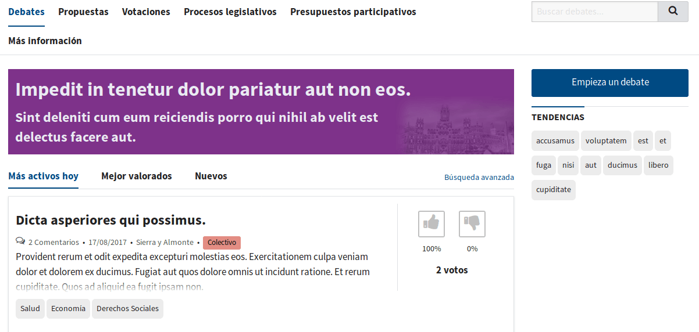

**Figura A.3.7.2:** Listado de debates

**Figura A.3.7.3:** Formulario de creación de debate

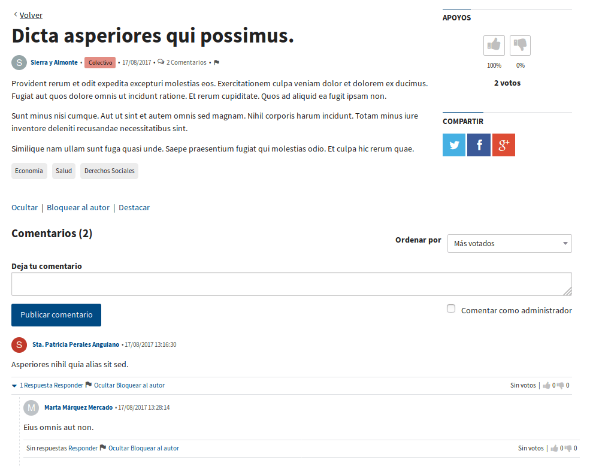

**Figura A.3.7.4:** Ficha de debate (con comentarios)

**Figura A.3.7.5:** Listado de propuestas

**Figura A.3.7.6:** Ficha de propuesta

**Figura A.3.7.7:** Ficha de propuesta: detalle de notificaciones

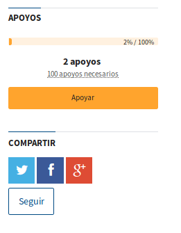

**Figura A.3.7.8:** Ficha de propuesta: detalle de barra lateral

**Figura A.3.7.9:** Notificación de seguimiento de propuestas

**Figura A.3.7.10:** Listado de votaciones

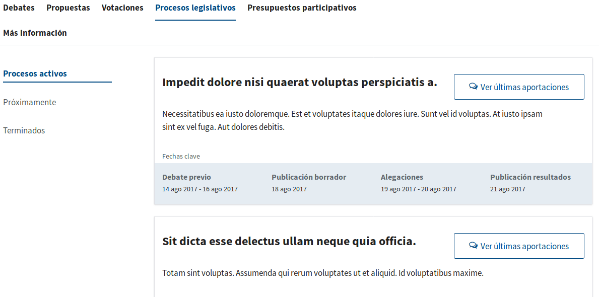

**Figura A.3.7.11:** Listado de procesos legislativos

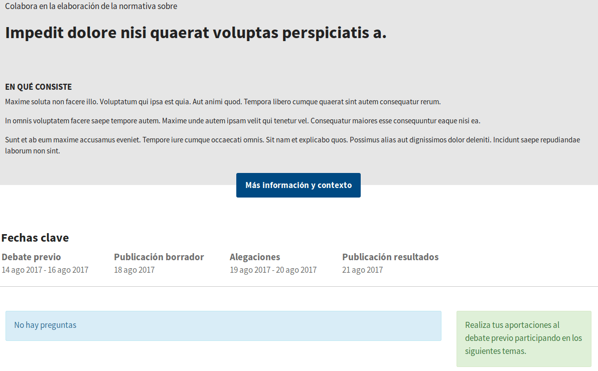

**Figura A.3.7.12:** Ficha de proceso legislativo

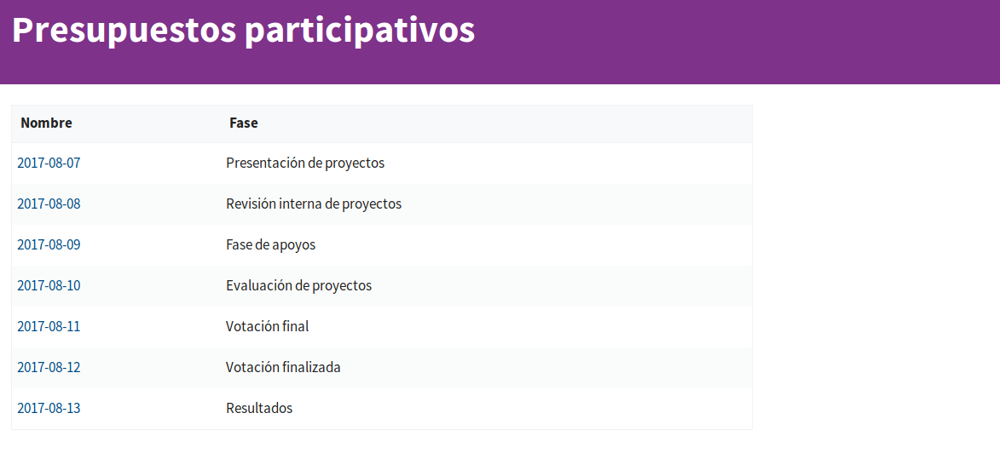

**Figura A.3.7.13:** Página de presupuestos participativos

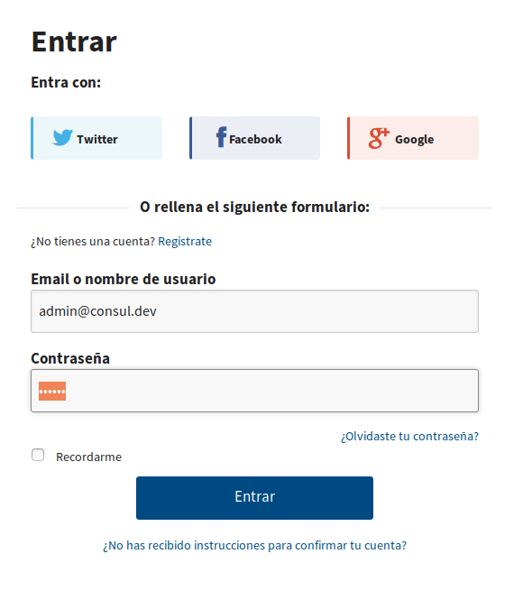

**Figura A.3.7.14:** Inicio de sesión

**Figura A.3.7.15:** Panel de administración

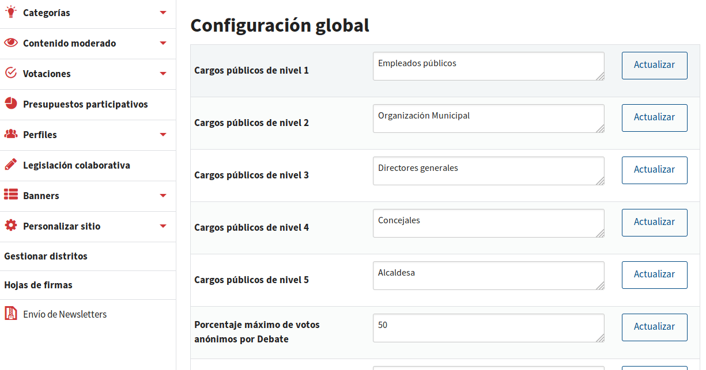

**Figura A.3.7.16:** Configuración global

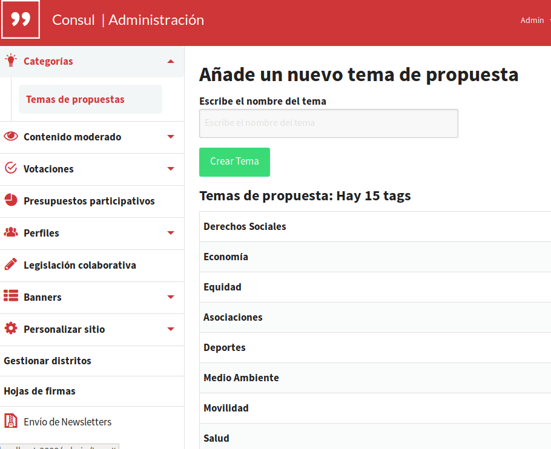

**Figura A.3.7.17:** Categoróas: temas de propuestas

**Figura A.3.7.18:** Revisión de moderación de contenitos (administración)

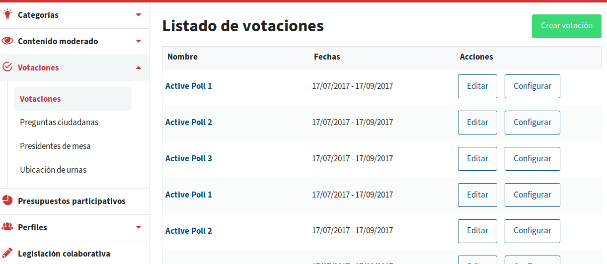

**Figura A.3.7.19:** Administrador: configurador de votaciones

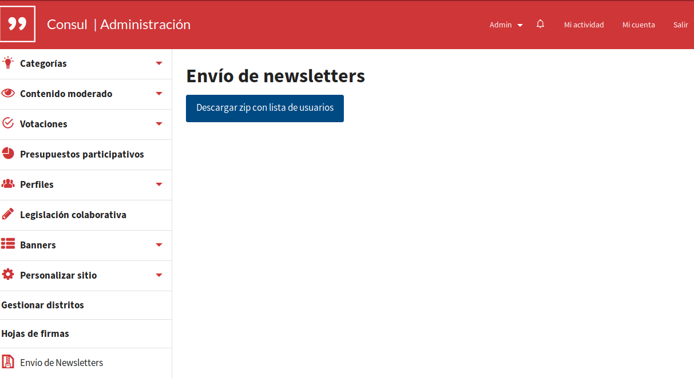

**Figura A.3.7.20:** Portada

###  

**Figura A.3.7.21:** Perfil de usuario

**Figura A.3.7.22:** Correo enviado al publicar un proyecto 

