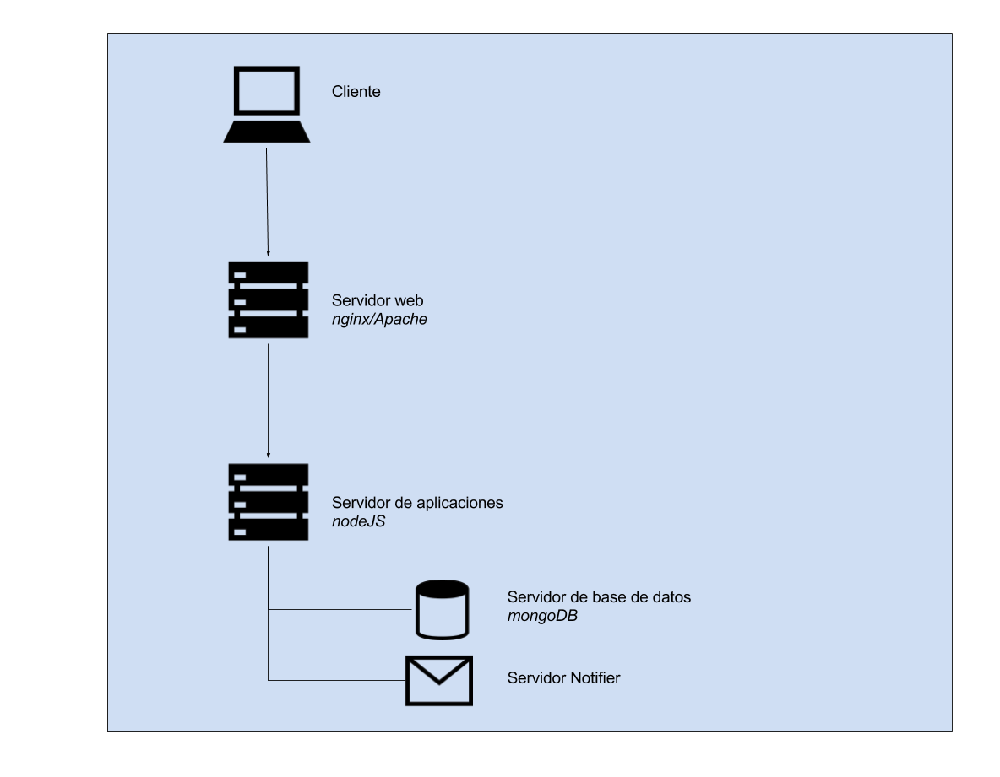

### B.1.4 Arquitectura

No permite la personalización de contenidos e imagen (HTML/CSS), por lo que dificulta su adaptación y posterior actualización. 

Cuentan con una API REST[^1] para acceder desde otras aplicaciones web a los contenidos de la base de datos. 

Como curiosidad, no utilizan un servidor SMTP convencional, sino que utilizan un servidor realizado por ellos mismos, y recomiendan utilizar servicios como SendGrid y GMail. Aunque la aplicación puede funcionar utilizando el servidor SMTP del mismo servidor (a través del comando sendmail), no lo recomiendan, ya que hace falta configurarlo correctamente[^2]:

*No se recomienda para producción. El uso del transporte directo no es confiable, ya que el puerto de salida 25 utilizado se bloquea a menudo por defecto. Además, el correo enviado desde direcciones dinámicas a menudo se marca como spam. Debería considerar utilizar un proveedor de SMTP.*

**Figura B.1.4.1**: Esquema de servidores de DemocracyOS

[^1]: http://docs.democracyos.org/develop/#web-api 
[^2]: https://github.com/DemocracyOS/notifier 
Texto original: Not recommended for production. Using direct transport is not reliable as outgoing port 25 used is often blocked by default. Additionally mail sent from dynamic addresses is often flagged as spam. You should really consider using a SMTP provider.
