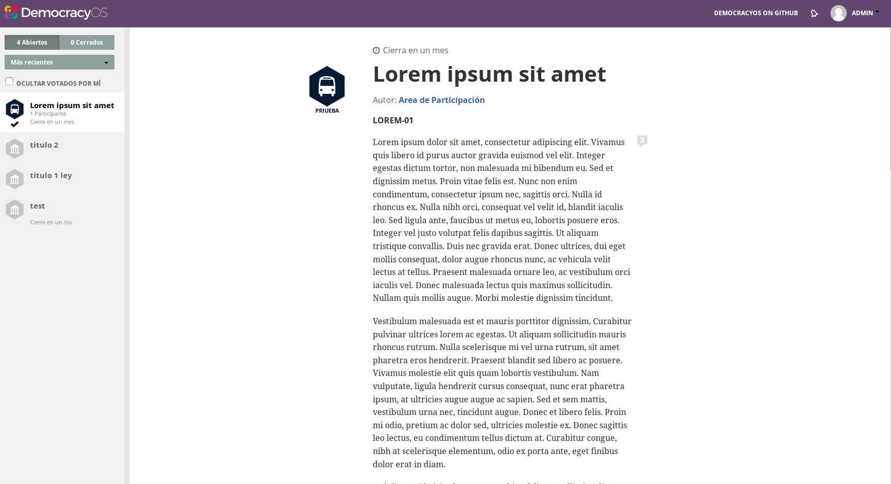

### B.1.7 Capturas de pantallas 

**Figura B.1.7.1: **Página de discusión de un texto

**Figura B.1.7.2: **Página de discusión de un texto: detalle de cantidad de comentarios

**Figura B.1.7.3: **Página de discusión de un texto: detalle de hilo de comentarios

**Figura B.1.7.4: **Página de discusión de un texto: detalle de recursos, participantes y compartir con redes sociales

**Figura B.1.7.5: **Argumentos en la discusión de un texto

**Figura B.1.7.6: **Votación de un texto

**Figura B.1.7.7: **Votación de un texto: posibilidad de cambio de voto

**Figura B.1.7.8: **Votación de un texto: posibilidad de cambio de voto

**Figura B.1.7.9: **Votación de un texto: gráfico al superar la fecha límite

**Figura B.1.7.10: **Detalle de menú del costado: filtros y selección de texto

**Figura B.1.7.11: **Administrador: formulario de dar de alta un texto I

**Figura B.1.7.12: **Administrador: formulario de dar de alta un texto II

