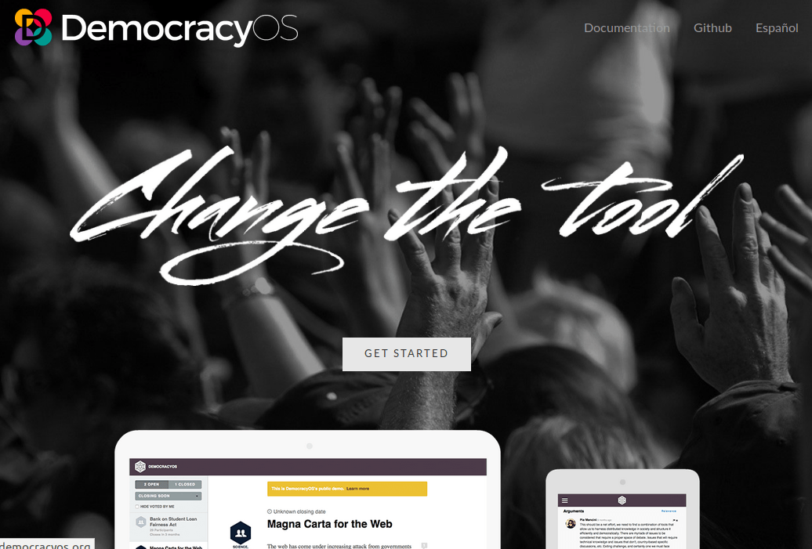

## B.1 DemocracyOS 

**Figura B.1.0:** Portada de [http://democracyos.org](http://democracyos.org) 

*Software libre de código abierto, con una experiencia de usuario fácil para que los ciudadanos se informen, debatan y voten sobre cada proyecto de ley presentado en el Congreso. DemocracyOS ha evolucionado hasta convertirse en una de las plataformas más utilizadas para la toma de decisiones en colaboración y se ha traducido a 15 idiomas. Se ha utilizado en Túnez para debatir su constitución nacional; por el Gobierno Federal de México para desarrollar su política de Gobierno Abierto; por el de parlamentario más joven de Kenia para consultar a su circunscripción o por el Congreso de Buenos Aires convirtiéndose en la primera experiencia en la democracia digital en el continente americano.*[^1]

[^1]: Traducido de http://democracyos.org/
Texto original: Open source, free software with an easy user experience for citizens to get informed, debate and vote on every single bill presented in Congress. DemocracyOS evolved to become one of the most used platforms for collaborative decision-making and it got translated into 15 languages. It has been used in Tunisia to debate its national constitution; by the Federal Government of Mexico to develops its open goverment policy; by the youngest parlamentarian in Kenya to consult his constituency or the Congress of Buenos Aires becoming the first experience on digital democracy in the American continent.
