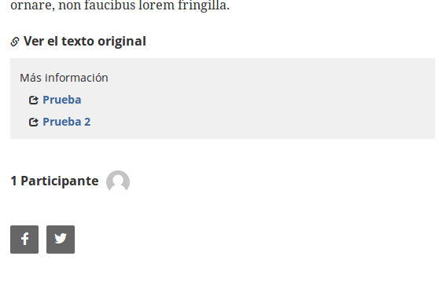
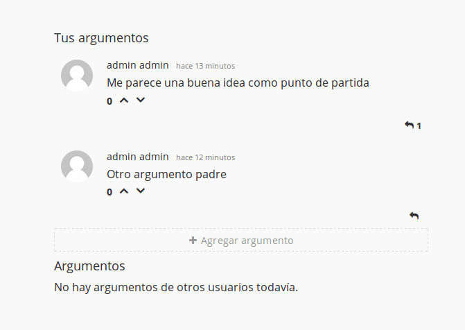
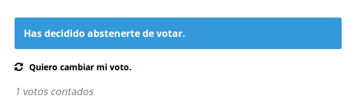
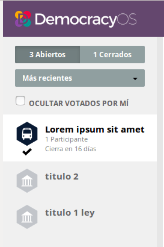
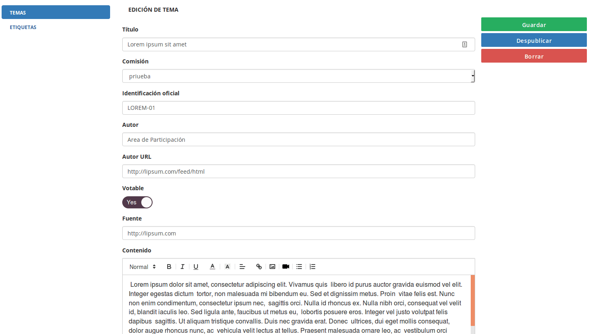

## Anexo B.1 DemocracyOS 

**Figura B.1.0: **Portada de [http://democracyos.org](http://democracyos.org) 

*Software libre de código abierto, con una experiencia de usuario fácil para que los ciudadanos se informen, debatan y voten sobre cada proyecto de ley presentado en el Congreso. DemocracyOS ha evolucionado hasta convertirse en una de las plataformas más utilizadas para la toma de decisiones en colaboración y se ha traducido a 15 idiomas. Se ha utilizado en Túnez para debatir su constitución nacional; por el Gobierno Federal de México para desarrollar su política de Gobierno Abierto; por el de parlamentario más joven de Kenia para consultar a su circunscripción o por el Congreso de Buenos Aires convirtiéndose en la primera experiencia en la democracia digital en el continente americano.* (NOTE:  Traducido de http://democracyos.org/
Texto original: Open source, free software with an easy user experience for citizens to get informed, debate and vote on every single bill presented in Congress. DemocracyOS evolved to become one of the most used platforms for collaborative decision-making and it got translated into 15 languages. It has been used in Tunisia to debate its national constitution; by the Federal Government of Mexico to develops its open goverment policy; by the youngest parlamentarian in Kenya to consult his constituency or the Congress of Buenos Aires becoming the first experience on digital democracy in the American continent.)

### B.1.1 Metadatos

<table>
  <tr>
    <td>Nombre</td>
    <td>DemocracyOS</td>
  </tr>
  <tr>
    <td>URL</td>
    <td>http://democracyos.org/ </td>
  </tr>
  <tr>
    <td>URL repositorio</td>
    <td>https://github.com/DemocracyOS/democracyos </td>
  </tr>
  <tr>
    <td>Resumen (Inglés)</td>
    <td>An online space for deliberation and voting on political proposals. The software aims to stimulate better arguments and come to better rulings</td>
  </tr>
  <tr>
    <td>Resumen (Castellano)</td>
    <td>Un espacio en línea para deliberar y votar en propuestas políticas. El software tiene el fin de estimular mejores argumentos y llegar a mejores resoluciones.</td>
  </tr>
  <tr>
    <td>Lenguaje</td>
    <td>Javascript</td>
  </tr>
  <tr>
    <td>Framework</td>
    <td>Node.js</td>
  </tr>
  <tr>
    <td>Fecha primer commit</td>
    <td>Abril de 2013</td>
  </tr>
  <tr>
    <td>Versión analizada</td>
    <td>2.9.3</td>
  </tr>
  <tr>
    <td>Nº de versiones</td>
    <td>189</td>
  </tr>
  <tr>
    <td>Nº de tablas de la BBDD</td>
    <td>10</td>
  </tr>
  <tr>
    <td>Nº de contribuidores</td>
    <td>68</td>
  </tr>
  <tr>
    <td>Nº de stars</td>
    <td>1524</td>
  </tr>
  <tr>
    <td>Licencia</td>
    <td>GNU Affero GPL v3</td>
  </tr>
  <tr>
    <td>Mantenido </td>
    <td>Sí</td>
  </tr>
  <tr>
    <td>Diseño responsivo</td>
    <td>Sí</td>
  </tr>
</table>

 

### B.1.2 Funcionalidades 

* Permite abrir una serie de comentarios sobre cada párrafo del texto.

* Permite aportar argumentos sobre el texto general, como comentarios anidados con posibilidad de votarlos (de forma positiva o negativa).

* Permite valorar un texto votando a favor, en contra o absteniéndose.

* Tiene la posibilidad de debatir varios textos en paralelo. 

* Soporte para utilizar Avatares de usuarios a través de Gravatar. 

* Permite enlazar recursos (enlaces externos) a un texto. 

* Permite configurar una fecha límite para la discusión del texto. 

* Cuenta con posibilidad de usar etiquetas para cada texto. 

* Soporte para el formato Markdown en los comentarios.

* Soporte para actualizaciones por RSS.

* Soporte para inicio de sesión con Facebook.

### B.1.3 Análisis

Se ha utilizado para distintos procesos de discusión de un texto base, tanto desde la sociedad civil como desde las instituciones. 

* Por la ciudad de París, para su portal de Rendición de Cuentas (Compte Rendu)  (NOTE:  https://crm.paris.fr/ )

* Por la República Argentina, para su portal de Consulta Pública Argentina (discusión de la Alianza de Gobierno Abierto)  (NOTE:  https://consultapublica.argentina.gob.ar  )

### B.1.4 Arquitectura

No permite la personalización de contenidos e imagen (HTML/CSS), por lo que dificulta su adaptación y posterior actualización. 

Cuentan con una API REST (NOTE:  http://docs.democracyos.org/develop/#web-api ) para acceder desde otras aplicaciones web a los contenidos de la base de datos. 

Como curiosidad, no utilizan un servidor SMTP convencional, sino que utilizan un servidor realizado por ellos mismos, y recomiendan utilizar servicios como SendGrid y GMail. Aunque la aplicación puede funcionar utilizando el servidor SMTP del mismo servidor (a través del comando sendmail), no lo recomiendan, ya que hace falta configurarlo correctamente (NOTE:  https://github.com/DemocracyOS/notifier 
Texto original: Not recommended for production. Using direct transport is not reliable as outgoing port 25 used is often blocked by default. Additionally mail sent from dynamic addresses is often flagged as spam. You should really consider using a SMTP provider.): 

*No se recomienda para producción. El uso del transporte directo no es confiable, ya que el puerto de salida 25 utilizado se bloquea a menudo por defecto. Además, el correo enviado desde direcciones dinámicas a menudo se marca como spam. Debería considerar utilizar un proveedor de SMTP.*

**Figura B.1.4.1**: Esquema de servidores de DemocracyOS

### B.1.5 Modelo de datos

#### B.1.5.1 Modelos relevantes 

Es la única de las aplicaciones analizadas que ha utilizado una base de datos no relacional (MongoDB) para almacenar la mayoría de los contenidos. 

Las principales colecciones  (el equivalente a una tabla en este tipo de servidores) son Topics y

 Comments.

#### B.1.5.2 Colecciones

Al no ser una base de datos relacional no cuenta con tablas sino con colecciones. Cuenta con 10 colecciones: 

* comments

* feeds

* forums

* notifications

* notifierJobs

* tags

* tokens

* topics

* users

* whitelists

#### B.1.5.3 Gráficos UML

Al no contar con un esquema por definición no se puede obtener una representación gráfica automática. Para fines documentales se muestran algunos contenidos de ejemplos que fueron creados a tal efec

to. Puede haber colecciones vacías en caso de no haberse guardado ningún objeto: 

*> db.comments.findOne()*

*{*

*    "_id" : ObjectId("5745cb09789325545f8f85d9"),*

*    "text" : "este me mola",*

*    "context" : "paragraph",*

*    "reference" : "5745cac4789325545f8f85d4",*

*    "topicId" : ObjectId("5745cac4789325545f8f85d1"),*

*    "author" : ObjectId("573af365435155135e008a9c"),*

*    "createdAt" : ISODate("2016-05-25T15:55:53.958Z"),*

*    "flags" : [ ],*

*    "score" : 0,*

*    "votes" : [ ],*

*    "replies" : [ ],*

*    "__v" : 0*

*}*

*> db.feeds.findOne()*

*{*

*    "_id" : ObjectId("5745cad8e99435545f9c11fc"),*

*    "type" : "topic-published",*

*    "topic" : "5745cac4789325545f8f85d1",*

*    "createdAt" : 1464191704274,*

*    "forum" : null*

*}*

*> db.forums.findOne()*

*{*

*    "_id" : ObjectId("577a2e42fe4cc2fb56563c03"),*

*    "name" : "organizativo",*

*    "title" : "Documentos Organizativos",*

*    "owner" : ObjectId("573af365435155135e008a9c"),*

*    "summary" : "Discute los documentos organizativos propuestos",*

*    "createdAt" : ISODate("2016-07-04T09:37:06.867Z"),*

*    "__v" : 0*

*}*

*> db.notifierJobs.findOne()*

*null*

*> db.tags.findOne()*

*{*

*    "_id" : ObjectId("573af65e789325545f8f85cf"),*

*    "name" : "priueba",*

*    "hash" : "priueba",*

*    "createdAt" : ISODate("2016-05-17T10:45:50.238Z"),*

*    "image" : "transportation",*

*    "color" : "#091A33",*

*    "__v" : 0*

*}*

*> db.tokens.findOne()*

*{*

*    "_id" : ObjectId("5734853093b50d070f7907a9"),*

*    "user" : ObjectId("5734853093b50d070f7907a8"),*

*    "scope" : "email-validation",*

*    "meta" : {*

*   	 "ua" : "Mozilla/5.0 (X11; Ubuntu; Linux x86_64; rv:46.0) Gecko/20100101 Firefox/46.0",*

*   	 "referer" : "https://democracyos.compas.alabs.org/signup",*

*   	 "host" : "democracyos.compas.alabs.org",*

*   	 "ips" : [ ],*

*   	 "ip" : "::ffff:127.0.0.1"*

*    },*

*    "createdAt" : ISODate("2016-05-12T13:29:20.973Z"),*

*    "__v" : 0*

*}*

*> db.topics.findOne()*

*{*

*    "_id" : ObjectId("5745cac4789325545f8f85d1"),*

*    "updatedAt" : ISODate("2016-05-25T16:00:38.501Z"),*

*    "mediaTitle" : "test",*

*    "tag" : ObjectId("5745cb65789325545f8f85da"),*

*    "topicId" : "test",*

*    "authorUrl" : "",*

*    "bodyTruncationText" : "",*

*    "source" : "",*

*    "closingAt" : ISODate("2016-06-02T10:00:00Z"),*

*    "author" : "migue",*

*    "links" : [ ],*

*    "votable" : true,*

*    "createdAt" : ISODate("2016-05-25T15:54:44.487Z"),*

*    "participants" : [ ],*

*    "votes" : [ ],*

*    "clauses" : [*

*   	 {*

*   		 "markup" : "
Jaromil es activista, hacker y artista, cofundador del think&amp;do tank Dyne.org, que alberga una comunidad digital de makers críticos y desarrolladores nómadas.&nbsp;
",*

*   		 "position" : 0,*

*   		 "_id" : ObjectId("5745cac4789325545f8f85d6"),*

*   		 "empty" : false*

*   	 },*

*   	 {*

*   		 "markup" : "
 
",*

*   		 "position" : 1,*

*   		 "_id" : ObjectId("5745cac4789325545f8f85d5"),*

*   		 "empty" : true*

*   	 },*

*   	 {*

*   		 "markup" : "
Escribe código y lo publica como software libre y de código abierto. Su investigación se centra en la descentralizacion, los algoritmos y las prácticas media independientes.&nbsp;
",*

*   		 "position" : 2,*

*   		 "_id" : ObjectId("5745cac4789325545f8f85d4"),*

*   		 "empty" : false*

*   	 },*

*   	 {*

*   		 "markup" : "
 
",*

*   		 "position" : 3,*

*   		 "_id" : ObjectId("5745cac4789325545f8f85d3"),*

*   		 "empty" : true*

*   	 },*

*   	 {*

*   		 "markup" : "
Jaromil ha recibido el premio Vilém Flusser Award (Transmediale) y ha sido reconocido como uno de los mejores 100 emprendedores sociales (Purpose Economy, 2014) y líder joven europeo (40 under 40, 2012).
",*

*   		 "position" : 4,*

*   		 "_id" : ObjectId("5745cac4789325545f8f85d2"),*

*   		 "empty" : false*

*   	 }*

*    ],*

*    "__v" : 4,*

*    "publishedAt" : ISODate("2016-05-25T15:55:03.290Z")*

*}*

*> db.user.findOne()*

*null*

*> db.users.findOne()*

*{*

*    "_id" : ObjectId("573af365435155135e008a9c"),*

*    "salt" : "8e222c26db61181b381285faaba3d512bc6eeb6e8f47ae5ebe97a7b759b86e41",*

*    "hash" : "066cf4eb7d5dce6a8ef0e174b33e644de30e7a72ccc7a7a284a92afbe1ed7ec083cee9aa6117673e7fcade7eff0125762ae204a8bbefc115ff1b47a57218ab84383c4db14d5cd8a255e02a4dd3f58f3f7d5e2c162bda03db1de1170a08a08bb90dfebbeb6910458fef9e437ad66cffcb7f7160350b2a79eb83b5627f29ad407741fa222b2578295cada9774c1a3fcfa97520fe892a4d8dbe06c8d9f0e9ec0f72054851173b405c6d57e67739c3e067065cab8599784ad0b5bc5473b1e05bd01d2c56f5cf4355b12d52d9e35d8510a32e655d37053adfdf63378c0a304831f50b848e0c9716b5dd5b32999eaafc6c9a61d357690ded0b90a633fb69f252b822186888938a12bce0bc8c65c067cabfd3a227c5e5a90d383*56838ae97c809061998fc9f187b781eb92e6fcd544aaf879a1249ffa4228b9728ffc51431d126c5d1bb03dc749fc19ae365ef23964c51c80459e8c7c8356b89c5e336cebbc54d630385fe063eaaf904df1c7e4dfe6dc76ad1d0ebee3dda8a1bb6cd05c7d1b6d3f947295bae277e8c9176c83dcad93c20e5dda303896847ecc879cff4b67f9ffad95d5cf30c011231ef40e86184af5392016f19618500db6e51be1d96d9fa38cc21339550562e34a7d8303ae4b7fc8fe49f0d16e7928ade24add57f79da41af5211e6d52b47ca94d018216bc8511b5df63a17525c5c46f5d36e0820abbabc8ca249cbb6",

*    "email" : "hola+democracyos@alabs.org",*

*    "firstName" : "admin",*

*    "lastName" : "admin",*

*    "locale" : "es",*

*    "notifications" : {*

*   	 "new-topic" : true,*

*   	 "replies" : true*

*    },*

*    "createdAt" : ISODate("2016-05-17T10:33:09.466Z"),*

*    "emailValidated" : true,*

*    "__v" : 0*

*}*

*> db.whitelists.findOne()*

*null*

### XX B.1.6 Conclusiones  

### B.1.7 Capturas de pantallas 

**Figura B.1.7.1: **Página de discusión de un texto

**Figura B.1.7.2: **Página de discusión de un texto: detalle de cantidad de comentarios

**Figura B.1.7.3: **Página de discusión de un texto: detalle de hilo de comentarios

**Figura B.1.7.4: **Página de discusión de un texto: detalle de recursos, participantes y compartir con redes sociales

**Figura B.1.7.5: **Argumentos en la discusión de un texto

**Figura B.1.7.6: **Votación de un texto

**Figura B.1.7.7: **Votación de un texto: posibilidad de cambio de voto

**Figura B.1.7.8: **Votación de un texto: posibilidad de cambio de voto

**Figura B.1.7.9: **Votación de un texto: gráfico al superar la fecha límite

**Figura B.1.7.10: **Detalle de menú del costado: filtros y selección de texto

**Figura B.1.7.11: **Administrador: formulario de dar de alta un texto I

**Figura B.1.7.12: **Administrador: formulario de dar de alta un texto II

