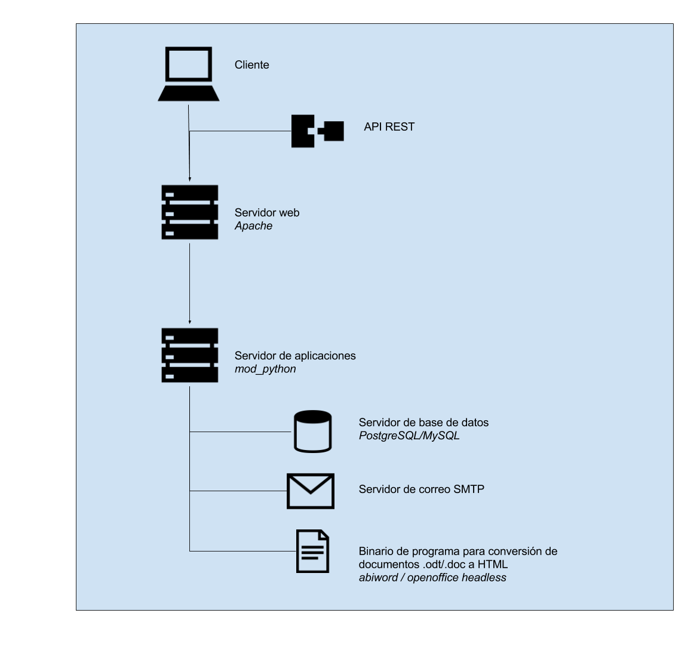

### B.2.4 Arquitectura

Se trata de una aplicación web estándar hecha en Django. No cuenta con una forma de extenderla a nivel de imagen (diseño, traducciones, etc).

Al permitir embeber a través de un iframe la mayoría de las integraciones se realizan a través de esta dinámica. Por ejemplo cuentan con un plugin para Drupal[^1], que permite realizar esta integración de manera automática, agregando el identificador y URL del documento que se quiera embeber. Otro ejemplo es la aplicación web Open Irekia, que en su fase de Debates permite embeber de COMT. 

**Figura B.2.4.1:** COMT embebido en Drupal

Ofrecen una API REST[^2] para hacer consultas al servidor de forma automática, permitiendo obtener analíticas de métricas para hacer reportes o integrar COMT con sistemas de gestión de contenidos (CMS).

**Figura B.2.4.2:** Esquema a nivel de servidores de COMT

[^1]: https://www.drupal.org/project/co_ment
[^2]: https://github.com/co-ment/comt/wiki/DocumentationAPI
