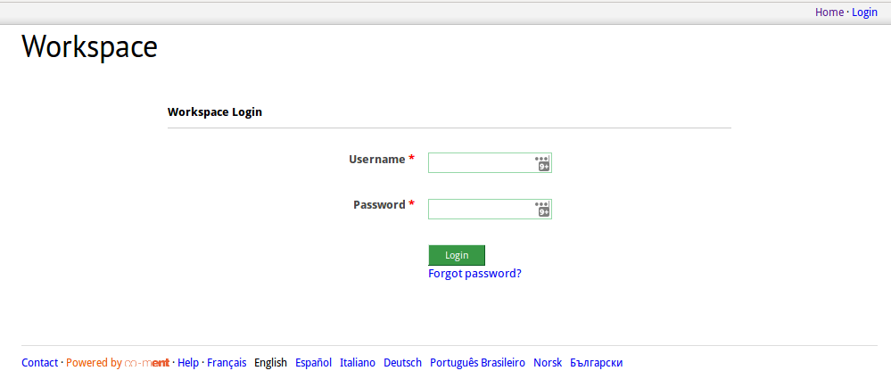
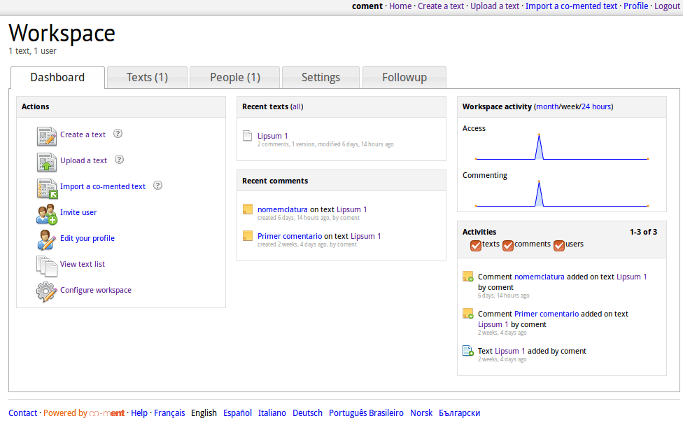
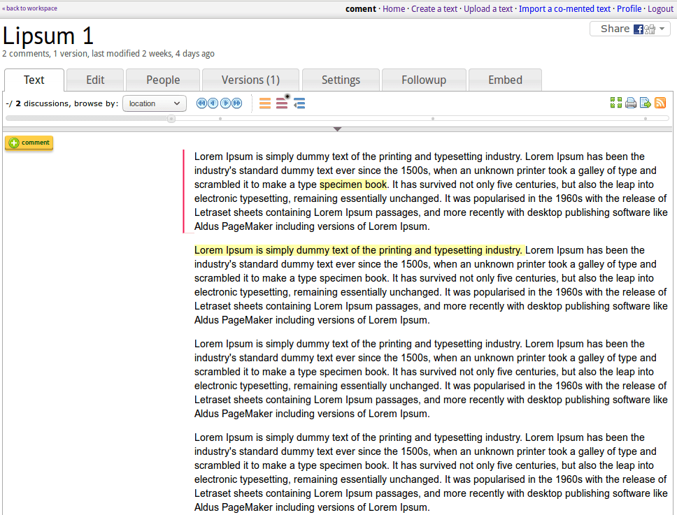
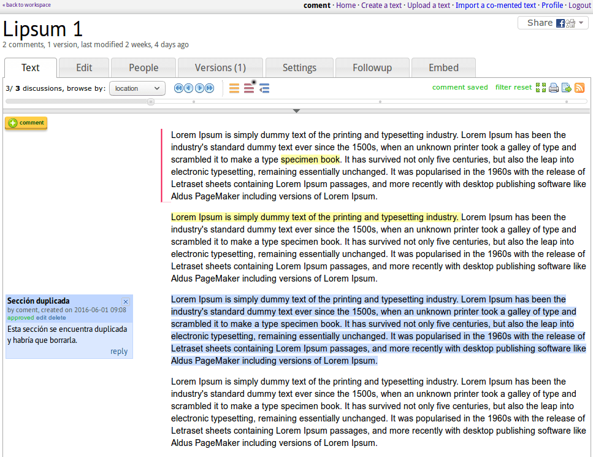
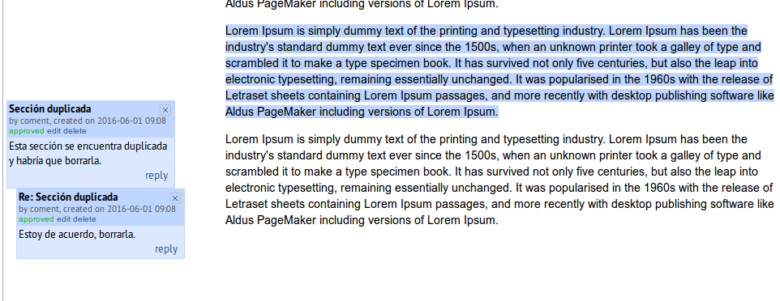
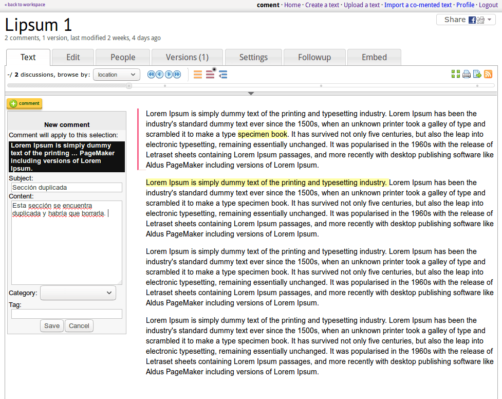
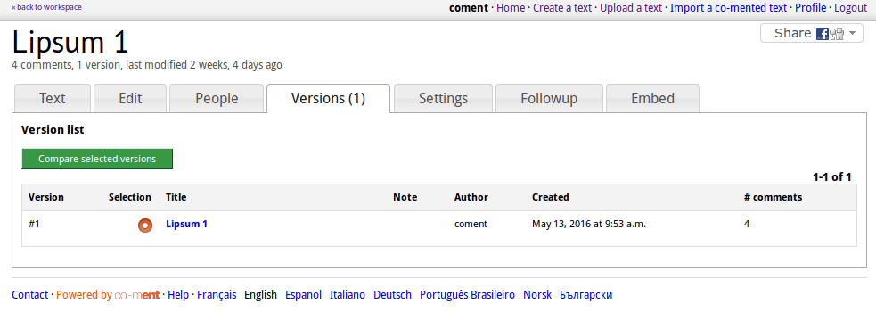

### B.2.7 Capturas de pantallas

**Figura B.2.7.1: **Portada e inicio de sesión 

**Figura B.2.7.2: **Área de trabajo con acciones y actividad 

**Figura B.2.7.3: **Ejemplo de texto comentado

**Figura B.2.7.4: **Ejemplo de comentario en texto

**Figura B.2.7.5**: Ejemplo de respuesta a un comentario en texto

**Figura B.2.7.6: **Ejemplo de interfaz para agregar un comentario en texto

**Figura B.2.7.7: **Administrador: edición del texto base

**Figura B.2.7.8:** Administrador: múltiples versiones de un texto

**Figura B.2.7.9: **Administrador: configuraciones de categorías y moderación

**Figura B.2.7.10: **Administrador: funcionalidades de seguimiento

**Figura B.2.7.11: **Administrador: posibilidad de embeber

