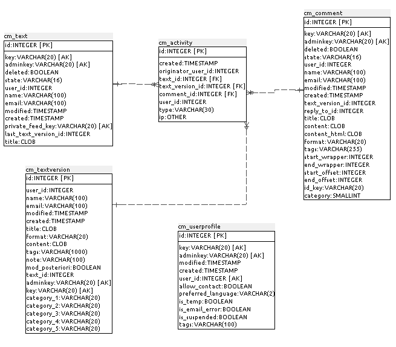

### B.2.5 Modelo de datos

#### B.2.5.1 Modelos relevantes

Los principales modelos son Text, Comment y TextVersion

#### B.2.5.2 Tablas

Cuenta con 26 tablas:

* auth_group

* auth_group_permissions

* auth_message

* auth_permission

* auth_user

* auth_user_groups

* auth_user_user_permissions

* cm_activity

* cm_attachment

* cm_comment

* cm_configuration

* cm_email

* cm_notification

* cm_role

* cm_role_permissions

* cm_text

* cm_textversion

* cm_userprofile

* cm_userrole

* django_admin_log

* django_content_type

* django_session

* django_site

* south_migrationhistory

* tagging_tag

* tagging_taggeditem

#### B.2.5.3 Gráficos UML

**Figura B.2.5.1: **Tablas de la base de datos de COMT

**Figura B.2.5.2: **Tablas de la base de datos de COMT

**Figura B.2.5.3: **Tablas de la base de datos de COMT
