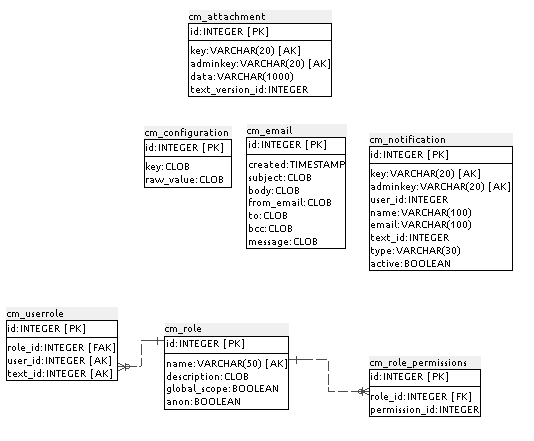

## Anexo B.2 COMT 

**Figura B.2.0: **Portada de [http://www.co-ment.com/](http://www.co-ment.com/) 

*COMT te permite instalar y ejecutar un servicio Web de anotación de textos. COMT habilita un espacio de trabajo compartido entre un grupo de usuarios. En este espacio de trabajo, **se **puede crear, subir, enviar comentarios, revisar, y exportar textos y sus comentarios. Los permisos de usuarios son definidos por todo el conjunto de textos en la área de trabajo y puede ser especializado para cada texto. * (NOTE:  Traducido de https://github.com/co-ment/comt/wiki 
Texto original: COMT enables you to install and run a text-annotation Web service. COMT operates a workspace shared among a group of users. In this workspace, one can create, upload, submit to comments, revise, and export texts and their comments. User rights are defined for the whole set of texts in the workspace and can be specialized for each text.)

### B.2.1 Metadatos

<table>
  <tr>
    <td>Nombre</td>
    <td>COMT</td>
  </tr>
  <tr>
    <td>URL</td>
    <td>http://www.co-ment.com/ </td>
  </tr>
  <tr>
    <td>URL repositorio</td>
    <td>https://github.com/co-ment/comt</td>
  </tr>
  <tr>
    <td>Resumen (Inglés)</td>
    <td>Text annotation and collaborative writing</td>
  </tr>
  <tr>
    <td>Resumen (Castellano)</td>
    <td>Anotación de textos y escritura colaborativa</td>
  </tr>
  <tr>
    <td>Lenguaje</td>
    <td>Python</td>
  </tr>
  <tr>
    <td>Framework</td>
    <td>Django</td>
  </tr>
  <tr>
    <td>Fecha primer commit</td>
    <td>Noviembre de 2009</td>
  </tr>
  <tr>
    <td>Versión analizada</td>
    <td>2.6.4</td>
  </tr>
  <tr>
    <td>Nº de versiones</td>
    <td>8</td>
  </tr>
  <tr>
    <td>Nº de tablas de la BBDD</td>
    <td>26</td>
  </tr>
  <tr>
    <td>Nº de contribuidores</td>
    <td>5</td>
  </tr>
  <tr>
    <td>Nº de stars</td>
    <td>12</td>
  </tr>
  <tr>
    <td>Licencia</td>
    <td>GNU Affero GPL v3</td>
  </tr>
  <tr>
    <td>Mantenido</td>
    <td>No</td>
  </tr>
  <tr>
    <td>Diseño responsivo</td>
    <td>No</td>
  </tr>
</table>

 

### B.2.2 Funcionalidades 

* Permite tener un hilo de comentarios sobre el texto 

* Cuenta con al posibilidad de embeber el texto a un sitio externo a través de un iframe. 

* Permite controlar el tipo de moderación que se tendrá, si es a posteriori o por defecto todo se encuentra moderado. 

* Permite tener un feed RSS para estar al tanto de las actualizaciones realizadas en el texto. 

* Su interfaz es antigua: el diseño no es responsivo, tiene problemas de usabilidad para el comentario del texto. 

### B.2.3 Análisis

Es uno de los aplicativos de este tipo (comentarios y escritura colaborativa de textos) más antiguo y ha sido utilizado en distintos procesos participativos. Por ejemplo se utiliza en la plataforma Irekia del Gobierno Vasco: 

*Contribuciones:  Partiendo  de  la  propuesta  inicial  y  las  sugerencias  recibidas  en  la  fase  de debate, el gobierno prepara un borrador de lo que finalmente sería su propuesta. En el caso de Irekia se utiliza la herramienta Co-ment donde los ciudadanos pueden hacer anotaciones sobre párrafos concretos del texto.* (NOTE:  http://bideoak2.euskadi.net/openirekia/ogov/v5/OpenIrekia-5.0-func.pdf OpenIrekia:Manual de desarrollador y usuario )

Se ha utilizado por distintas organizaciones para realizar debates en distintos ámbitos (NOTE:  http://www.co-ment.com/2010/11/23/co-ment-for-law-making/ ) (NOTE:  http://www.co-ment.com/2010/02/25/co-ment%C2%AE-for-licenses-and-contracts/ ), entre ellos:

* los grupos del Parlamento Europeo ALDE y los Verdes para una discusión de ACTA (por la iniciativa de la MP de ALDE Marietje Schaake).

* Por la Open Knowledge Foundation para sus licencias de Open Data Commons

* Por Creative Commons para varios proyectos

* Para el proceso de revisión de la Mozilla Public License por la Mozilla Foundation

* Por la comunidad de OpenSuse para su documento de Visión y Estrategia

A nivel técnico cuenta con varios problemas principalmente relacionados con su falta de mantenimiento y modernización en los últimos años: la interfaz cuenta con varios problemas de usabilidad (no queda claro al comentar un texto el flujo que hay que seguir), no cuenta con un diseño responsivo y adaptable a dispositivos móviles, que cada vez tiene más relevancia en los últimos años. 

### B.2.4 Arquitectura

Se trata de una aplicación web estándar hecha en Django. No cuenta con una forma de extenderla a nivel de imagen (diseño, traducciones, etc).

Al permitir embeber a través de un iframe la mayoría de las integraciones se realizan a través de esta dinámica. Por ejemplo cuentan con un plugin para Drupal (NOTE:  https://www.drupal.org/project/co_ment  ), que permite realizar esta integración de manera automática, agregando el identificador y URL del documento que se quiera embeber. Otro ejemplo es la aplicación web Open Irekia, que en su fase de Debates permite embeber de COMT. 

**Figura B.2.4.1: **COMT embebido en Drupal

Ofrecen una API REST (NOTE:  https://github.com/co-ment/comt/wiki/DocumentationAPI) para hacer consultas al servidor de forma automática, permitiendo obtener analíticas de métricas para hacer reportes o integrar COMT con sistemas de gestión de contenidos (CMS).

**Figura B.2.4.2: **Esquema a nivel de servidores de COMT

### B.2.5 Modelo de datos

#### B.2.5.1 Modelos relevantes

Los principales modelos son Text, Comment y TextVersion

#### B.2.5.2 Tablas

Cuenta con 26 tablas:

* auth_group

* auth_group_permissions

* auth_message

* auth_permission

* auth_user

* auth_user_groups

* auth_user_user_permissions

* cm_activity

* cm_attachment

* cm_comment

* cm_configuration

* cm_email

* cm_notification

* cm_role

* cm_role_permissions

* cm_text

* cm_textversion

* cm_userprofile

* cm_userrole

* django_admin_log

* django_content_type

* django_session

* django_site

* south_migrationhistory

* tagging_tag

* tagging_taggeditem

#### B.2.5.3 Gráficos UML

**Figura B.2.5.1: **Tablas de la base de datos de COMT

**Figura B.2.5.2: **Tablas de la base de datos de COMT

**Figura B.2.5.3: **Tablas de la base de datos de COMT

### XX B.2.6 Conclusiones

### B.2.7 Capturas de pantallas

**Figura B.2.7.1: **Portada e inicio de sesión 

**Figura B.2.7.2: **Área de trabajo con acciones y actividad 

**Figura B.2.7.3: **Ejemplo de texto comentado

**Figura B.2.7.4: **Ejemplo de comentario en texto

**Figura B.2.7.5**: Ejemplo de respuesta a un comentario en texto

**Figura B.2.7.6: **Ejemplo de interfaz para agregar un comentario en texto

**Figura B.2.7.7: **Administrador: edición del texto base

**Figura B.2.7.8:** Administrador: múltiples versiones de un texto

**Figura B.2.7.9: **Administrador: configuraciones de categorías y moderación

**Figura B.2.7.10: **Administrador: funcionalidades de seguimiento

**Figura B.2.7.11: **Administrador: posibilidad de embeber

