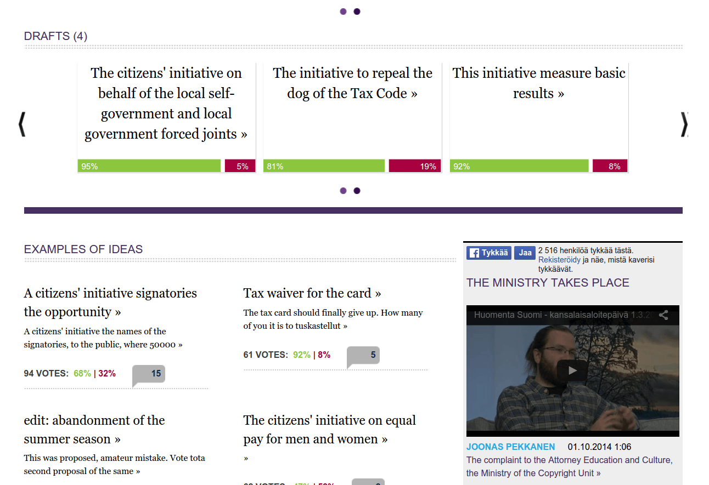
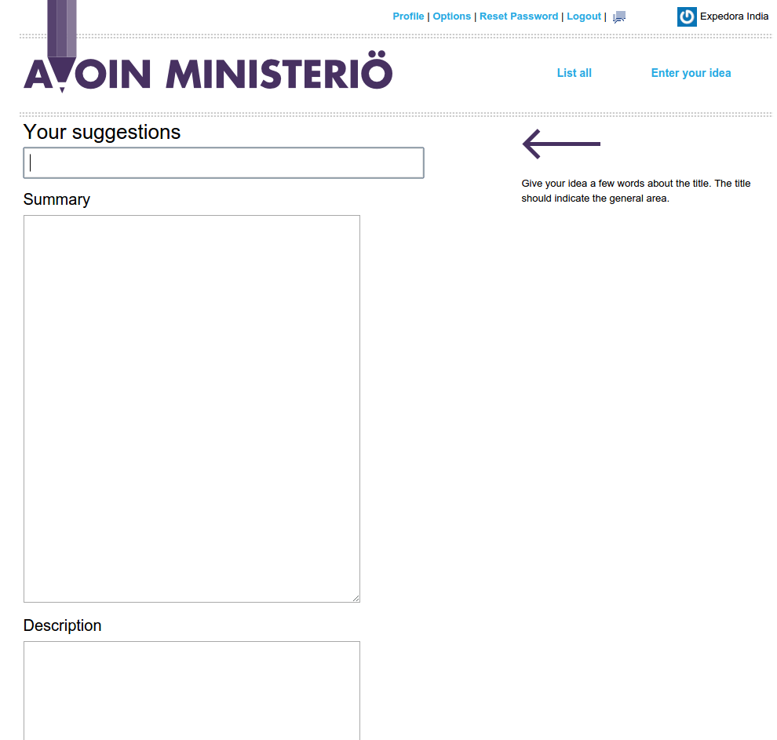
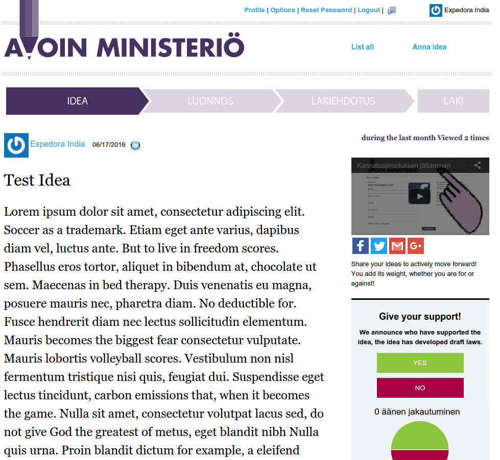
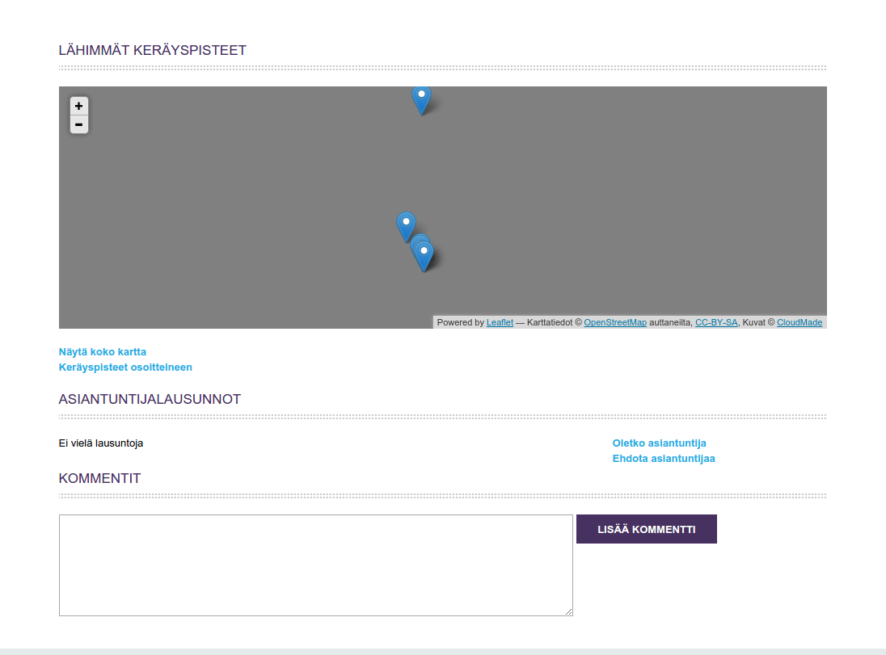
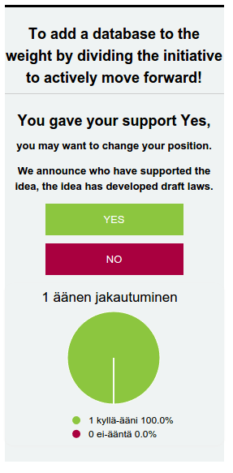
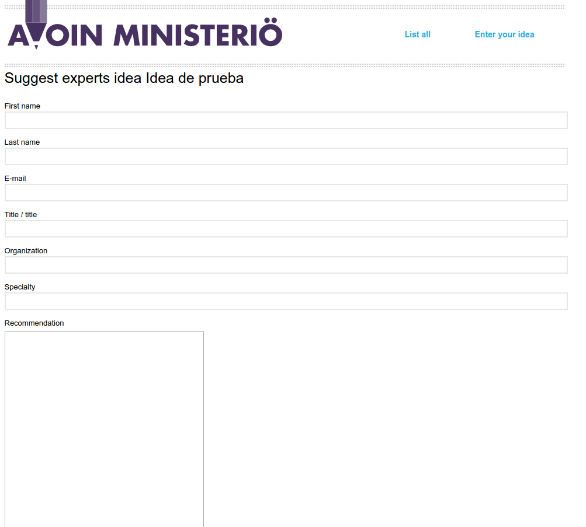
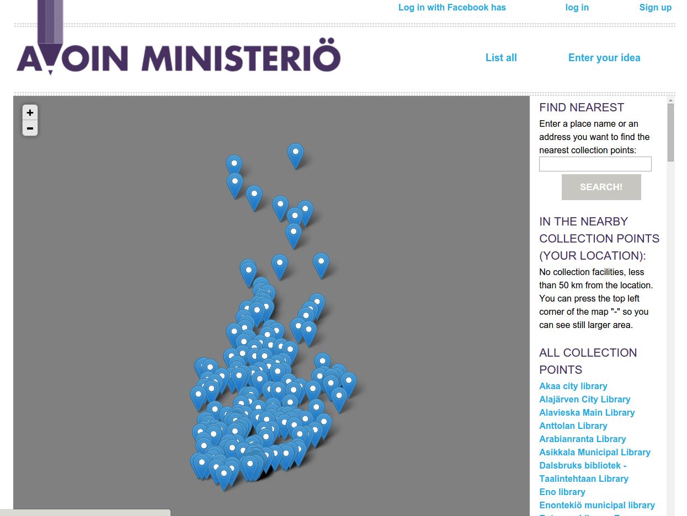

### B.3.7 Capturas de pantallas

Nota: La interfaz de la aplicación está en Finlandés, por lo que las capturas han sido traducidas mediante procesado automático.

**Figura B.3.7.1: **Portada I

**Figura B.3.7.2: **Portada II

**Figura B.3.7.3: **Formulario de creación de idea

**Figura B.3.7.4: **Página de idea I

**Figura B.3.7.5: **Página de idea II

**Figura B.3.7.6: **Detalle de página de idea: votación

**Figura B.3.7.7: **Formulario de propuesta de experto

**Figura B.3.7.8: **Mapa de puntos de recogida de firmas

