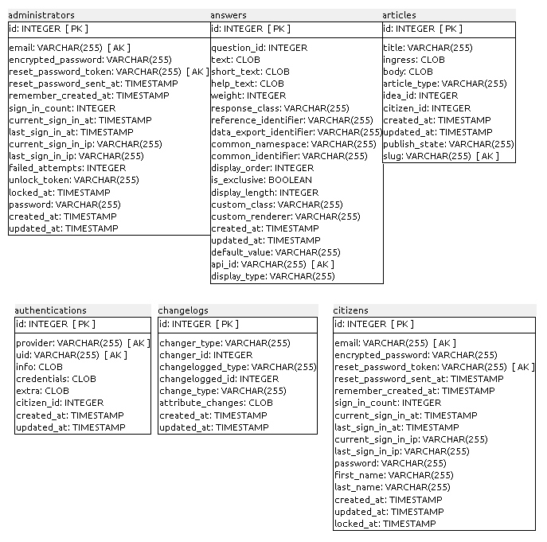
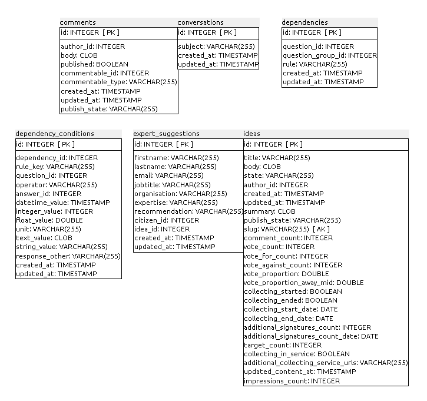
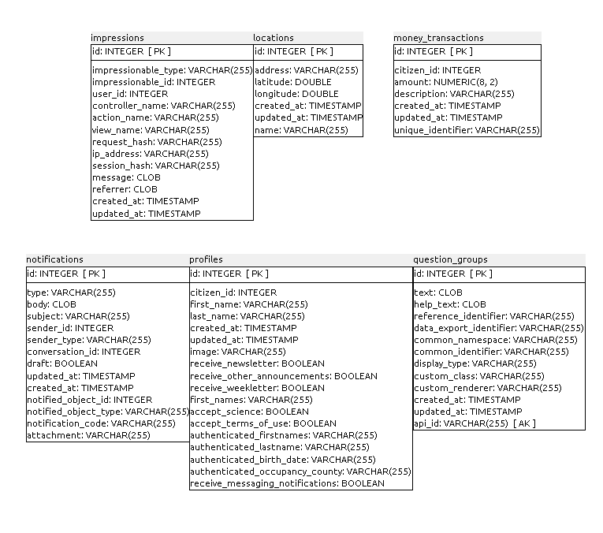
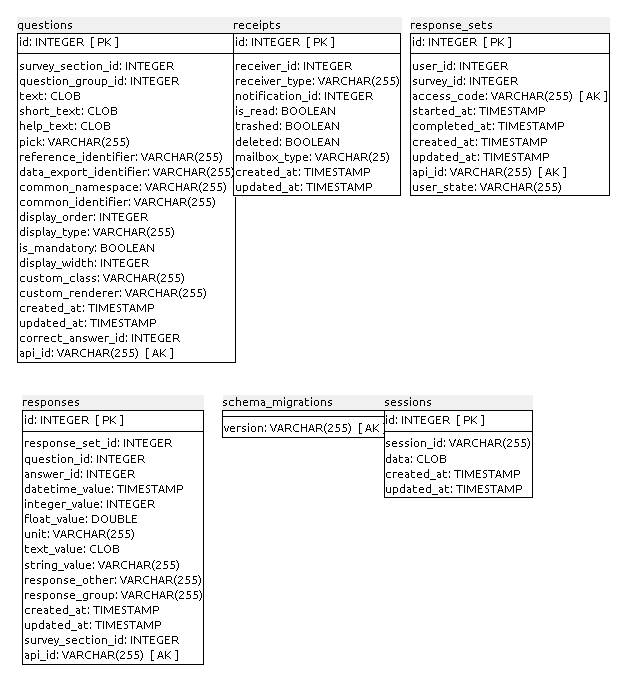
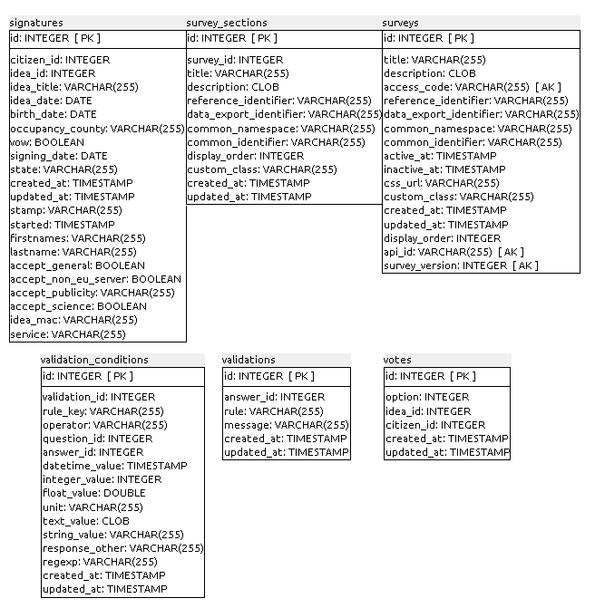

### B.3.5 Modelo de datos

#### B.3.5.1 Modelos relevantes

Los modelos más importantes son Ideas, Signatures, Questions, Responses y Answers.

#### B.3.5.2 Tablas

Cuenta con 30 tablas:

* administrators

* answers

* articles

* authentications

* changelogs

* citizens

* comments

* conversations

* dependencies

* dependency_conditions

* expert_suggestions

* ideas

* impressions

* locations

* money_transactions

* notifications

* profiles

* question_groups

* questions

* receipts

* response_sets

* responses

* schema_migrations

* sessions

* signatures

* survey_sections

* surveys

* validation_conditions

* validations

* votes

#### B.3.5.2 Gráficos UML

**Figura B.3.5.1:** Tablas de la base de datos de Open Ministry

**Figura B.3.5.2:** Tablas de la base de datos de Open Ministry

**Figura B.3.5.3:** Tablas de la base de datos de Open Ministry

**Figura B.3.5.4:** Tablas de la base de datos de Open Ministry

**Figura B.3.5.5:** Tablas de la base de datos de Open Ministry

