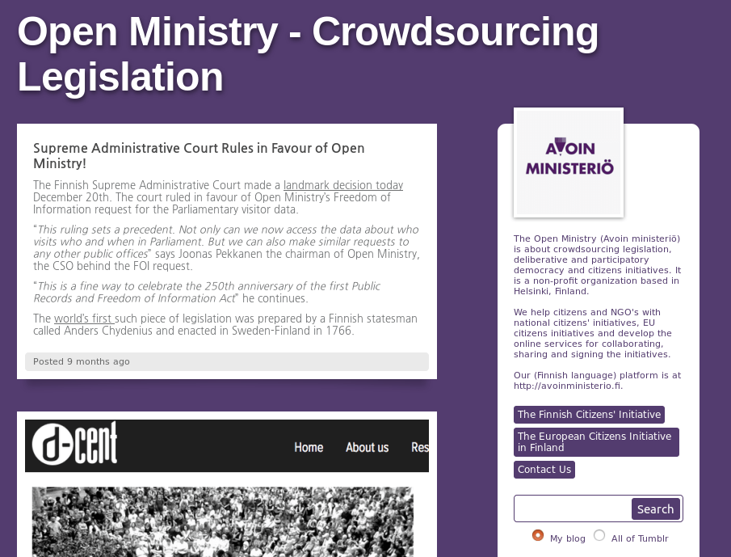

B.3 Open Ministry

**Figura B.3.0: **Portada de [http://openministry.info/](http://openministry.info/)

*Una colaboración inusual entre el Parlamento finlandés y un grupo de emprendedores de tecnología permite llevar propuestas de los ciudadanos directamente a una votación parlamentaria. La iniciativa comienza del 1 de octubre gracias a la Ley de Iniciativa Ciudadana (...). La ley establece que toda propuesta legislativa que reúna 50.000 firmas de los 5,3 millones de habitantes en un periodo de seis meses irá al Parlamento para su votación. En respuesta a la ley, un grupo de emprendedores de tecnología ha creado Open Ministry, una plataforma de código abierto para que los ciudadanos puedan discutir propuestas y recoger las firmas necesarias en línea. (...) **El Parlamento será capaz de hacer algunas modificaciones en las leyes, Joonas Pekkanen, co-fundador de Open Ministry, dijo en una entrevista con Deutsche Welle. "Para aclarar, hay dos tipos de propuestas", es citado diciendo. **"Hay un tipo (de propuesta) que está pidiendo al gobierno a tomar acciones hacia un objetivo, para cambiar la legislación vigente de alguna manera. Por otro lado hay una nueva propuesta de ley que se formula de manera colaborativa. En ese caso, es más difícil para el parlamento para cambiarlo porque ya está redactado en lenguaje jurídico".* (NOTE: Traducido de http://techpresident.com/news/22927/finland-open-ministry-brings-legislation-crowd
Texto original: An unusual collaboration between the Finnish Parliament and a group of tech entrepreneurs is getting citizens' proposals straight to a parliamentary vote. The initiative begins Oct. 1 thanks to the Citizens' Initiative Act (...). The Act states that every legislative proposal gathering 50,000 signatures from the country of B.3.3 million within six months will go to Parliament for a vote. In response to the law, a handful of tech entrepreneurs created Open Ministry, an open-source platform for citizens to discuss proposals and collect the necessary signatures online. (...) Parliament will be able to make some change to the bills, Joonas Pekkanen, Open Ministry's co-founder, said in an interview with Deutsche Welle."To clarify, there are two types of proposals," he is quoted as saying. "There's one type that is asking for the government to take actions towards a goal, to change existing legislation somehow. Then there's a new legal bill that is formulated in a crowdsourced manner. In that case, it's harder for the parliament to change it because it's drafted into legal language already." )

Nota: Se ha estudiado la aplicación que se encontraba liberada al momento de escribir este informe (2017). A lo largo de estos meses han cambiado de versión sin que la nueva versión haya sido liberada de momento.

