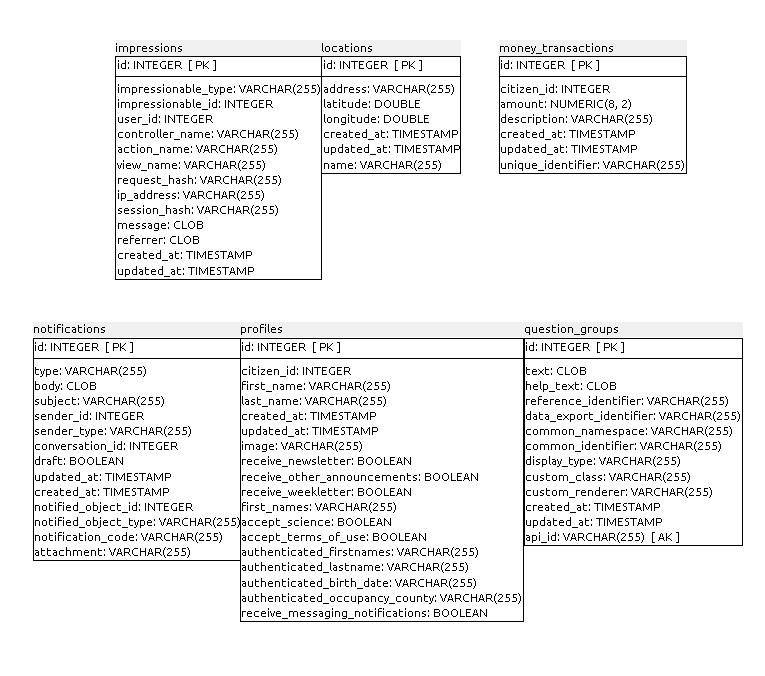

## Anexo B.3 Open Ministry

**Figura B.3.0: **Portada de [http://openministry.info/](http://openministry.info/) 

*Una colaboración inusual entre el Parlamento finlandés y un grupo de emprendedores de tecnología permite llevar propuestas de los ciudadanos directamente a una votación parlamentaria. La iniciativa comienza del 1 de octubre gracias a la Ley de Iniciativa Ciudadana (...). La ley establece que toda propuesta legislativa que reúna 50.000 firmas de los 5,3 millones de habitantes en un periodo de seis meses irá al Parlamento para su votación. En respuesta a la ley, un grupo de emprendedores de tecnología ha creado Open Ministry, una plataforma de código abierto para que los ciudadanos puedan discutir propuestas y recoger las firmas necesarias en línea. (...) **El Parlamento será capaz de hacer algunas modificaciones en las leyes, Joonas Pekkanen, co-fundador de Open Ministry, dijo en una entrevista con Deutsche Welle. "Para aclarar, hay dos tipos de propuestas", es citado diciendo. **"Hay un tipo (de propuesta) que está pidiendo al gobierno a tomar acciones hacia un objetivo, para cambiar la legislación vigente de alguna manera. Por otro lado hay una nueva propuesta de ley que se formula de manera colaborativa. En ese caso, es más difícil para el parlamento para cambiarlo porque ya está redactado en lenguaje jurídico".* (NOTE:  Traducido de http://techpresident.com/news/22927/finland-open-ministry-brings-legislation-crowd 
Texto original: An unusual collaboration between the Finnish Parliament and a group of tech entrepreneurs is getting citizens' proposals straight to a parliamentary vote. The initiative begins Oct. 1 thanks to the Citizens' Initiative Act (...). The Act states that every legislative proposal gathering 50,000 signatures from the country of B.3.3 million within six months will go to Parliament for a vote. In response to the law, a handful of tech entrepreneurs created Open Ministry, an open-source platform for citizens to discuss proposals and collect the necessary signatures online.  (...) Parliament will be able to make some change to the bills, Joonas Pekkanen, Open Ministry's co-founder, said in an interview with Deutsche Welle."To clarify, there are two types of proposals," he is quoted as saying. "There's one type that is asking for the government to take actions towards a goal, to change existing legislation somehow. Then there's a new legal bill that is formulated in a crowdsourced manner. In that case, it's harder for the parliament to change it because it's drafted into legal language already." )

Nota: Se ha estudiado la aplicación que se encontraba liberada al momento de escribir este informe (2017). A lo largo de estos meses han cambiado de versión sin que la nueva versión haya sido liberada de momento. 

### B.3.1 Metadatos

<table>
  <tr>
    <td>Nombre</td>
    <td>Open Ministry</td>
  </tr>
  <tr>
    <td>URL</td>
    <td>http://openministry.info/</td>
  </tr>
  <tr>
    <td>URL repositorio</td>
    <td>https://github.com/avoinministerio/avoinministerio </td>
  </tr>
  <tr>
    <td>Resumen (Inglés)</td>
    <td>Crowdsourcing legislation, deliberative and participatory democracy and citizens initiatives</td>
  </tr>
  <tr>
    <td>Resumen (Castellano)</td>
    <td>Legislación en colaboración abierta y distribuida, democracia participativa e iniciativas ciudadanas</td>
  </tr>
  <tr>
    <td>Lenguaje</td>
    <td>Ruby</td>
  </tr>
  <tr>
    <td>Framework</td>
    <td>Ruby on Rails</td>
  </tr>
  <tr>
    <td>Fecha primer commit</td>
    <td>Enero de 2012</td>
  </tr>
  <tr>
    <td>Versión analizada </td>
    <td>No aplica</td>
  </tr>
  <tr>
    <td>Nº de versiones</td>
    <td>2</td>
  </tr>
  <tr>
    <td>Nº de tablas de BBDD</td>
    <td>30</td>
  </tr>
  <tr>
    <td>Nº de contribuidores</td>
    <td>18</td>
  </tr>
  <tr>
    <td>Nº de stars</td>
    <td>98</td>
  </tr>
  <tr>
    <td>Licencia</td>
    <td>Ad-hoc</td>
  </tr>
  <tr>
    <td>Mantenido</td>
    <td>No</td>
  </tr>
  <tr>
    <td>Diseño responsivo</td>
    <td>No</td>
  </tr>
</table>

### B.3.2 Funcionalidades 

* Permite que los usuarios hagan propuestas o aporten ideas para Leyes o Acciones.

* Permite debatir a través de comentarios sobre una propuesta.

* Permite al usuario decir si está a favor o en contra de la propuesta.  

* Una propuesta cuenta con varias fases: Idea, Borrador, Proyecto de Ley, Ley.

* Una Idea pasa a ser Borrador si consigue ser debatida y consensuada entre varios ciudadanos. Un Borrador pasa a ser Proyecto de Ley si consigue 50.000 apoyos por parte de ciudadanos verificados a través de un sistema conectado con la identidad bancaria. Por último, un Proyecto de Ley pasa a ser Ley si es aprobada por el Parlamento.

* Tiene la posibilidad de sugerir a expertos que publiquen su análisis sobre la propuesta.

* Existen puntos físicos de recogida de apoyos.

### B.3.3 Análisis

La aplicación se basa en una ley nacional finlandesa, la la ley de Iniciativas Ciudadanas ([Finnish Citizens Initiative Act](http://t.umblr.com/redirect?z=http%3A%2F%2Ftranslate.google.com%2Ftranslate%3Fsl%3Dfi%26tl%3Den%26js%3Dn%26prev%3D_t%26hl%3Den%26ie%3DUTF-8%26layout%3D2%26eotf%3D1%26u%3Dhttp%253A%252F%252Fwww.finlex.fi%252Ffi%252Flaki%252Falkup%252F2012%252F20120012&t=YmFjMzRjZjRjYTI5MjdlOTkxNzU5NDZkYzVmZTg4MTE3YTZkNmQ2OSxUbU4zdWpESg%3D%3D)). (NOTE:  http://openministry.info/finnish-citizens-initiative )

Al ser un proceso tan específico para Finlandia no se ha utilizado en otros sitios ni contextos. Por otra parte el código ya no está mantenido ni se corresponde con la versión actualmente instalada, tampoco facilita su integración ni adaptación a otros usos, y algunos comentarios y contenidos se encuentran en finés (NOTE:  https://github.com/avoinministerio/avoinministerio/blob/master/db/seeds.rb#L59 ). 

Forma parte del proyecto europeo d-cent, que ha desarrollado la "nueva generación de herramientas de código abierto, distribuidas y conscientes con la privacidad para la democracia directa y empoderamiento económico"  (NOTE:  “A Europe-wide project developing the next generation of open source, distributed, and privacy-aware tools for direct democracy and economic empowerment.” - http://dcentproject.eu/ ). 

### B.3.4 Arquitectura

Se trata de una aplicación monolítica de Ruby on Rails estándar. 

 

En su documentación recomiendan realizar la instalación a través del proveedor de cloud computing Heroku. 

A nivel de servidores recomiendan la siguiente configuración: 

* Servidor web y de aplicaciones: heroku

* Servidor de base de datos: PostgreSQL 

* Servidor SMTP

## 

**Figura B.3.4.1: **Esquema a nivel de servidores de Open Ministry 

### B.3.5 Modelo de datos

#### B.3.5.1 Modelos relevantes

Los modelos más importantes son Ideas, Signatures, Questions, Responses y Answers. 

#### B.3.5.2 Tablas

Cuenta con 30 tablas:

* administrators   	 

* answers          	 

* articles         	 

* authentications  	 

* changelogs       	 

* citizens         	 

* comments         	 

* conversations    	 

* dependencies     	 

* dependency_conditions

* expert_suggestions    

* ideas            	 

* impressions      	 

* locations        	 

* money_transactions    

* notifications    	 

* profiles         	 

* question_groups  	 

* questions        	 

* receipts         	 

* response_sets    	 

* responses        	 

* schema_migrations	 

* sessions         	 

* signatures       	 

* survey_sections  	 

* surveys          	 

* validation_conditions

* validations      	 

* votes         

#### B.3.5.2 Gráficos UML

## 

**Figura B.3.5.1: **Tablas de la base de datos de Open Ministry 

**Figura B.3.5.2: **Tablas de la base de datos de Open Ministry 

**Figura B.3.5.3: **Tablas de la base de datos de Open Ministry 

**Figura B.3.5.4: **Tablas de la base de datos  de Open Ministry 

**Figura B.3.5.5: **Tablas de la base de datos de Open Ministry 

### XX B.3.6 Conclusiones

### B.3.7 Capturas de pantallas 

Nota:  La interfaz de la aplicación está en Finlandés, por lo que las capturas han sido traducidas mediante procesado automático. 

**Figura B.3.7.1: **Portada I

**Figura B.3.7.2: **Portada II

**Figura B.3.7.3: **Formulario de creación de idea

**Figura B.3.7.4: **Página de idea I

**Figura B.3.7.5: **Página de idea II

**Figura B.3.7.6: **Detalle de página de idea: votación

**Figura B.3.7.7: **Formulario de propuesta de experto

**Figura B.3.7.8: **Mapa de puntos de recogida de firmas 

