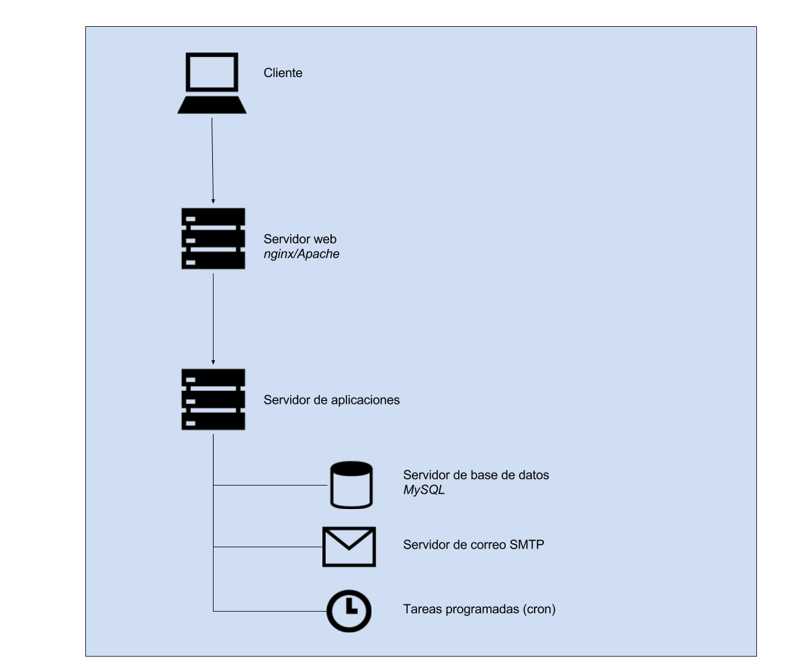

### C.1.4 Arquitectura

Cuenta con una API REST que facilita el acceso desde distintos tipos de dispositivos (por ejemplo móviles como iOS y Android).[^1] 

Cuenta con la posibilidad de recibir y enviar reportes desde distintos tipos de canales: SMS, Twitter, Email y Web. 

**Figura C.1.4.1:** Arquitectura a alto nivel de Ushahidi 

**Figura C.1.4.2:** Arquitectura de servidores de Ushahidi 

[^1]: https://wiki.ushahidi.com/display/WIKI/Ushahidi+3.x+REST+API

