### C.1.7 Capturas de pantallas
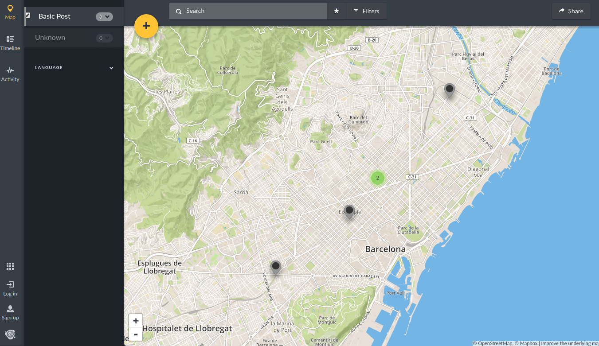

**Figura C.1.7.1:** Portada - Mapa de publicaciones

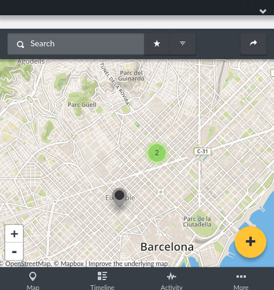

**Figura C.1.7.2:** Portada - Mapa de publicaciones (responsivo)

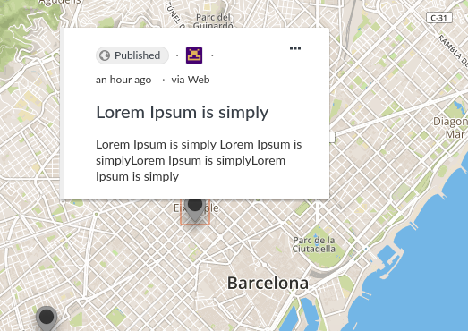

**Figura C.1.7.3:** Detalle de publicación

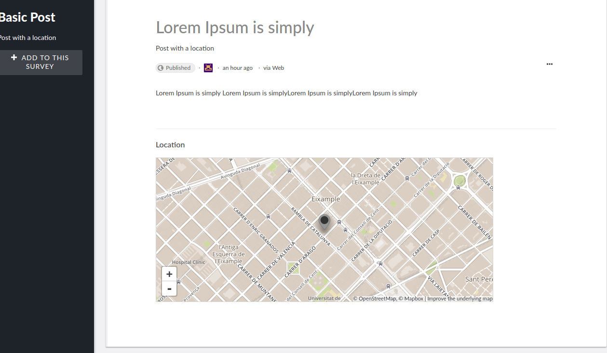

**Figura C.1.7.4:** Página de publicación

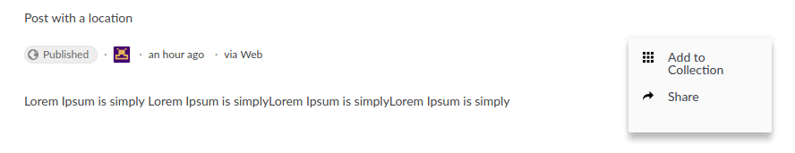

**Figura C.1.7.5:** Página de publicación (acciones)

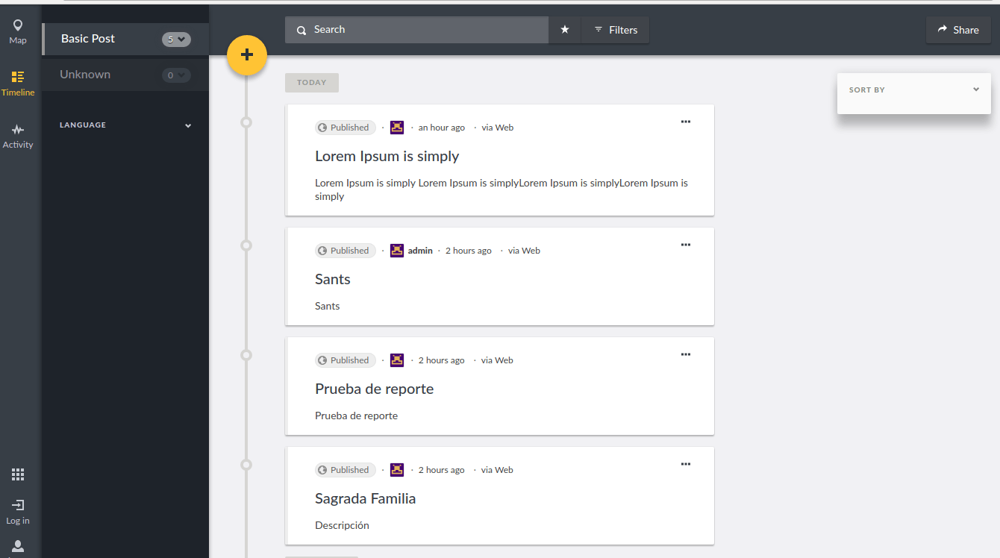

**Figura C.1.7.6:** Línea temporal de publicaciones

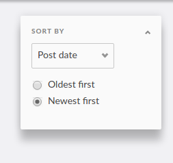

**Figura C.1.7.7:** Línea temporal de publicaciones - Detalle de filtros de ordenación

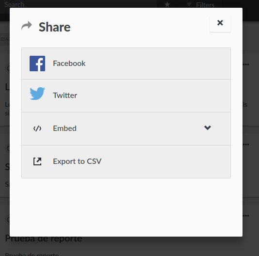

**Figura C.1.7.8:** Publicación - Compartir 

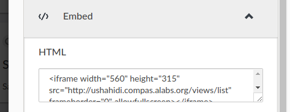

**Figura C.1.7.9:** Publicación - Integrar

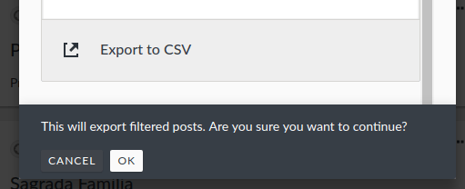

**Figura C.1.7.10:** Publicaciones - Exportar a CSV 

**Figura C.1.7.11:** Publicaciones - Búsqueda

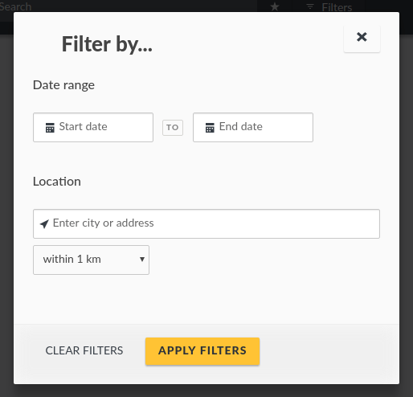

**Figura C.1.7.12:** Publicaciones - Búsqueda - Filtrado

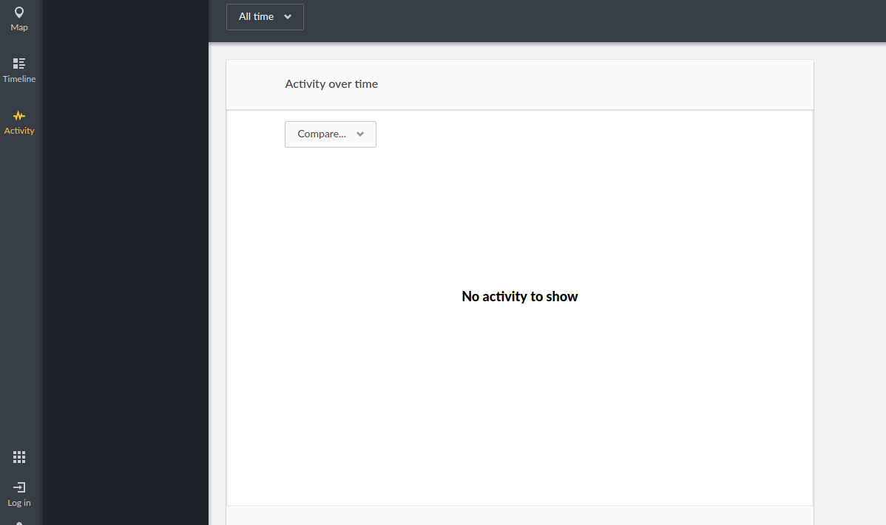

**Figura C.1.7.13:** Actividad

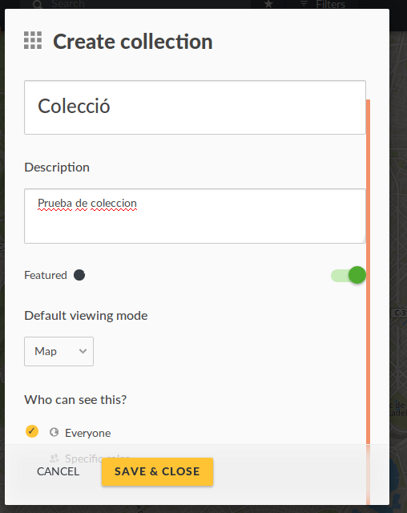

**Figura C.1.7.14:** Formulario de crear colección 

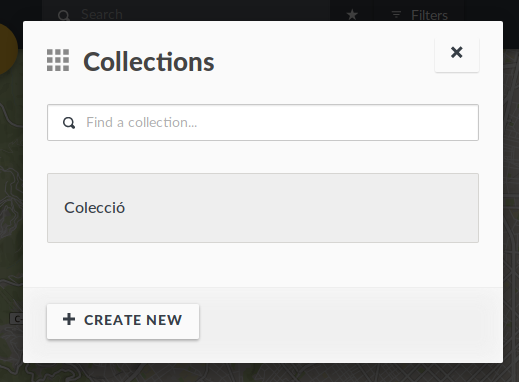

**Figura C.1.7.15:** Colecciones - Selección

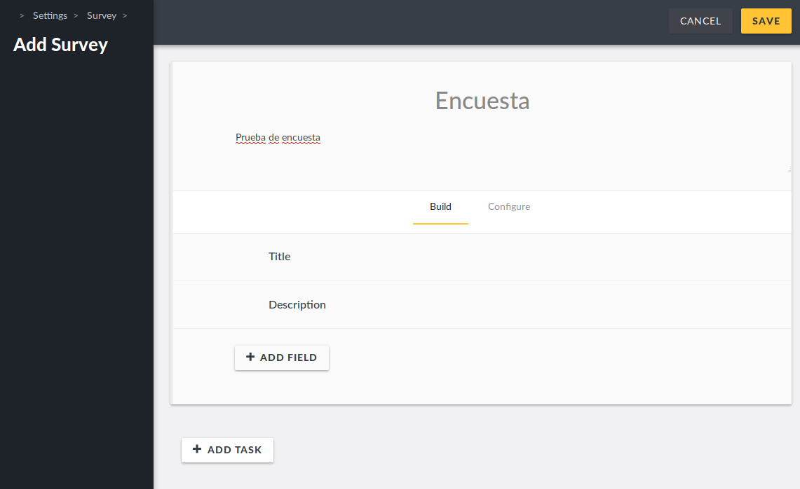

**Figura C.1.7.16:** Administrador - Formulario de creación de encuestas 

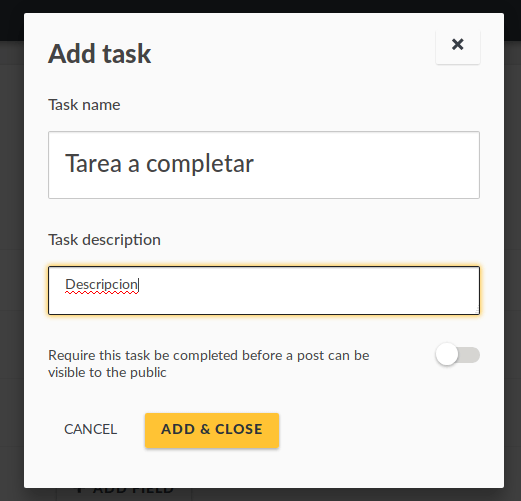

**Figura C.1.7.17:** Administrador - Agregar tareas a encuestas

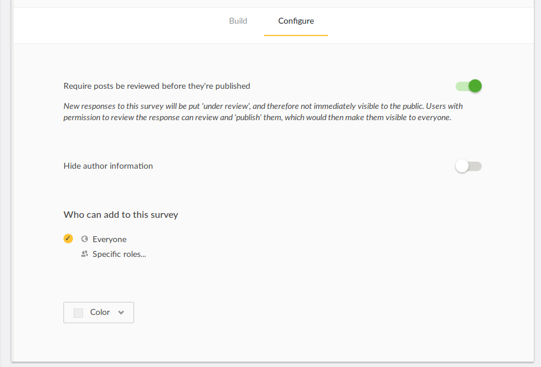

**Figura C.1.7.18:** Administrador: configuración de encuesta

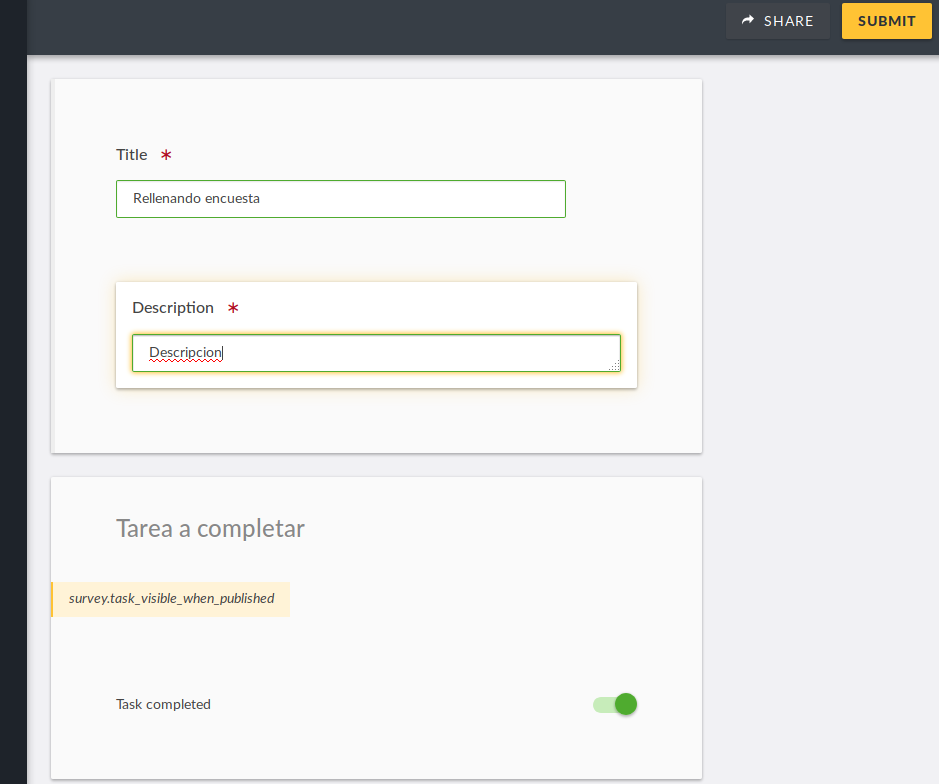

**Figura C.1.7.19:** Rellenando encuesta

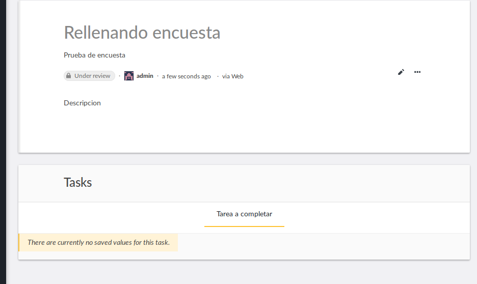

**Figura C.1.7.20:** Publicación de encuesta customizada

**Figura C.1.7.21:** Administrador: Configuraciones

   

**Figura C.1.7.22:** Formulario  de registro de usuarios

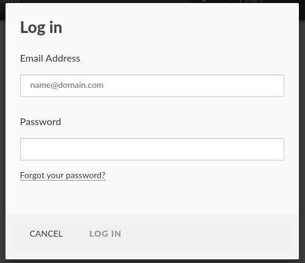

**Figura C.1.7.23:** Formulario de inicio de sesión de usuarios

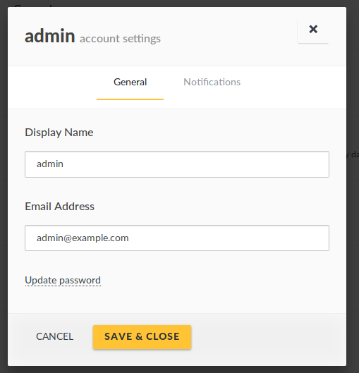

**Figura C.1.7.24:** Formulario de edición de usuarios

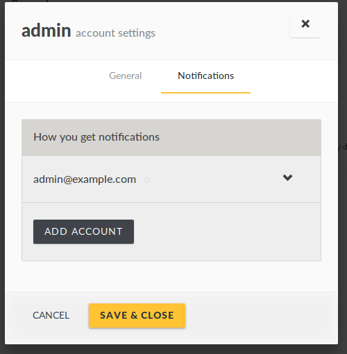

**Figura C.1.7.25:** Formulario de edición de usuarios (Notificaciones)

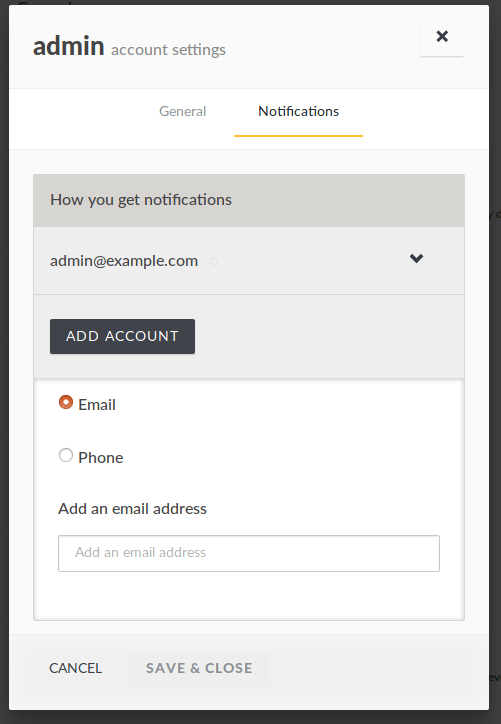

**Figura C.1.7.26:** Formulario de edición de usuarios (Notificaciones por correo electrónico y por móvil)

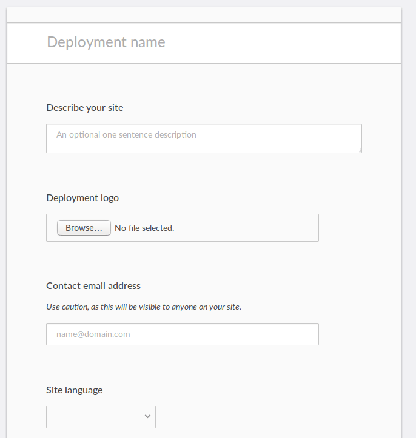

**Figura C.1.7.27:** Administrador: configuraciones generales I

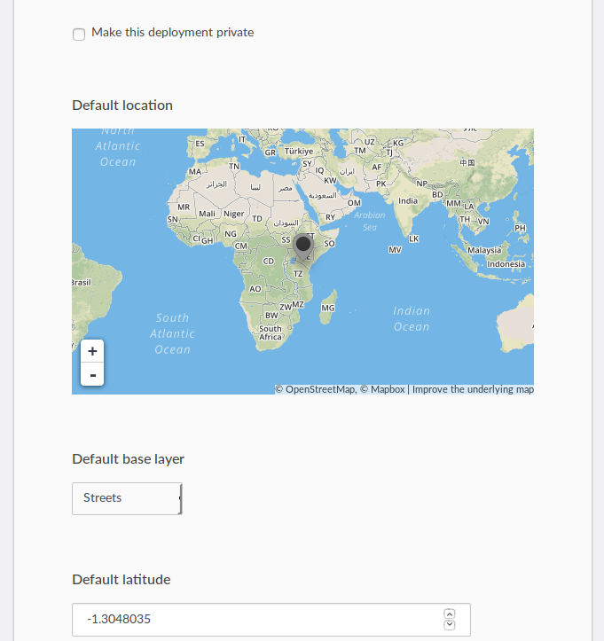

**Figura C.1.7.28:** Administrador: configuraciones generales II

