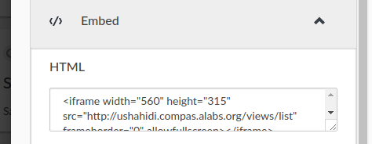
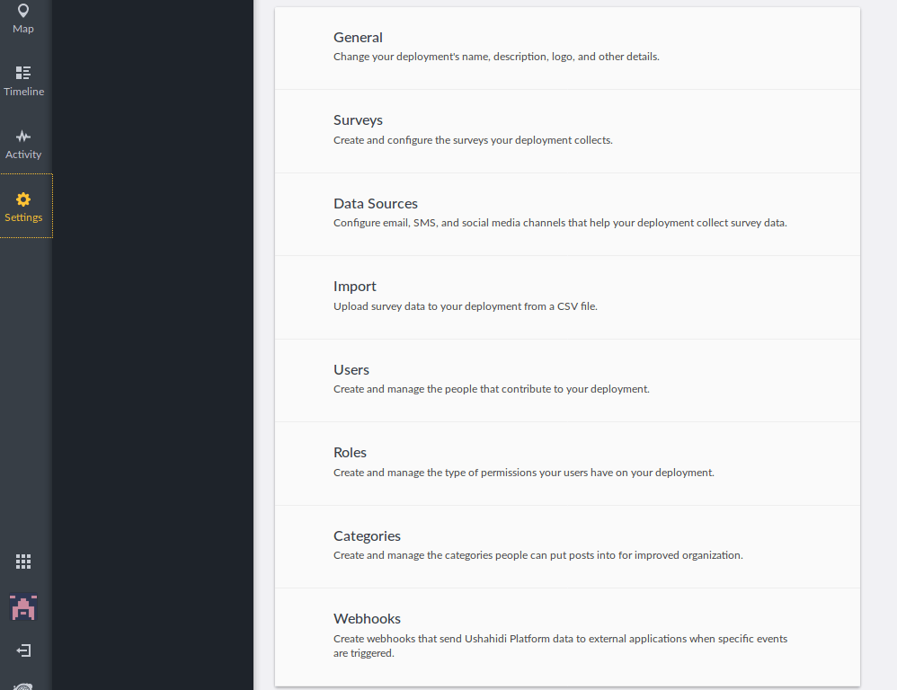

### C.1.7 Capturas de pantallas

**Figura C.1.7.1:** Portada - Mapa de publicaciones

**Figura C.1.7.2:** Portada - Mapa de publicaciones (responsivo)

**Figura C.1.7.3:** Detalle de publicación

**Figura C.1.7.4:** Página de publicación

**Figura C.1.7.5:** Página de publicación (acciones)

**Figura C.1.7.6:** Línea temporal de publicaciones

**Figura C.1.7.7:** Línea temporal de publicaciones - Detalle de filtros de ordenación

**Figura C.1.7.8:** Publicación - Compartir 

**Figura C.1.7.9:** Publicación - Integrar

**Figura C.1.7.10:** Publicaciones - Exportar a CSV 

**Figura C.1.7.11:** Publicaciones - Búsqueda

**Figura C.1.7.12:** Publicaciones - Búsqueda - Filtrado

**Figura C.1.7.13:** Actividad

**Figura C.1.7.14:** Formulario de crear colección 

**Figura C.1.7.15:** Colecciones - Selección

**Figura C.1.7.16:** Administrador - Formulario de creación de encuestas 

**Figura C.1.7.17:** Administrador - Agregar tareas a encuestas

**Figura C.1.7.18:** Administrador: configuración de encuesta

**Figura C.1.7.19:** Rellenando encuesta

**Figura C.1.7.20:** Publicación de encuesta customizada

**Figura C.1.7.21:** Administrador: Configuraciones

   

**Figura C.1.7.22:** Formulario  de registro de usuarios

**Figura C.1.7.23:** Formulario de inicio de sesión de usuarios

**Figura C.1.7.24:** Formulario de edición de usuarios

**Figura C.1.7.25:** Formulario de edición de usuarios (Notificaciones)

**Figura C.1.7.26:** Formulario de edición de usuarios (Notificaciones por correo electrónico y por móvil)

**Figura C.1.7.27:** Administrador: configuraciones generales I

**Figura C.1.7.28:** Administrador: configuraciones generales II

