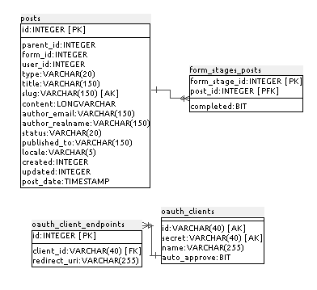
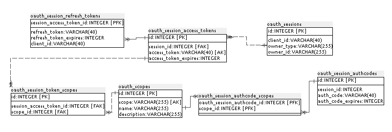
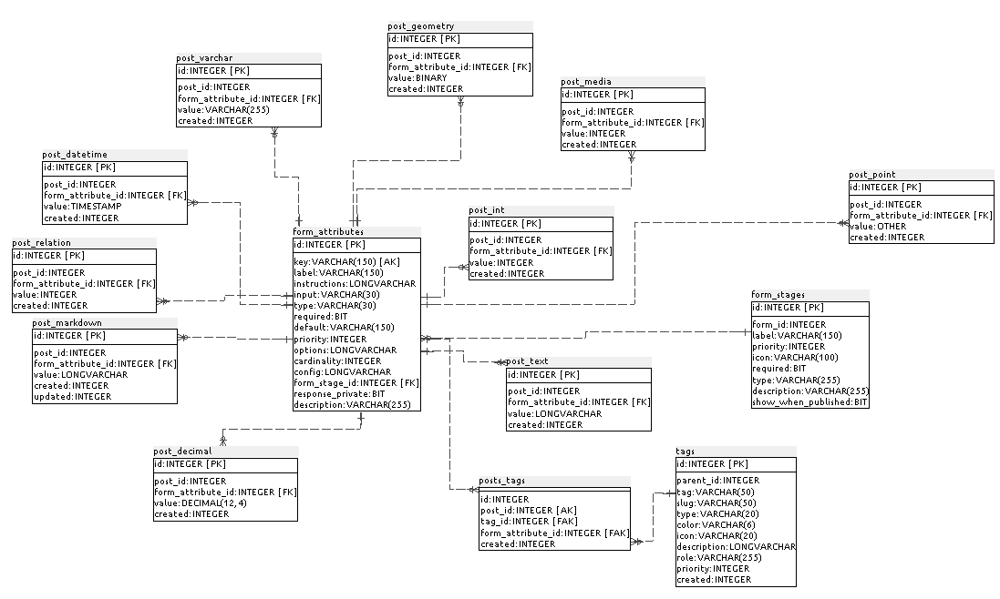
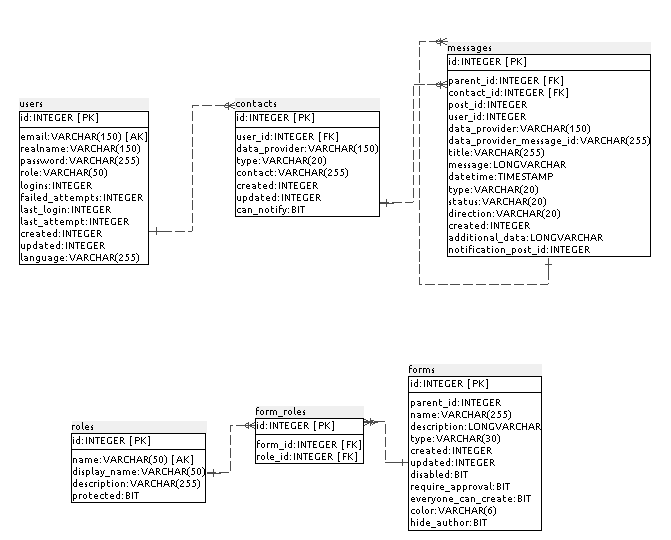

### C.1.5 Modelo de datos

#### C.1.5.1 Modelos relevantes

Los modelos relevantes son Posts, WebHooks, FormAttributes, Messages y las tablas con prefijo "oauth".

#### C.1.5.2 Tablas

Cuenta con 49 tablas:

* config                  	 

* contacts                	 

* csv                     	 

* form_attributes         	 

* form_roles              	 

* form_stages             	 

* form_stages_posts       	 

* forms                   	 

* layers                  	 

* media                   	 

* messages                	 

* notification_queue      	 

* notifications           	 

* oauth_client_endpoints  	 

* oauth_clients           	 

* oauth_scopes            	 

* oauth_session_access_tokens  

* oauth_session_authcode_scopes

* oauth_session_authcodes 	 

* oauth_session_redirects 	 

* oauth_session_refresh_tokens

* oauth_session_token_scopes   

* oauth_sessions          	 

* permissions             	 

* phinxlog                	 

* post_comments           	 

* post_datetime           	 

* post_decimal            	 

* post_geometry           	 

* post_int                	 

* post_markdown           	 

* post_media              	 

* post_point              	 

* post_relation           	 

* post_text               	 

* post_varchar            	 

* posts                   	 

* posts_media             	 

* posts_sets              	 

* posts_tags              	 

* roles                   	 

* roles_permissions       	 

* sets                    	 

* tags                    	 

* tos                     	 

* user_reset_tokens       	 

* users                   	 

* webhook_job             	 

* webhooks                	 

#### C.1.5.3 Gráficos UML

#### 

**Figura C.1.5.1:** Tablas de la base de datos de Ushahidi

#### 

**Figura C.1.5.2:** Tablas de la base de datos de Ushahidi

#### 

**Figura C.1.5.3:** Tablas de la base de datos de Ushahidi

#### 

**Figura C.1.5.4:** Tablas de la base de datos de Ushahidi

#### 

**Figura C.1.5.5:** Tablas de la base de datos de Ushahidi

#### 

**Figura C.1.5.6:** Tablas de la base de datos de Ushahidi

#### 

**Figura C.1.5.7:** Tablas de la base de datos de Ushahidi

