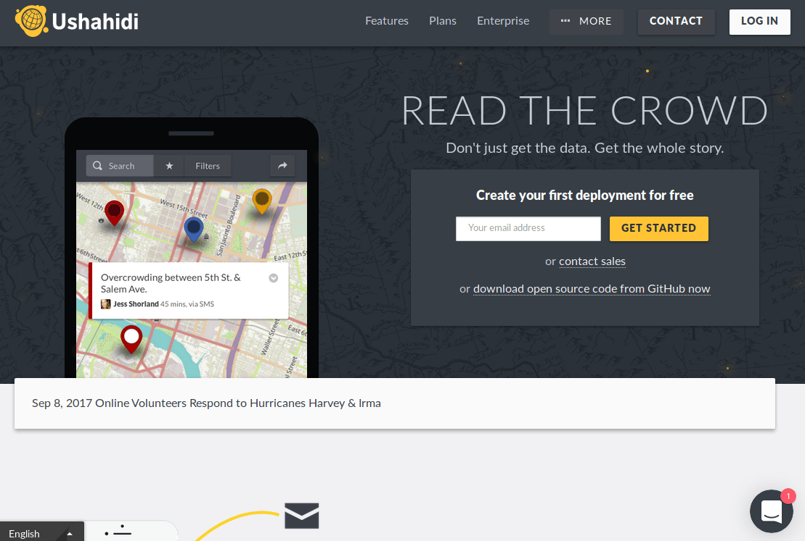

## Anexo C.1 Ushahidi

**Figura C.1.0:** Portada de [https://www.ushahidi.com/](https://www.ushahidi.com/) 

*Ushahidi, que se traduce como "testimonio" en swahili, fue desarrollado para mapear informes de violencia en Kenia después de la violencia post-electoral en 2008. Desde entonces, miles de personas han utilizado nuestras herramientas de crowdsourcing para elevar su voz. Somos un líder tecnológico en África, con sede en Nairobi, con un equipo global. Somos una empresa social que proporciona software y servicios a numerosos sectores y la sociedad civil para ayudar a mejorar el flujo ascendente de información.*[^1]

[^1]: https://www.ushahidi.com/about 
Texto original: Ushahidi, which translates to "testimony" in Swahili, was developed to map reports of violence in Kenya after the post-election violence in 2008. Since then, thousands have used our crowdsourcing tools to raise their voice. We’re a technology leader in Africa, headquartered in Nairobi, with a global team. We are a social enterprise that provides software and services to numerous sectors and civil society to help improve the bottom up flow of information.

