## Anexo C.1 Ushahidi

**Figura C.1.0:** Portada de [https://www.ushahidi.com/](https://www.ushahidi.com/) 

*Ushahidi, que se traduce como "testimonio" en swahili, fue desarrollado para mapear informes de violencia en Kenia después de la violencia post-electoral en 2008. Desde entonces, miles de personas han utilizado nuestras herramientas de crowdsourcing para elevar su voz. Somos un líder tecnológico en África, con sede en Nairobi, con un equipo global. Somos una empresa social que proporciona software y servicios a numerosos sectores y la sociedad civil para ayudar a mejorar el flujo ascendente de información.* (NOTE:  https://www.ushahidi.com/about 
Texto original: Ushahidi, which translates to "testimony" in Swahili, was developed to map reports of violence in Kenya after the post-election violence in 2008. Since then, thousands have used our crowdsourcing tools to raise their voice. We’re a technology leader in Africa, headquartered in Nairobi, with a global team. We are a social enterprise that provides software and services to numerous sectors and civil society to help improve the bottom up flow of information.
)

### C.1.1 Metadatos

<table>
  <tr>
    <td>Nombre</td>
    <td>Ushahidi</td>
  </tr>
  <tr>
    <td>URL</td>
    <td>https://www.ushahidi.com/ </td>
  </tr>
  <tr>
    <td>URL repositorio</td>
    <td>https://github.com/ushahidi/ </td>
  </tr>
  <tr>
    <td>Resumen (Inglés)</td>
    <td>Read the crowd. Don't just get the data. Get the whole story.</td>
  </tr>
  <tr>
    <td>Resumen (Castellano)</td>
    <td>Lea la multitud. No obtenga sólo los datos. Obtenga toda la historia.</td>
  </tr>
  <tr>
    <td>Lenguaje</td>
    <td>PHP</td>
  </tr>
  <tr>
    <td>Framework</td>
    <td>Laravel</td>
  </tr>
  <tr>
    <td>Fecha primer commit</td>
    <td>Octubre de 2012</td>
  </tr>
  <tr>
    <td>Versión analizada</td>
    <td>3.6.3</td>
  </tr>
  <tr>
    <td>Nº de versiones</td>
    <td>72</td>
  </tr>
  <tr>
    <td>Nº de tablas de la BBDD</td>
    <td>49</td>
  </tr>
  <tr>
    <td>Nº de contribuidores</td>
    <td>26</td>
  </tr>
  <tr>
    <td>Nº de stars</td>
    <td>403</td>
  </tr>
  <tr>
    <td>Licencia</td>
    <td> GNU Affero GPL v3</td>
  </tr>
  <tr>
    <td>Mantenido</td>
    <td>Sí</td>
  </tr>
  <tr>
    <td>Diseño responsivo</td>
    <td>Sí</td>
  </tr>
</table>

 

### C.1.2 Funcionalidades 

* Permite recopilar publicaciones, eventos o reportes de distintas fuentes, como:

    * formulario a través de la web 

    * SMS

    * aplicaciones para iOS y Android

    *  Twitter

* Permite personalizar los formularios de recogida de datos, así como agregar tareas asociadas

* Permite realizar filtros y guardar búsquedas 

* Permite gestionar flujos de trabajo para el procesamiento de los reportes

* Permite realizar colecciones de publicaciones para agruparlas por similitud

* Permite tener distintos roles de usuario para gestionar permisos 

* Cuenta con soporte para distintos servicios de mapas, como Open Street Maps y MapQuest.

* Permite recibir SMS de múltiples proveedores, como Twillio, SMSSync, Nexmo y  FrontlineSMS

* Permite visualizar las publicaciones en distintas tablas, mapas, gráficos y líneas temporales

* Permite recibir alertas por correo electrónico o SMS sobre cambios y actualizaciones

### C.1.3 Análisis

Se ha utilizado para varias situaciones que requieren un mapeo colaborativo (crowdsourcing), principalmente en tres tipos de casos:

<table>
  <tr>
    <td>Tipo</td>
    <td>Descripción</td>
    <td>Región</td>
    <td>URL</td>
  </tr>
  <tr>
    <td>Monitorización electoral</td>
    <td>Elecciones 2012</td>
    <td>EEUU</td>
    <td>https://www.ushahidi.com/blog/2016/05/06/how-ushahidi-helped-thousands-of-peoples-votes-count-in-the-2012-usa-election </td>
  </tr>
  <tr>
    <td>Monitorización electoral</td>
    <td>Lente 2016</td>
    <td>Filipinas </td>
    <td>https://lente2016observations2.ushahidi.io </td>
  </tr>
  <tr>
    <td>Respuesta a crisis</td>
    <td>Terremoto</td>
    <td>Nepal </td>
    <td>https://www.ushahidi.com/case-studies/quakemap  </td>
  </tr>
  <tr>
    <td>Respuesta a crisis</td>
    <td>Inundaciones</td>
    <td>Chennai</td>
    <td>https://chennaifloodhelp.ushahidi.io </td>
  </tr>
  <tr>
    <td>Respuesta a crisis</td>
    <td>Sequías</td>
    <td>Somalia</td>
    <td>https://abaaraha.ushahidi.io/ </td>
  </tr>
  <tr>
    <td>Defensa de Derechos Humanos</td>
    <td>Apartheid </td>
    <td>Palestina</td>
    <td>https://siddadel.ushahidi.io/ </td>
  </tr>
  <tr>
    <td>Defensa de Derechos Humanos</td>
    <td>Violencia post-electoral</td>
    <td>EEUU</td>
    <td>https://documenthate.ushahidi.io/</td>
  </tr>
</table>

### C.1.4 Arquitectura

Cuenta con una API REST que facilita el acceso desde distintos tipos de dispositivos (por ejemplo móviles como iOS y Android).  (NOTE:  https://wiki.ushahidi.com/display/WIKI/Ushahidi+3.x+REST+API )

Cuenta con la posibilidad de recibir y enviar reportes desde distintos tipos de canales: SMS, Twitter, Email y Web. 

**Figura C.1.4.1:** Arquitectura a alto nivel de Ushahidi 

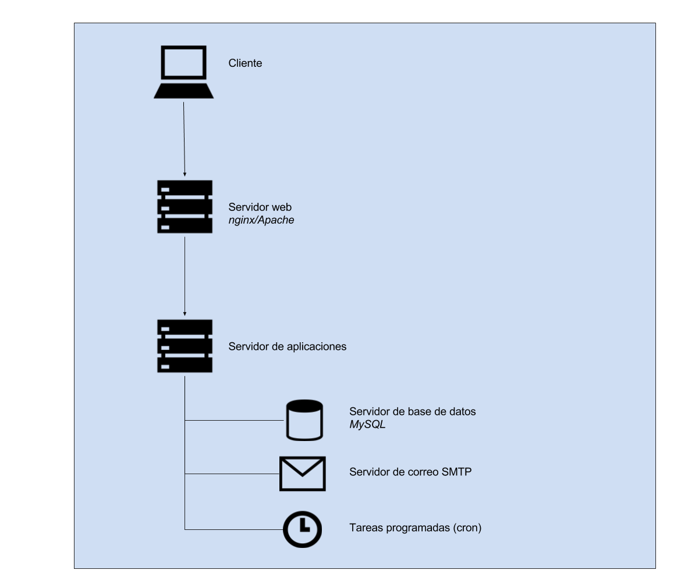

**Figura C.1.4.2:** Arquitectura de servidores de Ushahidi 

### C.1.5 Modelo de datos

#### C.1.5.1 Modelos relevantes

Los modelos relevantes son Posts, WebHooks, FormAttributes, Messages y las tablas con prefijo "oauth".

#### C.1.5.2 Tablas

Cuenta con 49 tablas:

* config                  	 

* contacts                	 

* csv                     	 

* form_attributes         	 

* form_roles              	 

* form_stages             	 

* form_stages_posts       	 

* forms                   	 

* layers                  	 

* media                   	 

* messages                	 

* notification_queue      	 

* notifications           	 

* oauth_client_endpoints  	 

* oauth_clients           	 

* oauth_scopes            	 

* oauth_session_access_tokens  

* oauth_session_authcode_scopes

* oauth_session_authcodes 	 

* oauth_session_redirects 	 

* oauth_session_refresh_tokens

* oauth_session_token_scopes   

* oauth_sessions          	 

* permissions             	 

* phinxlog                	 

* post_comments           	 

* post_datetime           	 

* post_decimal            	 

* post_geometry           	 

* post_int                	 

* post_markdown           	 

* post_media              	 

* post_point              	 

* post_relation           	 

* post_text               	 

* post_varchar            	 

* posts                   	 

* posts_media             	 

* posts_sets              	 

* posts_tags              	 

* roles                   	 

* roles_permissions       	 

* sets                    	 

* tags                    	 

* tos                     	 

* user_reset_tokens       	 

* users                   	 

* webhook_job             	 

* webhooks                	 

#### C.1.5.3 Gráficos UML

#### 

**Figura C.1.5.1:** Tablas de la base de datos de Ushahidi

#### 

**Figura C.1.5.2:** Tablas de la base de datos de Ushahidi

#### 

**Figura C.1.5.3:** Tablas de la base de datos de Ushahidi

#### 

**Figura C.1.5.4:** Tablas de la base de datos de Ushahidi

#### 

**Figura C.1.5.5:** Tablas de la base de datos de Ushahidi

#### 

**Figura C.1.5.6:** Tablas de la base de datos de Ushahidi

#### 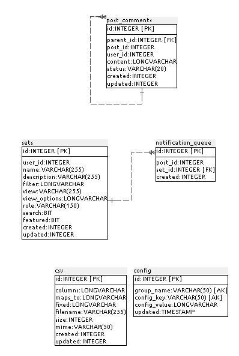

**Figura C.1.5.7:** Tablas de la base de datos de Ushahidi

### XX C.1.6 Conclusiones

### C.1.7 Capturas de pantallas

### 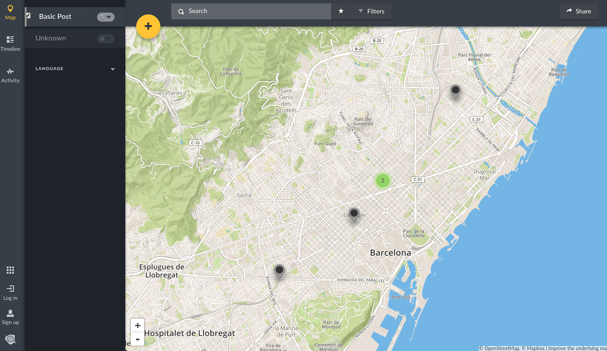

**Figura C.1.7.1:** Portada - Mapa de publicaciones

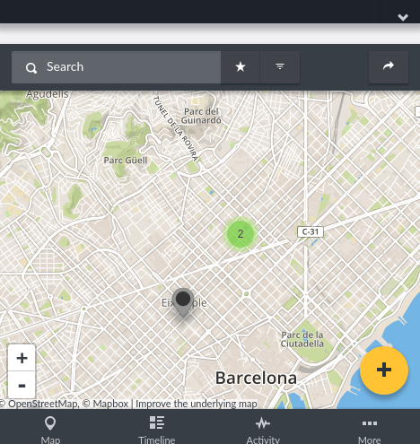

**Figura C.1.7.2:** Portada - Mapa de publicaciones (responsivo)

### 

**Figura C.1.7.3:** Detalle de publicación

### 

**Figura C.1.7.4:** Página de publicación

### 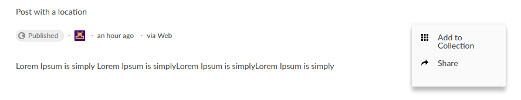

**Figura C.1.7.5:** Página de publicación (acciones)

### 

**Figura C.1.7.6:** Línea temporal de publicaciones

### 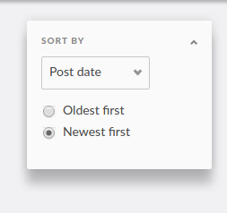

**Figura C.1.7.7:** Línea temporal de publicaciones - Detalle de filtros de ordenación

### 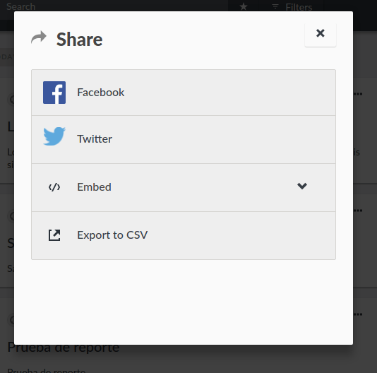

**Figura C.1.7.8:** Publicación - Compartir 

### 

**Figura C.1.7.9:** Publicación - Integrar

### 

**Figura C.1.7.10:** Publicaciones - Exportar a CSV 

### 

**Figura C.1.7.11:** Publicaciones - Búsqueda

### 

**Figura C.1.7.12:** Publicaciones - Búsqueda - Filtrado

### 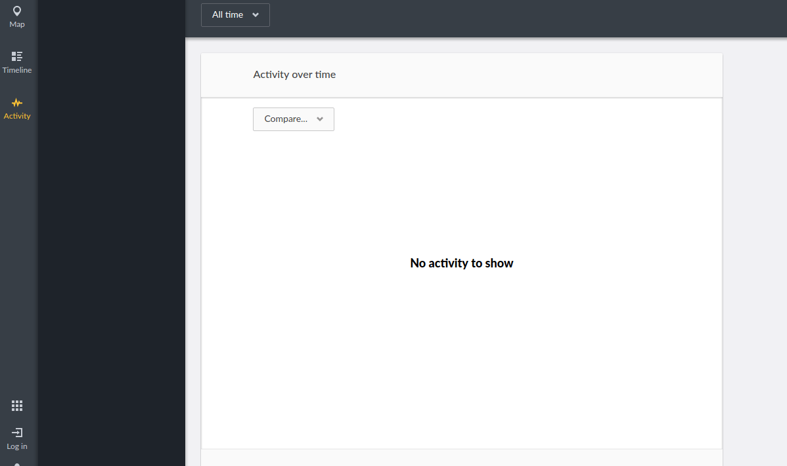

**Figura C.1.7.13:** Actividad

### 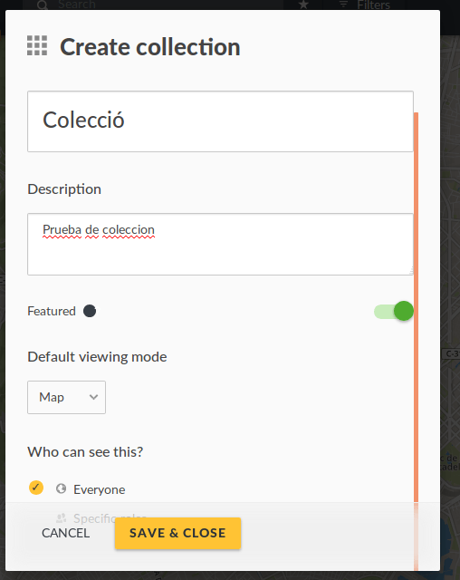

**Figura C.1.7.14:** Formulario de crear colección 

### 

**Figura C.1.7.15:** Colecciones - Selección

### 

**Figura C.1.7.16:** Administrador - Formulario de creación de encuestas 

### 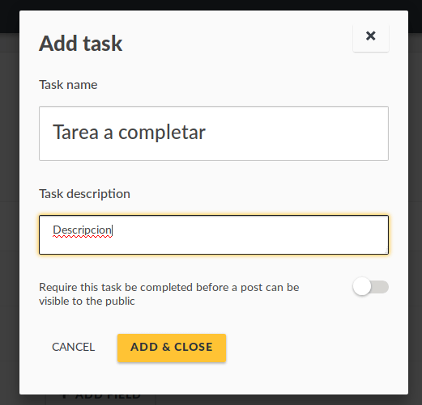

**Figura C.1.7.17:** Administrador - Agregar tareas a encuestas

### 

**Figura C.1.7.18:** Administrador: configuración de encuesta

### 

**Figura C.1.7.19:** Rellenando encuesta

### 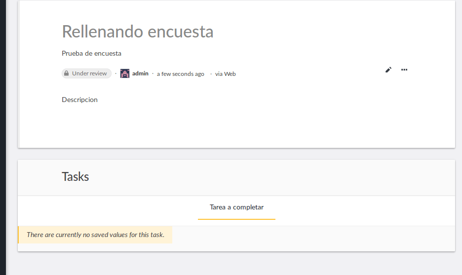

**Figura C.1.7.20:** Publicación de encuesta customizada

### 

**Figura C.1.7.21:** Administrador: Configuraciones

###    

### 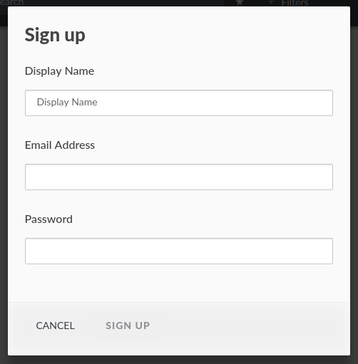

**Figura C.1.7.22:** Formulario  de registro de usuarios

### 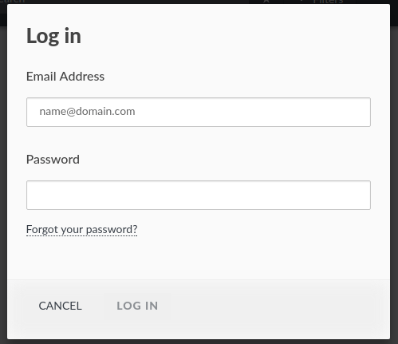

**Figura C.1.7.23:** Formulario de inicio de sesión de usuarios

### 

**Figura C.1.7.24:** Formulario de edición de usuarios

### 

**Figura C.1.7.25:** Formulario de edición de usuarios (Notificaciones)

### 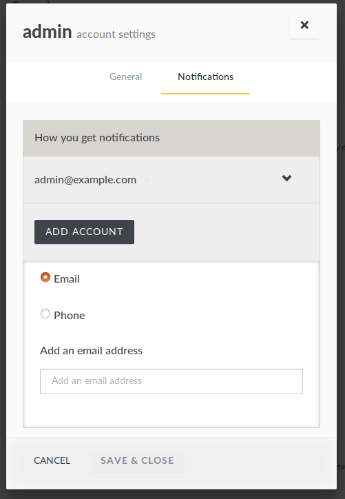

**Figura C.1.7.26:** Formulario de edición de usuarios (Notificaciones por correo electrónico y por móvil)

### 

**Figura C.1.7.27:** Administrador: configuraciones generales I

### 

**Figura C.1.7.28:** Administrador: configuraciones generales II

