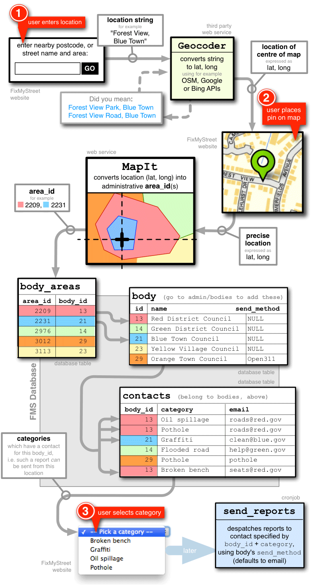

### C.2.3 Implantación

Para comprender el flujo general de funcionamiento de la aplicación se incluye en la siguiente página el esquema y distintos servicios que entran en juego al producirse un reporte. Los pasos son:

1. El usuario entra una localización, a través del código postal, nombre de calle o área. Se envía este texto y a través de un servicio externo de terceros se normaliza, convirtiéndolo a latitud y longitud (Geocodificación). Puede escogerse entre distintos servicios para realizar esta conversión: APIs de Open Streets Maps, Google Maps o Bing Maps.

2. El usuario pone un marcador en el mapa, precisando la latitud y longitud.

3. Por último el usuario selecciona la categoría a la que pertenece la incidencia y se produce un reporte que es enviado al organismo correspondiente.

4. Dicha correspondencia se realiza a través del servicio web externo MapIt, que convierte la latitud y longitud en un área administrativa, donde se encuentran los entes gubernamentales que a su vez tienen una serie de contactos separados en categorías. Los destinatarios finales pueden tener configurado un método de contacto, que por defecto es el correo electrónico, pero también puede conectarse a un servicio externo de registro de incidencias cívicas (Open311).

Viendo los ejemplos de la Figura, se puede observar que hay cinco áreas (2209, 2231, 2976, 3012, 3113) que corresponden con cinco entes (*"Red District Council", "Green District Council", "Blue Town Council", "Yellow Village Council"* y *"Orange Town Council"*), cuatro categorías (*"Broken bench", "Graffiti", "Oil spillage" *y *"Pothole"*) y seis contactos relacionados entre las categorías y entes. Así, por ejemplo para la combinación de categoría "Oil spillage" con el ente "Red District Council", se debe enviar al correo electrónico "roads@red.gov". Esto es similar para el resto de entes, siendo la excepción el "Orange Town Council" cuyo método de envío ("send_method") no cuenta con la opción por defecto (valor "NULL") sino con el servicio externo "Open311".

A nivel municipal en el estado español se puede encontrar una experiencia similar, el Mapa de Quejas y Sugerencias del Ayuntamiento de Zaragoza  (NOTE:  www.zaragoza.es/ciudadania/gobierno-abierto/transparencia/enlace/servicios/mapa-quejas-y-sugerencias.html ). También el Ajuntament de Barcelona cuenta con un mecanismo para que la ciudadanía comunique incidencias, la Bústia Ciutadana  (NOTE:  http://smartcity.bcn.cat/es/bustia-ciutadana.html ), pero no son comunicadas públicamente. 

En caso de considerar interesante esta dinámica se puede contactar con la organización MySociety para ver sus servicios ofrecidos.

**Figura C.2.3.1: **Flujo general de la aplicación

Ofrecen un servicio de pago (NOTE:  https://www.fixmystreet.com/about/council) donde un municipio (Council) puede contratar los servicios de MySociety para tener adaptaciones del software, tanto a nivel de diseño (imagen personalizada) como con la conexión a los sistemas de control de incidencia que usa cada ciudad. Entre los municipios que han contratado dichos servicios son mayortariamente  del Reino Unido de Gran Bretaña, como Angus (NOTE:  https://fix.angus.gov.uk/ ), Stevenage (NOTE:  http://fixmystreet.stevenage.gov.uk/ ), Bromley (NOTE:  http://fix.bromley.gov.uk/ ), Harrogate (NOTE:  http://harrogate.fixmystreet.com/ ), Oxfordshire (NOTE:  http://fixmystreet.oxfordshire.gov.uk/ ), Hart (NOTE:  http://hart.fixmystreet.com/ ), East Sussex County Council (NOTE:  http://eastsussex.fixmystreet.com/ ), Greenwich (NOTE:  http://fix.royalgreenwich.gov.uk/ ), y Warwickshire County Council (NOTE:  http://warwickshire.fixmystreet.com/ ), aunque también es utilizado por otros que están fuera de Reino Unido, como la ciudad de Zurich (NOTE:  https://www.zueriwieneu.ch/) en Suiza.

