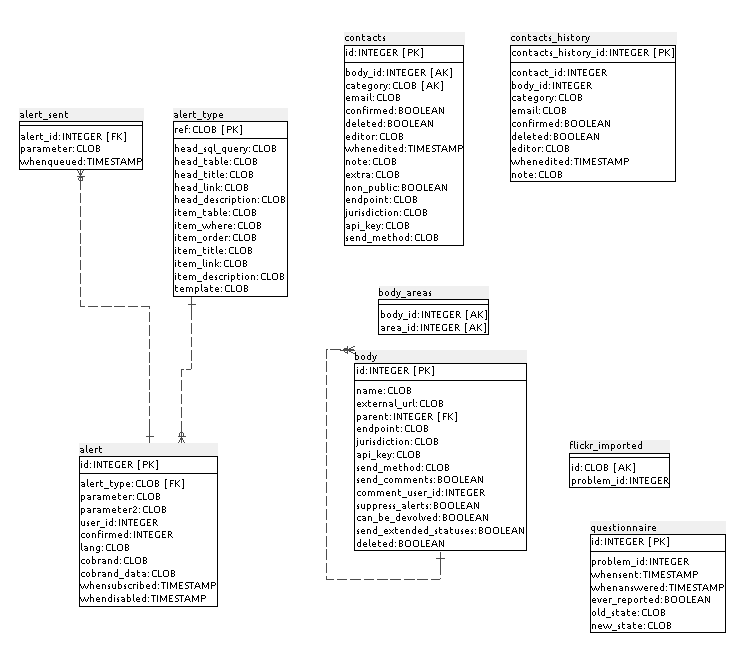

### C.2.5 Modelo de datos

#### C.2.5.1 Modelos relevantes

Los principales modelos son Problem, Comment, Alert y Body.

#### C.2.5.2 Tablas

Cuenta con 22 tablas:

* abuse               	 

* admin_log           	 

* alert               	 

* alert_sent          	 

* alert_type          	 

* body                	 

* body_areas          	 

* comment             	 

* contacts            	 

* contacts_history    	 

* flickr_imported     	 

* moderation_original_data

* partial_user        	 

* problem             	 

* questionnaire       	 

* response_templates  	 

* secret              	 

* sessions            	 

* textmystreet        	 

* token               	 

* user_body_permissions    

* users  

#### C.2.5.3 Gráficos UML

**Figura C.2.5.1: **Esquema de la base de datos

**Figura C.2.5.2: **Esquema de la base de datos

**Figura C.2.5.3: **Esquema de la base de datos

**Figura C.2.5.4: **Esquema de la base de datos

