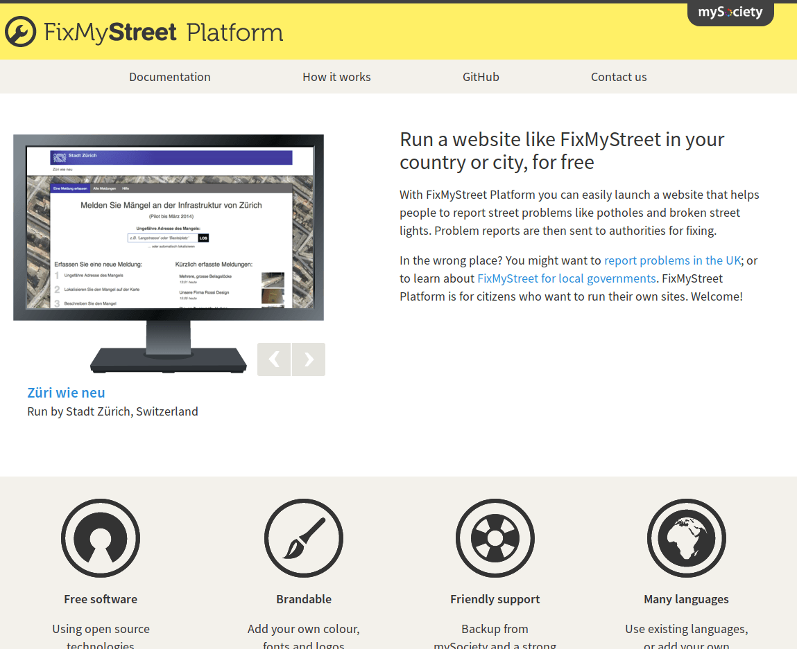

## Anexo C.2 FixMyStreet 

### 

**Figura C.2.0:** Portada: búsqueda del sitio y datos generales

*La plataforma FixMyStreet es un proyecto de código abierto para ayudar a la gente tener sitios webs para informar de problemas comunes en la calle como baches y farolas rotas a la autoridad apropiada. Los usuarios localizan problemas usando una combinación de dirección y poniendo un pin en un mapa sin tener que preocuparse acerca de la autoridad correcta a la que reportarla. FixMyStreet resuelve la autoridad correcta usando la localización y tipo del problema y envía un informe por correo electrónico o usando un servicio como Open311. Los problemas reportados son visibles a cualquiera así pueden ver si ya ha sido reportado y dejar actualizaciones. Los usuarios también pueden suscribirse a alertas por correo electrónico o RSS de problemas en su área.* [^1]

[^1]: Traducido de https://github.com/mysociety/fixmystreet 
Texto original: FixMyStreet Platform is an open source project to help people run websites for reporting common street problems such as potholes and broken street lights to the appropriate authority. Users locate problems using a combination of address and sticking a pin in a map without worrying about the correct authority to report it to. FixMyStreet then works out the correct authority using the problem location and type and sends a report, by email or using a web service such as Open311. Reported problems are visible to everyone so they can see if something has already been reported and leave updates. Users can also subscribe to email or RSS alerts of problems in their area.

