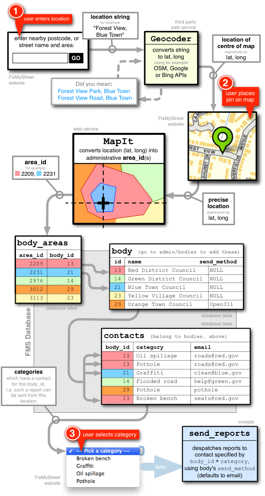
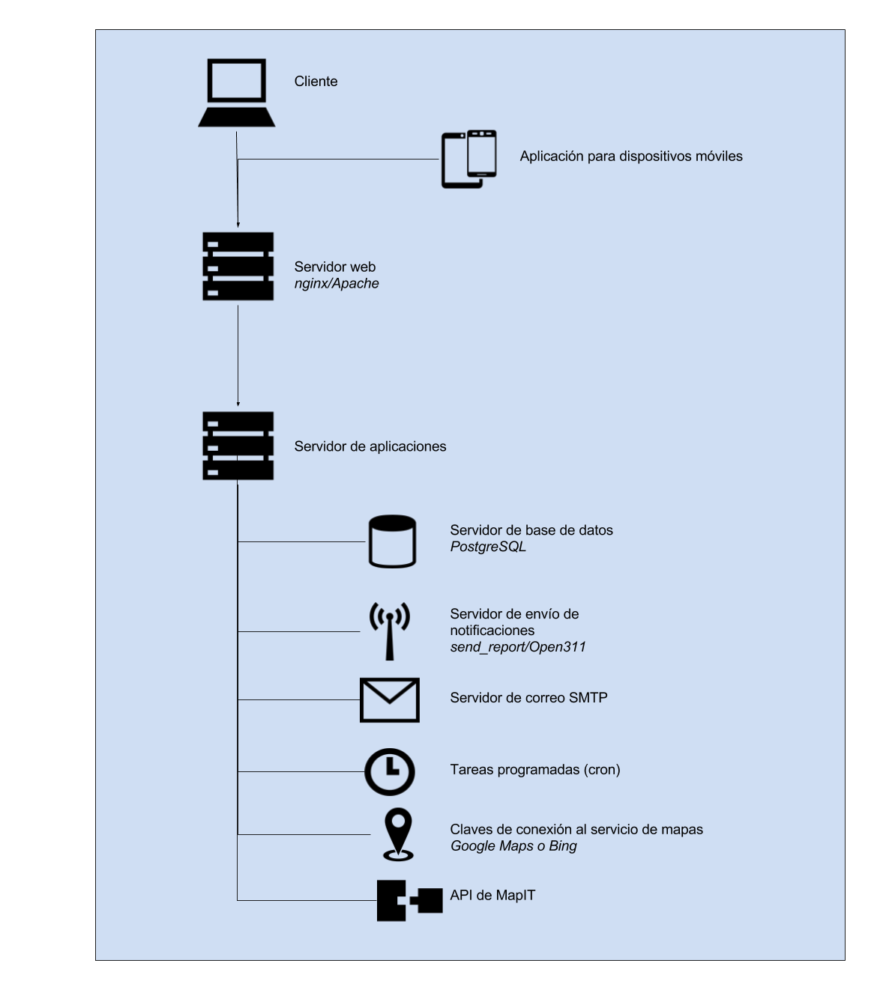
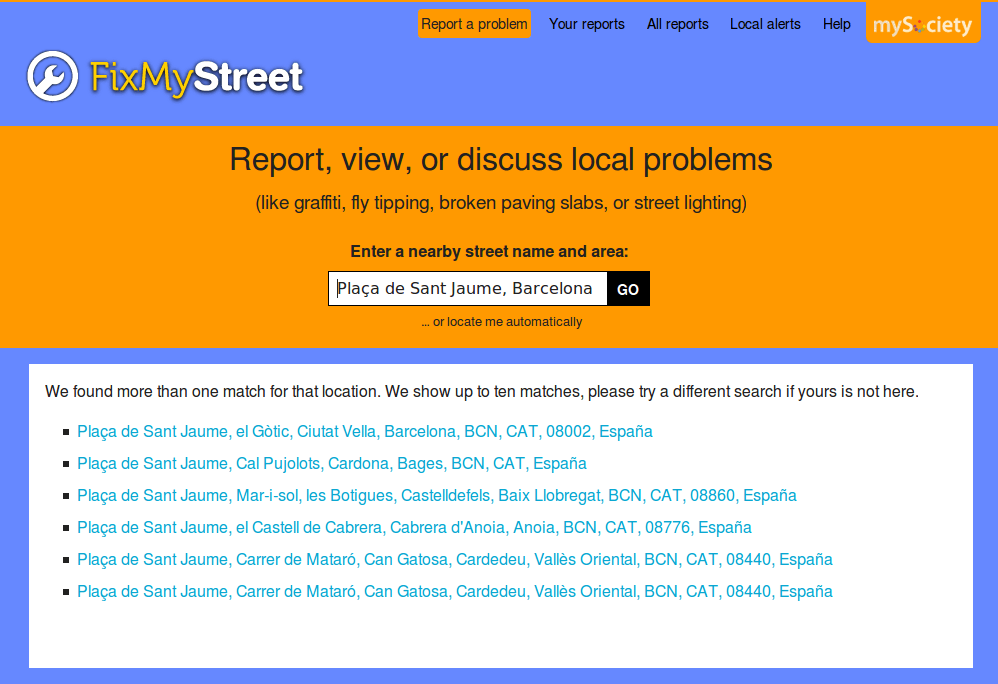
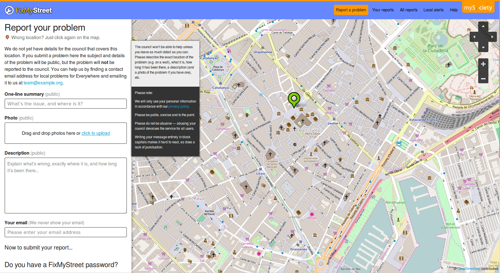

## Anexo C.2 FixMyStreet 

### 

**Figura C.2.0: **Portada: búsqueda del sitio y datos generales

*La plataforma FixMyStreet es un proyecto de código abierto para ayudar a la gente tener sitios webs para informar de problemas comunes en la calle como baches y farolas rotas a la autoridad apropiada. Los usuarios localizan problemas usando una combinación de dirección y poniendo un pin en un mapa sin tener que preocuparse acerca de la autoridad correcta a la que reportarla. FixMyStreet resuelve la autoridad correcta usando la localización y tipo del problema y envía un informe por correo electrónico o usando un servicio como Open311. Los problemas reportados son visibles a cualquiera así pueden ver si ya ha sido reportado y dejar actualizaciones. Los usuarios también pueden suscribirse a alertas por correo electrónico o RSS de problemas en su área. * (NOTE:  Traducido de https://github.com/mysociety/fixmystreet 
Texto original: FixMyStreet Platform is an open source project to help people run websites for reporting common street problems such as potholes and broken street lights to the appropriate authority. Users locate problems using a combination of address and sticking a pin in a map without worrying about the correct authority to report it to. FixMyStreet then works out the correct authority using the problem location and type and sends a report, by email or using a web service such as Open311. Reported problems are visible to everyone so they can see if something has already been reported and leave updates. Users can also subscribe to email or RSS alerts of problems in their area.)

### C.2.1 Metadatos

<table>
  <tr>
    <td>Nombre</td>
    <td>FixMyStreet</td>
  </tr>
  <tr>
    <td>URL</td>
    <td>https://www.fixmystreet.com/ </td>
  </tr>
  <tr>
    <td>URL repositorio</td>
    <td>https://github.com/mysociety/fixmystreet </td>
  </tr>
  <tr>
    <td>Resumen (Inglés)</td>
    <td>Map-based reporting platform</td>
  </tr>
  <tr>
    <td>Resumen (Castellano)</td>
    <td>Plataforma de reporte basada en mapas</td>
  </tr>
  <tr>
    <td>Lenguaje</td>
    <td>Perl</td>
  </tr>
  <tr>
    <td>Framework</td>
    <td>Catalyst</td>
  </tr>
  <tr>
    <td>Fecha primer commit</td>
    <td>Octubre de 2012</td>
  </tr>
  <tr>
    <td>Versión analizada</td>
    <td>2.2</td>
  </tr>
  <tr>
    <td>Nº de versiones</td>
    <td>41</td>
  </tr>
  <tr>
    <td>Nº de tablas de BBDD</td>
    <td>22</td>
  </tr>
  <tr>
    <td>Nº de contribuidores</td>
    <td>35</td>
  </tr>
  <tr>
    <td>Nº de stars</td>
    <td>322</td>
  </tr>
  <tr>
    <td>Licencia</td>
    <td>GNU Affero GPL v3</td>
  </tr>
  <tr>
    <td>Mantenido</td>
    <td>Sí</td>
  </tr>
  <tr>
    <td>Diseño responsivo</td>
    <td>Sí</td>
  </tr>
</table>

 

### C.2.2 Funcionalidades 

* Permite buscar un sitio donde realizar el reporte tanto por dirección como usando la API de geolocalización de HTML5. 

* Permite dar de alta un reporte sin necesidad de crear un usuario, pero ofreciendo la posibilidad de realizarlo. Según el grupo desarrollador, un 70% de los usuarios prefiere no crearlo. 

* Utiliza tecnologías libres (OpenStreetMap para el mapa). 

* Pide una serie de datos básicos obligatorios (Título y descripción de la incidencia, email y nombre de la persona) y permite una serie de datos opcionales (foto, contraseña para el usuario).

* Permite actualizar un problema con cambios que se hayan producido y marcar una incidencia como resuelta.

* Cuenta con aplicación móvil tanto para Android como para iOS (iPhone).

* Cuenta con una amplia documentación sobre su instalación, configuración inicial, personalización de imagen y textos, etc.  (NOTE:  http://fixmystreet.org/overview/ ) 

* Cuenta con diseño responsivo y adaptable a distintos formatos (móvil, tablet, etc)

* Permite configurar los reportes para que se envían a destinatarios específicos en función del área de ámbito geográfico y categoría del reporte, a través de distintos sistemas de envio: correo electrónico, Open311 (NOTE:  Open311 "A collaborative model and open standard for civic issue tracking" - http://www.open311.org/. Un protocolo estándar para el reporte de incidencias no críticas por parte de la ciudadanía. ), etc. 

* Por defecto, al cumplirse un mes del reporte, el sistema envía un cuestionario al usuario para que responda una encuesta actualizando el estado de la incidencia, donde puede cambiar su estado a "arreglado" (fixed), agregar una descripción o comentario o incluso subir una foto.  (NOTE:  http://fixmystreet.org/running/surveys/ ) 

### C.2.3 Análisis

Para comprender el flujo general de funcionamiento de la aplicación se incluye en la siguiente página el esquema y distintos servicios que entran en juego al producirse un reporte. Los pasos son:

1. El usuario entra una localización, a través del código postal, nombre de calle o área. Se envía este texto y a través de un servicio externo de terceros se normaliza, convirtiéndolo a latitud y longitud (Geocodificación). Puede escogerse entre distintos servicios para realizar esta conversión: APIs de Open Streets Maps, Google Maps o Bing Maps.

2. El usuario pone un marcador en el mapa, precisando la latitud y longitud.

3. Por último el usuario selecciona la categoría a la que pertenece la incidencia y se produce un reporte que es enviado al organismo correspondiente.

4. Dicha correspondencia se realiza a través del servicio web externo MapIt, que convierte la latitud y longitud en un área administrativa, donde se encuentran los entes gubernamentales que a su vez tienen una serie de contactos separados en categorías. Los destinatarios finales pueden tener configurado un método de contacto, que por defecto es el correo electrónico, pero también puede conectarse a un servicio externo de registro de incidencias cívicas (Open311).

Viendo los ejemplos de la Figura, se puede observar que hay cinco áreas (2209, 2231, 2976, 3012, 3113) que corresponden con cinco entes (*"Red District Council", "Green District Council", "Blue Town Council", "Yellow Village Council"* y *"Orange Town Council"*), cuatro categorías (*"Broken bench", "Graffiti", "Oil spillage" *y *"Pothole"*) y seis contactos relacionados entre las categorías y entes. Así, por ejemplo para la combinación de categoría "Oil spillage" con el ente "Red District Council", se debe enviar al correo electrónico "roads@red.gov". Esto es similar para el resto de entes, siendo la excepción el "Orange Town Council" cuyo método de envío ("send_method") no cuenta con la opción por defecto (valor "NULL") sino con el servicio externo "Open311".

A nivel municipal en el estado español se puede encontrar una experiencia similar, el Mapa de Quejas y Sugerencias del Ayuntamiento de Zaragoza  (NOTE:  www.zaragoza.es/ciudadania/gobierno-abierto/transparencia/enlace/servicios/mapa-quejas-y-sugerencias.html ). También el Ajuntament de Barcelona cuenta con un mecanismo para que la ciudadanía comunique incidencias, la Bústia Ciutadana  (NOTE:  http://smartcity.bcn.cat/es/bustia-ciutadana.html ), pero no son comunicadas públicamente. 

En caso de considerar interesante esta dinámica se puede contactar con la organización MySociety para ver sus servicios ofrecidos.

**Figura C.2.3.1: **Flujo general de la aplicación

Ofrecen un servicio de pago (NOTE:  https://www.fixmystreet.com/about/council) donde un municipio (Council) puede contratar los servicios de MySociety para tener adaptaciones del software, tanto a nivel de diseño (imagen personalizada) como con la conexión a los sistemas de control de incidencia que usa cada ciudad. Entre los municipios que han contratado dichos servicios son mayortariamente  del Reino Unido de Gran Bretaña, como Angus (NOTE:  https://fix.angus.gov.uk/ ), Stevenage (NOTE:  http://fixmystreet.stevenage.gov.uk/ ), Bromley (NOTE:  http://fix.bromley.gov.uk/ ), Harrogate (NOTE:  http://harrogate.fixmystreet.com/ ), Oxfordshire (NOTE:  http://fixmystreet.oxfordshire.gov.uk/ ), Hart (NOTE:  http://hart.fixmystreet.com/ ), East Sussex County Council (NOTE:  http://eastsussex.fixmystreet.com/ ), Greenwich (NOTE:  http://fix.royalgreenwich.gov.uk/ ), y Warwickshire County Council (NOTE:  http://warwickshire.fixmystreet.com/ ), aunque también es utilizado por otros que están fuera de Reino Unido, como la ciudad de Zurich (NOTE:  https://www.zueriwieneu.ch/) en Suiza.

### C.2.4 Arquitectura

A nivel de personalizaciones cuentan con la posibilidad de sobreescribir tanto el código HTML como CSS, e incluso se puede agregar código hecho en el lenguaje del servidor (perl). En su propia página dan los motivos por lo que recomiendan realizarlo de esta manera: 

*Le recomendamos encarecidamente que siga este sistema, en lugar de simplemente editar los archivos existentes, porque significa que podrá actualizar FixMyStreet sin que las actualizaciones sobreescriban sus cambios.* (NOTE:  Traducido de http://fixmystreet.org/customising/ 
Texto original: We strongly recommend you follow this system – rather than just editing existing files – because it means that you’ll be able to upgrade FixMyStreet without the updates overwriting your unique changes. )

Cuentan con documentación muy detallada de cómo ha de realizarse la instalación y configuración inicial de la aplicación (NOTE:  http://fixmystreet.org/customising/checklist/ ), e incluso con extras no técnicos como materiales de marketing de guerrilla para extender el conocimiento de la herramienta (NOTE:  https://www.fixmystreet.com/about/posters ).

A nivel de servidores recomiendan la siguiente configuración: 

* Servidor web: nginx/Apache

* Servidor de aplicaciones: PostgreSQL 

* Servidor SMTP

* Servidor de envío de notificaciones (send_report/Open311)

* Tareas programadas (cron)

* API de MapIt

* Claves de conexión al servicio de mapas (Google Maps o Bing)

 

**Figura C.2.4.1: **Esquema a nivel de servidores de FixMyStreet

### C.2.5 Modelo de datos

#### C.2.5.1 Modelos relevantes

Los principales modelos son Problem, Comment, Alert y Body.

#### C.2.5.2 Tablas

Cuenta con 22 tablas:

* abuse               	 

* admin_log           	 

* alert               	 

* alert_sent          	 

* alert_type          	 

* body                	 

* body_areas          	 

* comment             	 

* contacts            	 

* contacts_history    	 

* flickr_imported     	 

* moderation_original_data

* partial_user        	 

* problem             	 

* questionnaire       	 

* response_templates  	 

* secret              	 

* sessions            	 

* textmystreet        	 

* token               	 

* user_body_permissions    

* users  

#### C.2.5.3 Gráficos UML

**Figura C.2.5.1: **Esquema de la base de datos

**Figura C.2.5.2: **Esquema de la base de datos

**Figura C.2.5.3: **Esquema de la base de datos

**Figura C.2.5.4: **Esquema de la base de datos

### XX C.2.6 Conclusiones 

### C.2.7 Capturas de pantallas 

**
**

**Figura C.2.7.1: **Portada: búsqueda del sitio y datos generales

**Figura C.2.7.2: **Búsqueda del sitio

**Figura C.2.7.3:** Formulario de reporte (alta de incidencia)

**Figura C.2.7.4: **Formulario de reporte (registro de usuario)

**Figura C.2.7.5:** Formulario de reporte (actualización de incidencia)

