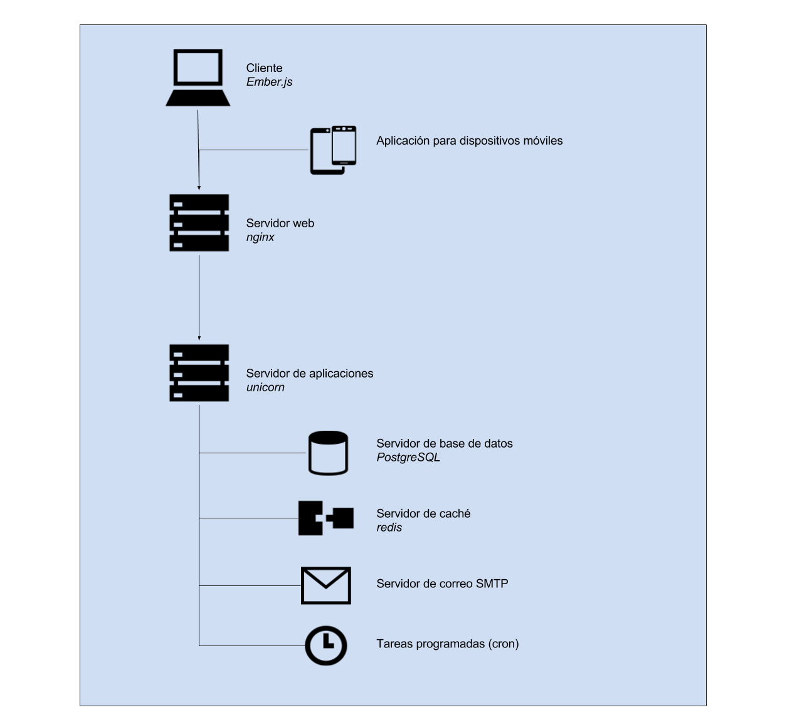

### D.1.4 Arquitectura

Es una aplicación javascript escrita con el framework Ember.js, con un backend escrito en Ruby on Rails para la persistencia de contenidos en la base de datos. 

Cuenta con un instalador (NOTE:  https://github.com/discourse/discourse_docker.git ) que facilita todo el proceso, a través de scripts que descargan y configuran imágenes docker para la instalación del sistema. Cuenta con un asistente de instalación en el que se preguntan las principales opciones. 

*/var/discourse$ sudo ./discourse-setup*

*Ports 80 and 443 are free for use*

*Found 3GB of memory and 2 physical CPU cores*

*setting db_shared_buffers = 768MB*

*setting UNICORN_WORKERS = 4*

*Hostname for your Discourse? [discourse.example.com]:*

*Email address for admin account(s)? [me@example.com,you@example.com]:*

*SMTP server address? [smtp.example.com]:*

*SMTP port? [587]:*

*SMTP user name? [user@example.com]:*

*SMTP password? [pa$$word]:*

*Let's Encrypt account email? (ENTER to skip) [me@example.com]:*

*Does this look right?*

*Hostname  	: discourse.example.com*

*Email     	: me@example.com,you@example.com*

*SMTP address  : smtp.example.com*

*SMTP port 	: 587*

*SMTP username : user@example.com*

*SMTP password : pa$$word*

*ENTER to continue, 'n' to try again, Ctrl+C to exit:*

Los desarrolladores han optado por no incluir en el aplicativo un servidor SMTP para el envío de correo electrónico, debiéndose por tanto proveer ese servicio externamente. 

 

**Figura D.1.4.1:** Esquema de arquitectura de Discourse

