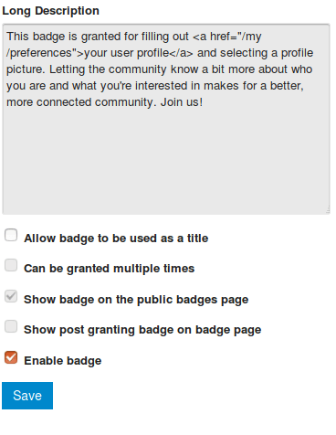
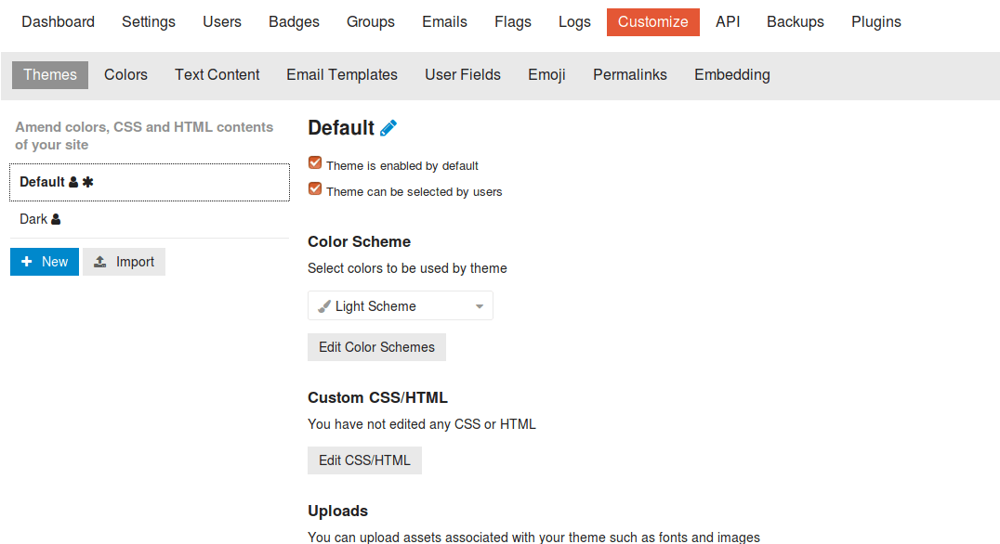

### D.1.7 Capturas de pantallas 

**Figura D.1.7.1:** Pantalla de registro inicial post-instalación

**Figura D.1.7.2:** Registro inicial con correo dado durante la instalación

**Figura D.1.7.3:** Página inicial

**Figura D.1.7.4: **Página de un Tema

**Figura D.1.7.5:** Creación de cuenta

**Figura D.1.7.6:** Inicio de sesión

**Figura D.1.7.7:** Página principal con sesión de administrador iniciada

**Figura D.1.7.8:** Guía de Inicio Rápido para Administradores I

**Figura D.1.7.9:** Guía de Inicio Rápido para Administradores II

**Figura D.1.7.10:** Guía de Inicio Rápido para Administradores III

**Figura D.1.7.11:** Guía de Inicio Rápido para Administradores IV

**Figura D.1.7.12:** Guía de Inicio Rápido para Administradores V

**Figura D.1.7.13:** Guía de Inicio Rápido para Administradores VI

**Figura D.1.7.14:** Explicación de categoría Lounge ("Salón")

**Figura D.1.7.15:** Tema para subir imágenes

**Figura D.1.7.16:** Política de privacidad por defecto

**Figura D.1.7.17:** Guía de la comuniadd por defecto

**Figura D.1.7.18:** Términos de uso por defecto

**Figura D.1.7.19:** Opciones de un Tema para administradores

**Figura D.1.7.19:** Opciones de un Tema para todos los usuarios

**Figura D.1.7.20:** Opciones de una Publicación para usuarios

**Figura D.1.7.21:** Opciones de una Publicación para administradores

**Figura D.1.7.22:** Menú superior

**Figura D.1.7.23:** Administrador: Panel de control

**Figura D.1.7.24:** Administrador: Configuraciones

**Figura D.1.7.25:** Administrador: Panel de usuarios

**Figura D.1.7.26:** Administrador: Panel de insignias

**Figura D.1.7.27:** Administrador: edición de insignias I

**Figura D.1.7.28:** Administrador: edición de insignias II

**Figura D.1.7.29:** Administrador: gestión de grupos

**Figura D.1.7.30:** Administrador: configuración de correo electrónico 

**Figura D.1.7.31:** Administrador: registros de acciones

**Figura D.1.7.32:** Administrador: personalización de temas 

**Figura D.1.7.33:** Administrador: personalización de textos

**Figura D.1.7.34:** Administrador: personalización de plantillas de correos electrónicos 

**Figura D.1.7.35:** Administrador: personalización de campos de usuario

**Figura D.1.7.36:** Administrador: personalización de campos de usuario (tipos de campos)

**Figura D.1.7.37:** Administrador: personalización de Emojis

**Figura D.1.7.38:** Administrador: personalización de URLs

**Figura D.1.7.39:** Administrador: configuración de integración por iframe 

**Figura D.1.7.40:** Administrador: descarga de copias de seguridad

**Figura D.1.7.41:** Administrador: gestión de plugins

**Figura D.1.7.42:** Formulario de publicación de entradas I

**Figura D.1.7.43:** Formulario de publicación de entradas II

**Figura D.1.7.44:** Configuración de categorías I  

**Figura D.1.7.45:** Configuración de categorías II

**Figura D.1.7.46:** Configuración de categorías III

**Figura D.1.7.47:** Configuración de categorías IV

**Figura D.1.7.48:** Configuración de categorías V

**Figura D.1.7.49:** Configuración de categorías VI

**Figura D.1.7.50:** Configuración de categorías VII

