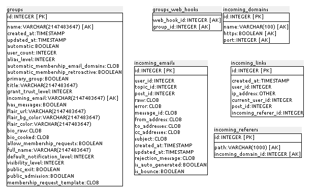
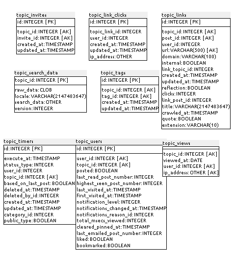

### D.1.5 Modelo de datos

#### D.1.5.1 Modelos relevantes

Sus principales modelos son Categories, Groups, Posts y Topics. 

#### D.1.5.2 Tablas

Cuenta con 129 tablas:

* api_keys

* application_requests

* badge_groupings

* badge_types

* badges

* categories

* categories_web_hooks

* category_custom_fields

* category_featured_topics

* category_featured_users

* category_groups

* category_search_data

* category_tag_groups

* category_tags

* category_users

* child_themes

* color_scheme_colors

* color_schemes

* custom_emojis

* developers

* directory_items

* draft_sequences

* drafts

* email_change_requests

* email_logs

* email_tokens

* embeddable_hosts

* facebook_user_infos

* github_user_infos

* given_daily_likes

* google_user_infos

* group_archived_messages

* group_custom_fields

* group_histories

* group_mentions

* group_users

* groups

* groups_web_hooks

* incoming_domains

* incoming_emails

* incoming_links

* incoming_referers

* instagram_user_infos

* invited_groups

* invites

* message_bus

* muted_users

* notifications

* oauth2_user_infos

* onceoff_logs

* optimized_images

* permalinks

* plugin_store_rows

* post_action_types

* post_actions

* post_custom_fields

* post_details

* post_replies

* post_revisions

* post_search_data

* post_stats

* post_timings

* post_uploads

* posts

* queued_posts

* quoted_posts

* remote_themes

* scheduler_stats

* schema_migration_details

* schema_migrations

* screened_emails

* screened_ip_addresses

* screened_urls

* search_logs

* single_sign_on_records

* site_settings

* stylesheet_cache

* tag_group_memberships

* tag_groups

* tag_users

* tags

* theme_fields

* themes

* top_topics

* topic_allowed_groups

* topic_allowed_users

* topic_custom_fields

* topic_embeds

* topic_invites

* topic_link_clicks

* topic_links

* topic_search_data

* topic_tags

* topic_timers

* topic_users

* topic_views

* topics

* translation_overrides

* twitter_user_infos

* unsubscribe_keys

* uploads

* user_actions

* user_api_keys

* user_archived_messages

* user_auth_token_logs

* user_auth_tokens

* user_avatars

* user_badges

* user_custom_fields

* user_emails

* user_exports

* user_field_options

* user_fields

* user_histories

* user_open_ids

* user_options

* user_profile_views

* user_profiles

* user_search_data

* user_stats

* user_visits

* user_warnings

* users

* versions

* watched_words

* web_hook_event_types

* web_hook_event_types_hooks

* web_hook_events

* web_hooks

#### D.1.5.3 Gráficos UML 

**Figura D.1.5.1:** Tablas de la base de datos de Discourse

**Figura D.1.5.2:** Tablas de la base de datos de Discourse

**Figura D.1.5.3:** Tablas de la base de datos de Discourse

**Figura D.1.5.4:** Tablas de la base de datos de Discourse

**Figura D.1.5.5:** Tablas de la base de datos de Discourse

**Figura D.1.5.6:** Tablas de la base de datos de Discourse

**Figura D.1.5.7:** Tablas de la base de datos de Discourse

**Figura D.1.5.8:** Tablas de la base de datos de Discourse

**Figura D.1.5.9:** Tablas de la base de datos de Discourse

**Figura D.1.5.10:** Tablas de la base de datos de Discourse

**Figura D.1.5.11:** Tablas de la base de datos de Discourse

**Figura D.1.5.12:** Tablas de la base de datos de Discourse

**Figura D.1.5.13:** Tablas de la base de datos de Discourse

**Figura D.1.5.14:** Tablas de la base de datos de Discourse

**Figura D.1.5.15:** Tablas de la base de datos de Discourse

