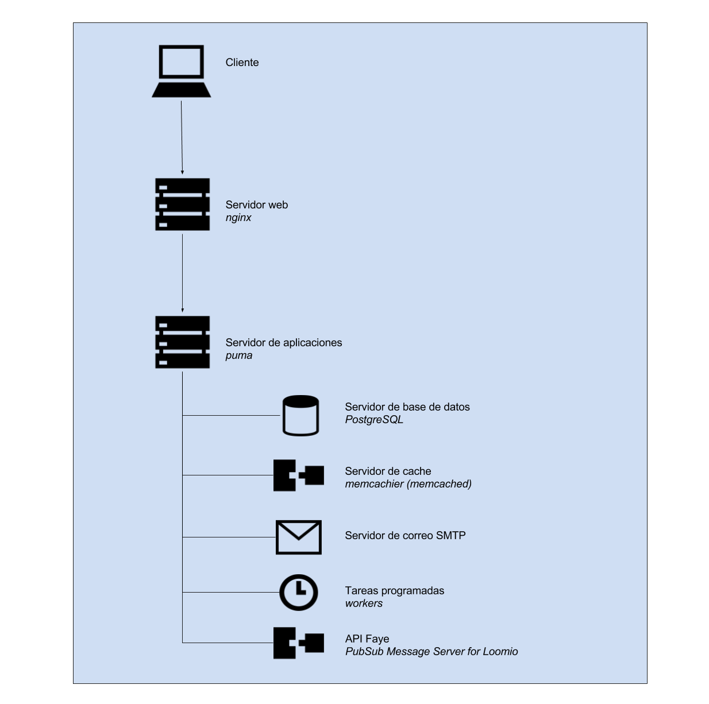

### D.2.4 Arquitectura

Cuenta con una API[^1] para accesos externos. 

Cuenta con un sistema de plugins que permiten extender la aplicación[^2]. 

A nivel de personalizaciones sólo cuenta con posibilidad de cambiar logos[^3], sin capacidad de cambiar hojas de estilo, agregar páginas estáticas, etc. 

**Figura D.2.4.1:** Esquema de arquitectura de loomio 

[^1]: https://github.com/loomio/loomio/tree/master/docs/en/using_the_loomio_api
[^2]: https://github.com/loomio/loomio/tree/master/docs/en/plugins
[^3]: https://github.com/loomio/loomio/blob/b4ace7b857f3a5796cbba666509cdc8eb684ae49/app/models/theme.rb
