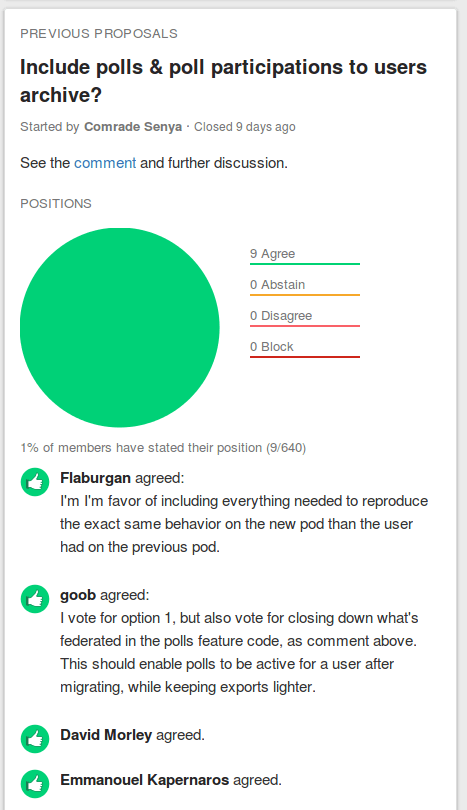

### D.2.7 Capturas de pantallas 

**Figura D.2.7.1: **Portada

**Figura D.2.7.2: **Portada de comunidad

**Figura D.2.7.3: **Hilo de discusión

**Figura D.2.7.4: **Video tutorial al crear un grupo nuevo

**Figura D.2.7.6: **Tutoriales al crear un grupo nuevo

**Figura D.2.7.7: **Propuesta de prueba** **

**Figura D.2.7.8: **Formulario al apoyar una propuesta (posibilidad de argumentar la posición) 

**Figura D.2.7.9: **Ejemplo de votación de propuesta

**Figura D.2.7.10: **Comentarios en un hilo

**Figura D.2.7.11: **Emojis en comentarios

**Figura D.2.7.12: **Posibilidad de invitar a otros usuarios

**Figura D.2.7.13: **Notificación de hilos no leídos

**Figura D.2.7.14: **Notificación de nueva actividad en hilo ya leído (Ver opción de "Load earlier activity" y marcador visual de “New activity”)

