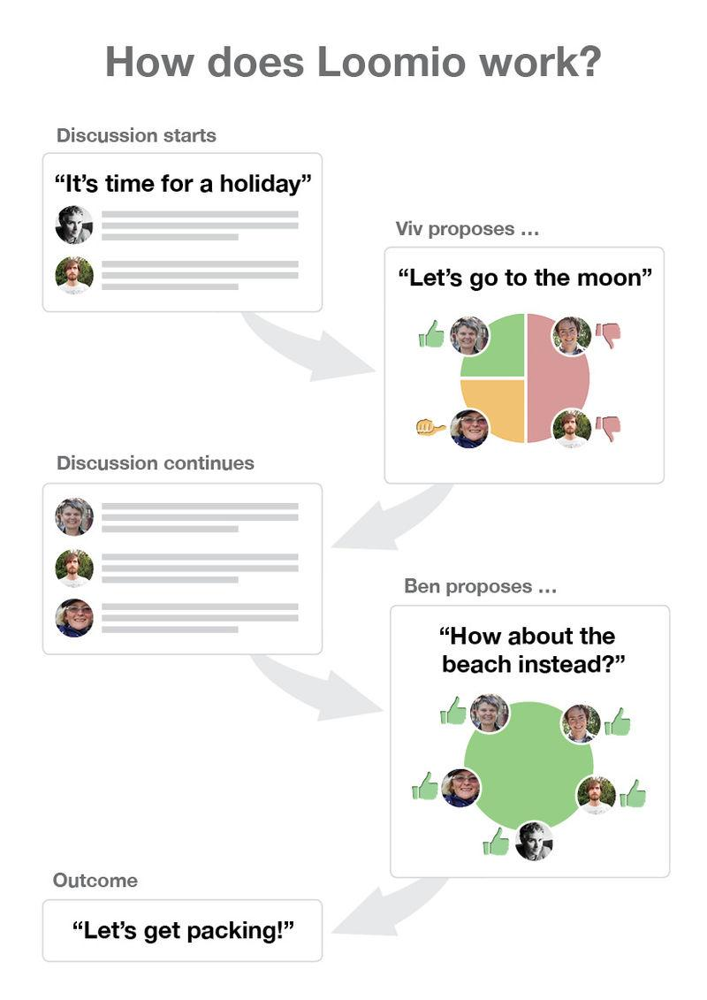

### D.2.3 Implantación

Ha sido utilizado por el Comité de Salud y Asistencia Social de la Asamblea Nacional de Gales,  para una investigación sobre el mal uso del alcohol y otras sustancias en la región, permitiéndole dar más tiempo a los participantes para discutir sus puntos de vista, interactuar entre ellos como una red, enviar nueva información, llegar a consensos, enfocar las conversaciones y mejorar el compromiso de los participantes[^1].

Ha sido utilizado por el Ayuntamiento de Wellington \(Nueva Zelanda\) para un ejercicio de consulta pública, el desarrollo de una estrategia de gestión del alcohol para la ciudad, con el fin de obtener información de ciudadanos que normalmente están muy ocupados para atender a las reuniones[^2].

En el siguiente gráfico \("How does Loomio work?"\) se puede observar el flujo general de la aplicación: se produce una debate, un usuario hace una propuesta en la que se vota \(de forma positiva, negativa o abstención\), el debate continúa, otro usuario realiza otra propuesta que puede obtener mayor consenso y se llega a un resultado de lo que quieren los participantes.

**Figura D.2.3.1:** Fuente: [https://en.wikipedia.org/wiki/Loomio](https://en.wikipedia.org/wiki/Loomio)

