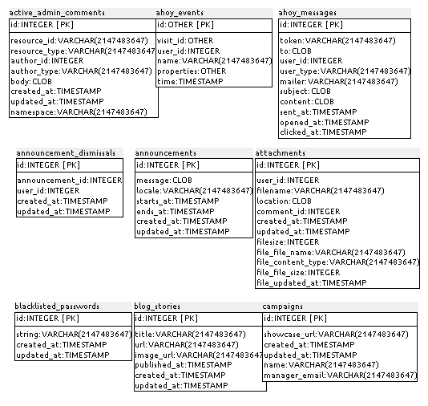
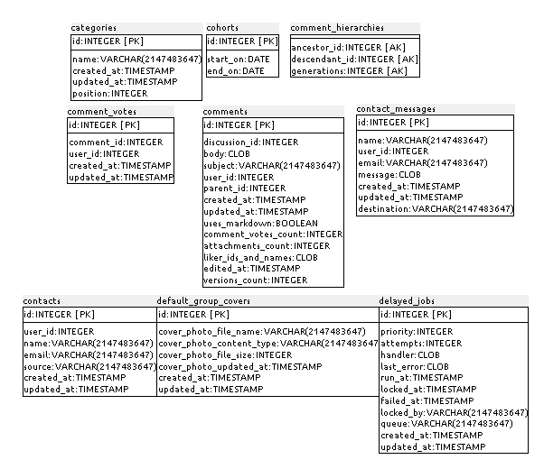
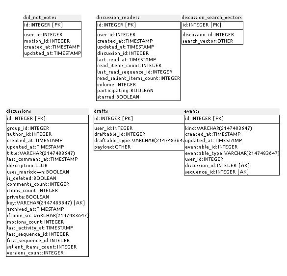
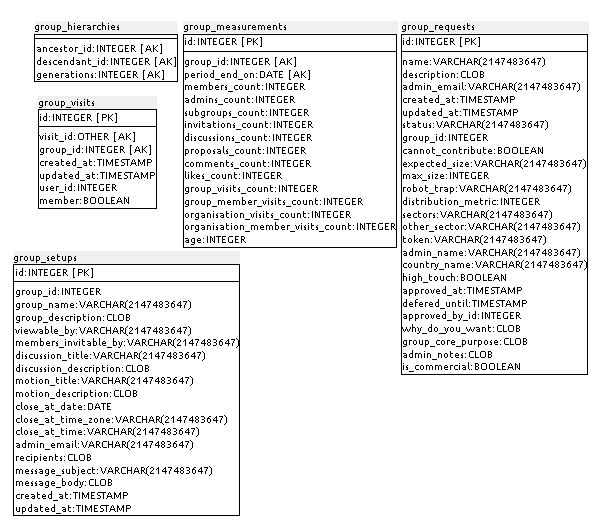
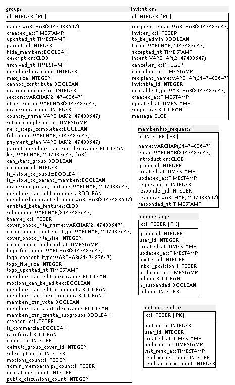
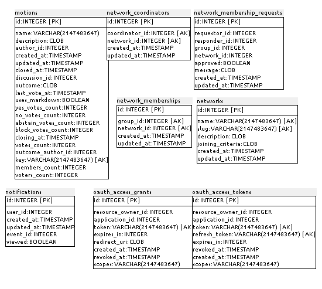
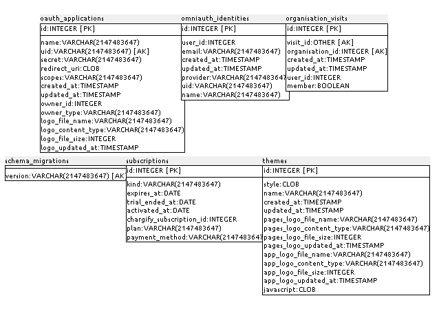
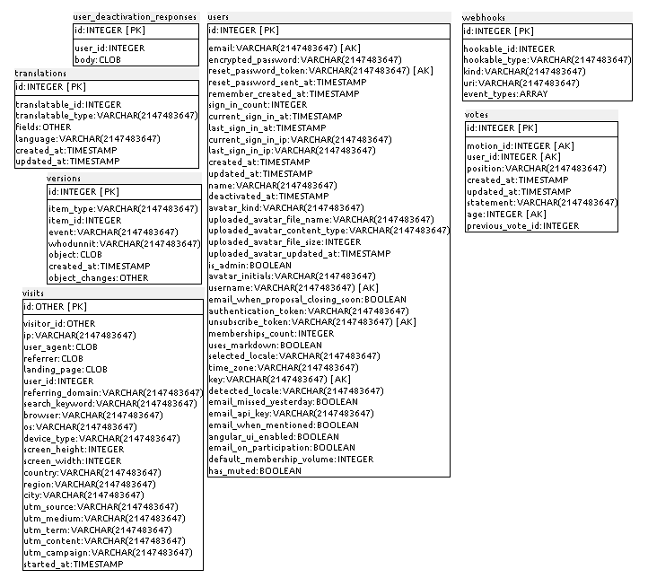

### D.2.5 Modelo de datos

#### D.2.5.1 Modelos relevantes

Los modelos relevantes son Discussions, Comments, Groups, Motions y Users. 

#### D.2.5.2 Tablas

Cuenta con 55 tablas:

* active_admin_comments 	 

* ahoy_events           	 

* ahoy_messages         	 

* announcement_dismissals    

* announcements         	 

* attachments           	 

* blacklisted_passwords 	 

* blog_stories          	 

* campaigns             	 

* categories            	 

* cohorts               	 

* comment_hierarchies   	 

* comment_votes         	 

* comments              	 

* contact_messages      	 

* contacts              	 

* default_group_covers  	 

* delayed_jobs          	 

* did_not_votes         	 

* discussion_readers    	 

* discussion_search_vectors  

* discussions           	 

* drafts                	 

* events                	 

* group_hierarchies     	 

* group_measurements    	 

* group_requests        	 

* group_setups          	 

* group_visits          	 

* groups                	 

* invitations           	 

* membership_requests   	 

* memberships           	 

* motion_readers        	 

* motions               	 

* network_coordinators  	 

* network_membership_requests

* network_memberships   	 

* networks              	 

* notifications         	 

* oauth_access_grants   	 

* oauth_access_tokens   	 

* oauth_applications    	 

* omniauth_identities   	 

* organisation_visits   	 

* schema_migrations     	 

* subscriptions         	 

* themes                	 

* translations          	 

* user_deactivation_responses

* users                 	 

* versions              	 

* visits                	 

* votes                 	 

* webhooks     

 

#### D.2.5.3 Gráficos UML 

**Figura D.2.5.1: **Tablas de la base de datos de loomio 

**Figura D.2.5.2: **Tablas de la base de datos de loomio 

**Figura D.2.5.3: **Tablas de la base de datos de loomio 

**Figura D.2.5.4: **Tablas de la base de datos de loomio 

**Figura D.2.5.5: **Tablas de la base de datos de loomio 

**Figura D.2.5.6: **Tablas de la base de datos de loomio 

	

**Figura D.2.5.7: **Tablas de la base de datos de loomio 

**Figura D.2.5.8: **Tablas de la base de datos de loomio 

