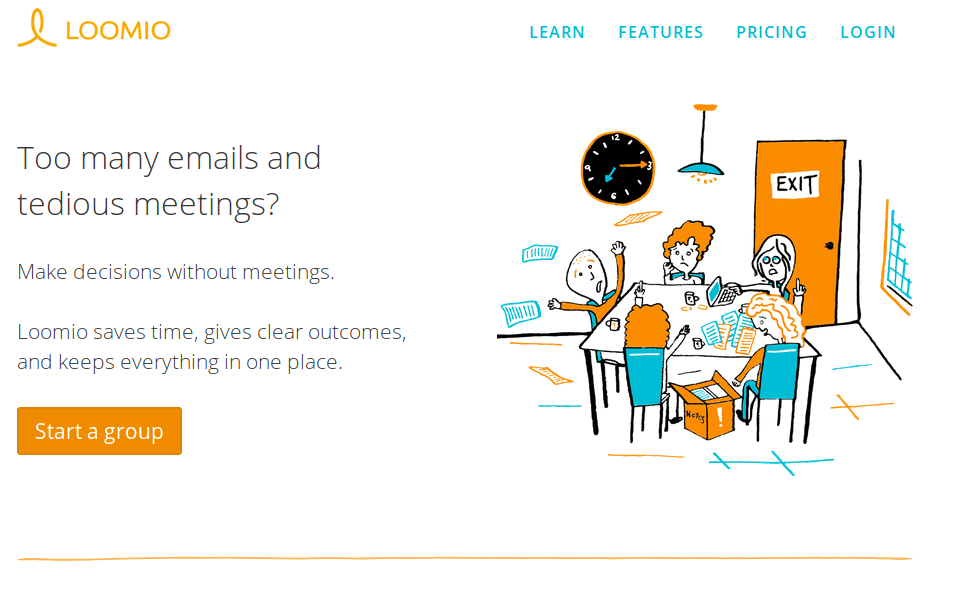

## Anexo D.2. Loomio 

### 

**Figura D.2.0: **Portada de [https://www.loomio.org/](https://www.loomio.org/) 

1. *Reúnete:** Trae a la gente indicada y a la información necesaria. Accesible, fácil de usar, adaptable, con detalles optimizados para la privacidad y seguridad.*

2. *Dialoga: Ten conversaciones claras sobre temas particulares. Mantente al día, lee la información relevante y filtra el ruido. Es un espacio dedicado para la colaboración constructiva.*

3. *Propón:Resúmenes visuales que facilitan el entendimiento de las posiciones de los demás. Entérate rápidamente si están de acuerdo. O ve fácilmente la causa del desacuerdo y comienza a construir un entendimiento compartido.*

4. *Decide y Actúa: Llega a un resultado claro para cada propuesta, dentro del tiempo fijado. Todos serán notificados sobre el resultado, para que puedan avanzar juntos y ponerse en acción.* (NOTE:  https://www.loomio.org/ )

