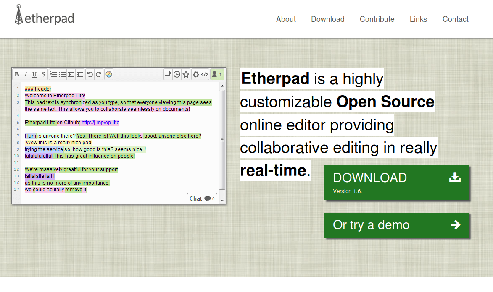
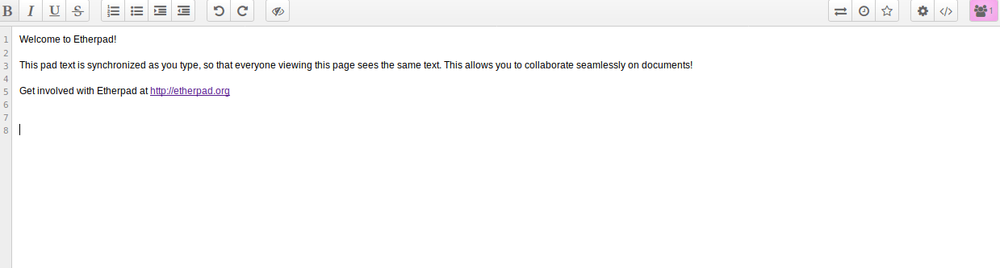
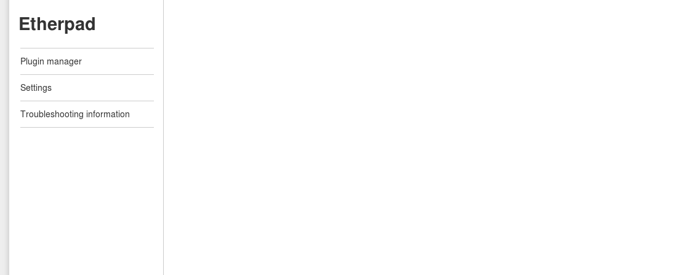
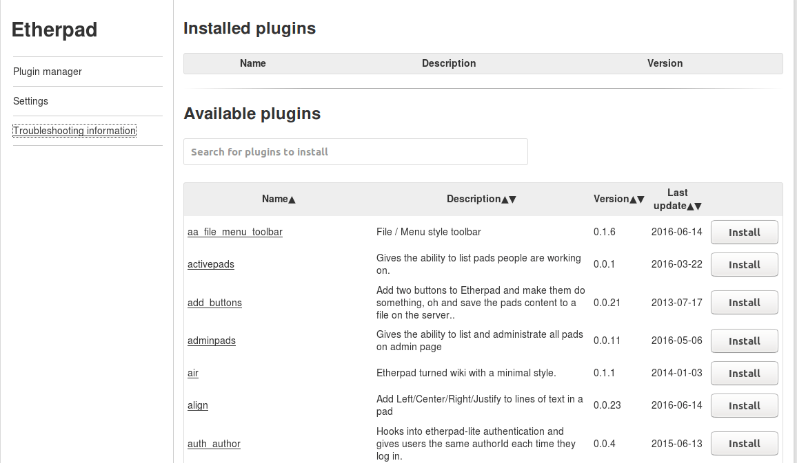
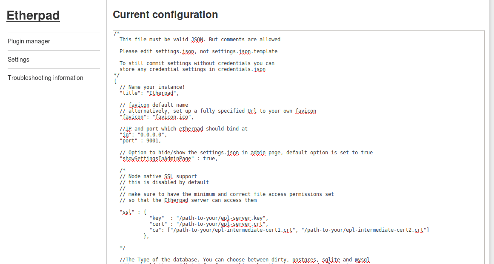
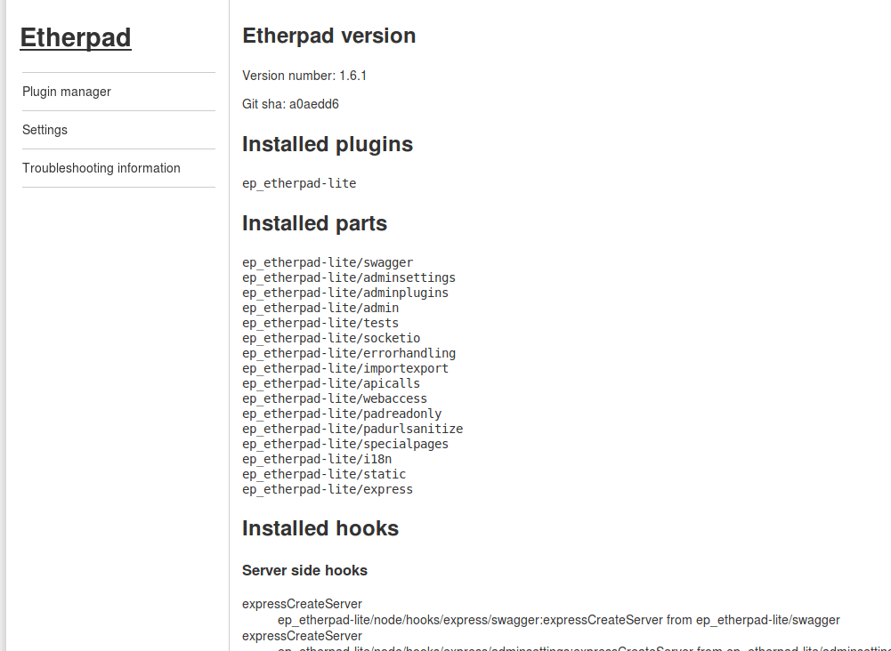

## Anexo E.1 Etherpad

**Figura E.1.0:** Portada de [http://etherpad.org](http://etherpad.org) 

*Etherpad permite editar documentos de forma colaborativa en tiempo real, al igual que un editor multi-jugador en vivo que se ejecuta en su navegador. Escriba artículos, comunicados de prensa, listas de tareas pendientes, etc., junto con sus amigos, colegas o compañeros, todos trabajando en el mismo documento al mismo tiempo. * (NOTE:  http://etherpad.org/
Texto original: Etherpad allows you to edit documents collaboratively in real-time, much like a live multi-player editor that runs in your browser. Write articles, press releases, to-do lists, etc. together with your friends, fellow students or colleagues, all working on the same document at the same time. )

### E.1.1 Metadatos

<table>
  <tr>
    <td>Nombre</td>
    <td>Etherpad</td>
  </tr>
  <tr>
    <td>URL</td>
    <td>http://etherpad.org/ </td>
  </tr>
  <tr>
    <td>URL repositorio</td>
    <td>https://github.com/ether/etherpad-lite </td>
  </tr>
  <tr>
    <td>Resumen (Inglés)</td>
    <td>Really real-time collaborative document editing</td>
  </tr>
  <tr>
    <td>Resumen (Castellano)</td>
    <td>Edición de documentos colaborativa en tiempo real</td>
  </tr>
  <tr>
    <td>Lenguaje</td>
    <td>Javascript</td>
  </tr>
  <tr>
    <td>Framework</td>
    <td>Node.js</td>
  </tr>
  <tr>
    <td>Fecha primer commit</td>
    <td>Marzo de 2011</td>
  </tr>
  <tr>
    <td>Versión analizada</td>
    <td>1.6.1</td>
  </tr>
  <tr>
    <td>Nº de versiones</td>
    <td>36</td>
  </tr>
  <tr>
    <td>Nº de tablas en la BBDD</td>
    <td>1</td>
  </tr>
  <tr>
    <td>Nº de contribuidores</td>
    <td>177</td>
  </tr>
  <tr>
    <td>Nº de stars</td>
    <td>6495</td>
  </tr>
  <tr>
    <td>Licencia</td>
    <td> Apache 2.0</td>
  </tr>
  <tr>
    <td>Mantenido</td>
    <td>Sí</td>
  </tr>
  <tr>
    <td>Diseño responsivo</td>
    <td>Sí</td>
  </tr>
</table>

 

### E.1.2 Funcionalidades 

* Es una aplicación web de escritura colaborativa en tiempo real. 

* Cuenta con soporte para extender sus funcionalidades a través de plugins

* Permite dar un formato básico al texto (negrita, cursiva, subrayado, tachado, listas numeradas y sin numerar, sangría del texto)

* Cuenta con un chat en tiempo real para comunicarse con el resto de participantes del documento.

* Permite integrar los documentos creados con el aplicativo (pads) en otros sitios webs a través de un iframe 

* Permite compartir un documento (pad) con una URL especial de solo lectura 

* Permite navegar por las distintas versiones del documento (pad)

### E.1.3 Análisis

Es una de las primeras aplicaciones web de escritura colaborativa en tiempo real. Su primera versión (llamada etherpad) se encontraba escrita en Java, y el despliegue en un servidor propio requería muchos recursos. Se ha reescrito en otra tecnología (llamada etherpad-lite) cambiando el lenguaje a Javascript. 

Cuenta con una API que permite a una aplicación web externa gestionar los pads, usuarios y grupos, así como clientes en los lenguajes de programación más populares (Ruby, Javascript, Python, Perl, PHP, Java, Objective-C, .NET y Go) (NOTE:  https://github.com/ether/etherpad-lite/wiki/HTTP-API-client-libraries ).

De las aplicaciones de este tipo, es una de las más populares, teniendo instalaciones que pueden ser utilizadas de forma anónima, como PiratePad y TitanPad. Diversas organizaciones relacionadas con el software y la cultura libre, como las fundaciones Mozilla y WikiMedia, lo utilizan a nivel interno.

### E.1.4 Arquitectura

Es una aplicación web hecha en Javascript con el framework nodeJS. 

Permite utilizar distintos sistemas de base de datos (PostgreSQL, MySQL o sqlite). 

**Figura E.1.4.1:** Arquitectura de servidores de etherpad

### E.1.5 Modelo de datos

#### E.1.5.1 Modelos relevantes

El único modelo con el que cuenta esta aplicación es Store. 

#### E.1.5.2 Tablas

Cuenta con sólo una tabla llamada Store. Aquí se guardan en formato JSON todas las revisiones de las modificaciones que va teniendo un Pad. Esta tabla sólo cuenta con dos columnas: Key (Clave) y Value (Valor). 

#### XX E.1.5.3 Gráficos UML

Al contar con una única tabla no ...

+-------------------------+

| Tables_in_etherpad_prod |

+-------------------------+

| store               	|

+-------------------------+

1 row in set (0.00 sec)

mysql> describe store;

+-------+--------------+------+-----+---------+-------+

| Field | Type     	| Null | Key | Default | Extra |

+-------+--------------+------+-----+---------+-------+

| key   | varchar(100) | NO   | PRI | NULL	|   	|

| value | longtext 	| NO   | 	| NULL	|   	|

+-------+--------------+------+-----+---------+-------+

2 rows in set (0.00 sec)

 key: pad:test:revs:1

value: {"changeset":"Z:6c>1|5=6b*0|1+1$\n","meta":{"author":"a.oQuROhHCepHhKURO","timestamp":1504275170925}}

 key: pad:test:revs:2

value: {"changeset":"Z:6d>2|6=6c*0|2+2$\n\n","meta":{"author":"a.oQuROhHCepHhKURO","timestamp":1504275171362}}

### XX E.1.6 Conclusiones

### E.1.7 Capturas de pantallas 

**Figura E.1.7.1:** Portada

**Figura E.1.7.2:** Texto por defecto en un documento nuevo

**Figura E.1.7.3:** Opciones de Importación/Exportación

**Figura E.1.7.4:** Navegación de versiones del documneto 

**Figura E.1.7.5:** Opciones generales del documento

**Figura E.1.7.6:** Compartir e integrar en web externa un documento

**Figura E.1.7.7:** Ventana del chat

**Figura E.1.7.8:** Administrador 

**Figura E.1.7.9:** Administrador: gestión de plugins 

**Figura E.1.7.10:** Administrador: configuración del servidor

**Figura E.1.7.7.10:** Administrador: información para resolución de problemas

###  

