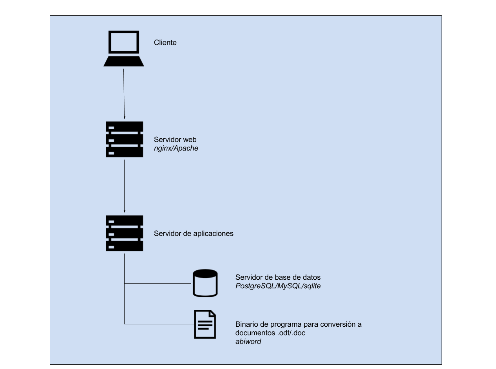

### E.1.4 Arquitectura

Es una aplicación web hecha en Javascript con el framework nodeJS. 

Permite utilizar distintos sistemas de base de datos (PostgreSQL, MySQL o sqlite). 

**Figura E.1.4.1:** Arquitectura de servidores de etherpad

