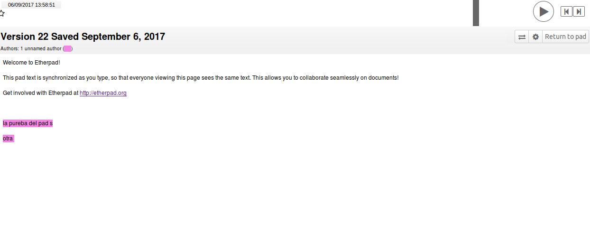

### E.1.7 Capturas de pantallas 

**Figura E.1.7.1:** Portada

**Figura E.1.7.2:** Texto por defecto en un documento nuevo

**Figura E.1.7.3:** Opciones de Importación/Exportación

**Figura E.1.7.4:** Navegación de versiones del documneto 

**Figura E.1.7.5:** Opciones generales del documento

**Figura E.1.7.6:** Compartir e integrar en web externa un documento

**Figura E.1.7.7:** Ventana del chat

**Figura E.1.7.8:** Administrador 

**Figura E.1.7.9:** Administrador: gestión de plugins 

**Figura E.1.7.10:** Administrador: configuración del servidor

**Figura E.1.7.7.10:** Administrador: información para resolución de problemas

  

