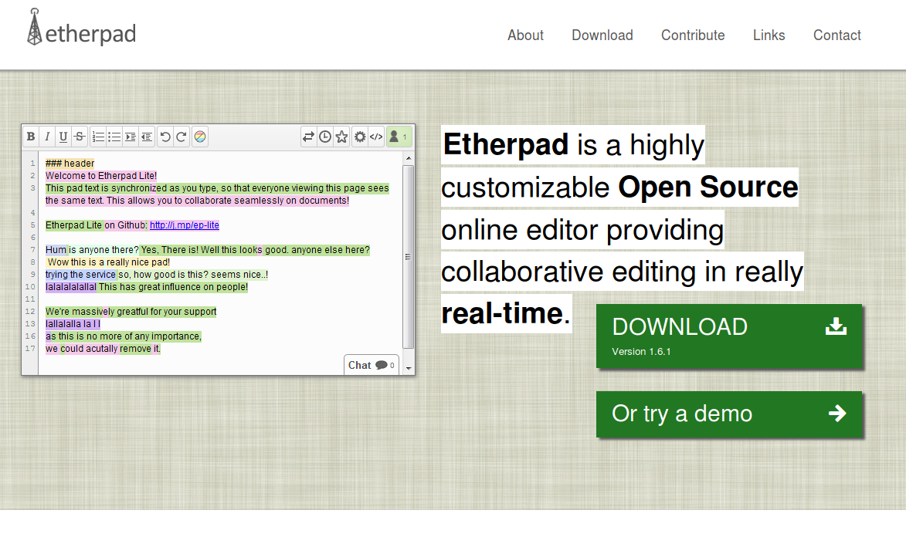

## E.1 Etherpad

**Figura E.1.0:** Portada de [http://etherpad.org](http://etherpad.org) 

*Etherpad permite editar documentos de forma colaborativa en tiempo real, al igual que un editor multi-jugador en vivo que se ejecuta en su navegador. Escriba artículos, comunicados de prensa, listas de tareas pendientes, etc., junto con sus amigos, colegas o compañeros, todos trabajando en el mismo documento al mismo tiempo.*[^1]

[^1]: http://etherpad.org/
Texto original: Etherpad allows you to edit documents collaboratively in real-time, much like a live multi-player editor that runs in your browser. Write articles, press releases, to-do lists, etc. together with your friends, fellow students or colleagues, all working on the same document at the same time.

