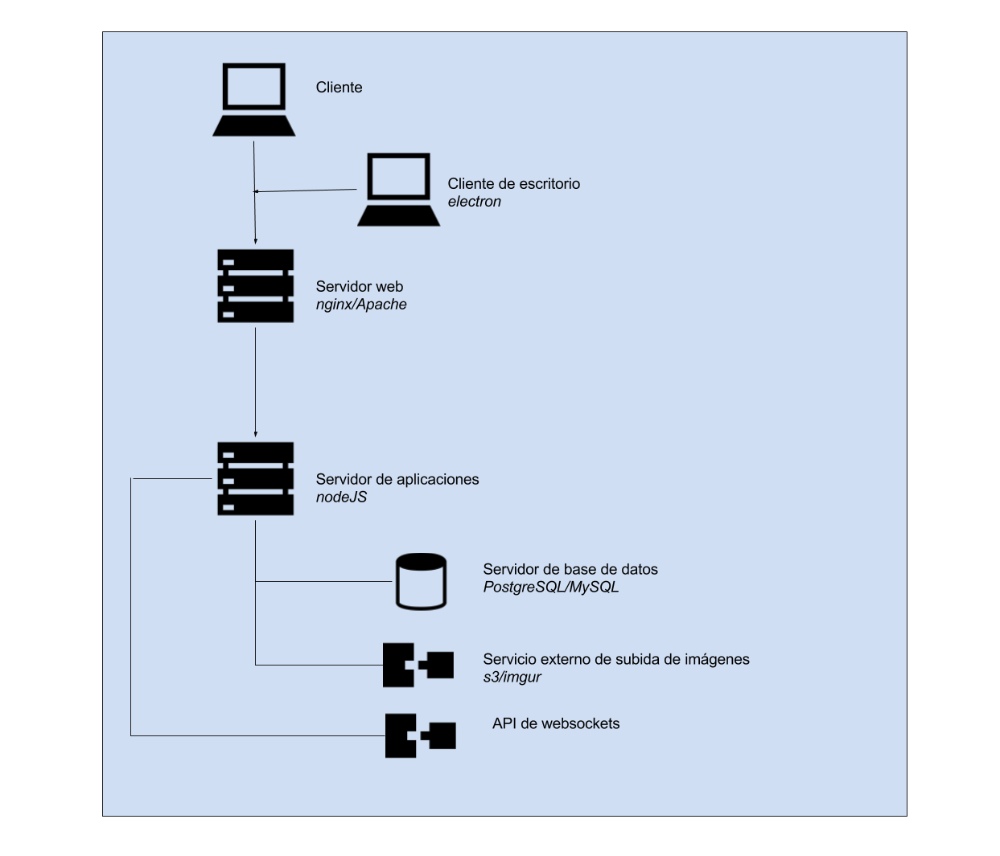

### E.2.4 Arquitectura

A nivel de despliegue de la aplicación cuenta con la posibilidad de hacerlo a través de Docker[^1]. 

Tiene la posibilidad de trabajar de forma fuera de línea (*offline*), permitiendo también trabajar con un cliente de escritorio hecho con el framework *electron*. 

A nivel tecnológico es destacable el uso del estándar WebSocket para la comunicación de los cambios realizados en los documentos. 

**Figura E.2.4.1:** Arquitectura de servidores de hackmd

[^1]: https://github.com/hackmdio/docker-hackmd
